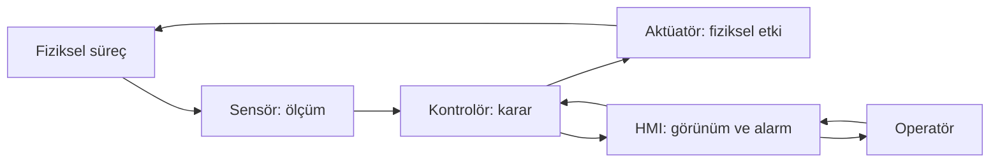

# Kontrol döngüsü ve bileşenler

Bir kontrol döngüsü, ölçümden karar üretir ve bu kararın fiziksel sonucunu yeniden ölçer. Bileşen adlarından önce bu ilişkinin anlaşılması, saldırı ve savunma değerlendirmesinde hangi verinin neden önemli olduğunu gösterir.

## Ölç, değerlendir, etki et

Şema özgün ve kavramsaldır. HMI'nın kontrolöre yaptığı her işlem kontrol yetkisi taşımaz; bazı ekranlar yalnızca gözlem içindir. Diyagramda emniyet sistemi gösterilmemiştir: emniyet mimarisi ve bağımsızlık gereksinimleri ayrıca tasarlanır.

Kurgusal bir depoda giriş debisi çıkış debisinden büyükse miktar artar. Basit bilanço `miktar değişimi = (giriş − çıkış) × süre` olarak yazılabilir. Gerçek sistemde sensör hassasiyeti, gecikme, taşma, geometrik özellikler ve başka akışlar da bulunur. Bu ilişki bir kontrol ayarı önerisi değil, ölçümlerin neden birlikte incelenmesi gerektiğinin örneğidir.

## Bileşenleri tanımak

| Bileşen | İşlev | Savunmacının bilmesi gereken bilgi |
|---|---|---|
| Sensör / transmitter | Sıcaklık, basınç, konum gibi büyüklükleri ölçer | Birim, kalibrasyon, veri kalitesi ve son güncelleme |
| Aktüatör | Vana, motor veya mekanizmaya fiziksel etki uygular | Enerji ve haberleşme kaybında tasarlanan davranış |
| PLC | Programlanmış kontrol mantığını yürütür | Proje sürümü, işletme modu, yükleme yetkisi ve yedek |
| RTU | Uzak sahadan veri toplar ve saha kontrolünü destekler | Yerel özerklik, bağlantı bağımlılığı ve saha erişimi |
| HMI | Operatörün süreci görmesini ve izinli işlemlerini sağlar | Rol, alarm davranışı, veri tazeliği ve denetim izi |
| Mühendislik istasyonu | Program, yapılandırma ve devreye alma işlerini yürütür | Kim kullanır, hangi varlıklara değişiklik yapabilir? |
| Historian | Zaman serisini ve süreç geçmişini tutar | Zaman damgası, kalite bayrağı, bütünlük ve saklama |
| IED | Elektrik alanında koruma, ölçme veya kontrol işlevli akıllı cihaz | Koruma ayarının sahibi, onaylı sürüm ve olay kayıtları |
| Ağ geçidi | Farklı protokoller veya ağlar arasında arayüzdür | Çevirinin anlamı, tamponlama, kimlik ve yetki sınırı |
| SIS / emniyet işlevi | Tehlike durumlarını ele alan ayrı tasarım kapsamıdır | Bağımsızlık, doğrulama, değişiklik ve yetki koşulları |

Bu tablo genel teknik terminolojinin öğretim amaçlı açıklamasıdır. Bir cihaz birden fazla işlev üstlenebilir; isimden yola çıkarak ağ yetkisi veya emniyet yeterliliği çıkarılamaz.

## Ölçüm neden tek başına yeterli değildir?

“Seviye 50” kaydı anlamı belirsiz bir veridir. Yüzde mi, santimetre mi? Kaynağın saati doğru mu? Ölçüm yeni mi? Sensör bakımda mı? Ekran son geçerli değeri mi gösteriyor? Bir alarmı yorumlamak için değerle birlikte birim, zaman, kalite, çalışma modu ve değişiklik geçmişi gerekir.

Kurgusal değerlendirme: historian ve HMI aynı sunucudan veri alıyorsa ikisinde aynı değeri görmek bağımsız doğrulama sayılmaz. Ayrı ölçüm yolu veya yetkili saha kontrolü daha farklı bir kanıt sağlar. Bağımsız kanıt toplamanın yöntemi de personelin güvenli çalışma koşullarını korumalıdır.

## Alarm, interlock ve emniyet aynı şey mi?

Alarm bir durumun dikkat gerektirdiğini bildirir. Interlock belirli koşullar karşılanmadan bir eyleme izin verilmemesini sağlayan mantıktır. Her interlock, sertifikalı bir emniyet işlevi değildir. Siber erişim kontrolü de tehlikeli bir fiziksel sonuca karşı doğrulanmış emniyet işlevinin yerine geçmez.

INL'nin Cyber-Informed Engineering yaklaşımı, dijital bir ihlalin fiziksel zarara dönüşmesini sınırlayacak mühendislik kararlarını tasarım yaşam döngüsüne katar. Böylece sadece erişimi zorlaştırmak değil, erişim gerçekleşse bile istenmeyen sonuçları kısıtlamak da değerlendirilir. [INL CIE](https://inl.gov/national-security/cie/)

Bu depodaki uygulama önerisi: Her kritik işlev için “dijital ölçüm yanlışsa nasıl anlaşılır?”, “bağlantı kaybında davranış nedir?” ve “sonucu sınırlayan bağımsız tedbir gerçekten bağımsız mı?” sorularını teknik sorumluya yöneltin. Emniyet düzeneklerini test etmek veya değiştirmek ayrı mühendislik kapsamıdır.

## Mini alıştırma

“Pompa çalışıyor bilgisi var ama akış görülmüyor.” En az üç açıklama yazın. Bir komutun verilmesi, motorun dönmesi ve akış oluşması farklı kanıtlarla doğrulanan farklı durumlardır. Örnek yanıt: fiziksel arıza, ölçüm sorunu, eski durum bilgisi. Bu gözlem tek başına saldırı kanıtı değildir.

## Kaynak

- Idaho National Laboratory, *Cyber-Informed Engineering*, [program ve kaynak sayfası](https://inl.gov/national-security/cie/), dinamik sayfa, erişim: 13.09.2026. CIE kavramını destekler. Kontrol döngüsü, tablo ve alıştırmalar özgün öğretim anlatımıdır.
