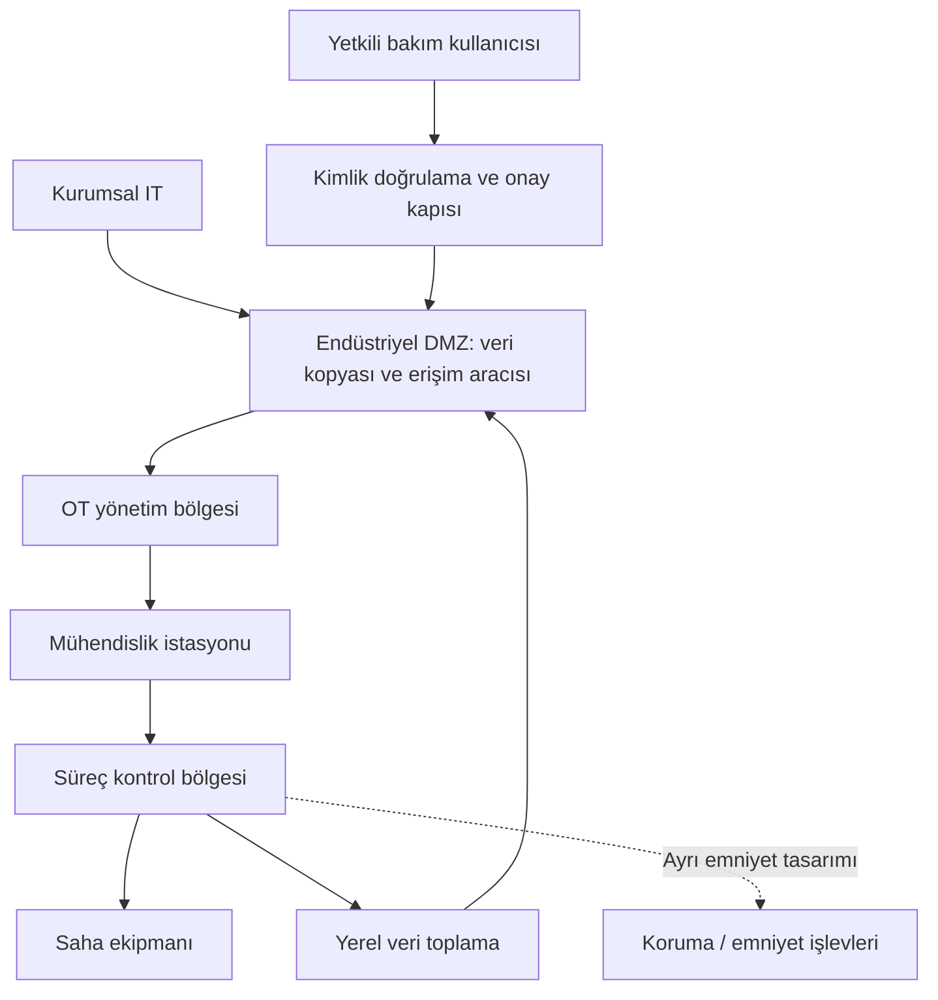

# Mimari ve güven bölgeleri

Bir OT ağını anlamanın başlangıcı IP adresleri değil, **hangi işlevin hangi başka işleve neden bağımlı olduğu** sorusudur. Aynı yerel ağda bulunmak ortak yetki gerektirmez; ayrı VLAN'da bulunmak da tek başına güvenlik sınırı oluşturmaz.

## Purdue modelini doğru kullanmak

Purdue yaklaşımı işlevleri kurumsal işletmeden fiziksel sürece doğru katmanlı düşünmek için kullanılır. Yaygın eğitim çizimlerinde seviye 0 fiziksel süreci, 1 temel kontrolü, 2 gözetimi, 3 tesis işletmesini, 4 kurumsal işlevleri anlatır. “3.5 DMZ” yaygın bir güvenlik mimarisi anlatımıdır; ayrı bir evrensel kontrol seviyesi gibi ele alınmamalıdır.

Bu sınıflandırma her tesise birebir oturmaz. Dağıtık elektrik varlıkları, uzak su sahaları, mobil haberleşme ve bulut analitiği için işlevsel bağımlılıklar ayrıca çizilir. Bir çizimin Purdue görünümünde olması onun güvenli olduğunu kanıtlamaz.

## Bölge ve geçiş

ISA/IEC 62443 yaklaşımındaki **zone**, ortak güvenlik gereksinimleri açısından gruplanan varlıkları; **conduit**, bölgeler arasındaki iletişim kanallarının güvenlik açısından ele alınmasını ifade eder. Risk değerlendirmesi hedef güvenlik gereksinimlerini belirlemeye yardım eder. ISA'nın kamuya açık seri özeti, varlık sahibi, hizmet sağlayıcı, sistem ve ürün sorumluluklarını ayrı standart parçalarında ele alır. [ISA/IEC 62443 seri kataloğu](https://www.isa.org/standards-and-publications/isa-standards/isa-iec-62443-series-of-standards)

Özgün şemadaki oklar kavramsal veri ilişkileridir; güvenlik duvarı izin listesi veya fiziksel kablolama planı değildir. Veri kopyalama oku her yerde çift yönlü oturum açılması gerektiği anlamına gelmez. Gerçek tasarımda başlatan uç, dönüş trafiği, protokol ve yetki ayrı kaydedilir.

## İlk veri akışı matrisi

| Kaynak işlev | Hedef işlev | Amaç | Soru / kanıt |
|---|---|---|---|
| Yerel veri toplayıcı | DMZ veri kopyası | Raporlama | Aktarım başarısızsa kontrol döngüsü etkileniyor mu? |
| Kurumsal raporlama | DMZ veri kopyası | İş analizi | Kurumsal uygulama kontrolöre erişmeden işini yapıyor mu? |
| Erişim aracısı | Mühendislik istasyonu | Onaylı bakım | Kullanıcı kimliği hedef oturumuyla eşleştirilebiliyor mu? |
| Mühendislik istasyonu | Kontrol sistemi | Onaylı değişiklik | Değişiklik numarası, zaman ve hedef kapsamı var mı? |
| Günlük toplayıcı | Güvenlik izleme | Olay inceleme | Aktarım kesilince boşluk görünür oluyor mu? |

Bu dört sütun, [envanter ve akış şablonundaki](../../templates/01-envanter-ve-akis.md) akış matrisinin sadeleştirilmiş ilk hâlidir; şablon aynı akışı daha ayrıntılı alanlarla kaydeder. Matris bir öneridir. “İzin ver” kararı ancak süreç sahibi ve ağ sorumlusu beklenen akışı, hata davranışını ve kabul testini tanımlayınca verilir. Bir sistemin varlığı otomatik olarak o sistemin tüm alt ağlara erişmesini gerektirmez.

## Sık yapılan mimari hatalar

- Yedek ağın, ana ağla aynı yönetim hesabına ve güç kaynağına bağımlı olduğunu gözden kaçırmak.
- Üretici VPN'ini yalnızca şifreli olduğu için yeterli kabul etmek; hedef kapsamını ve oturum sahibini doğrulamamak.
- İnternete doğrudan çıkışı olmayan sistemi tamamen bağlantısız saymak; bakım dizüstüsü ve geçici bağlantıları unutmamak.
- DMZ'yi kural sahipliği ve yaşam döngüsü bulunmayan genel bir geçiş ağına dönüştürmek.
- Emniyet, yönetim ve raporlama akışlarını aynı güven düzeyinde ele almak.

## Mimari incelemenin çıktısı

Bir sayfalık işlev şeması, sahipli akış matrisi, dış bağımlılık listesi ve doğrulanacak varsayımlar tablosu hazırlayın. Sonraki adım [segmentasyon ve uzak erişim](../04-savunma/02-segmentasyon-ve-uzak-erisim.md) bölümündeki kontrolleri bu akışlara uygulamaktır.

## Kaynak

- ISA, *ISA/IEC 62443 Series of Standards*, [kamuya açık katalog](https://www.isa.org/standards-and-publications/isa-standards/isa-iec-62443-series-of-standards), dinamik, erişim: 13.09.2026. Tam standart metni bu depoda yeniden üretilmez. Purdue anlatımı ve şema genel öğretim içeriği; matris ve inceleme önerileri özgün sentezdir.
