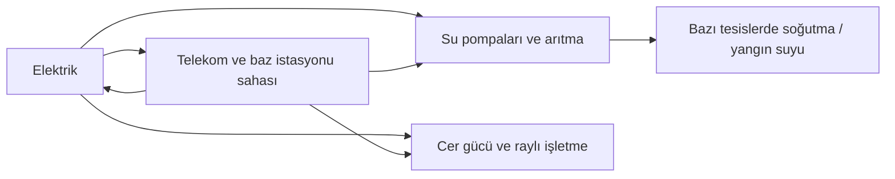

# Risk, emniyet ve altyapı bağımlılıkları

OT'de risk incelemesine “hangi cihaz zafiyetli?” sorusundan önce “hangi hizmet kaybı kabul edilemez?” sorusuyla başlamak gerekir. Bir zafiyet, onu etkileyen ürün, erişim yolu, çalışma modu ve fiziksel süreç bilinmeden tek başına olayın sonucunu anlatmaz.

## Dört ayrı kavram

| Kavram | Soru | Kurgusal örnek |
|---|---|---|
| Tehdit | Kim veya ne istenmeyen olaya yol açabilir? | Yetkisini kötüye kullanan bakım hesabı |
| Zayıflık | Hangi koşul buna imkân veriyor? | Bakım süresi bitse de açık kalan yetki |
| Sonuç | Hizmet, insan, çevre veya ekipman nasıl etkilenebilir? | Doğrulanamayan ayar nedeniyle işletme kısıtlaması |
| Risk | Bu koşullar ve sonuç birlikte nasıl yönetilmeli? | Erişimi süreli yap, değişikliği doğrula, kalan riske sahip ata |

İhlalden fiziksel sonuca geçiş genellikle ek koşullar gerektirir. HMI hesabına erişim her durumda PLC programı değiştirme yetkisi vermez. Kontrol verisine müdahale de bağımsız koruma, çalışma modu veya fiziksel sınırlar nedeniyle beklenen sonucu doğurmayabilir. Bu ara koşullar tehdit modelinde açık yazılmalıdır.

## Hizmetler birbirine bağlıdır

Özgün diyagram yalnızca olası hizmet bağımlılıklarını gösterir; oklar saldırı yolu değildir. Her sahada aynı bağımlılıklar bulunmaz. Telekomun elektrik kontrolündeki rolü varsa bile yerel koruma ve işletme özellikleri ayrıca değerlendirilir.

Her bağımlılık için şu bilgileri kaydedin: kesinti nasıl anlaşılır, yerel işlev devam eder mi, hangi süre hangi koşulla tolere edilir, yedek gerçekten farklı güç/iletişim/kimlik sağlayıcısına mı bağlı, geri gelince durum nasıl uzlaştırılır? Jeneratörün varlığı yakıt, bakım ve devreye girme kanıtının yerine geçmez. Yedek hat aynı fiziksel güzergâhtan geçiyorsa ortak arıza riski kalır.

## Risk puanını doğru yorumlamak

CVSS zafiyetin teknik şiddetini ifade eder; temel puan yerel tesisin toplam riskini ölçmez. FIRST, tehdit ve çevresel bağlamın eklenmesini açıklar. Dolayısıyla yüksek bir puanı otomatik üretim duruşuna veya düşük puanı otomatik risk kabulüne çevirmek uygun değildir. [FIRST CVSS v4.0 Kullanıcı Kılavuzu](https://www.first.org/cvss/user-guide)

Bu depo için önerilen nitel sıralama şöyledir: önce insan/çevre açısından ciddi sonuç ihtimali bulunan işlevler, sonra erişilebilir ve koruması zayıf yollar, ardından tespit ve kurtarma boşlukları incelenir. Bu sıra bir standart puanlama formülü değildir. İşletmenin süreç risk analizi ile birleştirilir.

## Bir risk kaydının kapanması

“Firewall alındı” bir uygulama faaliyetidir. “Onaysız bakım yolundan kritik hedefe erişim olmadığı, onaylı yolun çalıştığı ve günlük ürettiği kontrollü kabul incelemesinde gösterildi” ise kontrol kanıtıdır. Kayıt kapatılırken süreç sahibi kalan sonucu, güvenlik sorumlusu dijital kanıtı ve yetkili risk sahibi kabul kararını ayrı teyit eder.

Bir kontrolün uygulanamadığı durumda geçici önlem, sahibi, bitiş tarihi, doğrulama yöntemi ve kalıcı çözüm birlikte yazılır. Süresiz “iş gereği açık” açıklaması riski yönetilebilir hale getirmez.

## Kaynak

- FIRST, *CVSS v4.0 User Guide*, [kılavuz](https://www.first.org/cvss/user-guide), dinamik, erişim: 13.09.2026. Teknik şiddet ile çevre/tehdit bağlamı ayrımı. Diyagram, önceliklendirme ve kayıt örnekleri özgün analizdir.
