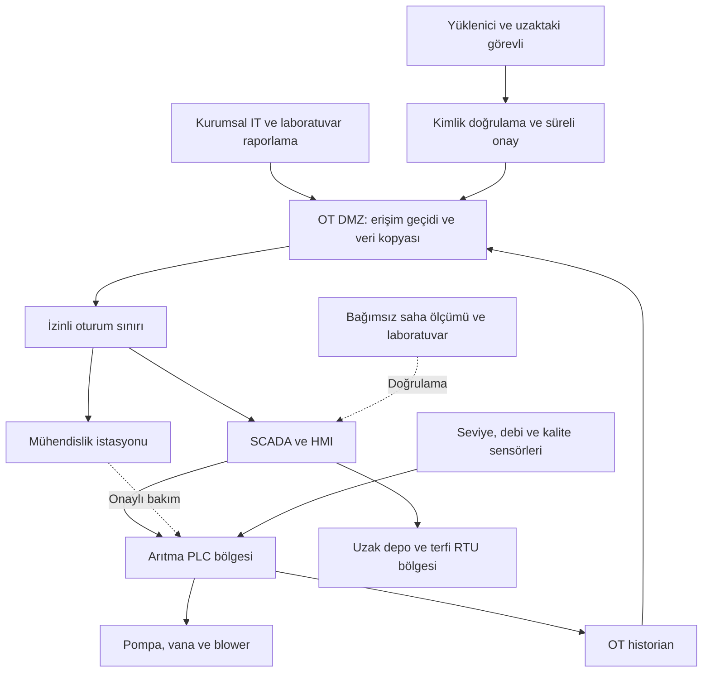

# Su ve atıksu sistemlerinde OT güvenliği

[Ana sayfa](../../README.md) · [Elektrik ve enerji](02-elektrik-ve-enerji.md) · [15 Ayrıntılı Saldırgan ve Savunma Senaryosu](senaryolar/01-su-ve-atiksu-senaryolari.md) · [Kaynak araştırma notları](../../research/su-elektrik-kaynaklar.md)

Bu bölüm, içme suyu üretimi, dağıtımı ve atıksu arıtmasını ilk kez öğrenen okur içindir. Amaç; bir bilgisayar olayının su hizmetine hangi bağımlılıklar üzerinden yansıyabileceğini anlamak ve savunmayı mühendislikle birlikte tasarlamaktır. Buradaki mimari, tehdit matrisi ve tatbikat özgün eğitim örnekleridir; gerçek bir tesisin projesini temsil etmez.

## 1. Önce fiziksel süreci anlayalım

İçme suyunda örnek yol **kaynak → alma yapısı → arıtma → dezenfeksiyon → temiz su deposu → terfi ve dağıtım → tüketici** biçimindedir. Koagülasyon, küçük parçacıkların birleşmesini kolaylaştırır; flokülasyon bunları daha büyük kümeler haline getirir. Çöktürme ve filtrasyon parçacıkları ayırır. Dezenfeksiyon mikroorganizmalarla ilgili riski yönetir. Her tesis bütün bu adımları aynı sırayla kullanmaz; kaynak suyu ve arıtma tasarımı belirleyicidir. [EPA, *Drinking Water Treatment*](https://nepis.epa.gov/Exe/ZyPURL.cgi?Dockey=3000660S.TXT)

Atıksuda örnek yol **kanalizasyon ve terfi → ızgara/kum tutma → ön çöktürme → biyolojik arıtma → son ayırma → gerekiyorsa ileri arıtma/dezenfeksiyon → deşarj veya yeniden kullanım** biçimindedir. Ayrılan çamurun da ayrı bir işleme hattı vardır. Biyolojik arıtmada canlı mikroorganizmalar kullanıldığından, yalnızca bilgisayarı geri getirmek prosesin toparlandığını kanıtlamaz. [EPA, *Primer for Municipal Wastewater Treatment Systems*, özellikle s. 9–19](https://www.epa.gov/sites/default/files/2015-09/documents/primer.pdf)

**Eğitim çıkarımı:** Güvenlik değerlendirmesi üç ayrı sonucu izlemelidir: hizmetin sürekliliği, su/atıksu kalitesi ve ekipmanın durumu. “SCADA çalışıyor” ile “su güvenli” aynı ölçüm değildir. Laboratuvar sonucu, saha ölçümü ve operatör gözlemi birbirinin yerine geçmez; birlikte değerlendirilir. Kalite kararının sahibi proses ve ilgili sağlık/çevre yetkilileridir.

## 2. Bileşenler ve güven sınırları

Bu eğitim mimarisinde seviye, debi, basınç ve kalite sensörleri ölçüm üretir. PLC, yerel kontrol mantığını yürütür; RTU, uzak terfi veya depo noktasının telemetrisini merkeze taşır. Sürücü motor hızını, vana aktüatörü vananın mekanik konumunu yönetir. HMI operatör ekranıdır; SCADA merkezden izleme ve gözetim sağlar. Historian geçmiş ölçümleri tutar. Mühendislik istasyonu kontrol uygulaması ve konfigürasyon değişiklikleri için ayrı yetki taşır.

Kurumsal IT tarafında faturalama, e-posta, insan kaynakları ve satın alma bulunur. Bu örnekte laboratuvar bilgi sistemi IT ile proses arasında veri paylaşır, ancak PLC üzerinde doğrudan kontrol yetkisi almaz. Bakım yüklenicisinin kimliği, bilgisayarı ve erişim oturumu ayrı ayrı değerlendirilir. Bir kurumun ağına bağlı olmak, bütün tesislerde değişiklik yapma yetkisi anlamına gelmez.

Oklar örnek veri/erişim ilişkileridir; uygulamada yön, kimlik, servis ve gerekçe ayrı bağlantı kaydına yazılır. DMZ, ağlar arasında denetimli alışveriş bölgesidir. EPA/CISA, korumasız HMI erişiminin yetkisiz görüntüleme ve değişikliğe yol açabileceğini; sınırda DMZ veya bastion, güçlü kimlik doğrulama ve uzak erişim kaydı kullanılmasını önerir. [EPA/CISA, 13 Aralık 2024 HMI bilgi notu](https://www.epa.gov/system/files/documents/2024-12/joint-factsheet-epa-cisa-internet-exposed-human-machine-interfaces-508c.pdf)

NIST SP 1800-45, farklı kapasitelerdeki su işletmeleri için üç temsilî güvenli OT uzak erişim çözümü sunar. **24 Haziran 2026 tarihli nihai yayın**, eski TN 2283 taslağının yerini almıştır. Örneklerin bir tesise uygunluğu ayrıca değerlendirilmelidir. [NIST SP 1800-45](https://csrc.nist.gov/pubs/sp/1800/45/final)

## 3. Protokol adı bize ne anlatır?

Aşağıdaki tablo yaygın işlev örneklerini gösterir; Türkiye'deki her tesiste kullanıldıkları iddiası değildir.

| Teknoloji | Bu örnekteki işlev | Savunmada doğrulanacak özellik |
|---|---|---|
| Analog/dijital giriş-çıkış | Sensör ve aktüatörün yerel kontrolöre bağlanması | Kablo/pano erişimi, kalibrasyon ve işaret eşlemesi |
| Modbus ve Modbus Security | Kontrolör ile cihaz arasında veri alışverişi | Geleneksel profil ile TLS ve sertifika kullanan Security profilini ayırt et; ürün desteğini doğrula. [Modbus Organization](https://www.modbus.org/news/modbus-security-new-protocol-to-improve-control-system-security) |
| DNP3 | RTU–merkez telemetrisi ve zaman damgalı olaylar | Ürün profili, olay kalitesi ve Secure Authentication desteği. [DNP Users Group](https://www.dnp.org/About/Features-of-DNP3) |
| OPC UA | SCADA/historian ve uygulamalar arasında anlamlı veri paylaşımı | Uygulama sertifikası, imza/şifreleme seçimi ve kullanıcı yetkisi. [OPC Foundation](https://opcfoundation.org/about/opc-technologies/opc-ua/) |
| VPN ve erişim geçidi | Onaylı bakım oturumunun taşınması | Kimlik, cihaz, süre, oturum kaydı ve iptal prosedürü; tünel kurulması tek başına proses yetkisi vermez |

Sertifikanın varlığını güvenli kurulumun kanıtı saymayın. Örneğin OPC UA'da uygulama kimliği, kullanıcı hakkı ve oturum güvenliği farklı kontrollerdir. Eğitimde “hangi güvenlik modu gerçekten etkin?” ve “sertifikayı kim yeniliyor?” soruları teknik özellik listesinden daha değerlidir. [OPC Foundation güvenlik açıklaması](https://opcfoundation.org/about/opc-technologies/opc-ua/)

## 4. Saldırgan bakışı: güven sınırlarından fiziksel sonuca

**Özgün tehdit modeli:** Satırlar saldırı talimatı veya belirli bir ürün açığı değildir. Ön koşul mevcut kabul edilerek hangi denetimin eksik kalabileceği incelenir. Olası etkiler kesin sonuç olarak okunmamalıdır; tesis tasarımı ve bağımsız korumalar sonucu değiştirir.

| Hedef | Ön koşul | Aşılan güven sınırı | Olası fiziksel/hizmet etkisi | Görülebilecek belirti | Savunma ve doğrulama |
|---|---|---|---|---|---|
| Operatörün kararını yanıltmak | Gösterge veya rapor verisinin bütünlüğü kaybolmuş | Ölçüm → güvenilir operasyon bilgisi | Yanlış değerlendirme, gerçek kalite sorununun geç anlaşılması | HMI, bağımsız ölçüm ve numune sonucunun tutarsızlığı | Veri kalite bayrağı; bağımsız doğrulama; kaynağı belirsiz değeri işaretleme |
| Bakım yetkisini kötüye kullanmak | Yetkili görünen fakat izinsiz kullanılan bakım oturumu | Yüklenici → OT yönetimi | Kontrol güvenilirliğinin kaybı, işletim kısıtı | İş emri olmadan oturum, onaysız proje farkı | Kişisel ve süreli erişim; iş emri eşlemesi; ikinci kişi incelemesi |
| Merkezi görünürlüğü kesmek | HMI/SCADA hizmetine etki edebilen bileşen bozulmuş | IT hizmeti → proses gözetimi | Uzak noktaların izlenememesi; saha personeli ihtiyacı | Güncellenmeyen zaman damgaları, toplu iletişim alarmı | Yerel özerklik envanteri; vardiya planı; alternatif haberleşme |
| Uzak saha verisini bozmak | RTU haberleşmesine veya konfigürasyonuna yetkisiz etki | Haberleşme taşıyıcısı → tesis kontrolü | Depo/terfi yönetiminde belirsizlik | Beklenmeyen cihaz kimliği, kalite bayrağı değişimi | Saha bazında yetki; izinli akışlar; iletişim ve proses korelasyonu |
| Geri dönüşü geciktirmek | Yedek veya mühendislik dosyaları korunmuyor | İşletim sistemi → kurtarma kaynağı | Onarımın uzaması, kısıtlı işletimin sürmesi | Yedek sürümüyle cihaz sürümünün uyuşmaması | Çevrimdışı kopya; proje bağımlılıkları; izole ortamda geri yükleme denemesi |

EPA'nın sektör kontrol listesi, su hizmetindeki proses kesintisi ile müşteri verisi ihlalini ayrı etki türleri olarak ele alır. Böylece yalnızca faturalama sistemindeki olaydan su kalitesinin bozulduğu sonucu çıkarılmaz. [EPA, *Incident Action Checklist – Cybersecurity*, s. 1](https://www.epa.gov/system/files/documents/2024-09/240909_cybersecurityiac_fillable_508c.pdf)

> Kuru çalışma, su koçu (water hammer), klor dozaj manipülasyonu, çözünmüş oksijen sahteciliği ve çamur çürütücü metan patlama riskleri dahil 15 ayrıntılı saldırgan ve çok katmanlı savunma senaryosu için [Su ve Atıksu Senaryoları Kataloğu](senaryolar/01-su-ve-atiksu-senaryolari.md) belgesini inceleyin.

## 5. Öncelikli savunma: kanıt üreten küçük işler

Aşağıdaki uygulama sırası **özgün öneridir**; tesisin risk analiziyle değiştirilir.

1. **İşlevi envantere bağlayın.** Her kritik varlık için hizmet ettiği proses, saha sorumlusu, uzak erişim yolu, bağımlı güç/haberleşme kaynağı ve son doğrulanmış proje sürümünü yazın. İlk görüşmeye IT, vardiya ve bakım birlikte katılsın.
2. **Erişimi bir iş emrine bağlayın.** Erişim talebi; kişi, cihaz, hedef sistem, amaç, zaman aralığı ve onaylayanı içersin. Kayıt tutan geçitte çok faktörlü kimlik doğrulama kullanın. Ürün bunu desteklemiyorsa kontrolü uygun sınır bileşenine taşıyın ve istisnayı belgeleyin.
3. **Veriyi kontrol yetkisinden ayırın.** Yönetim raporunu OT'den alınan veri kopyasından üretin. Raporlama hesabının kontrol uygulamasını değiştiremediğini konfigürasyon incelemesi ve izole testle gösterin.
4. **Proses bağlamıyla izleyin.** Uzak oturum, uygulama değişikliği, alarm yapılandırması, iletişim kaybı ve zaman kaymasını aynı olay çizelgesine koyun. “Planlı bakım vardı” bilgisini alarmın kapanma gerekçesine ekleyin.
5. **Yedeğin kullanılabilirliğini sınayın.** PLC projesi yanında HMI ekranları, cihaz ayarları, sürücü parametreleri, lisanslar ve gerekli kurulum dosyalarının da kurtarma paketinde bulunduğunu kontrol edin. Güvenli saklanan kimlik sırlarını ortak dokümana yazmayın.
6. **Yerel işletimin kapasitesini hesaplayın.** Hangi uzak noktanın personelsiz kalabildiğini, hangisinin saha ziyareti gerektirdiğini ve vardiyada kaç yetkin kişinin bulunduğunu kaydedin. “Manuele geçilebilir” ifadesini tek başına yeterli kanıt saymayın.

## 6. Olay müdahalesi ve mühendis onaylı geri dönüş

Sektör olay rehberi hazırlık, doğrulama, koordinasyon ve olay sonrası öğrenmeyi birlikte ele alır; ABD kurumlarının rollerini açıklar. Bu roller Türkiye için yasal bildirim rotası oluşturmaz. Yerel yükümlülükler, sözleşmeler ve kurumun SOME/olay planı ayrıca doğrulanır. [CISA/FBI/EPA, *Incident Response Guide*, Ocak 2024](https://www.epa.gov/system/files/documents/2024-01/wws-sector_incident-response-guide.pdf)

**Özgün karar akışı:** Vardiya amiri proses durumunu, siber ekip olay kapsamını, proses mühendisi hizmetin hangi koşullarda sürdürülebileceğini değerlendirir. Önce ölçüm güvenilirliği ve personel emniyeti doğrulanır. Bağlantı kesme, yerel işletim veya bileşen değiştirme seçeneği; telemetri, pompa koordinasyonu ve mevcut korumalar üzerindeki etkisiyle birlikte onaylanır. Siber alarmın otomatik olarak bütün sistemi durdurmasına dayalı bir varsayım yapılmaz.

Sistemleri gelişigüzel yeniden başlatmak kanıtı kaybettirebilir; EPA kontrol listesi de müdahalede kapatma/yeniden başlatmadan kaçınmayı vurgular. Emniyet için gerekli acil işletim kararları ise yetkili operasyon ekibinin prosedürüne tabidir. [EPA kontrol listesi, s. 4](https://www.epa.gov/system/files/documents/2024-09/240909_cybersecurityiac_fillable_508c.pdf)

Geri dönüş kaydı en az şu kapıları içersin: olayın etkilediği erişim yollarının giderilmesi; güvenilir yazılım/proje seçimi; izole ortamda işlev doğrulaması; sahada sensör/aktüatör eşlemesinin yetkin ekipçe kontrolü; proses ve kalite doğrulaması; vardiya devri. Her kapıda onaylayan kişi ve kanıt bulunmalıdır. İlk geçişte izleme süresi ve başarısızlık halinde uygulanacak alternatif işletim planı tesisçe belirlenir; evrensel bir süre önerilmez.

## 7. Kurgusal masa başı tatbikatı

**Senaryo:** Üç terfi noktası olan örnek işletmede gece vardiyası merkez ekranındaki bazı ölçümlerin yenilenmediğini görür. Aynı anda bir yüklenici hesabı için plansız oturum kaydı gelir. Saha ekibi bir noktada yerel göstergelerin çalıştığını bildirir. Gerçek cihazlara bağlanmadan, yalnızca hazırlanmış olay kartları ve temsili kayıtlarla ilerlenir.

Katılımcılar olayın haberleşme arızası mı, yetki ihlali mi, yoksa iki bağımsız durum mu olduğunu ayırmalıdır. Sonraki kartta vardiya personelinin iki uzak noktaya aynı anda ulaşamadığı açıklanır. Ekip hangi ölçüme güvendiğini, hangi operasyon kararını kimin vereceğini ve destek isteğinin içeriğini kaydeder. Son kart, bir yedek projenin sahadaki sürümle uyuşmadığını gösterir.

**Ölçütler:** ilk güvenilir durum resmine ulaşma süresi; sorumlusu belirlenen kritik işlev oranı; kaynağı doğrulanmış ölçüm oranı; iş emrine bağlanan oturum oranı; kurtarma paketindeki eksiklerin sayısı; mühendis onayı ve kanıtı bulunan geri dönüş adımı oranı. Hedef değerler tatbikattan önce kurumca belirlenir; hızlı karar kadar yanlış kararın önlenmesi de değerlendirilir.

## 8. Bölüm kontrol listesi

Bir maddenin işaretlenmesi, yalnızca yanına yazılan kanıt ve doğrulama tarihiyle anlam taşır; kanıtı olmayan madde açık kabul edilir.

- [ ] İçme suyu, atıksu ve çamur hattı ayrı işlevler olarak çizildi.
- [ ] IT olayı, görünürlük kaybı ve doğrulanmış proses etkisi ayrı kaydediliyor.
- [ ] Her uzak saha için yerel çalışma yeteneği ve personel ihtiyacı biliniyor.
- [ ] Bakım hesabının sahibi, iş emri ve erişim bitişi izlenebiliyor.
- [ ] Kritik ölçümün bağımsız doğrulama yöntemi var.
- [ ] Alarm değişiklikleri ve uygulama sürümleri incelemeye alınabiliyor.
- [ ] Kurtarma paketinin uyumluluğu izole ortamda gösterildi.
- [ ] Hizmete dönüşte proses, kalite ve siber onay sorumluları belirlendi.

## Kaynaklar ve kapsam

Tüm kaynaklara erişim: **2026-09-13**. Eski proses kaynakları temel fiziksel akış için kullanılmıştır; güncel su kalitesi limitleri veya Türkiye mevzuatı için kullanılmamıştır.

| Yayıncı ve kaynak | Yayın/güncelleme tarihi | Desteklediği içerik |
|---|---|---|
| EPA, [Drinking Water Treatment](https://nepis.epa.gov/Exe/ZyPURL.cgi?Dockey=3000660S.TXT) | Belge üzerinde 1974–2004 kampanya işareti; kesin yayın günü belirtilmiyor | Temel içme suyu arıtma adımları |
| EPA, [Primer for Municipal Wastewater Treatment Systems](https://www.epa.gov/sites/default/files/2015-09/documents/primer.pdf) | Eylül 2004 | Atıksu süreçleri ve çamur hattı |
| EPA/CISA, [Internet-Exposed HMIs Pose Cybersecurity Risks](https://www.epa.gov/system/files/documents/2024-12/joint-factsheet-epa-cisa-internet-exposed-human-machine-interfaces-508c.pdf) | 13 Aralık 2024 | HMI riski ve erişim sınırı kontrolleri |
| NIST, [SP 1800-45](https://csrc.nist.gov/pubs/sp/1800/45/final) | 24 Haziran 2026, nihai | Üç temsilî OT uzak erişim mimarisi; katalog/özet incelendi |
| Modbus Organization, [Modbus Security](https://www.modbus.org/news/modbus-security-new-protocol-to-improve-control-system-security) | 29 Ekim 2018 | TLS ve sertifika kullanılan ayrı güvenli profil |
| DNP Users Group, [Features of DNP3](https://www.dnp.org/About/Features-of-DNP3) | Sayfada tarih belirtilmiyor | Olay, zaman damgası ve telemetri özellikleri |
| OPC Foundation, [Unified Architecture](https://opcfoundation.org/about/opc-technologies/opc-ua/) | Sayfada tarih belirtilmiyor | Uygulama kimliği, kullanıcı hakkı, imza ve şifreleme |
| CISA/FBI/EPA, [Incident Response Guide: Water and Wastewater Sector](https://www.epa.gov/system/files/documents/2024-01/wws-sector_incident-response-guide.pdf) | Ocak 2024 | Sektörel olay koordinasyonu ve ABD kapsamı |
| EPA, [Incident Action Checklist – Cybersecurity](https://www.epa.gov/system/files/documents/2024-09/240909_cybersecurityiac_fillable_508c.pdf) | PDF içinde Eylül 2024 | Etki ayrımı, kanıt koruma, hazırlık ve kurtarma |

Bu metin belirli bir tesis için tasarım onayı, su kalitesi kararı veya mevzuat uygunluk beyanı değildir. Teknik varyantlar, mevcut emniyet düzenekleri ve saha sorumlulukları tesis bazında doğrulanmalıdır.
