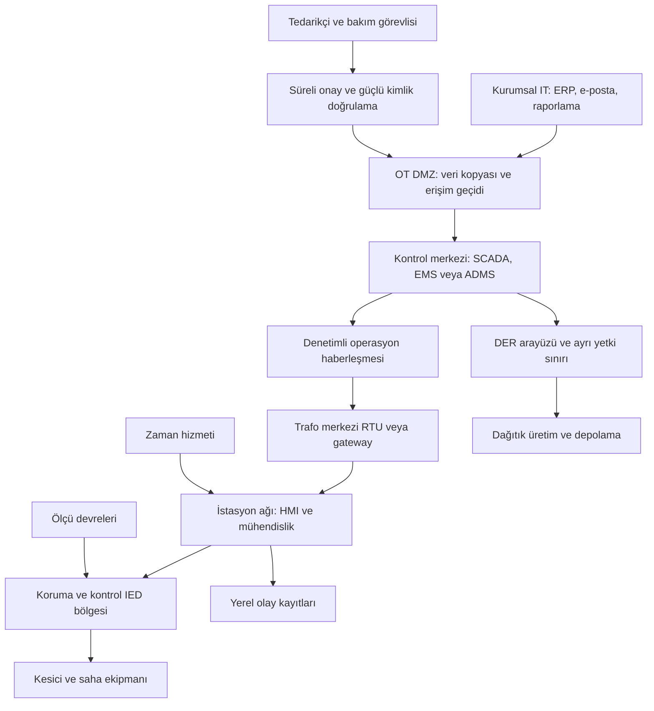

# Elektrik ve enerji sistemlerinde OT güvenliği

[Ana sayfa](../../README.md) · [Su ve atıksu](01-su-ve-atiksu.md) · [Kaynak araştırma notları](../../research/su-elektrik-kaynaklar.md)

Elektrik OT'sini öğrenirken enerji akışı ile bu akışı izleyen ve yöneten haberleşmeyi ayrı çizmek gerekir. Bir sunucunun çalışması, şebekenin doğru gözlendiğini veya koruma işlevinin sağlam olduğunu tek başına kanıtlamaz. Bu bölüm elektrik üretimi, iletim, dağıtım ve dağıtık enerji kaynaklarına odaklanır; petrol/doğal gaz boru hatları ve nükleer tesislere özgü tasarım ayrıntıları kapsam dışıdır.

## 1. Enerji tüketiciye nasıl ulaşır?

Basitleştirilmiş akış **üretim → gerilim dönüşümü → iletim → trafo merkezi → dağıtım → tüketici** biçimindedir. Transformatörler farklı aşamalarda gerilim seviyesini değiştirir. Şebeke işletmecileri üretim ile talep arasındaki dengeyi gözetir; bağlantılı şebekenin bölümleri arasında koordinasyon gerekir. [EIA, *How electricity is delivered to consumers*](https://www.eia.gov/energyexplained/electricity/delivery-to-consumers.php)

Dağıtık enerji kaynağı anlamındaki **DER**, bu görünümü genişletir: dağıtım seviyesine bağlanan güneş üretimi, depolama ve benzeri kaynaklar farklı sahiplerin dijital sistemleriyle ilişkilidir. DOE/NARUC yaklaşımı bu nedenle dağıtım işletmeleri yanında DER işletmecilerini ve toplayıcılarını da kapsar. [NARUC/DOE, *Cybersecurity Baselines*, Şubat 2024](https://www.energy.gov/sites/default/files/2025-01/NARUC_Cybersecurity-Baselines-Report%201.pdf)

**Özgün eğitim çıkarımı:** Varlık envanterinde yalnızca trafo merkezinin bilgisayarlarını saymak yetersizdir. Dış hizmet sağlayıcısı, DER yönetim hizmeti ve mühendislik dosyasının sahibi de güven kararının parçasıdır. Fiziksel elektrik bağlantısı, dijital kontrol yetkisinin kapsamını kendiliğinden belirlemez.

## 2. Kontrol, koruma ve kurumsal IT

Örnek bir santralde DCS/PLC üretim prosesini, türbin/jeneratör yardımcı sistemlerini ve tesis içi ekipmanı izler. İletim veya dağıtım kontrol merkezindeki SCADA saha verisini toplar. EMS enerji yönetimini, DMS/ADMS dağıtım işletimine ilişkin gözetim ve karar desteğini temsil eder. Bu eğitim örneğinde RTU/gateway kontrol merkeziyle saha cihazları arasında arayüzdür; her tesiste bütün ürünler birlikte bulunmaz.

IED, **akıllı elektronik cihaz** anlamına gelir. Koruma rölesi bunun bir örneğidir: elektriksel arıza veya anormal durumları algılar ve koruyucu işlem başlatabilir. Koruma rölesi ile mekanik olarak akımı kesen kesici ayrı bileşenlerdir. Üretici dokümantasyonu da koruma sisteminin ölçü trafoları, kesici, haberleşme ve yardımcı güç gibi birden fazla unsur içerdiğini gösterir. [SEL, *Protective Relays*](https://selinc.com/products/generation/protection/), [Mohamed Nabil Ali/SEL, *Improving Operation and Maintenance of Substation Equipment Using Operational Data From Protective Relays*, 2019](https://cdn.selinc.com/assets/Literature/Publications/Technical%20Papers/6922_ImprovingOperation_MA_20190524_Web.pdf?v=20191028-180043)

Bu ayrımın güvenlik sonucu şudur: kurumsal uç nokta güvenlik ekibi ile koruma mühendisinin değişiklik onayı aynı şey değildir. Röle konfigürasyonu, istasyon haberleşmesi ve kontrol merkezi uygulaması farklı sorumlulara sahip olabilir. Bakım bilgisayarının birden fazla bölgeye bağlanması, bu bölgeler arasındaki güven sınırını incelemeyi gerektirir.

Bu **özgün kavramsal mimari**, bütün koruma trafiğinin gateway veya güvenlik duvarından geçmesi gerektiği anlamına gelmez. Gecikme, yedeklilik ve arıza davranışı mühendislik tasarımının parçasıdır. Oklar enerji akışını değil örnek bilgi/kontrol ilişkilerini gösterir. Gerçek projede istasyon ağı, proses ağı, seri bağlantılar ve fiziksel koruma devreleri ayrıca çizilir.

## 3. Protokolleri işlevleriyle öğrenin

IEC 61850 tek bir paket biçimi değildir; veri modellerini, mühendislik dili SCL'yi, haberleşme hizmetlerini ve protokol eşlemelerini kapsayan bir standart ailesidir. [IEC 61850 resmî açıklaması](https://iec61850.dvl.iec.ch/)

| Teknoloji | İşlev | Savunmada sorulacak soru |
|---|---|---|
| IEC 60870-5-104 | Coğrafi olarak dağılmış süreçlerde uzaktan izleme/kontrol | Hangi uçlar ve işlevler yetkili; güvenlik profili gerçekten uygulanıyor mu? [IEC ürün kapsamı](https://webstore.iec.ch/en/publication/3746) |
| DNP3 / IEEE 1815 | RTU/IED telemetrisi ve olay aktarımı | Desteklenen profil ve Secure Authentication sürümü nedir? [DNP Users Group](https://www.dnp.org/About/Overview-of-DNP3-Protocol) |
| IEC 61850 MMS | Nesne temelli istasyon verilerinin haberleşmesi | İstemci kimliği, yetkiler ve kayıtlar hangi uçta doğrulanıyor? [IEC 62351 eşlemeleri](https://iec61850.dvl.iec.ch/what-is-61850/technical-principles/61850-cybersecurity/) |
| IEC 61850 GOOSE / SV | Eşler arası olay mesajları / örneklenmiş ölçümler | Trafik mühendisliği, kaynak denetimi ve güvenlik profilinin zaman gereksinimine uyumu doğrulandı mı? [IEC 62351-6 kapsam açıklaması](https://iec61850.dvl.iec.ch/what-is-61850/technical-principles/61850-cybersecurity/) |
| ICCP / TASE.2 | Kontrol merkezleri arasındaki bilgi alışverişi | Paylaşılan veri kümesi, karşı kurum ve güvenlik sınırı açık mı? [IEC 62351 açıklaması](https://iec61850.dvl.iec.ch/what-is-61850/technical-principles/61850-cybersecurity/) |
| Zaman hizmetleri | Olayların ve bazı ölçümlerin ortak zamanla ilişkilendirilmesi | Kaynak, yedek davranış ve saat sapması takibi tanımlı mı? |

IEC 62351 ailesi ilgili enerji protokolleri için güvenlik teknolojileri yanında rol tabanlı yetki, anahtar yönetimi ve güvenlik olay kaydını ele alır. **Çıkarım:** “IEC uyumlu” ifadesinden bütün bu özelliklerin satın alınan cihazda etkin olduğu sonucu çıkarılamaz. Ürün/sürüm/profil ve sahadaki konfigürasyon kanıtı aranmalıdır. [IEC 62351 resmî açıklaması](https://iec61850.dvl.iec.ch/what-is-61850/technical-principles/61850-cybersecurity/)

## 4. Saldırgan bakışı: hangi güven varsayımı bozuluyor?

**Özgün tehdit modeli:** Erişim elde etme adımları veya operasyon komutları verilmez. Satırlar, ön koşulu oluşmuş bir olayın savunma açısından değerlendirilmesidir. Etkinin büyüklüğü koruma tasarımı, işletim durumu ve kapsamla değişir; tek bir cihaz olayından ülke çapında kesinti sonucu çıkarılmaz.

| Hedef | Ön koşul | Güven sınırı | Olası fiziksel/hizmet etkisi | Belirti | Savunma/kanıt |
|---|---|---|---|---|---|
| Operatörün şebeke resmini bozmak | Telemetri veya topoloji bilgisinin bütünlüğü kaybolmuş | Saha bilgisi → karar desteği | Hatalı durum değerlendirmesi; işletim kısıtı | Bağımsız ölçümlerle uyuşmazlık, eski veri, kalite değişimi | Kaynak ve zaman doğrulama; model değişikliği kaydı; tutarsızlığı görünür kılma |
| Mühendislik yetkisini kötüye kullanmak | Onaysız kullanılan ayrıcalıklı oturum | Bakım → koruma/konfigürasyon | Korumanın veya kontrolün güvenilirliğinin azalması | İş emriyle eşleşmeyen konfigürasyon farkı | Ayrı yönetim kimliği; değişiklik incelemesi; onaylı temel sürüm |
| Kontrol merkezi hizmetini erişilemez kılmak | Ortak uygulama veya altyapı etkilenmiş | IT/ortak hizmet → OT gözetimi | Merkezi görünürlük kaybı; saha koordinasyonunun zorlaşması | Birçok sahadan eşzamanlı haberleşme alarmı | Ortak bağımlılık haritası; yerel işletim planı; temsilî kurtarma testi |
| Olay sırasını belirsizleştirmek | Zaman kaynağı veya günlük bütünlüğü bozulmuş | Zaman/kayıt hizmeti → olay analizi | Arıza nedeninin yanlış yorumlanması; geri dönüşün gecikmesi | Cihazlar arasında saat farkı, tutarsız olay sırası | Zaman kalite izlemesi; kayıt kaynağını koruma; belirsizlik aralığı yazma |
| DER filosundaki ortak yetkiyi istismar etmek | Toplayıcı hizmette aşırı geniş veya ele geçirilmiş yetki | Dış işletmeci → çoklu saha | Birden fazla bağlantı noktasında işletim sorunu | Aynı kimlikle olağandışı toplu değişiklik | Saha/grup bazında yetki; onay kapsamı; ortak arıza analizi |
| Kurtarma malzemesini güvenilmez kılmak | Ayar/proje arşivi doğrulanmıyor | Arşiv → sahaya geri yükleme | Uzayan kesinti veya yeniden doğrulama ihtiyacı | Dosya bütünlüğü ve sürüm uyuşmazlığı | Bağımsız kopya; tedarik kökeni; mühendislik kabul testi |

## 5. Öncelikli kontroller

NARUC/DOE tabanı; kritik varlıkların tanınması, IT/OT ve farklı güven seviyelerinin ayrılması, uzak erişimde çok faktörlü doğrulama, konfigürasyon kaydı ve kurtarma hazırlığı gibi alanları kapsar. Ocak 2025 **ara** uygulama rehberi özellikle kapsam ve önceliklendirmeyi ele alır. Bunlar ABD bağlamındaki kaynaklardır; Türkiye'de kendiliğinden yasal yükümlülük oluşturmaz. [NARUC/DOE tabanı](https://www.energy.gov/sites/default/files/2025-01/NARUC_Cybersecurity-Baselines-Report%201.pdf), [NARUC ara rehber açıklaması](https://www.naruc.org/core-sectors/critical-infrastructure-and-cybersecurity/cybersecurity-for-utility-regulators/cybersecurity-baselines/)

Aşağıdaki kabul kanıtları **özgün uygulama önerileridir**:

| Öncelik | Uygulama | Tamamlandığını gösteren kanıt |
|---|---|---|
| 1 | Kontrol merkezi, kritik istasyon, yardımcı güç, zaman ve ortak yönetim bağımlılıklarını eşleştir | Her kritik işlev için sorumlu, bağımlılık ve kayıp halinde işletim seçeneği |
| 1 | Bakım erişimini kişiye, iş emrine ve süreye bağla | Örnek bir oturumun talep–onay–kayıt–kapanış zinciri |
| 1 | Mühendislik dosyalarının güvenilir temel sürümünü oluştur | Cihaz/firmware/proje eşlemesi, değişiklik gerekçesi, onaylayan mühendis |
| 2 | Saha bölgeleri arasındaki gerekli iletişimi tanımla | Akış, yön, sahip ve operasyon gerekçesi bulunan izin matrisi |
| 2 | Röle, gateway ve kontrol merkezi kayıtlarını ilişkilendir | Ortak zaman çizelgesi; saat sapması ve veri kalite bilgisi |
| 2 | DER hizmet sağlayıcısının ortak yetki ve bağımlılıklarını incele | Saha kapsamı, erişim iptal yolu ve hizmet kesilince beklenen davranış |
| 3 | Değişiklik ve geri dönüşü temsilî ortamda dene | İşlev, gecikme, yedeklilik, log ve başarısızlık geri dönüş sonuçları |

Koruma trafiğine denetim ürünü eklemek de değişikliktir. Trafiği engelleyen bir kontrolün devreye alınmasında koruma mühendisliği etkisi değerlendirilmelidir. Başlangıçta onaylı pasif gözlem ve mevcut kayıtların incelenmesi, üretimde yeni etki oluşturmadan görünürlük sağlayan bir eğitim yaklaşımıdır. Pasifliğin fiziksel bağlantı ve cihaz yükü bakımından da doğrulanması gerekir.

## 6. Olay müdahalesi ve şebekeye dönüş

NERC CIP-009-6, kendi uygulanabilirlik kapsamındaki BES siber sistemleri için kurtarma planı ve test kanıtlarını tanımlar. Burada **planın denenebilir olması** ilkesi için karşılaştırmalı kaynak olarak kullanılır; NERC'nin bütün enerji varlıklarına veya Türkiye'ye doğrudan uygulandığı ileri sürülmez. [NERC CIP-009-6, R1–R2](https://www.nerc.com/globalassets/standards/reliability-standards/cip/cip-009-6.pdf)

**Özgün müdahale akışı:** Olay yöneticisi iletişimi koordine eder; kontrol merkezi işletim durumunu, koruma mühendisi koruma güvenilirliğini, siber ekip etkilenen kimlik ve sistemleri değerlendirir. Kaynak kaybı, gerçek elektriksel arıza ve gösterim hatası ayrı hipotezler olarak tutulur. Kesici durumu yalnızca uzaktaki bir ekran rengine dayanarak yorumlanmaz; yetkili ekip uygun bağımsız veriyi kullanır.

Ağ izolasyonu, uzaktan erişimin askıya alınması veya bileşenin değiştirilmesi; mevcut haberleşme ve yedek işletim üzerindeki etkisi bilinerek onaylanır. Siber ekibin otomatik enerji kesme, röle sıfırlama veya tekrar enerjilendirme yetkisi olduğu varsayılmaz. Acil işletim kararları saha emniyeti ve şebeke işletim prosedürlerine bağlıdır.

Geri dönüşte beş ayrı kabul gerekir: **güvenilir yazılım/konfigürasyon**, **ölçüm ve olay kaydının doğruluğu**, **koruma/otomasyon işlevleri**, **merkez–saha yetki ve haberleşmesi**, **işletim onayı**. Geri yüklenen dosyanın bütünlüğü kadar o fiziksel düzen için doğru dosya olması da kontrol edilir. İşletim yetkilisi ve ilgili mühendisler kayıtlı onay verir; siber ekibin “zararlı bulunamadı” sonucu tek başına yeterli kabul ölçütü değildir.

## 7. Kurgusal masa başı tatbikatı

**Senaryo:** Temsilî dağıtım işletmesinde birkaç istasyonun zaman damgalı olayları kontrol merkeziyle uyuşmaz. Bir bakım hesabının iş emri süresi dışında kullanıldığı anlaşılır. İlk kartta elektriksel arıza kanıtı yoktur; ikinci kartta iki istasyonun aynı zaman hizmetine bağlı olduğu açıklanır. Son kartta DER hizmet sağlayıcısı kendi yönetim ekranına erişemediğini bildirir. Tüm veriler uydurmadır; gerçek istasyon bağlantısı veya anahtarlama yapılmaz.

Ekip önce hangi kayıtların güvenilir olduğunu ve veri boşluğunun hangi kararı engellediğini yazar. Ardından bakım hesabı, ortak zaman hizmeti ve dış sağlayıcı olaylarının bağlantılı olup olmadığını inceler. Son aşamada temsilî kurtarma paketini inceler ve hangi eksik kanıt yüzünden işletime dönüş onayı veremeyeceğini açıklar.

**Ölçütler:** ilk tutarlı durum resmine ulaşma süresi; saat belirsizliği tanımlanan kayıt oranı; iş emrine bağlanan ayrıcalıklı oturum oranı; onaylı sürümle eşlenen cihaz oranı; geri dönüş için eksik mühendislik kanıtı sayısı; birden fazla sahayı etkileyen ortak bağımlılıkların belirlenme oranı. Sayısal hedefleri kurum tatbikat öncesi belirler. Kesintiyi hızlı sonlandırmak kadar yanlış yeniden enerjilendirme kararını önlemek de başarı ölçütüdür.

## 8. Bölüm kontrol listesi

- [ ] Enerji akışı ve haberleşme mimarisi ayrı çizildi.
- [ ] Kontrol, koruma ve mekanik kesme işlevlerinin sorumluları ayrıldı.
- [ ] Her protokol için sürüm, güvenlik profili ve etkin ayar kanıtı var.
- [ ] Zaman, yardımcı güç ve ortak yönetim bağımlılıkları envanterde.
- [ ] Bakım dosyasının doğru sahaya ve doğru donanıma ait olduğu doğrulanıyor.
- [ ] DER sağlayıcısının erişim kapsamı ve ortak arıza etkisi biliniyor.
- [ ] Siber müdahalenin koruma/haberleşme üzerindeki etkisi değerlendiriliyor.
- [ ] Yeniden hizmete alma kararı mühendislik ve işletim onayı içeriyor.

## Kaynaklar ve güncellik

Tüm kaynaklara erişim: **2026-09-13**. IEC standartlarının ücretli tam metinleri incelenmedi; resmî kapsam ve teknik açıklama sayfaları kullanıldı. NARUC sayfası hâlâ ara rehberi listeliyor ve 2025 için geçmiş bir yayımlama beklentisi taşıyor; bu beklenti nihai sürümün yayımlandığının kanıtı sayılmadı.

| Yayıncı ve kaynak | Yayın/güncelleme tarihi | Desteklediği içerik |
|---|---|---|
| EIA, [How electricity is delivered to consumers](https://www.eia.gov/energyexplained/electricity/delivery-to-consumers.php) | İncelenen metinde tarih belirtilmiyor | Üretim–iletim–dağıtım ve dengeleme |
| NARUC/DOE, [Cybersecurity Baselines for Electric Distribution Systems and DER](https://www.energy.gov/sites/default/files/2025-01/NARUC_Cybersecurity-Baselines-Report%201.pdf) | Şubat 2024; URL'deki 2025 yükleme dizini yayın tarihi değildir | Dağıtım/DER kapsamı ve kontrol alanları |
| NARUC, [Cybersecurity Baselines sayfası](https://www.naruc.org/core-sectors/critical-infrastructure-and-cybersecurity/cybersecurity-for-utility-regulators/cybersecurity-baselines/) ve [Interim Implementation Guidance](https://pubs.naruc.org/pub/96999449-C80D-6780-A3B6-273988121062) | Ara rehber Ocak 2025; sayfa tarihi belirtilmiyor | Kapsam, önceliklendirme ve ara sürüm durumu |
| IEC, [IEC 61850 Home](https://iec61850.dvl.iec.ch/) | Sayfada yayın tarihi belirtilmiyor | Veri modeli, SCL, hizmetler ve protokoller |
| IEC, [IEC 60870-5-104:2006](https://webstore.iec.ch/en/publication/3746) | 13 Haziran 2006; sayfa 2016 değişikliğine de bağlanıyor | Dağınık süreçlerin telekontrol kapsamı; tam standart değil |
| IEC, [IEC 62351: Cybersecurity for IEC 61850](https://iec61850.dvl.iec.ch/what-is-61850/technical-principles/61850-cybersecurity/) | Sayfada tarih belirtilmiyor | MMS, GOOSE/SV, ICCP güvenlik eşlemeleri ve yönetim kontrolleri |
| DNP Users Group, [Overview of DNP3 Protocol](https://www.dnp.org/About/Overview-of-DNP3-Protocol) | Sayfada tarih belirtilmiyor | IEEE 1815 ilişkisi ve Secure Authentication kapsamı |
| SEL, [Protective Relays](https://selinc.com/products/generation/protection/) | Sayfada tarih belirtilmiyor | Koruma rölesi işlevi; üretici kaynağı, ürün önerisi değil |
| Mohamed Nabil Ali/SEL, [Improving Operation and Maintenance of Substation Equipment Using Operational Data From Protective Relays](https://cdn.selinc.com/assets/Literature/Publications/Technical%20Papers/6922_ImprovingOperation_MA_20190524_Web.pdf?v=20191028-180043) | GCC Power, 27–29 Ekim 2019 | Röle/kesici ayrımı ve koruma sisteminin bileşenleri |
| NERC, [CIP-009-6](https://www.nerc.com/globalassets/standards/reliability-standards/cip/cip-009-6.pdf) | Sürüm geçmişi: NERC kabulü 13 Kasım 2014; FERC onayı 21 Ocak 2016 | Kapsama bağlı kurtarma planı ve test yaklaşımı; güncel uygulanabilirlik ayrıca kontrol edilmeli |
