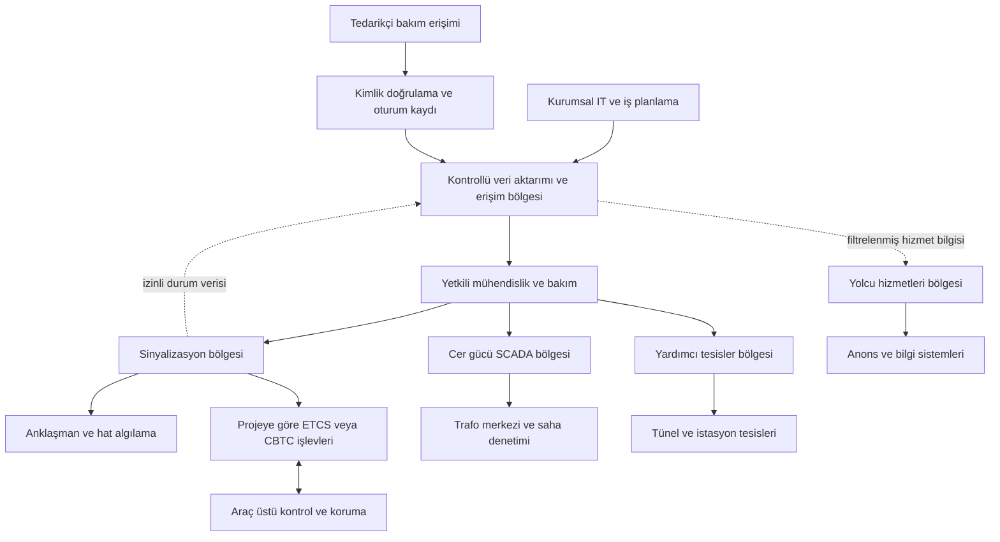

# Raylı sistemlerde OT ve siber güvenlik

[Ana sayfa](../../README.md) · [Telekom ve baz istasyonları](04-telekom-ve-baz-istasyonlari.md) · [12 Ayrıntılı Saldırgan ve Savunma Senaryosu](senaryolar/03-rayli-sistemler-senaryolari.md)

> Araştırma tarihi: **13.09.2026**. Bu bölüm eğitim ve yetkili savunma planlaması içindir. Mimari ve senaryolar kurgusaldır; bir işletmenin hat planını veya işletme talimatını temsil etmez.

## 1. Önce fiziksel hizmeti anlayalım

Raylı sistemin işi, yolcuyu veya yükü uygun güzergâhta taşırken tren hareketlerini, enerji beslemesini ve istasyon işletmesini birlikte yönetmektir. Bir arızanın sonucu yalnızca bilgisayar ekranının kapanması olmayabilir: sefer aralığı uzayabilir, trenler bekleyebilir ve istasyonlarda yığılma oluşabilir. Bununla birlikte, her siber olay otomatik olarak çarpışma anlamına gelmez. Sinyalizasyon tasarımında emniyetli duruma geçiş hedeflenir; Network Rail, gerekli hareket bilgisinin kaybının sinyallerin kısıtlayıcı durumda kalmasına ve gecikmeye yol açabildiğini açıklar. Bu tasarım hedefi, bütün saldırı koşullarında emniyetin garanti edildiği şeklinde yorumlanmamalıdır. [Network Rail: Signals explained](https://www.networkrail.co.uk/stories/signals-explained/)

Öğrenme amacıyla bir hareketi şu bağımlılıklarla düşünün:

1. İşletme merkezi seferi ve güzergâh talebini planlar.
2. Hat üzerindeki algılama sistemi, trenin bulunduğu bölgelere ilişkin durum üretir.
3. Anklaşman sistemi, makas ve sinyaller arasındaki izin koşullarını değerlendirir.
4. Uygulanan sinyalizasyon ve tren koruma sistemi, hareket iznini ve hız gözetimini yürütür.
5. Cer gücü, haberleşme ve yardımcı tesisler işletmenin sürmesini destekler.

Bu sıralama bir eğitim soyutlamasıdır; gerçek sistemde işlevler eşzamanlı ve dağıtık çalışabilir. Tasarım incelemesi, her adımın veri kaynağını, karar yetkisini ve hatalı bilgi halinde izlenecek onaylı davranışı ayrı kaydetmelidir.

## 2. Temel bileşenler ve sınırlar

**Anklaşman / interlocking**, birbiriyle çelişen güzergâhların kurulmasını önlemeye yönelik makas ve sinyal bağımlılıklarını uygular. Bir operatör ekranı, anklaşmanın kendisi değildir; ekranın görünürlüğünü kaybetmek ile emniyet mantığının bütünlüğünü kaybetmek farklı olaylardır. [Network Rail: Jargon Buster, Interlocking](https://safety.networkrail.co.uk/jargon-buster/)

**ETCS**, kabin sinyalizasyonu ve otomatik tren koruma işlevlerini içeren Avrupa Tren Kontrol Sistemi'dir. **ERTMS** daha geniş çerçevedir; ERA, ETCS, demiryolu haberleşmesi ve işletme kurallarını birlikte ele alır. ETCS düzeyi, baseline ve radyo sistemi sürümü proje bazında kayıt altına alınmalıdır. **RBC**, radyo tabanlı ETCS uygulamalarındaki Radio Block Centre bileşenidir; her hatta aynı mimaride bulunacağı varsayılmaz. [ERA: ERTMS](https://www.era.europa.eu/sk/node/558)

**CBTC**, özellikle kent içi işletmelerde görülen, tren ile hat sistemleri arasındaki sürekli haberleşmeye dayalı tren kontrol yaklaşımıdır. MTA'nın uygulamasında kablosuz bağlantı trenler ile merkezi kontrol arasında süreklilik sağlar. CBTC, ETCS'nin diğer adı değildir; bir CBTC ürününün ETCS ile birlikte çalışabilirliği kendiliğinden doğmaz. Otomasyon derecesi de yalnızca “CBTC var” bilgisiyle belirlenemez. [MTA: CBTC](https://www.mta.info/projects/culver-line-signal-modernization)

**Cer gücü** treni hareket ettiren elektrik beslemesidir. **Yardımcı tesisler** tünel ve istasyon havalandırması, pompa, aydınlatma ve benzeri fiziksel işlevleri içerir. **Yolcu sistemleri** anons, bilgi ekranı, biletleme ve kablosuz erişim gibi hizmetleri kapsar. ENISA, bölgelerin yalnız cihaz tipine göre değil, süreç işlevleri ve fiziksel/mantıksal sınırlar dikkate alınarak oluşturulmasını önerir. [ENISA: Zoning and Conduits for Railways, bölüm 3](https://www.enisa.europa.eu/sites/default/files/publications/Zoning%20and%20Conduits%20for%20Railways%20-%20Security%20Architecture.pdf)

## 3. Eğitim mimarisi

Oklar zorunlu doğrudan bağlantı veya sınırsız erişim değildir. Bu depo için önerilen inceleme modelinde her ok; sahibi, amacı, yönü, izinli işlem türü, kayıt noktası ve bağlantı kaybı davranışıyla belgelenir. Tedarikçi oturumu her bölgeye ortak yönetici yetkisi vermemelidir. Yolcu ekranını güncelleyen hesabın sinyalizasyon bakım yetkisi bulunması için iş gerekçesi yoktur.

| İşlev / teknoloji | Kullanıldığı yer | Güvenlik incelemesindeki soru |
|---|---|---|
| Anklaşman saha arayüzleri | Makas, sinyal, tren algılama | Saha durumu ile komut yetkisi nasıl ayrılıyor? |
| ETCS / RBC / Eurobalise | Uygulamaya göre hat ve araç üstü | Sürüm, anahtar yönetimi ve mühendislik sorumluluğu kayıtlı mı? |
| GSM-R ve projeye bağlı yeni radyo çözümleri | İşletme haberleşmesi | Ses ve veri bağımlılıklarının geri dönüş planı var mı? |
| CBTC haberleşmesi | Araç ve hat kontrol bileşenleri | Haberleşme kaybı davranışı hangi onaylı tasarıma dayanıyor? |
| SCADA telemetrisi ve uzaktan kumanda | Cer gücü, yardımcı tesisler | Okuma, kumanda ve mühendislik işlemleri ayrı mı? |
| Yönetim ve dosya aktarımı | Bakım istasyonları | Dosyanın kaynağı, değişiklik onayı ve oturumu izlenebilir mi? |

Tablo protokolün adından güvenlik sonucu çıkarmaz. Aynı işlev farklı üretici arayüzleriyle uygulanabilir. ETCS/RBC bağlamının bir resmi örneği EBA'nın ERA konferans sunumunda görülür; buradaki örnek başka hatların mimarisi olarak kullanılamaz. [EBA: Cybersecurity Aspects in German Railway Sector, 2025](https://www.era.europa.eu/sites/default/files/2025-12/session%206-2%20-%20eba%20-%20cybersecurity%20in%20german%20nsa.pdf)

## 4. Saldırgan bakışıyla tehdit modelleme

Aşağıdaki matris bu eğitim deposunun özgün analizidir; doğrulanmış olay veya bir sistemde mevcut açıklık iddiası değildir. Önkoşullar, incelemede doğrulanacak varsayımlardır. Amaç, erişim veya istismar adımı üretmeden güven sınırlarını sorgulamaktır.

| Tehdit hedefi | Varsayımsal önkoşul | Aşılmaya çalışılan sınır | Olası hizmet / fiziksel etki | Gözlenebilir belirti | Savunma |
|---|---|---|---|---|---|
| Bakım kimliğini kötüye kullanmak | Ele geçirilmiş hesap ve fazla yetki | Dış bakım → mühendislik | Yetkisiz değişiklik; doğrulama için işletme kısıtı | Onaysız zaman veya varlığa erişim | Süreli yetki, güçlü kimlik doğrulama, oturum kaydı |
| İşletmecinin durumu yanlış yorumlaması | Gösterim verisine müdahale olanağı | Telemetri → operatör kararı | Gecikmiş müdahale veya gereksiz kısıtlama | Bağımsız kaynaklarla durum uyuşmazlığı | Kaynak ve zaman bilgisi, çapraz doğrulama |
| Tek olayın birden fazla hizmete yayılması | Ortak yönetim veya zayıf bölgeleme | Yolcu IT → kritik yönetim | Aynı anda bilgi ve kontrol hizmeti kaybı | Bölgeler arasında beklenmeyen oturumlar | Bölge bazlı kimlik ve izinli akış politikası |
| Mühendislik dosyasının bütünlüğünü bozmak | Denetimsiz dosya kabulü | Tedarikçi paketi → güvenilen sürüm | Kabul testlerinin geçersizleşmesi; hizmete dönüş gecikmesi | Onaylı sürümle dosya farkı | Kaynak doğrulama, sürüm kaydı, bağımsız inceleme |
| Enerji/tesis görünürlüğünü kaybettirmek | Yardımcı yönetim hesabının kötüye kullanımı | Uzaktan yönetim → saha izlemesi | Enerji veya çevresel sorunun geç fark edilmesi | Donmuş ölçüm, eksik alarm, saha teyidi farkı | Yerel koruma, bağımsız alarm ve saha doğrulaması |

Hizmet kaybı ve emniyet tehlikesi ayrı değerlendirilmelidir. Bir göstergenin yanıltılması, koruma işlevlerinin aşıldığını kanıtlamaz; koruma işlevinin durumu da incelenmelidir. ENISA'nın risk rehberi yöntemlerin kuruluşun bağlamına uyarlanmasını ele alır. [ENISA: Railway Cybersecurity — Good Practices](https://www.enisa.europa.eu/publications/railway-cybersecurity-good-practices-in-cyber-risk-management)

> Dingil sayıcı sahte reset, makas son konum dondurma, ETCS baliz replay, CBTC telsiz jam/DoS ve hemzemin geçit manipülasyonu dahil 12 ayrıntılı saldırgan ve çok katmanlı savunma senaryosu için [Raylı Sistemler Senaryoları Kataloğu](senaryolar/03-rayli-sistemler-senaryolari.md) belgesini inceleyin.

## 5. Savunmada öncelik sırası

Bu bölümdeki öneriler, işletmenin emniyet ve bakım süreçleriyle karara bağlanacak örnek çalışmalardır:

1. **İşlev temelli envanter:** Varlığa hizmet, bakım sahibi, onaylı sürüm, bağlantılar ve geri yükleme gereksinimi ekleyin. Envanteri yalnız IP listesi olarak tutmayın.
2. **Bakım yolları:** Ortak hesapları kaldırın; erişimi iş emri, süre ve varlık grubuyla sınırlandırın. Acil erişimin kayıt ve sonradan inceleme sürecini tanımlayın.
3. **Bölge sınırları:** Gerçek akışları pasif gözlem, mevcut kayıt ve mühendislik belgeleriyle karşılaştırın. Kural değişikliğinin zamanlama ve erişilebilirlik etkisini önce temsilî ortamda inceleyin.
4. **Değişiklik güveni:** Mantık, parametre, yazılım ve ağ yapılandırmasının hangi sürümünün kabul edildiğini birlikte kaydedin. Bir yama kararı için siber risk ile hizmet ve emniyet etkisini birlikte değerlendirin.
5. **Kurtarma kanıtı:** Yedek dosyası bulunmasıyla yetinmeyin; okunabilirliğini, gerekli lisans/anahtar/araçların erişilebilirliğini ve geri dönüş sürecini doğrulayın.

## 6. Siber güvenlik, fonksiyonel emniyet ve standartlar

Siber güvenlik; kötü niyetli erişim, değişiklik ve hizmet bozulması risklerini ele alır. Fonksiyonel emniyet ise emniyet işlevlerinin tehlikeleri gerekli biçimde kontrol etmesiyle ilgilidir. Birinin testi diğerinin yerine geçmez. **CLC/TS 50701:2023**, RAMS yaşam döngüsüyle ilişkili demiryolu siber güvenlik teknik şartnamesidir; NEN kapsam özeti bunun fonksiyonel emniyet gereksinimlerini tanımlamadığını açıkça belirtir. Burada ücretli tam metin incelenmedi; madde bazında uygunluk iddiası kurulmamıştır. NEN'in 1 Eylül 2023 tarihli sürümü 2021 sürümünün yerini alır. [NEN: CLC/TS 50701:2023](https://www.nen.nl/en/nvn-clc-ts-50701-2023-en-314480)

ENISA'nın 2022 bölgeleme rehberi **2021** teknik şartnamesine dayanır; doğrudan 2023 tam metninin özeti değildir. IEC'nin Şubat 2026 organizasyon kaydı **PT 63452** demiryolu siber güvenlik projesini listeler; bu kayıt tek başına tamamlanmış bir IEC standardı veya CLC/TS 50701'in yürürlükten kalktığı kanıtı sayılmaz. [ENISA yayın bilgisi](https://www.enisa.europa.eu/publications/zoning-and-conduits-for-railways), [IEC TC 9 organizasyon kaydı](https://assets.iec.ch/further_informations/1248/Organizational%20chart%202026-02-16.pdf)

Bu Avrupa kaynakları Türkiye'deki bir işletmeye otomatik mevzuat yükümlülüğü atamak için kullanılmaz; uygulanacak ulusal düzenleme, sözleşme ve kabul şartları ayrıca belirlenir.

## 7. Olay müdahalesi ve hizmete dönüş

Örnek müdahale akışı: işletme sorumlusu etkilenen hizmetleri belirler; siber ekip şüpheli oturum ve değişiklikleri kaydeder; sinyalizasyon, enerji ve emniyet uzmanları kendi alanlarını değerlendirir. Ekran görüntüsü, olay zamanı, yapılandırma farkı ve erişim kayıtları mümkün olduğunca korunur. Hangi bağlantının kesilebileceği, bilinen bağımlılıklar ve onaylı olay planıyla kararlaştırılır. Toplu yeniden başlatma veya saha komutu genel müdahale reçetesi değildir.

Hizmete dönüş için örnek kapılar: güvenilen yapılandırma doğrulandı; şüpheli erişim nedeni giderildi; ilgili kabul kontrolleri tamamlandı; işletme ve gerekli emniyet yetkilileri dönüşü onayladı; artırılmış izleme süresi belirlendi. İmza sahibi ve kanıt kaydı olmayan “alarm bitti” sonucu kapanış için yeterli kabul edilmez.

## 8. Kurgusal masa başı çalışması ve ölçüm

**Senaryo:** Kurgusal bir metroda bakım saatinden sonra tedarikçi oturumu görülür. Yolcu bilgi ekranlarında tutarsızlık vardır; sinyalizasyonun etkilendiği henüz doğrulanmamıştır. Katılımcılar hiçbir canlı sisteme işlem yapmadan erişim kayıtlarını ve hizmet bağımlılık şemasını temsil eden kartlarla çalışır.

**Görev:** İlk 15 dakikada olay liderini, doğrulanmış bulguları ve üç belirsizliği yazın. Ardından hangi kanıtın sinyalizasyon etkisini doğrulayabileceğini, hangi kararın işletme yetkilisine ait olduğunu ve dönüş için hangi kabul belgesinin aranacağını belirleyin. Son aşamada bağımsız telemetri normal görünürken yönetim kaydı eksikliği eklenir; ekip olay kapsamını gerekçesiyle günceller.

| Ölçüm | Örnek kabul hedefi | Kanıt |
|---|---|---|
| Bakım oturumunun iş emrine bağlanması | İncelenen örneklerin %100'ü | Oturum–iş emri eşleştirmesi |
| Kritik akış sahibinin bilinmesi | Tatbikattaki tüm sınırlar | Onaylı akış listesi |
| Güvenilen yapılandırmayı bulma | Tatbikat için kararlaştırılan 15 dakika | Sürüm ve sorumlu kaydı |
| Olay sınıflandırması | Kanıt ile varsayımın ayrı yazılması | Zaman çizelgesi |
| Geri dönüş hazırlığı | Seçilen bileşenin temsilî ortamda doğrulanması | Tarihli geri yükleme tutanağı |

Hedefler bu depo için önerilmiştir; standartların zorunlu eşikleri veya saha için kabul edilmiş kurtarma süreleri değildir.

## Kaynaklar ve erişim sınırları

Tüm kaynaklara erişim: **2026-09-13**. Uzun standart metinleri çoğaltılmamıştır.

| Başlık / yayıncı | Yayın / sürüm | Desteklediği konu |
|---|---|---|
| [Signals explained — Network Rail](https://www.networkrail.co.uk/stories/signals-explained/) | 2018-09-05 | Sinyalizasyon işlevleri, bilgi kaybı ve gecikme ilişkisi |
| [Jargon Buster — Network Rail](https://safety.networkrail.co.uk/jargon-buster/) | Sayfada yayın tarihi belirtilmiyor | Interlocking tanımı |
| [ERTMS — ERA](https://www.era.europa.eu/sk/node/558) | Güncel sayfa; sabit yayın tarihi belirtilmiyor | ETCS, ERTMS ve radyo haberleşmesi ayrımı |
| [CBTC: Upgrading signal technology — MTA](https://www.mta.info/projects/culver-line-signal-modernization) | Güncelleme 2025-03-11 | İşletmeci tarafından CBTC açıklaması |
| [Zoning and Conduits for Railways — ENISA](https://www.enisa.europa.eu/publications/zoning-and-conduits-for-railways) | 2022-02-28 | İşlev, bölge ve iletişim sınırları; 2021 şartnamesiyle ilişki |
| [Cybersecurity Aspects in German Railway Sector — EBA / ERA](https://www.era.europa.eu/sites/default/files/2025-12/session%206-2%20-%20eba%20-%20cybersecurity%20in%20german%20nsa.pdf) | 2025-12-02 | RBC, araç ve anklaşman ilişkisine örnek; tüm hatlara genellenmez |
| [Railway Cybersecurity — Good Practices — ENISA](https://www.enisa.europa.eu/publications/railway-cybersecurity-good-practices-in-cyber-risk-management) | 2021-11-25 | Bağlama uyarlanmış siber risk yönetimi |
| [NVN-CLC/TS 50701:2023 — NEN](https://www.nen.nl/en/nvn-clc-ts-50701-2023-en-314480) | 2023-09-01 | Sürüm, kapsam, emniyet ayrımı; yalnız kamuya açık katalog incelendi |
| [TC 9 Organizational chart — IEC](https://assets.iec.ch/further_informations/1248/Organizational%20chart%202026-02-16.pdf) | 2026-02-16 | PT 63452 proje kaydı; yayımlanmış standart statüsü iddiası için kullanılmadı |
