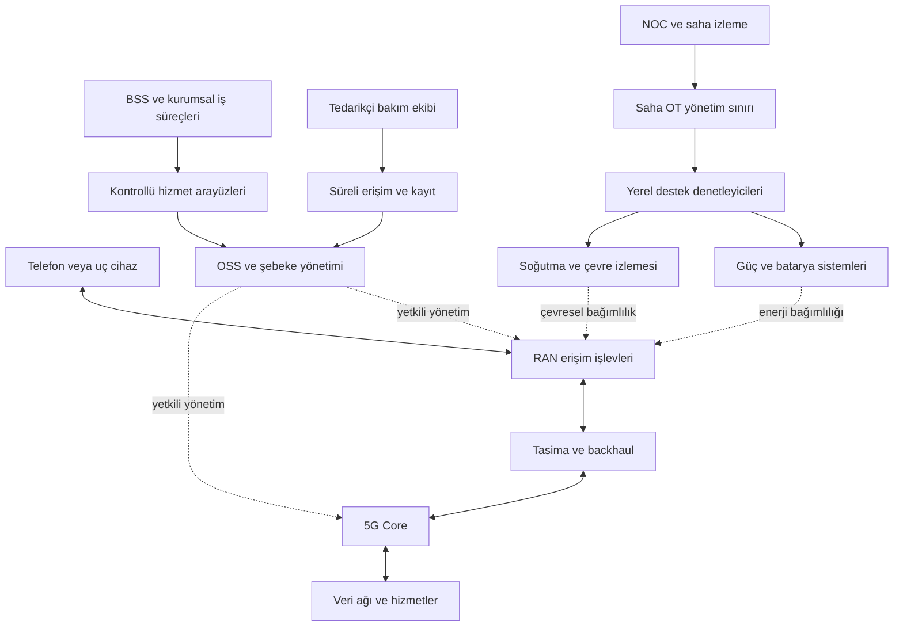

# Telekom ve baz istasyonlarında OT sınırları

[Ana sayfa](../../README.md) · [Raylı sistemler](03-rayli-sistemler.md)

> Araştırma tarihi: **13.09.2026**. İçerik, mimariyi anlamak ve yetkili savunma planlamak içindir. Örneklerde gerçek saha, abone, frekans veya erişim bilgisi kullanılmaz.

## 1. Baz istasyonunun tamamı PLC değildir

Telekom altyapısında iki bağlantılı alanı ayırmak gerekir: **iletişim hizmetini sağlayan şebeke** ve bu şebekenin fiziksel olarak çalışmasını sağlayan **enerji, soğutma ve çevresel denetim altyapısı**. Birincisinde RAN, taşıma ağı, çekirdek ve yönetim sistemleri bulunur. İkincisinde doğrultucu, batarya, jeneratör, iklimlendirme ve bunların denetleyicileri olabilir. ETSI ES 202 336-1, telekomda güç, soğutma ve bina ortamı ekipmanlarının izleme/kontrol arayüzlerini ayrı bir kapsam olarak tanımlar. Bu nedenle bütün baz istasyonunu tek PLC veya tek klasik OT ağı gibi sınıflandırmak yanıltıcıdır. [ETSI ES 202 336-1 V1.3.1](https://www.etsi.org/deliver/etsi_es/202300_202399/20233601/01.03.01_60/es_20233601v010301p.pdf)

Bu depoda fiziksel süreç denetleyen destek sistemleri **saha OT'si** olarak ele alınır. Telekom şebekesinin kendisi ise kritik iletişim altyapısı olarak ayrıca incelenir. Kuruluşların envanter etiketleri farklı olabilir; önemli olan bir cihazın hangi hizmete ve fiziksel sürece etki ettiğini kaybetmemektir. Bir mobil bağlantı üzerinden endüstriyel tesise veri taşınması da operatörün çekirdeği ile fabrikanın kontrol sisteminin aynı güven bölgesi olduğu anlamına gelmez.

## 2. Temel hizmet akışı ve bileşenler

Aşağıdaki açıklama öğretici bir **5G Standalone** soyutlamasıdır. 4G ve 5G Non-Standalone uygulamalarında bileşenler ve bağımlılıklar değişir.

- **UE:** Telefon veya haberleşen uç cihazdır.
- **RAN:** Radyo erişim ağıdır; cihazın şebekeyle radyo üzerinden bağlantısını sağlar. Radyo ve temel bant işlevleri dağıtım tasarımına göre farklı yerlerde bulunabilir.
- **Backhaul / taşıma:** Erişim tarafını çekirdek ve diğer şebeke noktalarına bağlayan taşıma altyapısıdır.
- **5G Core:** AMF erişim/hareketlilik, SMF oturum yönetimi ve UPF kullanıcı verisi iletimi gibi ayrışmış işlevler içerir. Her çekirdek işlevi her baz istasyonunda bulunmaz.

Özet veri yolu `UE → RAN → taşıma → UPF → veri ağı` şeklindedir. Kimlik doğrulama, kayıt ve oturum kararlarının kontrol düzlemi ayrıdır; çizgi üzerindeki her kutu kullanıcı verisinin tamamını işlemez. [3GPP TS 23.501, ETSI V18.11.0, bölümler 4 ve 8](https://www.etsi.org/deliver/etsi_ts/123500_123599/123501/18.11.00_60/ts_123501v181100p.pdf)

**OSS**, şebeke ve hizmet işletimini destekleyen yönetim, orkestrasyon ve hizmet güvencesi işlevlerini; **BSS**, ücretlendirme, faturalama ve sipariş gibi iş süreçlerini kapsar. İş akışları birbirine bağlansa da yetkileri aynı olmamalıdır. Bu ayrım için bir üreticinin kendi OSS/BSS tanımı da yararlı bir kavramsal kaynaktır; ürün tavsiyesi değildir. [Ericsson: OSS/BSS](https://www.ericsson.com/en/oss-bss)

**Saha destek akışı** ise enerji kaynağından dağıtım ve yedek beslemeye, oradan iletişim ekipmanına uzanır; çevresel sensörler ve yerel denetleyiciler sıcaklık, güç ve alarm durumunu izler. ETSI, aynı sahada farklı üretici ve yetenek düzeyindeki denetim birimlerinin bulunabileceğini belirtir. Merkezde “normal” görünen durum bu yüzden kaynağı ve ölçüm zamanıyla birlikte değerlendirilmelidir. [ETSI ES 202 336-1, bölüm 4.2](https://www.etsi.org/deliver/etsi_es/202300_202399/20233601/01.03.01_60/es_20233601v010301p.pdf)

## 3. Eğitim mimarisi ve güven sınırları

Şema fiziksel yerleşim veya kablo planı değildir. Yönetim okları ile kullanıcı trafiği ayrıdır; enerji ve soğutma okları ağ bağlantısını değil bağımlılığı gösterir. Bu depo için önerilen incelemede sınır başına veri sahibi, kimlik kaynağı, izinli işlem, kayıt sistemi ve erişim kaybı davranışı yazılır. Tek tedarikçinin iki alanı işletmesi, iki alanın ortak yönetici hesabına ihtiyaç duyduğu anlamına gelmez.

| Protokol / arayüz ailesi | İşlev | Savunma incelemesindeki odak |
|---|---|---|
| 5G radyo erişimi | UE ile RAN bağlantısı | Kimlik ve güvenlik özelliklerinin seçilen sürümle uyumu |
| N2 / NGAP | RAN–çekirdek kontrol ilişkisi | Yetkili uçlar ve kontrol düzlemi görünürlüğü |
| N3 / GTP-U | Kullanıcı verisinin RAN–UPF taşınması | Taşıma ve yönetim trafiğinin ayrılması |
| Servis tabanlı arayüzler / SBA | Çekirdek işlevlerin servis iletişimi | İşlev kimliği, yetkilendirme ve sertifika yaşam döngüsü |
| NETCONF/YANG veya REST tabanlı altyapı yönetimi | Uygulamaya bağlı izleme/yönetim | Okuma ve değişiklik yetkisinin ayrılması |
| Alarm ve durum arayüzleri | Güç, soğutma ve çevresel gözlem | Kaynak, zaman, veri güncelliği ve kayıp alarmı |

İlk dört satırın mimari dayanağı [3GPP TS 23.501](https://www.etsi.org/deliver/etsi_ts/123500_123599/123501/18.11.00_60/ts_123501v181100p.pdf), altyapı yönetiminin dayanağı [ETSI ES 202 336-1](https://www.etsi.org/deliver/etsi_es/202300_202399/20233601/01.03.01_60/es_20233601v010301p.pdf)'dir. Her ürün bütün arayüzleri desteklemez. Protokol adının bilinmesi, kimlik doğrulamanın veya güvenli yapılandırmanın uygulandığını kanıtlamaz.

## 4. Saldırgan bakışıyla tehdit modelleme

Matris özgün ve kurgusal bir savunma çalışmasıdır; belirli operatör veya üründe açıklık bulunduğu iddiası taşımaz. Etki, yedeklilik ve gerçek dağıtıma göre değişir. Saha keşfi, RF müdahalesi veya canlı şebekeyi bozacak deneme içermez.

| Tehdit hedefi | Varsayımsal önkoşul | Aşılmaya çalışılan sınır | Olası hizmet / fiziksel etki | Gözlenebilir belirti | Savunma |
|---|---|---|---|---|---|
| Yönetim yetkisini kötüye kullanmak | Ele geçirilmiş ayrıcalıklı hesap | Bakım → OSS / şebeke yönetimi | Çok sayıda hizmette yetkisiz değişiklik | İş emirsiz işlem, olağan dışı varlık kapsamı | Süreli ve dar yetki, oturum kaydı, değişiklik onayı |
| Saha durumunu gizlemek | İzleme verisine müdahale olanağı | Yerel sensör → NOC kararı | Güç/ısı sorununun geç fark edilmesi | Donmuş değer, eksik zaman damgası, saha farkı | Güncellik alarmı ve bağımsız doğrulama |
| Destek altyapısından yönetim alanına yayılmak | Ortak kimlik veya aşırı ağ erişimi | Saha OT → telekom yönetimi | Birden fazla hizmette ortak arıza etkisi | İzin listesi dışı yönetim oturumu | Ayrı hesap alanları ve sınır filtreleri |
| Güvenilmeyen yazılımı kabul ettirmek | Zayıf tedarik ve yayın kontrolü | Tedarikçi paketi → üretim sürümü | Geniş dağıtım sonrası hizmet sorunu | Onaylı paketle bütünlük/sürüm farkı | Kaynak doğrulama, aşamalı kabul, geri dönüş paketi |
| Yönetim bağımlılığını kullanmak | Tek yönetim ya da sır saklama noktasına bağımlılık | Ortak platform → çoklu iş yükü | Bölgesel hizmet yönetiminin aksaması | Birçok işlevde aynı anda yetki/erişim hatası | Bağımlılık analizi, ayrı kurtarma erişimi |

Şifreli radyo bağlantısının bulunması, OSS hesabının veya soğutma denetleyicisinin güvenli olduğu sonucu vermez. 3GPP TS 33.501; erişim, ağ alanı ve servis tabanlı mimari gibi farklı güvenlik alanlarını ayırır. Bu ayrım, tek güvenlik özelliğiyle bütün sistem için güvence verilmemesi gerektiğini gösterir. [3GPP TS 33.501, ETSI V18.10.0, bölüm 4](https://www.etsi.org/deliver/etsi_ts/133500_133599/133501/18.10.00_60/ts_133501v181000p.pdf)

## 5. Savunma öncelikleri

Aşağıdaki öneriler bu depo için hazırlanmıştır; bir standardın kopyalanmış kontrol listesi değildir.

1. **Hizmet bağımlılıklarını bulun.** Bir saha için RAN, taşıma, enerji ve soğutma sahiplerini aynı kayıtta gösterin. Yedek bağlantının aynı enerji veya yönetim bağımlılığını paylaşıp paylaşmadığını inceleyin.
2. **Yönetim erişimini daraltın.** Şebeke, saha OT'si ve kurumsal iş süreçlerinde ayrı yetki grupları kullanın. Tedarikçinin görevi bittiğinde erişimin sona erdiğine ilişkin kanıt üretin.
3. **Kimlik ve sırları yönetin.** Cihaz, servis ve insan kimliklerini ayrı izleyin. Sertifika yenilemesinin kimin sorumluluğunda olduğunu ve süresi dolmadan nasıl izleneceğini belirleyin.
4. **Telemetriye güveni ölçün.** Değerin kendisiyle birlikte kaynağı, zamanını ve güncelliğini kaydedin. Alarm kanalının kaybını da alarm olarak ele alın; eşikleri operasyon ve tesis uzmanları belirlesin.
5. **Değişikliği aşamalı kabul edin.** Yazılımı, yapılandırmayı ve uygulama bağımlılıklarını birlikte sürümleyin. Geri dönüşün veri şeması, lisans ve kimlik malzemesi gereksinimlerini önceden kaydedin.
6. **Ortak platformları ayrıca inceleyin.** Sanallaştırma, uç bilişim ve dilimleme yeni yönetim sınırları oluşturabilir; mantıksal ayrımın fiziksel veya yönetim bağımsızlığı olduğunu varsaymayın. ENISA'nın 5G eki bu teknolojilerin güvenlik etkilerini ele alır. [ENISA: 5G Supplement, ikinci baskı](https://www.enisa.europa.eu/publications/5g-supplement-security-measures-under-eecc)

ENISA'nın **5G Security Controls Matrix** yayını teknik kontrolleri ve kanıt beklentilerini bir araya getiren başvuru kaynağıdır. Buradaki çalışma önerisi, bir kontrolü “var” diye işaretlemek yerine sahibi, kapsanan varlıklar ve doğrulanabilir kanıtıyla kaydetmektir. Matris AB bağlamında hazırlanmıştır; Türkiye için kendiliğinden bağlayıcı düzenleme değildir. [ENISA: 5G Security Controls Matrix](https://www.enisa.europa.eu/publications/5g-security-controls-matrix)

## 6. Tedarikçi güvencesi ve sürüm disiplini

**GSMA NESAS**, üretici geliştirme/ürün yaşam döngüsü süreçlerinin denetimi ve ürün güvenlik değerlendirmelerini kapsayan güvence çerçevesidir. GSMA açıkça NESAS'ın üreticiyi veya ürünü sertifikalandırmadığını belirtir; akreditasyon test laboratuvarlarıyla ilgilidir. Bu nedenle “NESAS sertifikalı, bütün şebeke güvenlidir” sonucu doğru değildir. Operatör, değerlendirme kapsamını gerçek ürün/sürüm ve kendi işletme kontrolleriyle eşleştirmelidir. [GSMA: NESAS](https://www.gsma.com/solutions-and-impact/technologies/security/network-equipment%20-security-assurance-scheme/)

GSMA FS.16'nın bu araştırmada doğrulanan **3.0** sürümü 20 Şubat 2025 tarihlidir ve üretici geliştirme/yaşam döngüsü güvenlik gereksinimlerini konu alır. Bu belge, sahadaki bütün yapılandırmaların değerlendirildiği anlamına gelmez. [GSMA: FS.16 v3.0](https://www.gsma.com/solutions-and-impact/technologies/security/gsma_resources/fs-16-network-equipment-security-assurance-scheme-development-and-lifecycle-security-requirements-2/)

Bu bölümdeki TS 23.501 **18.11.0** ve TS 33.501 **18.10.0**, incelenmiş sabit referans sürümleridir; en yeni sürüm oldukları iddia edilmez. 3GPP portalı farklı release dalları ve sürümler gösterir. Bir denetimde ürünün desteklediği release, üretici uygulaması ve seçilen gereksinimler birlikte kayda alınmalıdır. [3GPP: TS 33.501 sürüm kaydı](https://portal.3gpp.org/desktopmodules/Specifications/SpecificationDetails.aspx?specificationId=3169)

## 7. Olay müdahalesi ve geri dönüş

Önerilen ilk değerlendirme üç soruyu ayırır: Kullanıcı hizmeti etkileniyor mu? Yönetim düzleminin bütünlüğü şüpheli mi? Sahanın fiziksel koşulları doğrulanabiliyor mu? NOC, siber ekip, saha enerji/soğutma sorumlusu ve tedarikçi aynı zaman çizelgesini kullanır. Normal görünen bir ağ metriği, bağımsız bir sıcaklık veya batarya alarmını geçersiz kılmaz.

Şüpheli oturumlar, yapılandırma farkları ve ilgili alarm kayıtları korunur. Erişim sınırlandırması, taşıdığı hizmetler ve alternatif yönetim olanağı değerlendirildikten sonra onaylı olay planıyla uygulanır. Saha enerji anahtarlaması, soğutma ayarı veya toplu yeniden başlatma siber ekibin genel reçetesi olamaz; ilgili operasyon ve tesis yetkilileri karar verir.

Geri dönüşte örnek kanıtlar: güvenilen yapılandırma, giderilmiş erişim nedeni, geçerli cihaz/servis kimlikleri, doğrulanmış fiziksel ortam, başarılı hizmet kabul kontrolleri ve izleme süresi. Hizmetin geri gelmesi ile olayın kök nedeninin kapatılması ayrı kilometre taşları olarak kaydedilir.

## 8. Kurgusal masa başı ve ölçülebilir kontroller

**Senaryo:** Kurgusal operatörde üç sahanın merkezî sıcaklık verisi aynı değerde donmuştur. Kullanıcı hizmetleri sürmektedir. Aynı bakım hesabından plan dışı oturum görülür. Canlı şebekede trafik üretilmez; çalışma kayıt örnekleri ve mimari kartlarıyla yürütülür.

**Görev:** Ekip, ilk 15 dakikada veri kaybını fiziksel arızadan nasıl ayıracağını ve hangi bağımsız teyidi isteyeceğini yazar. İkinci kartta aynı kimliğin hem şebeke hem saha izleme yetkisi olduğu açıklanır. Katılımcılar etki alanını tekrar değerlendirir, erişim kararının sahibini belirler ve hizmete dönüş için gereken üç kanıtı seçer. Son kartta sıcaklık normal, kayıt hizmeti eksik çıkar; ekip yalnız alarmın sönmesine dayanarak kapanış yapıp yapmadığını tartışır.

| Ölçüm | Örnek hedef | Doğrulama |
|---|---|---|
| Saha bağımlılık kaydı | Seçilen sahaların %100'ünde dört alanın sahibi belli | RAN, taşıma, güç, soğutma kayıtları |
| Ayrıcalıklı erişim izlenebilirliği | Örnek oturumların %100'ü iş emriyle bağlı | Hesap, zaman, varlık ve işlem kaydı |
| Donmuş telemetriyi fark etme | İşletmenin belirlediği güncellik sınırında alarm | Temsilî ortamda veri güncellik testi |
| Tedarikçi kapsamı | Seçilen ürünlerin sürüm/kapsam eşleştirmesi mevcut | Değerlendirme ve işletme kabul kayıtları |
| Geri dönüş hazırlığı | Bir örnek hizmetin temsilî ortamda doğrulanması | Süre, sonuç, eksik bağımlılık tutanağı |

Bunlar eğitim hedefleridir; zorunlu mevzuat eşikleri, canlı sahaya test izni veya tüm operatörler için uygun kabul süreleri değildir.

## Kaynaklar ve erişim sınırları

Tüm kaynaklara erişim: **2026-09-13**. Standartların tamamı depoya alınmamış; kullanılan kavramlar kısa açıklamalarla verilmiştir.

| Başlık / yayıncı | Yayın / sürüm | Desteklediği konu |
|---|---|---|
| [System architecture for the 5GS — 3GPP / ETSI](https://www.etsi.org/deliver/etsi_ts/123500_123599/123501/18.11.00_60/ts_123501v181100p.pdf) | TS 23.501 / ETSI V18.11.0, 2025-09 | 5G mimarisi, işlev ve arayüz ayrımı |
| [Monitoring and Control Interface — ETSI](https://www.etsi.org/deliver/etsi_es/202300_202399/20233601/01.03.01_60/es_20233601v010301p.pdf) | ES 202 336-1 V1.3.1, 2025-04 | Güç, soğutma, çevresel denetim ve yönetim arayüzleri |
| [OSS/BSS — Ericsson](https://www.ericsson.com/en/oss-bss) | Sayfada yayın tarihi belirtilmiyor | Üreticinin OSS/BSS işlev tanımları |
| [Security architecture and procedures for 5GS — 3GPP / ETSI](https://www.etsi.org/deliver/etsi_ts/133500_133599/133501/18.10.00_60/ts_133501v181000p.pdf) | TS 33.501 / ETSI V18.10.0, 2025-07 | Güvenlik alanları ve SBA güvenliği |
| [TS 33.501 Specification Details — 3GPP](https://portal.3gpp.org/desktopmodules/Specifications/SpecificationDetails.aspx?specificationId=3169) | Canlı sürüm kaydı | Release ve sürüm ayrımı; sabit “en güncel” iddiasından kaçınma |
| [5G Supplement — ENISA](https://www.enisa.europa.eu/publications/5g-supplement-security-measures-under-eecc) | İkinci baskı, 2021-07-07 | Sanallaştırma, dilimleme ve uç bilişim güvenlik kapsamı |
| [5G Security Controls Matrix — ENISA](https://www.enisa.europa.eu/publications/5g-security-controls-matrix) | 2023-05-24 | Teknik kontrol/kanıt yaklaşımı ve AB bağlamı |
| [Network Equipment Security Assurance Scheme — GSMA](https://www.gsma.com/solutions-and-impact/technologies/security/network-equipment%20-security-assurance-scheme/) | Sayfada yayın tarihi belirtilmiyor | NESAS kapsamı; sertifikasyon/akreditasyon ayrımı |
| [FS.16 — GSMA](https://www.gsma.com/solutions-and-impact/technologies/security/gsma_resources/fs-16-network-equipment-security-assurance-scheme-development-and-lifecycle-security-requirements-2/) | V3.0, 2025-02-20 | Üretici geliştirme ve yaşam döngüsü kapsamı; kamuya açık yayın kaydı |
