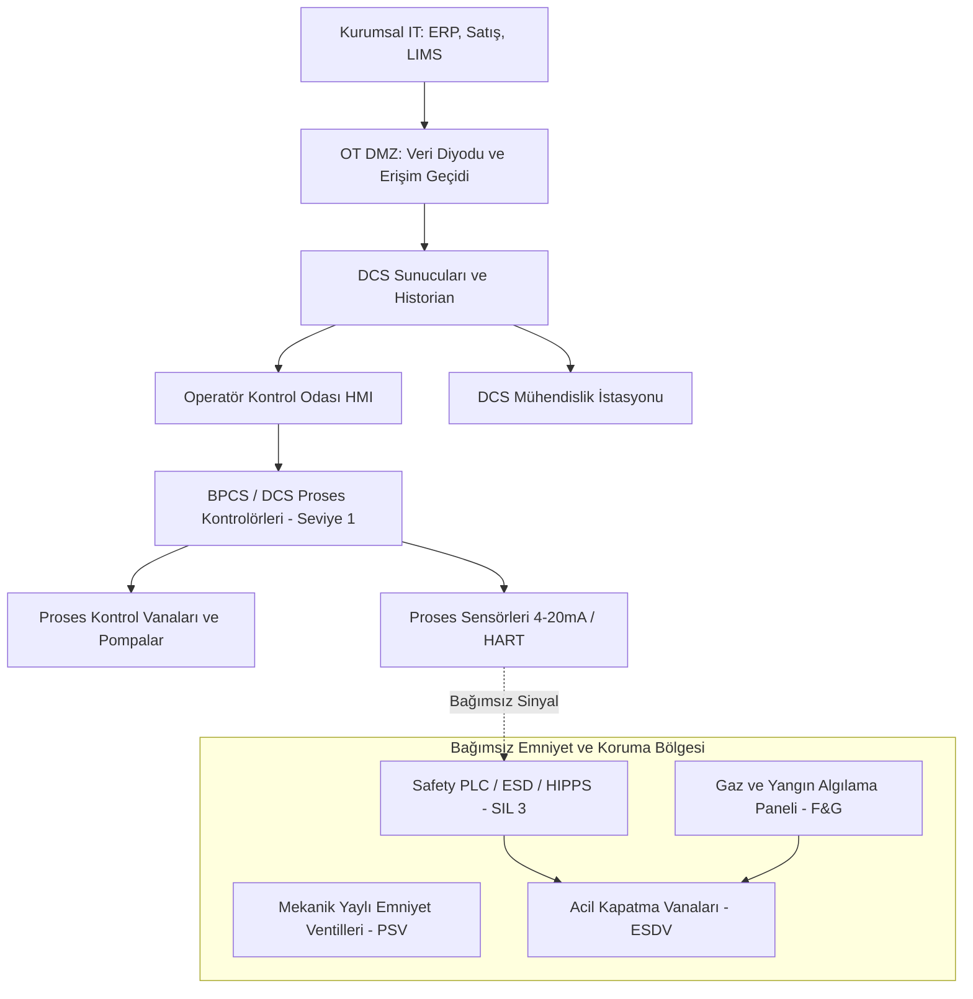

# Petrol, Doğal Gaz ve Kimya Proseslerinde OT Güvenliği

[Ana sayfa](../../README.md) · [Sektörel Senaryo Kataloğu](senaryolar/README.md) · [Ayrıntılı Petrol ve Kimya Senaryoları](senaryolar/05-petrol-kimya-proses-senaryolari.md)

Bu bölüm; petrol ve doğal gaz iletim boru hatları, rafineriler, petrokimya tesisleri, kimyasal proses endüstrisi ve büyük hidrokarbon depolama terminallerinde operasyonel teknolojiyi (OT), güvenlik enstrümanlı sistemleri (SIS) ve siber-fiziksel riskleri öğrenen okurlar içindir.

---

## 1. Fiziksel Süreci Anlayalım

Petrol, doğal gaz ve kimya sektöründe temel akış **üretim kuyuları (upstream) → iletim boru hatları ve kompresör/pompa istasyonları (midstream) → rafineri ve petrokimya tesisleri (downstream) → depolama ve dağıtım terminalleri** şeklindedir:

1. **Boru Hatları ve Kompresör/Pompa İstasyonları:** Doğal gaz veya ham petrol yüzlerce kilometrelik boru hatlarıyla taşınır. Gaz hatlarında basıncı korumak için gaz türbinli santrifüj kompresörler, sıvı hatlarında ise çok kademeli ana hat pompaları kullanılır. Hat üzerinde hat vanası istasyonları (Block Valve Stations) ve boru içi temizlik/denetim için pigging kapanları (Pig Traps) bulunur.
2. **Rafineri ve Distilasyon:** Ham petrol atmosferik ve vakum distilasyon kolonlarında kaynama noktası farklarına göre ayrıştırılır (LPG, benzin, nafta, motorin, fuel oil, asfalt). Proses yüksek sıcaklık (350°C+), yüksek basınç ve yanıcı/patlayıcı hidrokarbon sıvıları içerir.
3. **Kimyasal Reaktörler ve Dönüşüm:** Katalitik kraking, polimerizasyon ve alkilasyon gibi ekzotermik (yüksek ısı açığa çıkaran) reaksiyonlarda reaktör ceket soğutması ve karıştırma emniyeti süreklidir. Reaksiyon kontrolden çıkarsa (thermal runaway) saniyeler içinde mekanik patlama gerçekleşebilir.
4. **Depolama ve Yükleme Terminalleri:** Devasa yüzer ve sabit tavanlı hidrokarbon tankları, tanker dolum adaları ve deniz terminalleri yangın algılama ve taşma koruma sistemleriyle donatılmıştır.

---

## 2. Mimari, Emniyet Enstrümanları ve Güven Sınırları

Proses endüstrisinde temel kontrol sistemi **DCS (Distributed Control System)** iken, can güvenliğini ve patlamaları önleyen bağımsız sistem **SIS (Safety Instrumented System)** katmanıdır (IEC 61511 standardı).

### Güven ve Kontrol Katmanları (Layers of Protection Analysis - LOPA):
1. **Temel Proses Kontrol Sistemi (BPCS / DCS):** Rutin işletme parametrelerini (sıcaklık, basınç, seviye, debi) PID döngüleriyle kontrol eder.
2. **Kritik Alarmlar ve Operatör Müdahalesi:** Eşik aşıldığında operatöre sesli/görsel uyarı verir.
3. **Emniyet Enstrümanlı Sistemler (SIS / ESD / HIPPS):** DCS arızalansa veya saldırıya uğrasa dahi bağımsız sensörlerle tehlikeyi algılayıp tesisi acil duruşa (Fail-Safe Shutdown) geçiren SIL 2 / SIL 3 onaylı sistem.
4. **Fiziksel / Mekanik Koruma:** Mekanik emniyet ventilleri (PSV), patlama diskleri (Rupture Discs) ve kilitli mekanik interlocklar.
5. **Tesis İçi Acil Müdahale ve Meşale (Flare):** Yangın söndürme sistemleri, gaz tahliye meşaleleri.

---

## 3. Protokoller ve Saha Haberleşmesi

| Teknoloji | Kullanım Alanı | Savunma ve Güvenlik Odağı |
|---|---|---|
| **HART / HART-IP** | Akıllı sensör konfigürasyonu ve teşhis | Cihaz kalibrasyon parolaları, kablosuz WirelessHART şifreleme anahtarları |
| **Foundation Fieldbus / PROFIBUS-PA** | Rafineri ve kimya proses veriyolu | Saha aygıtı yazılım bütünlüğü, fiziksel bus sonlandırma |
| **PROFIsafe / Safety-over-EtherNet/IP** | Safety PLC ve acil vanalar arası iletişim | SIL 3 emniyet haberleşmesi, CRC denetimleri ve zaman aşımı mekanizmaları |
| **Modbus / DNP3 / OPC UA** | Boru hattı SCADA ve RTU telemetrisi | TLS şifreleme, IEC 62351, PAM erişim denetimi |
| **OPC DA (Classic) vs OPC UA** | DCS ile historian/ara katman bağlantısı | Eski DCOM tabanlı OPC DA'dan sertifikalı/şifreli OPC UA'ya geçiş |

---

## 4. Tehdit Modelleme ve Saldırgan Bakış Açısı

Proses endüstrisinde bir siber saldırganın temel hedefleri şunlardır:
1. **Basınç/Sıcaklık Sınırlarını Zorlamak:** Boru hatlarında veya reaktörlerde aşırı basınç oluşturarak mekanik patlama veya yangın tetiklemek.
2. **Emniyet Sistemlerini (SIS/ESD) Körleştirmek:** Tritex / TRISIS benzeri saldırılarla Safety PLC lojiğini manipüle etmek veya acil kapatma vanalarını açık konumda kilitlemek.
3. **Zehirli/Yanıcı Gaz Tahliyesini Gizlemek:** $H_2S$ veya hidrokarbon gaz dedektörlerini sıfırda dondurarak personeli zehirlemek veya patlama ortamı oluşturmak.

Detaylı 10 senaryo, teknik saldırı vektörleri ve 7 katmanlı savunma çözümleri için [Petrol, Doğal Gaz ve Kimya Senaryoları Kataloğu](senaryolar/05-petrol-kimya-proses-senaryolari.md) belgesini inceleyin.

---

## 5. Mühendislik ve Siber Savunma İlkeleri

1. **BPCS ve SIS Tam Ayrımı (Segregation):** Proses kontrol sistemi (DCS) ile emniyet sistemi (SIS) hiçbir koşulda aynı kontrolörde, aynı I/O kartında veya aynı şifresiz ağda birleştirilemez.
2. **Mekanik Emniyet Ventilleri Son Güvencedir:** Yaylı PSV ve patlama diskleri siber komutlarla kapatılamaz; periyodik kalibrasyon ve muayeneleri yasal zorunluluktur.
3. **Mekanik Kilitli Anahtar Sistemleri (Trapped Key Interlock):** Boru hattı pigging kapanlarında veya yüksek voltaj hücrelerinde insan hatasını ve siber manipülasyonu önleyen fiziksel mekanik anahtar sırası uygulanır.
4. **Veri Diyodu (Data Diode) ile L3/L4 İzolasyonu:** Rafineri proses historianından kurumsal ERP ve raporlama sistemlerine veri aktarımı tek yönlü fiziksel veri diyotları ile gerçekleştirilir.

---

## 6. Bölüm Kontrol Listesi

- [ ] BPCS (DCS) ve SIS (Safety PLC) ağları, donanımları ve mühendislik yazılımları fiziksel/mantıksal olarak ayrıldı.
- [ ] Tüm mekanik yaylı basınç tahliye ventillerinin (PSV) yasal hidrostatik test ve kalibrasyon sertifikaları güncel.
- [ ] Boru hattı pigging operasyonlarında mekanik trapped-key kilit sistemleri mevcut.
- [ ] Gaz ve yangın algılama (F&G) sisteminde NAMUR NE 43 arıza akımı seviyeleri (2.0 mA altı) otomatik acil duruma bağlandı.
- [ ] Rafineri historian ve kurumsal IT arasında çift yönlü IP yönlendirme kapatıldı, veri diyodu yapılandırıldı.
- [ ] Safety PLC mühendislik yazılımı üzerinde herhangi bir mantık baypası (bypass) için fiziksel anahtar ve otomatik zaman aşımı devrede.

---

## Kaynaklar ve İlgili Standartlar

- **IEC 61511:** Functional safety - Safety instrumented systems for the process industry sector.
- **API Standard 520 / 521:** Sizing, Selection, and Installation of Pressure-relieving Devices in Refineries.
- **API Standard 1164:** Pipeline Control Systems Cybersecurity.
- **NIST SP 800-82 Rev. 3:** Guide to Operational Technology (OT) Security - Section 10: Chemical and Petroleum Sectors.
- **CISA / ICS-CERT Advisory:** Cybersecurity Best Practices for Industrial Control Systems (TRISIS/Triton Malware Analysis).
