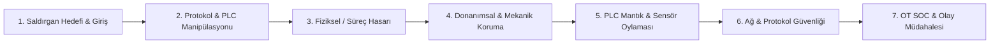

# Sektörel Tehdit Modelleme ve Savunma Mühendisliği Kataloğu

[Ana sayfa](../../../README.md) · [Su ve Atıksu](../01-su-ve-atiksu.md) · [Elektrik ve Enerji](../02-elektrik-ve-enerji.md) · [Raylı Sistemler](../03-rayli-sistemler.md) · [Telekomünikasyon](../04-telekom-ve-baz-istasyonlari.md) · [Petrol, Gaz ve Kimya](../05-petrol-gaz-ve-kimya.md)

Bu katalog; kritik altyapı sektörlerinde siber-fiziksel sistemlere yönelik **saldırgan bakış açılarını** (fiziksel tahribat, sensör manipülasyonu, PLC register sahteciliği, lojik bozma) ve bu saldırılara karşı geliştirilen **çok katmanlı mühendislik ve siber savunma mimarilerini** (donanımsal kilitler, PLC mantıksal tutarlılık denetimleri, ağ izolasyonu ve OT SOC algılama mekanizmaları) detaylandıran teknik referans koleksiyonudur.

---

## 1. Kataloğun Yapısı ve Metodoloji

Katalogdaki her senaryo, saldırganın yalnızca yazılım katmanında kalmayıp fiziksel süreci bozmayı hedeflediği gerçekçi tehdit modellerine dayanır. Her senaryo standart **7 Boyutlu Mühendislik ve Savunma Standardı** ile incelenmiştir:

1. **Senaryo Kimliği ve Başlık:** Sektörel kod ve açıklayıcı senaryo adı.
2. **Saldırgan Bakış Açısı ve Teknik Mekanizma:** Hedeflenen proses değişkeni, sömürülen protokol (Modbus, DNP3, IEC 61850, OPC UA vb.), manipüle edilen register/kontak ve siber enjeksiyon yöntemi.
3. **Fiziksel ve Süreç Hasarı:** Ekipman hasarı (kavitasyon, aşırı ısınma, patlama, şebeke çökmesi, derayman), can güvenliği riski veya çevre kirliliği.
4. **Donanımsal ve Mekanik Savunma (Layer 0/1):** Hardwired limit sviçleri, mekanik basınç emniyet ventilleri (PSV), kuru çalışma koruma röleleri, bağımsız Emniyet Enstrümanlı Sistemler (SIS / SIL).
5. **Yazılımsal ve Mantıksal Savunma (PLC / Controller):** Çapraz sensör doğrulaması, 2oo3 (2 out of 3) oylama, oran-değişim (rate-of-change) limitleri, durum geçiş matrisleri ve fiziksel imkânsızlık alarmları.
6. **Ağ, Protokol ve Erişim Savunması (Purdue L2/L3):** Purdue micro-segmentasyon, IEC 62351, Modbus Security, güvenli kimlik doğrulama, PAM ve çift onay mekanizmaları.
7. **Algılama, OT SOC İmzası ve Olay Müdahalesi:** Zeek/Suricata IDS kuralları, historian anomali eşikleri ve saha doğrulama adımları.

---

## 2. Sektörel Senaryo Koleksiyonları

Katalog 5 ana sektörde toplam **62 kapsamlı senaryo** içermektedir:

| Sektör Dosyası | Kapsanan Temel Süreçler | Senaryo Sayısı | Öne Çıkan Tehditler |
|---|---|---|---|
| [Su ve Atıksu Senaryoları](01-su-ve-atiksu-senaryolari.md) | İçme suyu arıtma, dağıtım terfi istasyonları, atıksu biyolojik arıtma, çamur çürütme | 15 Senaryo | Kuru çalışma, su koçu (water hammer), klor aşırı dozajı, blower surge, metan patlama riski |
| [Elektrik ve Enerji Senaryoları](02-elektrik-enerji-senaryolari.md) | Üretim santralleri, iletim/dağıtım trafo merkezleri, DER/BESS, SCADA/EMS | 15 Senaryo | Kesici avlanması (thrashing), faz dışı senkronizasyon, GOOSE enjeksiyonu, BESS termal kaçak |
| [Raylı Sistemler Senaryoları](03-rayli-sistemler-senaryolari.md) | Anklaşman (Interlocking), ETCS/CBTC sinyalizasyon, makas motorları, cer gücü SCADA | 12 Senaryo | Dingil sayıcı sahte reset, makas yarım kalması, baliz mesaj replay, hemzemin geçit manipülasyonu |
| [Telekomünikasyon ve Baz İstasyonu Senaryoları](04-telekom-baz-istasyonu-senaryolari.md) | Kule/saha HVAC, DC güç doğrultucular, akü yönetim sistemleri, PTP/SyncE zaman senkronizasyonu | 10 Senaryo | Hassas klima sabotajı, DC doğrultucu aşırı voltajı, akü telemetri körleştirmesi, PTP bozma |
| [Petrol, Gaz ve Proses Kimya Senaryoları](05-petrol-kimya-proses-senaryolari.md) | Boru hattı kompresör/pompa istasyonları, distilasyon kolonları, SIS/ESD sistemleri, depolama tankları | 10 Senaryo | PSV kilitlenmesi, kaçak ekzotermik reaksiyon, ESD baypas, gaz dedektör dondurma, kompresör surge |

---

## 3. Güvenlik ve Mühendislik Prensipleri

Bu dokümandaki senaryolar aşağıdaki temel emniyet ve savunma prensiplerini somutlaştırmaktadır:

- **Fiziksel Yasalar Siberi Sınırlar:** Siber manipülasyon ne kadar gelişmiş olursa olsun, doğru tasarlanmış mekanik ve donanımsal korumalar (yaylı emniyet ventilleri, termal bimetal röleler, hardwired acil stop devreleri) fiziksel hasarı önlemenin son kalesidir.
- **Tek Noktadan Doğruluk Kabul Edilemez:** Hiçbir kritik proses kararı tek bir sensörün veya tek bir PLC registerının değerine dayandırılamaz. Çoklu sensör oylaması (2oo3) ve fiziksel süreç modelleriyle çapraz doğrulama esastır.
- **Görünürlük ve Kontrol Ayrımı:** HMI ekranındaki bir değerin "normal" görünmesi sürecin normal işlediğini kanıtlamaz. OT SOC izlemesi bağımsız ağ tap noktalarından ve ham I/O sinyallerinden beslenmelidir.
