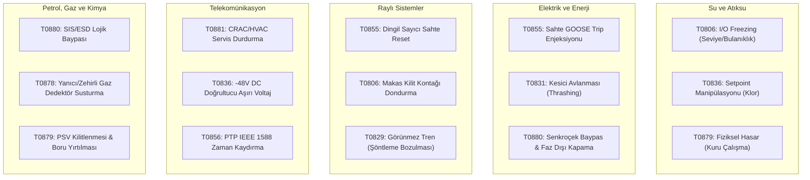

# MITRE ATT&CK for ICS Navigator Katmanı ve Analiz Rehberi

[Ana sayfa](../../README.md) · [Saldırgan Bakış Açısı](01-saldirgan-bakis-acisi.md) · [MITRE ATT&CK for ICS Temelleri](02-mitre-attack-ics.md) · [Sektörel Senaryo Kataloğu](../02-sektorler/senaryolar/README.md)

Bu rehber; depoda yer alan **62 sektörel tehdit ve savunma senaryosunun** MITRE ATT&CK for ICS çerçevesiyle eşleştirildiği [Navigator JSON Katmanı'nın](../../research/mitre_attack_ics_layer.json) nasıl kullanılacağını, taktiksel yoğunluk haritasını ve sektörler arası saldırgan davranış kalıplarını açıklar.

---

## 1. ATT&CK Navigator Katmanı Nasıl Yüklenir?

1. Web tarayıcınızda resmi [MITRE ATT&CK Navigator](https://mitre-attack.github.io/attack-navigator/) uygulamasını açın.
2. Sağ üstteki **"Open Existing Layer"** butonuna tıklayın ve **"Upload from local file"** seçeneğini seçin.
3. Bu depodaki [research/mitre_attack_ics_layer.json](../../research/mitre_attack_ics_layer.json) dosyasını seçip yükleyin.
4. Ekranda ICS matrisi üzerinde 62 senaryonun yoğunlaştığı teknikler açık sarıdan koyu kırmızıya doğru renk kodlu bir **ısı haritası (Heat-Map)** olarak görüntülenecektir.

---

## 2. Taktiksel Kapsama ve Isı Haritası Dağılımı

Katalogdaki 62 senaryonun ATT&CK for ICS taktiklerine göre yoğunluk analizi aşağıda özetlenmiştir:

| ATT&CK for ICS Taktiği | Kimlik | Kapsanan Temel Teknikler | Senaryo Yoğunluğu | Kritik Sektörel Yansıma |
|---|---|---|---|---|
| **Initial Access** | TA0108 | T0822 (External Remote Services), T0864 (Transient Cyber Asset) | Yüksek | VPN, PAM ve hücresel modemler üzerinden saha erişimi |
| **Execution** | TA0104 | T0807 (Command-Line), T0855 (Unauthorized Command) | Kritik | Modbus FC16, DNP3 Direct Operate, GOOSE Trip enjeksiyonu |
| **Persistence** | TA0110 | T0839 (Module Firmware), T0845 (Program Org. Unit) | Orta | PLC/RTU firmware tahrifatı, lojik blok içine mantık bombası |
| **Evasion** | TA0103 | T0878 (Alarm Suppression), T0856 (Spoof Reporting) | Yüksek | H2S/LEL gaz alarmı susturma, frekans telemetrisi spoofing |
| **Discovery** | TA0102 | T0840 (Network Connection Enum), T0842 (Point Identification) | Orta | L1/L2 veriyolu taraması, SCADA tag/register haritalama |
| **Lateral Movement** | TA0109 | T0886 (Remote Services), T0859 (Valid Accounts) | Yüksek | Purdue L3'ten L2/L1 hücrelerine pivot etme |
| **Inhibit Response** | TA0107 | T0880 (Loss of Safety), T0803 (Block Command Message) | Kritik | SIL 3 SIS/ESD blokajı, acil durum açma komutunun engellenmesi |
| **Impair Process Control** | TA0106 | T0831 (Manipulation of Control), T0836 (Modify Parameter) | Kritik | Pompa kuru çalıştırma, kesici avlanması, makas dondurma |
| **Impact** | TA0105 | T0879 (Damage to Property), T0826 (Loss of Availability) | Kritik | Trafo patlaması, su koçu, tren deraymanı, boru yırtılması |

---

## 3. Sektörler Arası Taktik Yoğunluk Karşılaştırması

---

## 4. Savunma Tasarımı İçin Analiz Çıkarımları

1. **Sadece T0855 (Komut Enjeksiyonu) Engellemek Yetmez:** Saldırganların en sık başvurduğu yöntem, komut göndermekten ziyade **T0878 (Alarm Susturma)** ve **T0806 (I/O Dondurma)** ile operatörü körleştirip fiziksel sürecin kendiliğinden hasara gitmesini beklemektir. Bu nedenle savunmada oran-değişim (rate-of-change) ve 2oo3 sensör oylaması zorunludur.
2. **Emniyet Katmanı (T0880) Bağımsız Olmalıdır:** Saldırgan proses kontrol PLC'sini (BPCS) ele geçirdiğinde emniyet sistemine (SIS) erişememelidir. SIS ağlarının ve hardwired kilitlerin (PSV, bimetal röleler, mekanik sürgüler) önemi bu matriste açıkça doğrulanmaktadır.
