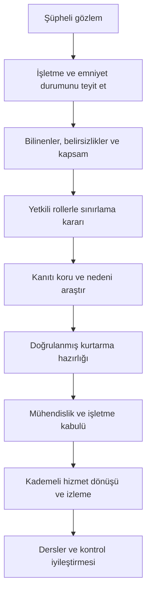

# Olay müdahalesi ve kurtarma

OT olay müdahalesi, dijital bulgularla işletme ve emniyet kararlarını birleştirir. NIST SP 800-61 Rev. 3, olay müdahalesini CSF 2.0 kapsamındaki risk yönetimi faaliyetleriyle bütünleştirir; 2025 yayını Rev. 2'nin yerini almıştır. [NIST yayın kaydı](https://csrc.nist.gov/pubs/sp/800/61/r3/final)

## Karar akışı

Bu özgün akış NIST'in resmi süreç şemasının kopyası değildir. İşletmenin acil durum prosedürleri olay anındaki personel ve çevre güvenliği kararlarını belirler; delil toplamak bu kararların önüne geçirilmez.

## İlk değerlendirmede kaydedilecekler

İlk gözlem zamanı, kaynağın saati, etkilenen işlev, doğrulanan hizmet etkisi, hangi kişinin hangi kararı verdiği ve mevcut kanıtın konumu kaydedilir. Henüz bilinmeyenler açık bırakılır. Olay kaydını değiştiren herkes zaman ve gerekçe ekler; asıl günlükler erişim kontrollü tutulur ve bütünlükleri doğrulanır.

Genel amaçlı olay müdahale aracının bir kontrolörde çalıştırılması güvenli varsayılmaz. Hafıza toplama, disk kopyalama, yeniden başlatma veya fiziksel bağlantı kesme işlemi, ilgili ürünün davranışı ve işletme etkisiyle değerlendirilir. Mevcut sunucu ve ağ kayıtlarıyla başlayan inceleme çoğu durumda daha az müdahaleli bir ilk adım sağlar.

## Sınırlama seçeneklerinin değerlendirilmesi

| Seçenek | Karardan önce araştırılacak konu |
|---|---|
| Şüpheli kullanıcı yetkisini sınırla | Başka kritik görev aynı paylaşılan kimliğe bağımlı mı? |
| Uzak bakım oturumunu sonlandır | Devam eden onaylı değişiklik ve yerel destek durumu ne? |
| Bir ağ geçişini kapat | Kontrol, koruma, gözlem ve zaman bağımlılığı nedir? |
| Alternatif işletme düzenine geç | Eğitimli personel, güncel prosedür ve saha koşulları uygun mu? |
| Sistemi geri yükle | Kanıt, uyumlu yedek ve fiziksel durum doğrulandı mı? |

Tablo bir otomatik müdahale listesi değildir. Karar yetkisi ve geri alma koşulu her seçenek için önceden tanımlanır. “Manuele geçmek” her tesiste mevcut veya güvenli bir seçenek olmayabilir.

## Yedek paketini tasarlama

NIST SP 1339, OT yedeklerini değişiklik yönetimiyle ilişkilendirmeyi, düzenli oluşturmayı, test etmeyi ve kurtarma tatbikatlarında gözden geçirmeyi vurgular. [OT Backup Quick Start Guide](https://csrc.nist.gov/pubs/sp/1339/final)

Aşağıdaki paket bu deponun özgün önerisidir:

- Kontrol projesi, HMI projesi ve gerekli yapılandırmalar.
- Onaylı yazılım/firmware sürümleri ve bütünlük bilgileri.
- Ağ ve güvenlik cihazı yapılandırmaları, akış matrisi ve bağımlılık listesi.
- Mühendislik araçları, sürücüler, lisans geri kazanma yöntemi ve gerekli donanım bilgisi.
- Yetkili kişilerce korunan kurtarma kimlik/sertifika düzeni; sırlar açık dokümana konulmaz.
- Geri yükleme sırası, test kanıtı, uygunluk sınırları ve son onay kaydı.

Kopyanın çevrimdışı veya değiştirilemez olması değerli olabilir; bu kopyaya erişebilecek yetki ve gerekli araçlar olay sırasında bulunamıyorsa kurtarma yine başarısız olur. Yedek üzerinde bir bütünlük özeti olması, içeriğin olaydan önce zaten bozulmadığını tek başına kanıtlamaz.

## Normal hizmete dönüş koşulları

İlk olarak olayın nedeni ve kapsamı yeterince sınırlandırılmış olmalıdır. Sonra geri yüklenen proje/ayarın güvenilir sürümle eşleşmesi, cihaz ve yazılım uyumluluğu, zaman ve kimlik hizmetleri, saha ölçümü ve ilgili emniyet işlevleri yetkili ekiplerce değerlendirilir. Çalışır sunucu ile doğrulanmış süreç ayrı kabul maddeleridir.

RTO, hedeflenen geri dönüş süresini; RPO, tolere edilen veri kaybı aralığını anlatır. OT'de bunların yanına kabul edilebilir süreç durumu ve saha doğrulama süresi eklenmelidir. Bu hedefler örnek bir internet listesiyle belirlenmez; hizmet ve emniyet sahipleri karar verir.

[Olay ve kurtarma şablonu](../../templates/04-olay-ve-kurtarma.md) karar kaydını tutmak için kullanılabilir. Düzenleyici bildirimler kurumun güncel yükümlülük ve iletişim planından yürütülür.

## Kaynaklar

- NIST, *SP 800-61 Rev. 3*, 3 Nisan 2025, [yayın kaydı](https://csrc.nist.gov/pubs/sp/800/61/r3/final); olay müdahalesinin risk yönetimiyle bütünleşmesi.
- NIST, *SP 1339: OT Backup Quick Start Guide*, 17 Haziran 2026, [yayın kaydı](https://csrc.nist.gov/pubs/sp/1339/final); yedek yönetiminin dört temel faaliyeti.

Erişim: 13.09.2026. Akış, tablolar ve kabul soruları özgün uygulama önerileridir.
