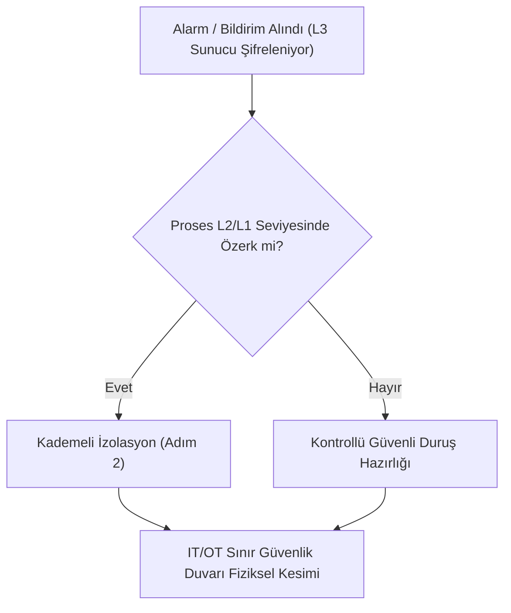

# Playbook 01: OT Ağında Ransomware Yayılımı ve Kademeli İzolasyon

[Playbook Dizini](README.md) · [Olay Müdahalesi](../05-olay-mudahalesi-ve-kurtarma.md) · [Masa Başı Tatbikatı](../../../labs/03-masa-basi-tatbikati.md)

Bu operasyonel kılavuz; kurumsal IT ağında başlayan veya OT DMZ üzerinden Seviye 3 SCADA/Historian sunucularına sıçrayan bir fidye yazılımı (Ransomware) saldırısı anında, üretimi ve fiziksel emniyeti tehlikeye atmadan uygulanacak kademeli izolasyon prosedürünü tanımlar.

---

## 1. İlk 15 Dakika: Hızlı Durum Tespiti ve Eskalasyon

### Acil Eylemler:
1. **Olayı Doğrulayın:** Etkilenen sunucunun (Historian, HMI, Domain Controller) IP adresini ve şifreleme uzantısını tespit edin.
2. **Kriz Masasını Toplayın:** Vardiya Amiri, Otomasyon Mühendisi ve OT SOC Lideri arasında acil telsiz/fiziksel hat açın.
3. **Cihazları Kapatmayın (Power-Off Yapmayın):** Sunucuların fişini çekmeyin; bu durum RAM'deki şifre çözme anahtarlarını ve adli kanıtları yok eder.

---

## 2. Kademeli İzolasyon Adımları (Staged Containment)

### Aşama 1: IT - OT DMZ Sınırının Kesilmesi (T + 15 dk)
- Kurumsal IT güvenlik duvarında OT DMZ'ye giden tüm yönlendirmeleri (routing) ve VPN oturumlarını kapatın veya DMZ uplink fiber kablosunu fiziksel olarak çekin.
- **Hedef:** Zararlının IT'den OT'ye ya da OT'den IT'ye komuta kontrol (C2) trafiğini ve yanal yayılımını durdurmak.

### Aşama 2: Purdue Seviye 3 (Operasyon Yönetimi) İzolasyonu (T + 30 dk)
- SCADA sunucuları, Engineering Workstation (EWS) ve Historian sunucularının bulunduğu L3 yönetim ağ anahtarlarındaki uplink portlarını kapatın.
- **Yerel Özerklik Kontrolü:** Seviye 2 HMI panellerinin ve Seviye 1 PLC'lerin merkezi SCADA olmadan bağımsız çalıştığını sahada operatörle teyit edin.

### Aşama 3: Seviye 2 Saha HMI ve Mühendislik İzolasyonu (T + 45 dk)
- Sahadaki Windows tabanlı HMI terminallerinin ağ kablolarını çıkarın; proses kontrolünü pano üzerindeki gömülü donanımsal dokunmatik panellere (Touch Panel) veya butonlu manuel kumanda masalarına devredin.
- PLC programlama portlarını (Ethernet/Profinet) geçici olarak devre dışı bırakın veya PLC anahtarını `RUN` konumuna kilitleyin (Physical Keylock).

---

## 3. Delil Toplama ve Adli Koruma (Forensic Acquisition)

1. **Uçucu Bellek (RAM) İmajı:** Şifrelenen veya şüpheli sunuculardan `WinPmem` veya `FTK Imager Lite` (güvenilir USB ortamından) ile RAM dökümü alın.
2. **Ağ Paket Kaydı (PCAP):** İzolasyon öncesi ve anındaki SPAN/TAP kayıtlarını harici güvenli diske yedekleyin.
3. **Mühendislik Proje Dosyaları:** PLC yedeklerinin (temiz temel sürümler) çevrimdışı (offline) hava boşluklu depolama kasasında olduğunu fiziksel olarak doğrulayın.

---

## 4. Olay Günlüğü ve Karar Kayıt Şablonu

| Zaman (TSİ) | Alınan Karar / Uygulanan İzolasyon | Onaylayan Yetkili | Proses Durumu / Gözlem |
|---|---|---|---|
| `14:15` | IT-OT DMZ fiber kablosu çekildi | Vardiya Amiri (A. Kaya) | Su arıtma terfileri L1 PLC ile kesintisiz çalışıyor |
| `14:30` | L3 SCADA sunucusu izole edildi | OT SOC Lideri (M. Demir) | Historian durdu, yerel HMI üzerinden izleme sürüyor |
| `14:50` | PLC'ler donanımsal RUN moduna kilitlendi | Otomasyon Mühendisi (E. Yılmaz) | 12 adet PLC anahtarı kilitli kasaya alındı |
