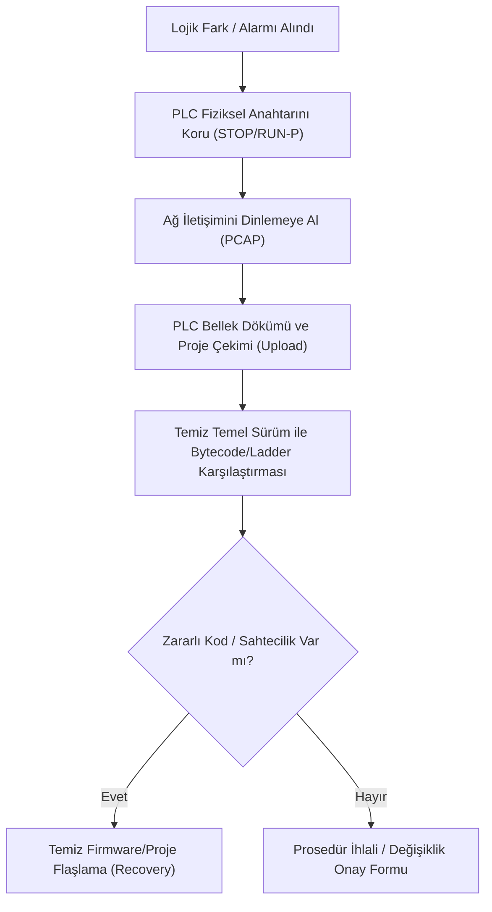

# Playbook 02: Yetkisiz PLC/RTU Lojik Değişikliği ve Adli Bilişim

[Playbook Dizini](README.md) · [PLC ve HMI Sıkılaştırma](../../08-mimari-ve-erisim/03-plc-hmi-ve-scada-sikilastirma.md) · [Zafiyet ve Değişiklik Yönetimi](../04-zafiyet-ve-degisiklik-yonetimi.md)

Bu operasyonel kılavuz; bir PLC, RTU veya Koruma Rölesinde (IED) plan dışı bir program indirme (Download), lojik blok değişikliği veya I/O force (değer sabitleme) tespit edildiğinde uygulanacak adli bilişim, fark analizi ve kurtarma adımlarını tanımlar.

---

## 1. Tespit ve İlk Müdahale

### Acil Eylemler:
1. **PLC'nin Çalışma Modunu Sabitleyin:** PLC ön panelindeki anahtarı `STOP` veya `RUN` konumuna getirin; `RUN-P` veya `REMOTE` konumundan çıkararak uzaktan yeni kod indirilmesini donanımsal olarak engelleyin.
2. **Değişiklik Kaynağını Belirleyin:** Hangi IP adresinden, hangi kullanıcı hesabıyla ve hangi mühendislik yazılımı (TIA Portal, RSLogix, Codesys) üzerinden bağlanıldığını ağ switch kayıtlarından doğrulayın.

---

## 2. Adli Delil Toplama ve Fark Analizi

### Adım 1: Ağ Trafiğini Kaydedin
- Mühendislik iş istasyonu ile PLC arasındaki ağ trafiğini (Port Mirroring / TAP) harici bir analiz cihazıyla kaydedin (PCAP).
- Kullanılan endüstriyel komutları (örneğin S7Comm `Job Request: Download`, Modbus `Force Multiple Coils`, CIP `Set Attribute Single`) filtreleyin.

### Adım 2: Çevrimiçi Projeyi Çekin (Upload from PLC)
- Temiz, izole bir adli mühendislik bilgisayarından PLC'deki mevcut çalışan kodu yükleyin (Upload).
- PLC'deki blok checksum (CRC32 / SHA-256) değerlerini not edin.

### Adım 3: Temiz Temel Sürüm (Gold Master) ile Karşılaştırma
- Güvenli çevrimdışı kasadan alınan son onaylı mühendislik projesi ile sahadan çekilen projeyi karşılaştırma aracında (Compare Tool) açın.
- **Odaklanılacak Alanlar:**
  - Değiştirilen Fonksiyon Blokları (FB / FC / OB),
  - Zorlanmış (Force edilmiş) giriş/çıkış bitleri,
  - Zamanlayıcı (Timer) ve sayaç parametrelerindeki sapmalar,
  - Güvenlik interlock devrelerine eklenmiş paralel açık/kapalı kontaklar.

---

## 3. Mühendislik İstasyonu Adli İncelemesi

Eğer değişiklik yetkili bir mühendislik bilgisayarından yapıldıysa:
1. Bilgisayarın ağ kablosunu çekin, işletim sistemi RAM imajını alın.
2. Windows Event Log'ları, mühendislik yazılımı audit loglarını (`.log`, `.db`) ve son açılan proje dosyalarını inceleyin.
3. USB bağlantı geçmişini (`USBSTOR` registry anahtarları) denetleyin.

---

## 4. Temiz Geri Yükleme ve Doğrulama

1. PLC hafızasını tamamen sıfırlayın (Memory Reset - MRES).
2. Üretici tarafından kriptografik olarak imzalanmış orijinal firmware sürümünü yükleyin.
3. Güvenli kasadaki onaylı proje dosyasını cihaza yazın (Download).
4. Kontrol anahtarını `RUN` moduna alıp sahada proses değişkenlerini adım adım doğrulayın.
