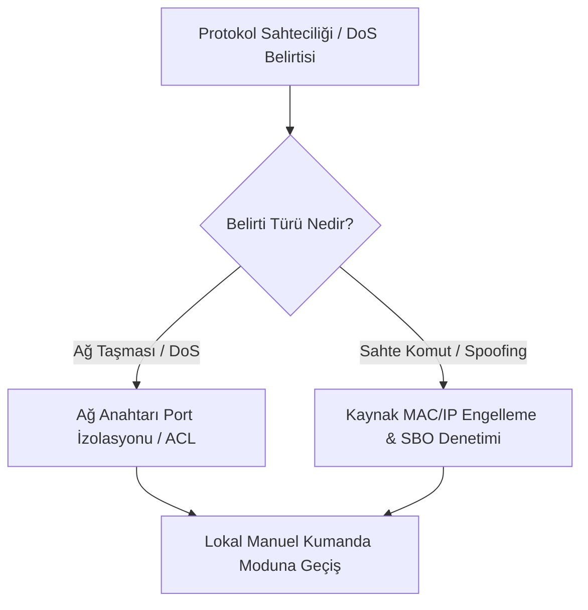

# Playbook 03: Endüstriyel Protokol Sahteciliği ve DoS Müdahalesi

[Playbook Dizini](README.md) · [Endüstriyel Protokoller](../../01-temeller/04-endustriyel-protokoller.md) · [Trafik Analizi](../../07-protokoller/03-trafik-analizi-ve-protokol-secimi.md)

Bu operasyonel kılavuz; sahada veya kontrol merkezinde sahte endüstriyel mesaj enjeksiyonu (IEC 61850 GOOSE/SV Spoofing, Modbus FC16 enjeksiyonu, DNP3 replay, IEC 104 sahte komut) veya ağ taşması (DoS) tespit edildiğinde uygulanacak izolasyon ve güvenli manuel işletim adımlarını tanımlar.

---

## 1. Olay Tespiti ve Belirtiler

### Olası Belirtiler:
- IED veya PLC'lerin beklenmedik şekilde eşzamanlı açma (trip) yapması,
- HMI ekranında aniden güncellenmeyen veya aşırı zıplayan telemetri değerleri,
- Ağ anahtarlarında (switch) broadcast fırtınası alarmları, yüksek CPU kullanımı,
- OT IDS sensöründe `GOOSE stNum Out of Sequence` veya `Modbus Invalid Function Code` uyarıları.

---

## 2. Ağ Düzeyinde İzolasyon ve Engelleme

### Adım 1: Kaynak Portu Kapatın (Port Shutdown)
- Sahte paketin geldiği fiziksel switch portunu tespit edin ve kapatın (`interface shutdown`).
- Cihaz bir kablosuz köprü veya hücresel ağ geçidi üzerinden bağlıysa RF anten beslemesini veya SIM kart oturumunu askıya alın.

### Adım 2: VLAN ve ACL Kısıtlaması Uygulayın
- Endüstriyel ağ anahtarlarında sahte trafiğin yayınlandığı VLAN'da port güvenliğini (Sticky MAC / 802.1X) devreye alın.
- İlgili IED/PLC'ye sadece yetkili kontrol merkezi IP'sinden gelen paketlere izin veren katı donanımsal ACL (Access Control List) kuralları uygulayın.

---

## 3. Proses Seviyesinde Yerel Manuel Kontrole Geçiş

1. **Uzak Kumanda İptali (Local/Remote Switch):** Trafo merkezi, terfi istasyonu veya vana odalarındaki "Lokal/Uzak" seçici pako şalterlerini fiziksel olarak **LOKAL** konumuna alın. Bu işlem ağdan gelen tüm dijital komutları donanımsal olarak geçersiz kılar.
2. **Analog ve Gösterge Doğrulaması:** SCADA ekranındaki dijital değerler yerine saha panosundaki ibreli analog manometre, voltmetre ve seviye camlarından gerçek proses değerlerini okuyun.
3. **Mekanik Emniyet Kilitlerini Kontrol Edin:** Basınç emniyet ventilleri ve anti-pumping rölelerinin devrede olduğunu teyit edin.

---

## 4. Adli Analiz ve Protokol İncelemesi

- Paket yakalama (PCAP) dosyasında şu alanları inceleyin:
  - **GOOSE:** `gocbRef`, `stNum`, `sqNum` değerlerinin zıplama eğrisi ve sahte kaynak MAC adresi.
  - **Modbus/TCP:** `Transaction ID`, `Unit ID` ve `Function Code` sıklığı.
  - **DNP3:** `Application Layer Sequence Number` ve `IIN (Internal Indications)` bitleri.
- Analiz sonuçlarını kaydedip telafi edici şifreleme/imzalama (IEC 62351) gereksinimlerini belirleyin.
