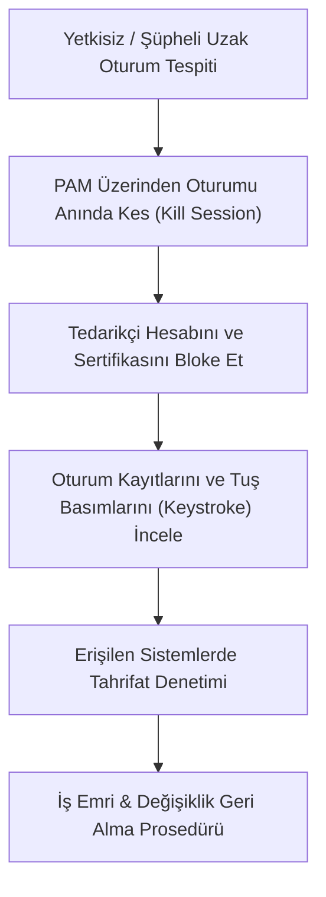

# Playbook 05: Tedarikçi ve PAM İhlali Müdahalesi

[Playbook Dizini](README.md) · [Zero Trust ve PAM](../../08-mimari-ve-erisim/01-zero-trust-rbac-ve-pam.md) · [Tedarikçi ve Uzak Erişim Şablonu](../../../templates/06-tedarikci-ve-uzak-erisim.md)

Bu operasyonel kılavuz; dış tedarikçi, bakım yüklenicisi veya uzaktan çalışan bir mühendisin ayrıcalıklı erişim hesabının (PAM) ele geçirilmesi, yetki aşımı yapılması veya plansız bir bakım oturumu tespit edildiğinde uygulanacak müdahale adımlarını tanımlar.

---

## 1. Tespit ve Acil Oturum Sonlandırma

### Acil Eylemler:
1. **Oturumu Anında Sonlandırın:** PAM (Ayrıcalıklı Erişim Yönetimi) konsolundan veya güvenlik duvarından şüpheli oturumu tek tıkla sonlandırın (`Kill Session / Terminate Connection`).
2. **Kimlik Bilgilerini Sıfırlayın:** Tedarikçinin Active Directory hesabını kilitleyin, VPN sertifikasını İptal Listesine (CRL) ekleyin ve MFA anahtarlarını sıfırlayın.

---

## 2. Oturum Adli Analizi ve Tahrifat Tespiti

### Adım 1: PAM Video ve Komut Kayıtlarını İzleyin
- PAM sunucusundaki oturum video kaydını ve CLI tuş basım kayıtlarını (Keystroke Logs) baştan sona inceleyin.
- Saldırganın/kullanıcının hangi dosyalara eriştiğini, hangi komutları çalıştırdığını ve hangi konfigürasyon pencerelerini açtığını belirleyin.

### Adım 2: Hedef Sistemlerde Olay Kayıtlarını Doğrulayın
- Tedarikçinin eriştiği PLC, HMI, EWS veya SCADA sunucusu üzerinde Windows Security Event Log'ları, syslog kayıtlarını ve mühendislik yazılımı değişiklik loglarını tarayın.
- İlgili zaman aralığında dosya oluşturma, silme, registry değişikliği veya proje yüklemesi yapılıp yapılmadığını listeleyin.

---

## 3. Tahrifatın Geri Alınması ve Telafi Kontrolleri

1. **Konfigürasyon Geri Alma:** Tedarikçinin değiştirdiği tüm parametreleri ve proje dosyalarını, oturum başlangıcından önceki onaylı sürüme geri döndürün.
2. **Kapsam Dışı Sistemlerin Taranması:** Tedarikçi bilgisayarından ağdaki diğer sistemlere doğru (L2/L1) herhangi bir port taraması veya yanal hareket yapılıp yapılmadığını ağ güvenlik duvarı loglarından denetleyin.
3. **Saha Teyidi:** Sahadaki otomasyon ekibiyle irtibata geçerek ekipman durumlarını fiziksel olarak doğrulayın.

---

## 4. Olay Sonrası İnceleme ve Raporlama

- Tedarikçi firma yetkilisi ile resmî görüşme yaparak oturumun kendi personelleri tarafından mı yoksa ele geçirilmiş kimlikle mi yapıldığını tespit edin.
- Olay tutanağını doldurun ve [Tedarikçi Erişim Formu](../../../templates/06-tedarikci-ve-uzak-erisim.md) üzerine ihlal şerhi düşerek sözleşmesel/hukuki adımları başlatın.
