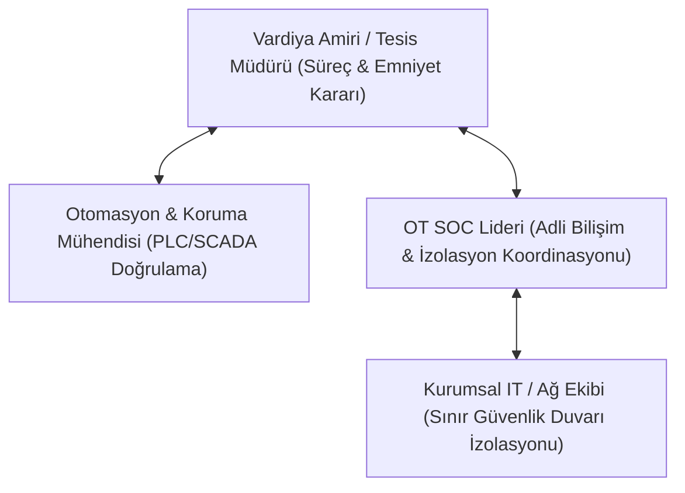

# OT Olay Müdahale ve Adli İnceleme Playbook Koleksiyonu

[Ana sayfa](../../../README.md) · [Olay Müdahalesi ve Kurtarma](../05-olay-mudahalesi-ve-kurtarma.md) · [Sektörel Senaryolar](../../02-sektorler/senaryolar/README.md) · [Kurtarma Doğrulama Laboratuvarı](../../../labs/04-kurtarma-dogrulama.md)

Bu dizin; endüstriyel tesislerde, kritik altyapılarda ve operasyonel teknoloji (OT) ortamlarında siber güvenlik olayları sırasında vardiya mühendisleri, otomasyon ekipleri ve OT SOC analistleri tarafından uygulanacak **standart operasyonel müdahale kılavuzlarını (Runbooks / Playbooks)** içerir.

---

## 1. Playbook Koleksiyonu

| No | Playbook Dosyası | Kapsanan Acil Durum | Temel Müdahale Hedefi |
|---|---|---|---|
| **01** | [Ransomware İzolasyonu](01-ransomware-izolasyon.md) | OT/IT sınırında fidye yazılımı yayılımı | Üretimi aniden durdurmadan L2/L1 kademeli izolasyonu |
| **02** | [Yetkisiz Lojik Değişikliği ve Adli Bilişim](02-unauthorized-logic-forensics.md) | PLC/RTU lojik veya firmware tahrifatı | Memory dump alma, bytecode fark analizi, kanıt koruma |
| **03** | [Protokol Sahteciliği ve DoS Müdahalesi](03-protokol-sahteciligi-mudahale.md) | GOOSE, Modbus, DNP3 sahteciliği | Sahte telemetri izolasyonu, lokal manuel kontrole geçiş |
| **04** | [Güvenli Hizmete Dönüş ve Devreye Alma](04-guvenli-hizmete-donus.md) | İhlal sonrası tesisin yeniden başlatılması | 5 aşamalı kabul kapısı, ıslak imzalı mühendis onayı |
| **05** | [Tedarikçi ve PAM İhlali Müdahalesi](05-tedarikci-pam-ihlali.md) | Ele geçirilmiş bakım hesabı / uzaktan erişim | Oturum sonlandırma, yetki iptali, tahrifat geri alma |

---

## 2. Rol ve Sorumluluk Matrisi (RACI)

OT olay müdahalesinde kararlar yalnızca siber güvenlik ekibine bırakılamaz; can güvenliği ve proses kararları tesis sorumlularındadır.

- **A (Accountable - Nihai Sorumlu):** Vardiya Amiri / Tesis Müdürü (Üretimi durdurma veya hatta enerji verme yetkisi).
- **R (Responsible - İcracı):** Otomasyon Mühendisi (PLC/SCADA müdahalesi) ve OT SOC Analisti (Adli analiz ve ağ filtreleme).
- **C (Consulted - Danışılan):** Proses Kimyageri / Elektrik Koruma Uzmanı / Emniyet Sorumlusu (İş Güvenliği).
- **I (Informed - Bilgilendirilen):** Kurumsal Yönetim, Hukuk Müşavirliği ve Düzenleyici Otoriteler (USOM / SOME).

---

## 3. Temel Müdahale Prensipleri

1. **Önce Can ve Tesis Emniyeti:** Siber tehdit ne olursa olsun, bir vanayı kapatma veya kesiciyi açma kararı fiziksel emniyet riskleri (aşırı basınç, rezonans, personel güvenliği) değerlendirilmeden verilemez.
2. **"Tüm Sistemleri Kapat" Refleksinden Kaçının:** Plansız elektrik kesintisi veya sunucu kapatma, uçucu RAM belleklerindeki adli kanıtları yok eder ve kimyasal süreçlerde reaksiyon kaçaklarına yol açabilir.
3. **Mühendis Onayı Olmadan Hizmete Dönüş Yoktur:** SOC ekibinin "ağda zararlı kalmadı" raporu tek başına üretimi başlatmak için yeterli değildir; 5 aşamalı mühendislik kabul doğrulaması zorunludur.
