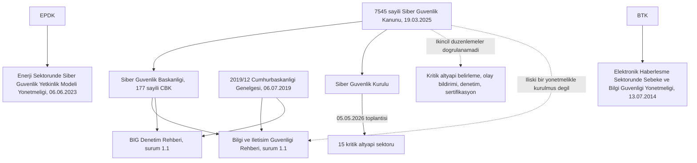

# Standartlar ve Türkiye'de resmî başvuru noktaları

[Ana sayfa](../README.md) · [Kaynak araştırma notları](../research/standartlar-kaynaklar.md) · [Sözlük](06-sozluk.md)

Bu bölüm iki ayrı soruyu ayırır. Birincisi teknik: hangi standart ailesi neyi çerçeveler, kime hitap eder, hangi soruyu cevaplar? İkincisi yerel: Türkiye'de hangi resmî metinler yayımlanmıştır ve nerede durur? Metin hukuki danışmanlık değildir. Belirli bir kurumun hangi düzenlemeye tabi olduğu burada belirlenmez; bu değerlendirme kurumun hukuk birimi, düzenleyicisi ve sözleşmeleriyle yapılır.

## Standart ne yapar, ne yapmaz

Bir standart ortak terim, tekrarlanabilir bir yöntem ve üzerinde anlaşılmış bir gereksinim listesi verir. Böylece iki taraf aynı kelimeyle aynı şeyi kastedebilir, bir talep sözleşmeye yazılabilir, bir denetçi neye bakacağını bilir. Standart, tesisin fiziksel sürecini, emniyet gereklerini, bakım penceresini ve personel kapasitesini bilmez; bunları kurum kendi getirir.

Üç ayrımı baştan yapmakta yarar var.

- **Uygunluk ile güvenli işletme aynı ölçüm değildir.** Uygunluk beyanı, belirli bir tarihte, belirli bir kapsamda, belirli gereksinimlerin karşılandığını gösterir. Kapsam dışında bırakılan varlıklar, beyandan sonra yapılan değişiklikler ve denetimde örneklenmeyen noktalar risk üretmeye devam eder. Kapsamı okumadan sonucu okumak yanıltır.
- **Satın almak ile uygulamak farklıdır.** Standartların çoğu ücretlidir; erişim ilk adımdır. Uygulama, kapsamın seçilmesi, gereksinimlerin yerel karara çevrilmesi, kontrolün kurulması ve kanıtın üretilmesiyle olur. Kütüphanede duran bir PDF kontrol değildir.
- **Sertifika ürüne verilir, güvenlik tesiste kurulur.** Bir ürünün gereksinimi karşılayabilecek yeteneği olması, o yeteneğin sahada etkin yapılandırıldığı anlamına gelmez.

Bu depoda standartlar zorunluluk listesi olarak değil, soru üretmek için kullanılır: bu gereksinim bizde hangi kararı gerektiriyor, kararın kanıtı ne olacak, kanıtı kim gözden geçirecek?

## Standart ailelerini işleviyle tanıma

Tablo bir tanıma haritasıdır. Satırlar, ilgili kuruluşun resmî katalog veya yayın kaydından okunan kapsam bilgisine dayanır; ücretli standartların tam metinleri incelenmemiştir. Sürüm ve tarih bilgileri bölüm sonundaki kaynak tablosundadır.

| Belge veya aile | Yayıncı | Neyi çerçeveler | Kime hitap eder | Cevapladığı soru | Cevaplamadığı soru |
|---|---|---|---|---|---|
| IEC 62443 serisi | IEC TC 65; ISA ile ortak çalışma | Endüstriyel otomasyon ve kontrol sistemleri güvenliği; kavram, program, sistem ve bileşen katmanları | Varlık sahibi, entegratör ve ürün üreticisi ayrı ayrı | Hangi gereksinim hangi role düşer; sistem bölge ve kanallara nasıl ayrılır | Sürecin fiziksel riski, emniyet gerekleri ve yerel işletme kısıtları |
| NIST SP 800-82 Rev. 3 | NIST | OT güvenliği rehberi; endüstriyel kontrol, bina otomasyonu ve ulaşım sistemleri | Uygulayıcı teknik ekipler | OT'ye özgü tehdit, zafiyet ve karşı önlem çerçevesi | Belgelendirme veya bir yargı alanında yasal uygunluk |
| NIST CSF 2.0 (CSWP 29) | NIST | Üst düzey siber güvenlik sonuçları taksonomisi | Yönetim ve teknik ekip birlikte | Riskin nasıl anlaşılacağı, önceliklendirileceği ve anlatılacağı | Hangi teknik kontrolün nasıl kurulacağı; belgelendirilebilir bir gereksinim seti değildir |
| ISO/IEC 27001:2022 | ISO/IEC JTC 1/SC 27 | Bilgi güvenliği yönetim sistemi gereksinimleri | Kurumun yönetim sistemi | Yönetim sistemi nasıl kurulur, sürdürülür ve belgelendirilir | Süreç davranışı, saha kontrolü ve kontrolör düzeyi ayrıntısı |
| ISO/IEC 27019:2024 | ISO/IEC JTC 1/SC 27 | Enerji hizmetleri sektörüne özgü bilgi güvenliği kontrolleri; ISO/IEC 27002:2022 tabanlı | Elektrik, gaz, petrol ve ısı işletmeleri | Sektörel kontrol seti ve kapsadığı teknoloji alanları | Bağımsız belgelendirme; nükleer tesislerin süreç kontrol alanı kapsam dışıdır |
| IEC 62351 serisi | IEC TC 57 | Güç sistemi haberleşme protokollerinin güvenliği | Enerji haberleşmesini tasarlayan ve işleten ekipler | IEC 60870-5, 60870-6, 61850, 61970 ve 61968 üzerine güvenliğin nasıl ekleneceği | Protokolün kendisinin yerine geçmez; ürün desteği tesis özelinde doğrulanır |
| CLC/TS 50701:2023 | CENELEC; teknik şartname | Demiryolu siber güvenliğinin RAMS yaşam döngüsü içinde yönetimi | Demiryolu işletmecisi, entegratör ve tedarikçi | Haberleşme, sinyalizasyon, araç ve sabit tesislerde güvenliğin yaşam döngüsüne yerleştirilmesi | Harmonize bir EN standardı değildir; bileşen gereksinimleri 62443-4-x tarafındadır |
| NERC CIP | NERC | Kuzey Amerika toplu elektrik sistemi (BES) için zorunlu siber güvenlik rejimi | NERC'in kayıtlı fonksiyonel varlıkları | BES siber sistemlerinin sınıflandırılması ve buna bağlı gereksinimler | Bu kayıt kapsamı dışındaki ülkelerdeki tesisler için yükümlülük |
| NIS2, Direktif (AB) 2022/2555 | Avrupa Birliği | Üye devletlerde asgari ortak siber güvenlik düzeyi | Üye devletler; iç hukuka aktarım sonrası kapsamdaki kuruluşlar | AB genelinde düzenleme ve gözetim çerçevesi | Türkiye'de doğrudan yükümlülük; teknik kontrol ayrıntısı |
| IEC 61508 ve IEC 61511 | IEC | Fonksiyonel emniyet; elektriksel/elektronik/programlanabilir sistemler ve süreç sektörü emniyet enstrümanlı sistemleri | Emniyet fonksiyonunu tasarlayan ve işleten ekipler | Emniyet fonksiyonunun bütünlüğü ve yaşam döngüsü | Kasıtlı saldırgana karşı direnç; IEC 61508-1 katalog kaydında siber güvenlik geçmez, IEC 61511-1 kaydında yalnızca anahtar kelime olarak görünür |

Demiryolu tarafında IEC 63452 adıyla, IEC 62443'ün demiryoluna uyarlanmasını hedefleyen bir proje yürütülmektedir. Aralık 2025 tarihli proje sunumunda uluslararası standart için yaklaşık Ağustos 2026 öngörülmüştür. Bu çalışmada 13.09.2026 itibarıyla IEC kataloğunda yayımlanmış bir kayıt doğrulanamamıştır; durum **doğrulanacak** olarak işaretlenir. Raylı sistem bağlamı için [raylı sistemler bölümü](02-sektorler/03-rayli-sistemler.md) okunabilir.

## IEC 62443'e biraz daha yakından bakış

Seri dört numaralandırma grubuna ayrılır. Bu yapı, "62443 uyguluyoruz" cümlesinin tek başına neden yetersiz kaldığını açıklar: hangi parça, hangi rol, hangi kapsam?

| Grup | Konusu | Birincil muhatap |
|---|---|---|
| 1-x | Genel kavramlar, terminoloji ve modeller | Herkes; ortak dil için |
| 2-x | Politika, program ve süreç gereksinimleri | Varlık sahibi ve hizmet sağlayıcı |
| 3-x | Sistem düzeyi: risk değerlendirmesi ve sistem gereksinimleri | Sistem tasarımcısı ve entegratör |
| 4-x | Bileşen düzeyi: geliştirme süreci ve teknik gereksinimler | Ürün üreticisi ve geliştirici |

**Bölge ve kanal.** IEC 62443-3-2, incelenen sistemin tanımlanmasını, bu sistemin bölgelere (zone) ve kanallara (conduit) ayrıştırılmasını, her bölge ve kanal için risk değerlendirmesi yapılmasını ve hedef güvenlik seviyesinin belirlenmesini kapsar. Bölge, benzer güvenlik gereksinimlerini paylaşan varlık kümesidir; kanal, bölgeler arasındaki denetimli iletişim yoludur. Bu, ağ mimarisi bölümündeki [güven bölgeleri](01-temeller/03-mimari-ve-guven-bolgeleri.md) tartışmasının standart tarafındaki karşılığıdır.

**Güvenlik seviyesi (SL) ne söyler, ne söylemez.** Katalog kayıtlarından doğrulanan ayrım şudur: 3-2 hedef seviyeyi (SL-T) belirler, 3-3 kontrol sisteminin yetenek seviyesini (SL-C, kontrol sistemi) tanımlar, 4-2 bileşen yetenek seviyesini (SL-C, bileşen) tanımlar ve bunun hedef (SL-T) ile erişilen (SL-A) seviyeden farklı olduğunu belirtir. Yani SL bir "güvenlik notu" değildir; hangi seviyenin hangi anlamda söylendiği her cümlede ayrıca yazılmalıdır. Seviye kademelerinin resmî tanımları ve karşılık geldiği saldırgan yetkinliği bu çalışmada tam metinden doğrulanmamıştır; **doğrulanacak**. Tesis ve bölge bazında SL-T ile SL-A arasındaki fark analizi için [IEC 62443 Öz Değerlendirme Şablonu](../templates/11-iec-62443-oz-degerlendirme.md) kullanılabilir.

**Sorumluluk kime düşer.** Katalog kayıtlarına göre 62443-4-1 güvenli ürün geliştirme yaşam döngüsü gereksinimlerini donanım, yazılım ve ürün yazılımı geliştiricilerine yöneltir ve entegratörlere veya son kullanıcılara uygulanmaz. 62443-2-1 ise varlık sahibinin güvenlik programı gereksinimlerini belirler; 2024 sürümü gereksinimleri program öğelerine göre yeniden yapılandırır ve bir olgunluk modeli getirir. Aynı kayıt, IACS ömrünün yirmi yılı aşabildiğini kabul ederek telafi edici önlemlere yer verir. Bu, [zafiyet ve değişiklik yönetimi](04-savunma/04-zafiyet-ve-degisiklik-yonetimi.md) bölümündeki uzun ömür tartışmasıyla aynı gerçeği kabul eder.

**Sertifikalı ürün, güvenli tesis demek değildir.** Bir bileşenin yetenek seviyesi, o yeteneğin sahada etkinleştirildiğini, doğru yapılandırıldığını, anahtar ve sertifika yönetiminin kurulduğunu veya çevresindeki bölge sınırının tasarlandığını göstermez. Tedarik dosyasında sertifika bulunması, kabul testinde davranışın gözlenmesinin yerine geçmez. Bu deponun özgün önerisi: satın alma şartnamesine yazılan her güvenlik özelliği için bir kabul kanıtı satırı da yazılsın; kanıtı üretilemeyen özellik açık madde olarak kalsın. [Tedarikçi ve uzak erişim şablonu](../templates/06-tedarikci-ve-uzak-erisim.md) bu kaydı tutmak içindir.

**Numaralandırma uyarısı.** ISA tarafındaki ANSI/ISA numaralandırma yılları IEC yıllarından farklı olabilmektedir; örneğin ISA sayfasında ANSI/ISA-62443-4-2-2018 geçerken IEC kaydı 62443-4-2:2019'dur. Bu depoda IEC numaralandırması kullanılır. Bir yazışmada veya şartnamede atıf yaparken hangi kurumun numaralandırmasının kullanıldığı açıkça yazılmalıdır.

## Fonksiyonel emniyet ile siber güvenliğin ilişkisi

IEC 61508, elektriksel, elektronik ve programlanabilir elektronik emniyetle ilgili sistemlerin fonksiyonel emniyetine ilişkin genel gereksinimleri verir. IEC 61511 bunun süreç sektörüne uygulanmasıdır ve emniyet enstrümanlı sistemin (SIS) şartname, tasarım, kurulum, işletme ve bakım gereksinimlerini kapsar. Her ikisi de emniyet fonksiyonunun rastgele ve sistematik arızalara karşı bütünlüğünü ele alır.

Buradan çıkan ayrım şudur: **SIL bir siber güvenlik seviyesi değildir.** SIL, emniyet fonksiyonunun gerekli bütünlük seviyesini anlatır; kasıtlı bir saldırgana karşı direnç ölçüsü olarak tanımlanmamıştır ve 62443'ün SL kavramıyla sayı sayıya eşleştirilemez. Bu ifade bir yorumdur, standart metninden alıntı değildir. Dayanağı şudur: IEC 61508-1 katalog kaydının kapsam metninde ve anahtar kelimelerinde siber güvenlik geçmez; IEC 61511-1 katalog kaydının kapsam metninde geçmez, ancak anahtar kelime alanında "Cyber security" yer alır. İkincisi, standardın siber güvenliğe değindiğine işaret eder; ayrıntı tam metinden doğrulanmamıştır (**doğrulanacak**).

IEC 61511-1'in ikinci baskısının bir siber güvenlik risk değerlendirmesi istediği yaygın biçimde belirtilir. Bu çalışmada iddia katalog kapsam metninden doğrulanamamıştır; **doğrulanacak**. Bu nedenle "fonksiyonel emniyet standartları siber güvenliği hiç ele almaz" biçiminde bir cümle de kullanılmaz. Doğru ifade şudur: kapsamları fonksiyonel emniyettir ve SIL saldırı direnci ölçmez.

Pratikte iki disiplin aynı varlıkta buluşur. Özgün öneri olarak ortak çalışma noktaları:

- Emniyet fonksiyonuna etki edebilecek her dijital erişim yolu, emniyet dokümantasyonunda da görünür olmalıdır.
- Emniyet sistemindeki bir değişiklik, hem emniyet hem güvenlik tarafında onay gerektiren tek bir değişiklik kaydıyla yürütülür.
- Siber olay müdahalesinde emniyet sistemine uygulanacak işlem, iş istasyonuna uygulanacak işlemle aynı kuralla ele alınmaz; ayrım önceden yazılır. [Risk, emniyet ve bağımlılıklar](01-temeller/05-risk-emniyet-ve-bagimliliklar.md) bölümü bu bağlamı verir.

## Kapsam tuzakları: hangi belge nerede bağlar?

OT güvenliği literatürünün büyük bölümü belirli bir yargı alanı için yazılmıştır. Belgeyi okumak yararlıdır; yükümlülüğünü ithal etmek yanıltır.

**NERC CIP.** CIP-002-8 metninin amaç bölümü kapsamı toplu elektrik sisteminin (BES) güvenilir işletimiyle sınırlar; uygulanabilirlik bölümü yükümlü tarafları NERC'in kayıtlı fonksiyonel varlıklarıyla sınırlar ve metin başka bir yargı alanı için muhatap tanımlamaz. Kendi kurumunuz için sonucu düzenleyicinize ve hukuk biriminize sorun. Bu çalışmada CIP-002-8'in yürürlük tarihi ve hâlen uygulamadaki CIP-002 sürümünün hangisi olduğu doğrulanmamıştır; standart metni yürürlüğü ayrı bir uygulama planı belgesine bırakır.

**NIS2.** Direktif (AB) 2022/2555 14 Aralık 2022 tarihlidir, 16 Ocak 2023'te yürürlüğe girmiştir ve üye devletlerin iç hukuka aktarma son tarihi 17 Ekim 2024'tür. Direktifin muhatabı üye devletlerdir; kapsamdaki kuruluşların yükümlülüğü, üye devletin aktarım mevzuatından doğar. Direktifte Türkiye'ye ilişkin bir hüküm yoktur. Bir kurumun bu metne tabi olup olmadığı burada yorumlanmaz; değerlendirme kurumun düzenleyicisi ve hukuk birimiyle yapılır.

**Peki neden okunuyor?** Üç gerekçe:

1. **Yöntem.** Kapsam belirleme, olay bildirimi, tedarik zinciri ve yönetişim başlıkları, yerel bir programın da cevaplaması gereken soruları düzenli biçimde sorar.
2. **Sözleşme.** AB pazarına ürün veya hizmet veren, ya da kapsamdaki bir kuruluşa tedarik yapan şirketler için bu metinler sözleşmesel erişim şartına dönüşebilir. Bu, iç hukuktan ayrı bir başlıktır.
3. **Karşılaştırma.** Farklı rejimlerin aynı soruna verdiği cevaplar, kendi kararınızın gerekçesini görünür kılar.

Aynı uyarı ters yönde de geçerlidir: bir ABD veya AB rehberindeki bildirim süresi, makam adı veya eşik değeri Türkiye'deki bir kurum için bildirim rotası oluşturmaz.

## Türkiye'de resmî başvuru noktaları

Bu alt bölümdeki her satır, yayıncının kendi resmî yayınından 13.09.2026 tarihinde doğrulanmıştır. Doğrulanamayan bilgi yazılmamış, belirsiz kalan noktalar açıkça işaretlenmiştir. Metin "şu kurum şu metni yayımlamıştır" düzeyinde kalır; bir kurumun bu metinlere tabi olup olmadığı yorumu yapılmaz.

### Çerçeve kanun

7545 sayılı Siber Güvenlik Kanunu 19 Mart 2025 tarihli ve 32846 sayılı Resmî Gazete'de yayımlanmış, yayımı tarihinde yürürlüğe girmiştir. Kanun metninden doğrulanan noktalar:

- **Kapsam (m.2).** Siber uzayda varlık gösteren, faaliyet yürüten ve hizmet sunan kamu kurum ve kuruluşları, kamu kurumu niteliğinde meslek kuruluşları, gerçek ve tüzel kişiler ile tüzel kişiliği bulunmayan kuruluşlar kapsamdadır. m.2/2'de sayılan kanunlar uyarınca yürütülen istihbari faaliyetler ile Türk Silahlı Kuvvetleri İç Hizmet Kanunu uyarınca yürütülen faaliyetler kapsam dışında bırakılmıştır.
- **Kritik altyapı tanımı (m.3/1-d).** İşlediği bilginin/verinin gizliliği, bütünlüğü veya erişilebilirliği bozulduğunda can kaybına, büyük ölçekli ekonomik zarara ve güvenlik açıklarına veya kamu düzeninin bozulmasına yol açabilecek **bilişim sistemlerini** barındıran altyapılar. Kanun metninde "endüstriyel kontrol sistemleri" ibaresi geçmez; bu, 2013 tarihli SOME Tebliği'ndeki tanımdan farklıdır.
- **Başkanlığın görevleri (m.5).** Kritik altyapıları ve ait oldukları kurum ile konumları belirlemek, varlık envanteri ve risk analizi, siber olaylara müdahale ekiplerini kurmak veya kurdurmak ve denetlemek, standart hazırlamak, test ve sertifikasyon, denetim ve yaptırım.
- **Yükümlülükler (m.7).** Talep edilen veri, belge, donanım ve yazılımın öncelikle iletilmesi; zafiyet ve siber olayların gecikmeksizin bildirilmesi; kamu kurumları ile kritik altyapılarda kullanılacak siber güvenlik ürün, sistem ve hizmetlerinin Başkanlıkça yetkilendirilmiş ve belgelendirilmiş siber güvenlik uzmanı, üretici veya şirketlerden tedarik edilmesi (m.7/1-c). Hüküm her türlü ürün ve hizmeti değil, siber güvenlik ürün, sistem ve hizmetlerini konu alır.
- **Diğer.** m.8 denetim, m.9/4-ç kritik altyapı sektörlerini belirleme yetkisinin Siber Güvenlik Kurulunda olması, m.16-17 cezai hükümler ve idari para cezaları. m.19 ile 5809 sayılı Elektronik Haberleşme Kanunu'nun 60/11 ile ek 1 ve ek 2 maddeleri yürürlükten kaldırılmıştır. Geçici m.1/6, uygulama düzenlemelerinin bir yıl içinde yürürlüğe konulmasını öngörür.

### Kurumsal yapı

Siber Güvenlik Başkanlığı, 8 Ocak 2025 tarihli ve 32776 sayılı Resmî Gazete'de yayımlanan 177 sayılı Cumhurbaşkanlığı Kararnamesi ile kurulmuştur: Cumhurbaşkanlığına bağlı, kamu tüzel kişiliğini haiz, özel bütçeli, merkezi Ankara. Kararname 183 sayılı CBK (28/3/2025-32855) ve 192 sayılı CBK (25/12/2025-33118) ile değiştirilmiştir. Konsolide metnin hizmet birimleri maddesinde OT açısından öne çıkan birimler Siber Savunma, Siber Mukavemet, Ekosistem Geliştirme, Kamu Yapay Zekâ, Dijital Devlet ve Yönetim Hizmetleri genel müdürlükleri ile Strateji Geliştirme ve Dış İlişkiler daire başkanlıklarıdır; aynı listede Hukuk Müşavirliği, Basın ve Halkla İlişkiler Müşavirliği ve Özel Kalem Müdürlüğü de yer alır. Konsolide metinde bir bent (ğ) mülga görünmektedir; bu bendin hangi birimi saydığı konsolide metinden okunamamaktadır.

Cumhurbaşkanlığı Dijital Dönüşüm Ofisi kapatılmıştır: 1 sayılı Cumhurbaşkanlığı Kararnamesi'nin Ofise ilişkin 527, 527/A ve 527/B maddeleri 183 sayılı CBK ile mülga kılınmış, geçici maddede kapatılan Ofisteki başkan ve başkan yardımcısı görevlerinin sona erdiği belirtilmiştir. USOM ise yayımladığı duyuruda, CVE başvuruları, siber ihbar süreçleri, zararlı bağlantı listeleri ve güvenlik bildirimlerinin artık siberguvenlik.gov.tr üzerinden yayımlanacağını bildirmektedir. Eski yayın adresi cbddo.gov.tr bu çalışmada DNS düzeyinde çözümlenmemiştir.

Kesintisiz oklar bu çalışmada doğrulanan yayın ve dayanak ilişkilerini, kesikli oklar doğrulanamayan veya henüz kurulmamış ilişkileri gösterir.

### Kritik altyapı sektörleri

Cumhurbaşkanlığı İletişim Başkanlığı'nın 5 Mayıs 2026 tarihli açıklamasına göre Siber Güvenlik Kurulu toplantısında şu alanların kritik altyapı sektörleri olarak belirlenmesi kararlaştırılmıştır: Dijital Altyapılar, Dijital Hizmetler, Elektronik Haberleşme, Enerji, Finans, Gıda ve Tarım, İmalat Sanayi, Kamu Hizmetleri, Medya ve Kriz İletişimi, Posta ve Kargo, Sağlık, Savunma Sanayii, Su Yönetimi, Ulaştırma, Uzay. Aynı liste Siber Güvenlik Başkanlığı'nın kritik altyapıların korunması sayfasında da yer almaktadır.

Sınır: bu bir resmî açıklama ve kurum sayfasıdır. Kurul kararının Resmî Gazete'de yayımlanmış metni bu çalışmada bulunamamıştır. Kararın yürürlük tarihi, sektör tanımları ve bir işletmenin "kritik altyapı işletmecisi" sayılma eşikleri doğrulanamamıştır; **doğrulanacak**.

### İkincil düzenlemelerin bugünkü durumu

Siber Güvenlik Başkanlığı'nın kendi mevzuat sayfasında 13.09.2026 itibarıyla beş kayıt listelenmektedir: 7545 sayılı Kanun (19.03.2025), 177 sayılı CBK (08.01.2025), Siber Güvenlik Başkanlığı Disiplin Amirleri Yönetmeliği (19.03.2026) ve 4734 sayılı Kamu İhale Kanunu'nun 3/(y) ile 3/(b) bentleri kapsamındaki alımlara ilişkin iki usul ve esas metni (25.04.2026). Kritik altyapı belirleme, olay bildirimi, denetim usulü veya sertifikasyon ve yetkilendirmeye ilişkin esasa dair bir yönetmelik bu listede görünmemektedir.

Bu bir eksiklik tespiti değil, listenin okunmasıdır: Başkanlığın listesi Başkanlığın yayımladığı mevzuatı gösterir. Başka kurumların yürürlükteki düzenlemelerinin bu listede olmaması, o metinlerin mülga olduğu anlamına gelmez.

### Bilgi ve İletişim Güvenliği Rehberi

Dayanak, 6 Temmuz 2019 tarihli ve 30823 sayılı Resmî Gazete'de yayımlanan 2019/12 sayılı Cumhurbaşkanlığı Genelgesi'dir. Rehber bugün Siber Güvenlik Başkanlığı tarafından yayımlanmaktadır. İncelenen sürüm 1.1'dir; sürüm tarihi 01.03.2026, belge içi değişiklik kaydında 1.0 Temmuz 2020 ilk yayın olarak görünür ve 1.1 değişikliğinin gerekçesi olarak mülga Dijital Dönüşüm Ofisi'nin yetkilerinin Başkanlığa devredilmesi gösterilir. Belge 235 sayfa ve "Tasnif Dışı" işaretlidir.

Kapsam olarak, bilgi işlem birimi barındıran veya bilgi işlem hizmetini üçüncü taraftan alan kamu kurum ve kuruluşları ile kritik altyapı hizmeti veren işletmeler anılır. Varlık grubu ana başlıkları altıdır: Ağ ve Sistemler, Uygulamalar, Taşınabilir Cihaz ve Ortamlar, Nesnelerin İnterneti Cihazları, Fiziksel Mekânlar, Personel. OT sistemleri (SCADA, RTU, PLC) "Ağ ve Sistemler" başlığı altında örneklenir.

OT açısından kilit bölüm 4.5 "Kritik Altyapılar Güvenliği"dir. Alt başlıkları: 4.5.1 genel güvenlik tedbirleri, 4.5.2 enerji sektörü özelinde tedbirler (s. 179), 4.5.3 elektronik haberleşme sektörü özelinde tedbirler (s. 182). Enerji alt başlığında geçen konular arasında endüstriyel kontrol sistemi cihaz konfigürasyonu, kontrol ağı ile kurumsal bilgi teknolojileri ağı arasında erişim kontrolü, kritikliğe göre ağ segmentasyonu ve izolasyon, kontrol ağı için ayrı kimlik doğrulama, kontrol ağının internete kapalı tutulması, çok faktörlü fiziksel erişim kontrolü, MMS üzerinde kimlik doğrulama ile SSL/TLS ve GPS yanıltmasına karşı koruma yer alır. Bu başlıklar, deponun [segmentasyon](04-savunma/02-segmentasyon-ve-uzak-erisim.md) ve [envanter](04-savunma/01-envanter-ve-gorunurluk.md) bölümleriyle aynı konuları işaret eder.

Tamamlayıcı belge, aynı tarihli Bilgi ve İletişim Güvenliği Denetim Rehberi sürüm 1.1'dir (57 sayfa). Denetim Rehberi sürüm 1.1'e göre denetimin yılda en az bir kez gerçekleştirilmesi için kurumların planlama yapması beklenir; denetim hizmet alımıyla yaptırılıyorsa hizmet, TSE'nin "Bilgi ve İletişim Güvenliği Rehberi Uyum Denetimi Hizmeti Veren Personel ve Firma Belgelendirme Programı" kapsamında yetkilendirilmiş firmalardan alınır; denetim raporu Bilgi ve İletişim Güvenliği Uyum ve Denetim İzleme Sistemi (BİGDES) üzerinden iletilir. Bu çalışmada BİGDES portalının güncel adresi doğrulanamamıştır; **doğrulanacak**.

Sınır: Rehber bir Genelge çerçevesinde hazırlanmış idari düzenlemedir. 7545 sayılı Kanun kapsamındaki kritik altyapı yükümlülükleriyle ilişkisinin bir yönetmelikle kurulduğu bu çalışmada doğrulanmamıştır. Ayrıca Rehber, "Kritik Altyapı Sektörleri"ni Ulusal Siber Güvenlik Stratejisi'nde belirlenen sektörler olarak tanımlar; ancak 2024-2028 Strateji metninde numaralandırılmış bir sektör listesi bulunmamaktadır. Bu atfın bugün hangi listeye işaret ettiği çözülememiştir; **doğrulanacak**.

### Ulusal strateji ve SOME yapısı

Ulusal Siber Güvenlik Stratejisi ve Eylem Planı (2024-2028), 7 Eylül 2024 tarihli ve 32655 sayılı Resmî Gazete'de yayımlanan 2024/11 sayılı Cumhurbaşkanlığı Genelgesi ile yürürlüğe konulmuştur. Resmî Gazete'de yayımlanan metin Genelge'dir; Strateji belgesinin tam metni UAB Haberleşme Genel Müdürlüğü sayfasında yayımlanmaktadır ve o PDF'te 2024/11 veya 32655 künyesi geçmez. Hedef H1.1, kamu kurum ve kuruluşları ile kritik altyapı sektörlerinde düzenleme ve denetlemeye dayalı siber güvenlik yaklaşımının geliştirilmesidir. Belge, USOM, sektörel SOME ve kurumsal SOME yapısını ulusal teknik mimari olarak tarif eder. Metin 7545 sayılı Kanun'dan önce hazırlanmıştır; kurumsal atıfları bugünkü yapıyla birebir örtüşmez.

SOME yapısının hâlâ atıf yapılan temel metni, 11 Kasım 2013 tarihli ve 28818 sayılı Resmî Gazete'de yayımlanan Siber Olaylara Müdahale Ekiplerinin Kuruluş, Görev ve Çalışmalarına Dair Usul ve Esaslar Hakkında Tebliğ'dir. OT açısından dikkate değer yanı, kritik altyapı tanımına endüstriyel kontrol sistemlerini dahil etmesi ve bu sistemleri m.3/1-b'de "Veri Tabanlı Merkezi Kontrol ve Gözetleme Sistemi (SCADA)" ile "coğrafi olarak Dağınık Kontrol Sistemleri (DKS)" olarak gruplamasıdır. Terim farkı not edilmelidir: 2013 tarihli Tebliğ "Dağınık", 2023 tarihli EPDK Yönetmeliği ise aynı kısaltma için "Dağıtılmış" der. Kurumsal SOME'ler bakanlıklar, diğer kamu kurumları ve sektörel SOME bulunan sektörlerdeki özel kurumlar bünyesinde; sektörel SOME'ler düzenleyici ve denetleyici kurumlar bünyesinde öngörülür.

Sınır: Tebliğ'in dayanakları 2018 öncesi yapıya aittir, 7545 m.5/d siber olaylara müdahale ekiplerine ilişkin yetkiyi Başkanlığa vermiştir ve Tebliğ, Başkanlığın mevzuat listesinde yer almamaktadır. mevzuat.gov.tr kaydında mülga şerhi görülmemiştir. Güncel yürürlük durumu bu çalışmada kesinleştirilememiştir; **doğrulanacak**.

### Sektör düzenleyicileri

| Kurum | Yayımlanmış metin ve tarih | Konusu | Bu çalışmadaki sınır |
|---|---|---|---|
| EPDK | Enerji Sektöründe Siber Güvenlik Yetkinlik Modeli Yönetmeliği; RG 6 Haziran 2023 – 32213, değişiklik RG 25 Kasım 2025 – 33088 | Enerji sektöründe kullanılan endüstriyel kontrol sistemlerinin siber güvenliği, asgari kabul edilebilir güvenlik seviyesi, dayanıklılık ve olgunluk | Kapsam maddesinde sayılmak ile fiilen yükümlü olmak ayrıdır; aşağıdaki nota bakınız |
| EPDK | 2017 tarihli Enerji Sektöründe Kullanılan Endüstriyel Kontrol Sistemlerinde Bilişim Güvenliği Yönetmeliği (RG 13/7/2017-30123) | Önceki düzenleme | 2023 Yönetmeliği ile yürürlükten kaldırılmıştır; eki olan kılavuz da mülgadır |
| BTK | Elektronik Haberleşme Sektöründe Şebeke ve Bilgi Güvenliği Yönetmeliği; RG 13 Temmuz 2014 – 29059 | İşletmecilerin şebeke ve bilgi güvenliği yükümlülükleri; BGYS için TS ISO/IEC 27001 esası; felaket kurtarma merkezi | Endüstriyel kontrol sistemine özgü hüküm içermez; kişisel verilerin işlenmesi kapsam dışıdır |
| UAB | Demiryolu Emniyet Yönetmeliği; RG 19 Kasım 2015 – 29537 | Emniyet yönetim sistemi, emniyet sertifikası ve emniyet yetkilendirmesi | Yayımlanan metinde "siber", "bilgi güvenliği" ve "bilişim" ibareleri geçmez; siber güvenlik düzenlemesi değildir |
| Su ve atıksu | Sektöre özgü siber güvenlik düzenlemesi doğrulanamadı | — | "Su Yönetimi" kritik altyapı sektörü olarak sayılmıştır; suya özgü bir yönetmelik, tebliğ veya rehber bu çalışmada bulunamamıştır |

EPDK Yönetmeliği'nin kapsam maddesinde elektrik iletim lisansı sahibi, elektrik dağıtım lisansı sahibi, kurulu gücü 100 MWe ve üzeri elektrik üretim tesisi sahibi, boru hattıyla iletim yapan doğal gaz iletim lisansı sahibi, sevkiyat kontrol merkezi kurmakla yükümlü doğal gaz dağıtım lisansı sahibi, doğal gaz depolama, ham petrol iletim ve rafinerici lisansı sahipleri sayılır. Aynı maddede OSB dağıtım lisansı sahipleri ile OSB üretim lisansı sahiplerinin kapsam dışında olduğu belirtilir. Buna karşılık EPDK'nın kendi sıkça sorulan sorular sayfasında, yayımlanan güncel sürümde yalnızca elektrik dağıtım ve doğal gaz dağıtım için modellerin belirlendiği, diğer alt sektörler için model çalışmalarının yayımlanmadığı ve bu lisans sahiplerinin mevcut durumda yönetmelik kapsamında bir yükümlülüğünün bulunmadığı belirtilmektedir. Aynı sayfada başka alt sektörlere ait teknik kontrol maddesi ekleri de listelenmektedir ve sayfada güncelleme tarihi yoktur. Bu iki bilgi arasındaki ilişki bu çalışmada çözülememiştir; **doğrulanacak** ve kurum kaynağından teyit edilmelidir.

Aynı sayfadan doğrulanan diğer noktalar: uyum planının başlangıcı EPDK'nın ilgili kuruluşa tebliğ ettiği yazının tarihidir; uyum denetimlerini bilgi ve iletişim güvenliği denetimleri için yetkilendirilmiş firmalar yapabilir ancak denetçi personelde Kritik Altyapılar Ulusal Test Yatağı Merkezi'nin endüstriyel kontrol sistemleri eğitimi sonrası başarı sertifikası aranır; teknik kontrol maddeleri için ISO 27001 ile eşleştirme tabloları yayımlanmıştır; yükümlü kuruluşlara hizmet veren üçüncü taraflar doğrudan yükümlü değildir, yükümlülük dolaylıdır.

Elektrik ve enerji bağlamı için [elektrik ve enerji bölümü](02-sektorler/02-elektrik-ve-enerji.md), telekom bağlamı için [telekom bölümü](02-sektorler/04-telekom-ve-baz-istasyonlari.md) okunabilir.

### Standartların Türkiye'deki karşılığı

IEC 62443 serisi TSE kataloğunda uyarlanmıştır. Katalogda TS EN IEC 62443-4-1 (kabul 19.11.2018), TS EN IEC 62443-3-3 ve TS EN IEC 62443-4-2 (30.09.2019), TS EN IEC 62443-3-2 ile TSE IEC/TS 62443-1-1, TSE IEC TR 62443-2-3 ve TSE IEC TR 62443-3-1 (09.11.2020), TS EN IEC 62443-2-4 yeni sürümü (04.03.2024), TS EN IEC 62443-2-1 yeni sürümü (08.10.2024), TSE CLC IEC/TS 62443-6-1 (06.01.2025) ve TSE CLC/IEC TS 62443-6-2 (21.05.2026) kayıtları görülmüştür. Bazı eski kayıtlar iptal durumundadır.

İki nokta önemlidir. Birincisi, kayıtların büyük çoğunluğu "(İngilizce Metin)" şerhlidir: başlık Türkçeleştirilmiş, metin İngilizce olarak kabul edilmiştir. Katalogda Türkçe metinli tek kayıt TSE IEC/TS 62443-1-1'dir. Bu nedenle "62443 serisi Türkçeye çevrilmiştir" ifadesi genel olarak doğru değildir. İkincisi, standartlar ücretlidir ve bu çalışmada yalnızca katalog kaydındaki kod, başlık, kabul tarihi ve durum bilgisi alınmıştır; tam metinler incelenmemiştir.

IEC 62443'e uyumun Türkiye'de genel bir hukuki zorunluluk olduğu bu çalışmada doğrulanmamıştır. EPDK Yetkinlik Modeli ve Bilgi ve İletişim Güvenliği Rehberi uluslararası çerçeveleri referans alır; incelenen eşleştirme tabloları ISO/IEC 27001 üzerinden verilmiştir. T.C. Cumhurbaşkanlığı Dijital Dönüşüm Ofisi BİGR EKS güvenlik tedbirlerinin kurumsal denetimi için [BİGR EKS Denetim Matrisi](../templates/10-bigr-eks-denetim-matrisi.md) kullanılabilir.

### Kişisel veri sınırı

6698 sayılı Kişisel Verilerin Korunması Kanunu 7 Nisan 2016 tarihli ve 29677 sayılı Resmî Gazete'de yayımlanmıştır. m.2 kapsamı, kişisel verisi işlenen gerçek kişiler ile bu verileri tamamen veya kısmen otomatik ya da bir veri kayıt sisteminin parçası olarak otomatik olmayan yollarla işleyen gerçek ve tüzel kişilerle sınırlar. m.12 uygun güvenlik düzeyini temin etmeye yönelik teknik ve idari tedbirleri, veri işleyenle müşterek sorumluluğu, gerekli denetimlerin yapılmasını ve m.12/5 uyarınca kişisel verilerin kanuni olmayan yollarla başkalarınca elde edilmesi hâlinde durumun en kısa sürede ilgilisine ve Kurula bildirilmesini düzenler.

OT ortamındaki süreç verisinin (basınç, debi, ayar değeri, alarm) kural olarak kişisel veri sayılmaması, buna karşılık operatör kimlik ve oturum kayıtları, kapı geçiş kayıtları, kamera görüntüleri, vardiya ve yetkilendirme kayıtları ile aboneye bağlanabilen sayaç verisi işlendiğinde Kanun'un devreye girmesi bu deponun **özgün yorumudur**. Bu ayrımı endüstriyel kontrol sistemleri bağlamında açıkça yapan bir Kurul kararı veya rehber bu çalışmada bulunamamıştır. m.12/5'teki "en kısa süre" ifadesini belirli bir saate somutlaştıran Kurul kararı da birincil kaynaktan teyit edilmemiştir; **doğrulanacak**.

Pratik sonuç, iki rejimin paralel olmasıdır: kişisel veri mevzuatı ile siber güvenlik mevzuatı birbirinin yerine geçmez. Bir OT olayı, koşulları oluştuğunda iki ayrı bildirim hattını aynı anda ilgilendirebilir. Bildirim rotasının kurum için nasıl kurulacağı hukuki bir değerlendirmedir ve burada yapılmaz.

## Kendi uygulanabilirlik haritanızı çıkarma

Aşağıdaki sıra ve tablo bu deponun **özgün önerisidir**; yayımlanmış bir metodolojinin çevirisi değildir. Amaç, "hangi standarda uyacağız?" sorusunu "hangi kapsamda, hangi gerekçeyle, hangi kanıtla?" sorusuna çevirmektir.

1. **Hizmeti tanımlayın.** Kurumun ürettiği hizmeti, bu hizmeti taşıyan tesisleri ve OT varlıklarını yazın. Kapsam dışı bıraktığınız yerleri de gerekçesiyle yazın.
2. **Düzenleyiciyi belirleyin.** Kurumun bağlı olduğu düzenleyici ve denetleyici kurumları listeleyin. Her biri için yayımlanmış metni, tarihini ve resmî bağlantısını kaydedin.
3. **Sözleşmeleri tarayın.** Müşteri, tedarikçi, sigorta ve ihale sözleşmelerindeki güvenlik maddeleri çoğu zaman mevzuattan önce bağlar. Yurt dışı pazarlara açılan hatlar ayrı satır olur.
4. **Çerçeveyi seçin.** Hangi standart ailesinin hangi parçasını, hangi sürümüyle kullanacağınızı yazın. Bütün seriyi almak zorunda değilsiniz; seçimin gerekçesi kayda geçsin.
5. **Boşlukları işaretleyin.** Cevabı bilinmeyen sorular "boşluk" olarak kalır ve sahibiyle birlikte izlenir. Boşluğu doldurulmuş gibi yazmak en pahalı hatadır.
6. **Gözden geçirme tarihi koyun.** Mevzuat ve standart sürümleri değişir; harita tarihsiz kalırsa eskir.

Kopyalanabilir boş tablo:

| Soru | Bu kurumdaki yanıt | Dayanak belge ve tarih | Sorumlu rol | Kanıt | Sonraki gözden geçirme |
|---|---|---|---|---|---|
| Hangi hizmeti üretiyoruz, hangi tesislerde? | [hizmet ve tesis listesi] | [iç belge] | [rol] | [belge kodu] | [tarih] |
| Hangi düzenleyiciye bağlıyız? | [kurum] | [metin adı, RG tarihi ve sayısı] | [rol] | [yazışma kaydı] | [tarih] |
| Hangi yayımlanmış metinler bizi ilgilendiriyor? | [metin listesi] | [resmî bağlantı] | [rol] | [inceleme notu] | [tarih] |
| Sözleşmelerden doğan güvenlik yükümlülükleri neler? | [madde özeti] | [sözleşme kodu] | [rol] | [sözleşme eki] | [tarih] |
| Hangi standardın hangi parçasını kullanıyoruz? | [standart kodu ve sürümü] | [katalog kaydı] | [rol] | [kapsam kararı] | [tarih] |
| Kapsam dışı bıraktığımız alanlar ve gerekçesi? | [alan ve gerekçe] | [risk kaydı] | [rol] | [onay kaydı] | [tarih] |
| Açık kalan sorular ve sahibi? | [boşluk listesi] | [iş listesi] | [rol] | [takip kaydı] | [tarih] |

## Standarttan kontrole giden yol

Bir gereksinim, yerel bir karara ve o kararın kanıtına çevrilmedikçe kâğıtta kalır. Aşağıdaki örnek **kurgusaldır ve bu deponun özgün eğitim sentezidir**; herhangi bir standart metninden alıntı değildir ve gerçek bir tesisi temsil etmez.

**Kurgusal durum:** B sahasında bir OT bölgesi ile kurumsal ağ arasında veri paylaşımı vardır. Seçilen çerçevenin beklentisi genel hatlarıyla şudur: bölgeler arası geçen akışlar tanımlı, gerekçeli ve onaylı olmalıdır.

| Adım | Bu kurgusal örnekte karşılığı |
|---|---|
| Gereksinimin genel ifadesi | Bölge sınırından geçen her akış tanımlı, gerekçeli ve onaylı olsun |
| Yerel yorum | "Akış" kaydı; kaynak, hedef, servis, yön, oturumu başlatan uç, veri sahibi ve iş gerekçesini içerir |
| Uygulama kararı | Yeni akış talebi, envanter kaydı ve iş gerekçesi olmadan açılmaz; geçici akışlara bitiş tarihi yazılır |
| Kabul kanıtı | Onaylı akış listesi ile sınır cihazı yapılandırmasının karşılaştırma kaydı; farkların gerekçesi veya kapatma kaydı |
| Gözlenebilirlik | Listede olmayan bir iletişim çifti görüldüğünde inceleme açılması; incelemenin kapanma gerekçesinin kayıtlı olması |
| Sınırlar | Şifreli tünel içindeki akışlar gözlemle ayrıştırılamayabilir; seri hatlar bu kanıtın dışında kalır |
| Gözden geçirme | Her değişiklik penceresinden sonra ve altı ayda bir; sahibi sınır bölgesinden sorumlu roldür |

Kanıt cümlesinin biçimi de önemlidir. "Segmentasyon yapıldı" bir kanıt değildir. "Onaylı akış listesindeki [sayı] akışın tamamı sınır yapılandırmasıyla karşılaştırıldı, [sayı] fark açıldı, [tarih] itibarıyla [sayı] fark kapandı" ölçülebilir bir kanıttır. Değişiklik ve kabul kayıtları için [değişiklik ve kabul şablonu](../templates/05-degisiklik-ve-kabul.md), tehdit tarafındaki karşılığı için [tehdit modeli şablonu](../templates/02-tehdit-modeli.md) kullanılabilir.

## Güncellik uyarısı ve ilgili bölümler

Bu bölümdeki bütün mevzuat ve standart bilgileri 13.09.2026 tarihinde ilgili kurumun kendi yayınından kontrol edilmiştir. Mevzuat değişir, standartların yeni baskıları çıkar, kurum sayfaları yeniden düzenlenir. Karar vermeden önce metni resmî kaynağından teyit edin ve yürürlük durumunu kontrol edin. Bu bölüm hukuki görüş değildir ve bir kurumun yükümlülüğünü belirlemez.

Sonraki adımlar: uygulama sırası için [90 günlük yol haritası](04-savunma/06-90-gunluk-yol-haritasi.md), terimler için [sözlük](06-sozluk.md), kaynakların tam listesi için [kaynak kataloğu](../KAYNAKLAR.md) ve bu bölümün araştırma kaydı için [standartlar kaynak notları](../research/standartlar-kaynaklar.md).

## Kaynaklar

Erişim: **13.09.2026**. Ücretli standartların tam metinleri incelenmemiştir; bilgi katalog kayıtlarının başlık, kapsam, tarih ve durum alanlarından alınmıştır. Tablolar, uygulanabilirlik haritası, kurgusal örnek ve yorum notları bu deponun özgün eğitim sentezidir.

### Türkiye

- T.C. Resmî Gazete, *Siber Güvenlik Kanunu (7545)*, 19 Mart 2025 – 32846, [metin](https://www.resmigazete.gov.tr/eskiler/2025/03/20250319-1.htm).
- mevzuat.gov.tr, *177 sayılı Cumhurbaşkanlığı Kararnamesi, konsolide metin*, ilk yayın 8/1/2025 – 32776, [PDF](https://www.mevzuat.gov.tr/MevzuatMetin/19.5.177.pdf).
- mevzuat.gov.tr, *1 sayılı Cumhurbaşkanlığı Kararnamesi, konsolide metin*, [PDF](https://www.mevzuat.gov.tr/MevzuatMetin/19.5.1.pdf); Dijital Dönüşüm Ofisi maddelerinin mülga durumu ve Su Yönetimi Genel Müdürlüğü görevleri için.
- Siber Güvenlik Başkanlığı, *Mevzuat*, [sayfa](https://siberguvenlik.gov.tr/mevzuat); listedeki en güncel kayıt 25.04.2026.
- Siber Güvenlik Başkanlığı, *Kritik Altyapıların Korunması*, [sayfa](https://siberguvenlik.gov.tr/kritik-altyapilarin-korunmasi); sayfada tarih belirtilmiyor.
- Cumhurbaşkanlığı İletişim Başkanlığı, *5 Mayıs 2026 tarihli Siber Güvenlik Kurulu toplantısı*, 05.05.2026, [açıklama](https://www.iletisim.gov.tr/turkce/haberler/detay/siber-guvenlik-kurulu-cumhurbaskani-erdogan-baskanliginda-toplandi-05-05-26).
- USOM, *duyuru sayfası*, [bağlantı](https://www.usom.gov.tr/); hizmetlerin siberguvenlik.gov.tr üzerinden yayımlanması.
- T.C. Resmî Gazete, *2019/12 sayılı Cumhurbaşkanlığı Genelgesi*, 6 Temmuz 2019 – 30823, [PDF](https://www.resmigazete.gov.tr/eskiler/2019/07/20190706-10.pdf).
- Siber Güvenlik Başkanlığı, *Bilgi ve İletişim Güvenliği Rehberi, sürüm 1.1*, 01.03.2026, [PDF](https://cdn.siberguvenlik.gov.tr/public/docs/bg_rehber.pdf).
- Siber Güvenlik Başkanlığı, *Bilgi ve İletişim Güvenliği Denetim Rehberi, sürüm 1.1*, 01.03.2026, [PDF](https://cdn.siberguvenlik.gov.tr/public/docs/BG_Denetim_Rehberi.pdf).
- T.C. Resmî Gazete, *Siber Olaylara Müdahale Ekiplerinin Kuruluş, Görev ve Çalışmalarına Dair Usul ve Esaslar Hakkında Tebliğ*, 11 Kasım 2013 – 28818, [metin](https://www.resmigazete.gov.tr/eskiler/2013/11/20131111-6.htm).
- UAB Haberleşme Genel Müdürlüğü, *Ulusal Siber Güvenlik Stratejisi ve Eylem Planı 2024-2028*, [PDF](https://hgm.uab.gov.tr/uploads/pages/strateji-eylem-planlari/ulusal-siber-guvenlik-stratejisi-2024-2028.pdf); belgeyi yürürlüğe koyan 2024/11 sayılı Cumhurbaşkanlığı Genelgesi RG 7 Eylül 2024 – 32655'te yayımlanmıştır, PDF'in kendisinde bu künye geçmez.
- T.C. Resmî Gazete, *Enerji Sektöründe Siber Güvenlik Yetkinlik Modeli Yönetmeliği*, 6 Haziran 2023 – 32213, [metin](https://www.resmigazete.gov.tr/eskiler/2023/06/20230606-2.htm); değişiklik RG 25 Kasım 2025 – 33088.
- EPDK, *Sektörel Bilgi Güvenliği*, [sayfa](https://www.epdk.gov.tr/Detay/Icerik/3-0-57/sektorel-bilgi-guvenligi); sayfada güncelleme tarihi belirtilmiyor.
- mevzuat.gov.tr, *Elektronik Haberleşme Sektöründe Şebeke ve Bilgi Güvenliği Yönetmeliği, konsolide metin*, RG 13 Temmuz 2014 – 29059, [PDF](https://www.mevzuat.gov.tr/File/GeneratePdf?mevzuatNo=19880&mevzuatTur=KurumVeKurulusYonetmeligi&mevzuatTertip=5).
- T.C. Resmî Gazete, *Demiryolu Emniyet Yönetmeliği*, 19 Kasım 2015 – 29537, [metin](https://www.resmigazete.gov.tr/eskiler/2015/11/20151119-31.htm).
- TSE, *Standard Arama Kataloğu*, [sayfa](https://intweb.tse.org.tr/standard/standard/StandardAra.aspx); "TS No" alanında 62443 sorgusu, kabul tarihleri 19.11.2018 – 21.05.2026. Sorgu sayfası bazı istemcilere erişim reddi dönebilir.
- mevzuat.gov.tr, *Kişisel Verilerin Korunması Kanunu (6698), konsolide metin*, RG 7 Nisan 2016 – 29677, [PDF](https://www.mevzuat.gov.tr/mevzuatmetin/1.5.6698.pdf).

### Uluslararası

- IEC, *IEC 62443-2-1:2024*, 7 Ağustos 2024, [katalog](https://webstore.iec.ch/en/publication/62883).
- IEC, *IEC 62443-3-2:2020*, 24 Haziran 2020, [katalog](https://webstore.iec.ch/en/publication/30727).
- IEC, *IEC 62443-3-3:2013*, 7 Ağustos 2013, 2014 tashihini içerir, [katalog](https://webstore.iec.ch/en/publication/7033).
- IEC, *IEC 62443-4-1:2018*, 15 Ocak 2018, [katalog](https://webstore.iec.ch/en/publication/33615).
- IEC, *IEC 62443-4-2:2019*, 27 Şubat 2019, 2022 tashihini içerir, [katalog](https://webstore.iec.ch/en/publication/34421).
- NIST, *SP 800-82 Rev. 3, Guide to Operational Technology (OT) Security*, Eylül 2023, final, [kayıt](https://csrc.nist.gov/pubs/sp/800/82/r3/final).
- NIST, *SP 800-82 Rev. 4, taslak öncesi görüş çağrısı*, 22 Ocak 2026, görüş süresi 23 Şubat 2026'da kapandı, [kayıt](https://csrc.nist.gov/pubs/sp/800/82/r4/iprd).
- NIST, *CSWP 29, The NIST Cybersecurity Framework (CSF) 2.0*, 26 Şubat 2024, final, [kayıt](https://csrc.nist.gov/pubs/cswp/29/the-nist-cybersecurity-framework-csf-20/final).
- ISO/IEC, *ISO/IEC 27001:2022*, 25 Ekim 2022, [IEC katalog kaydı](https://webstore.iec.ch/en/publication/79694).
- ISO/IEC, *ISO/IEC 27019:2024*, 18 Ekim 2024, [IEC katalog kaydı](https://webstore.iec.ch/en/publication/102555).
- IEC, *IEC TS 62351-1:2007*, 15 Mayıs 2007, [katalog](https://webstore.iec.ch/en/publication/6903); serinin diğer parçaları farklı tarihlidir.
- BSI, *PD CLC/TS 50701:2023, Railway applications. Cybersecurity*, 31 Ağustos 2023, [katalog](https://knowledge.bsigroup.com/products/railway-applications-cybersecurity-1).
- IEC PT 63452, *proje durum sunumu*, ERA/ENISA konferansı, 2 Aralık 2025, [PDF](https://www.enisa.europa.eu/sites/default/files/2025-12/session%205-1%20-%20iec%20-%20pt%2063452.pdf); yayımlanmış standart değildir.
- NERC, *CIP-002-8, Cyber Security — BES Cyber System Categorization*, [PDF](https://www.nerc.com/globalassets/standards/reliability-standards/cip/cip-002-8.pdf); yürürlük tarihi ayrı uygulama planı belgesine bırakılmıştır.
- EUR-Lex, *Directive (EU) 2022/2555 (NIS 2)*, 14 Aralık 2022, OJ L 333, 27.12.2022, [kayıt](https://eur-lex.europa.eu/legal-content/EN/ALL/?uri=CELEX:32022L2555).
- IEC, *IEC 61508-1:2010*, 30 Nisan 2010, [katalog](https://webstore.iec.ch/en/publication/5515).
- IEC, *IEC 61511-1:2016*, 24 Şubat 2016, AMD1:2017 mevcuttur, [katalog](https://webstore.iec.ch/en/publication/24241).
- ISA, *ISA95, Enterprise-Control System Integration komite sayfası*, [bağlantı](https://www.isa.org/standards-and-publications/isa-standards/isa-standards-committees/isa95); sayfada tarih belirtilmiyor.

Ayrıntılı erişim notları, kapsam sınırları ve kullanılmayan iddialar için [standartlar kaynak araştırması](../research/standartlar-kaynaklar.md).
