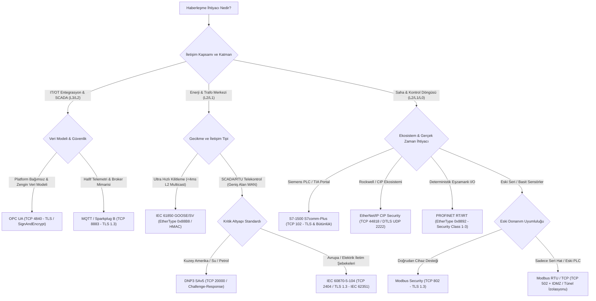

# Endüstriyel Protokol Seçim ve Karşılaştırma Rehberi

Bu kılavuz, Operasyonel Teknoloji (OT) ve Endüstriyel Kontrol Sistemlerinde (ICS) kullanılan temel haberleşme protokollerini teknik, operasyonel ve güvenlik kriterlerine göre karşılaştırır. Amaç; determinizm, latans, kriptografik yetenek ve üretici ekosistemine uygun doğru protokol mimarisini seçmektir.

---

## 1. Protokol Karar Ağacı

Aşağıdaki karar ağacı, proses gereksinimlerine göre en uygun protokolün belirlenmesine rehberlik eder:



---

## 2. Büyük Protokol Karşılaştırma Matrisi

| Protokol | Katman & Taşıma / Port | Kriptografik Yetenek | Gecikme (Latency) & Determinizm | Purdue Seviyesi | Üretici Bağımlılığı |
|---|---|---|---|---|---|
| **Modbus TCP** | L7 (TCP 502) | Yok (Düz Metin) | 10–50 ms (Deterministik değil) | Level 1, 2 | Bağımsız (Açık Standart) |
| **Modbus Security** | L7 (TCP 802 / TLS 1.3) | X.509, TLS Şifreleme & Bütünlük | 15–60 ms (TLS El Sıkışması) | Level 1, 2 | Bağımsız (Açık Standart) |
| **Siemens S7comm** | L7 / ISO-on-TCP (TCP 102) | Yok (Düz Metin) | 5–20 ms | Level 1, 2 | Siemens (S7-300 / 400) |
| **Siemens S7comm-Plus** | L7 / ISO-on-TCP (TCP 102) | Oturum İmzası, Anti-Replay, TLS | 5–25 ms | Level 1, 2 | Siemens (S7-1200 / 1500) |
| **EtherNet/IP (CIP)** | L7 (TCP 44818 / UDP 2222) | Yok (Standart CIP) | 1–10 ms (Implicit I/O) | Level 1, 2 | ODVA (Rockwell ağırlıklı) |
| **CIP Security** | L7 (TLS TCP 44818 / DTLS UDP 2222) | X.509 / PSK, DTLS Bütünlük | 2–15 ms | Level 1, 2 | ODVA (Rockwell GuardLogix vb.) |
| **PROFINET RT / IRT** | L2 (EtherType `0x8892`) | Sınırlı (Security Class 1–3) | < 1 ms (IRT) / 1–10 ms (RT) | Level 0, 1 | PI (Siemens, Phoenix vb.) |
| **OPC Classic (DA/A&E)** | L7 (DCOM / TCP 135 + Dinamik) | Windows RPC NTLM (Eski) | 20–100 ms | Level 2, 3 | Microsoft Windows Bağımlı |
| **OPC UA** | L7 (TCP 4840 / HTTPS / WSS) | X.509, AES-128/256, SHA-256 | 10–50 ms (PubSub ile < 5 ms) | Level 2, 3, 4 | Bağımsız (OPC Foundation) |
| **DNP3 SAv5** | L7 (TCP/UDP 20000 / Seri) | HMAC-SHA256 Challenge-Response | 50–200 ms (WAN Uyumlu) | Level 1, 2 (SCADA) | Bağımsız (IEEE 1815) |
| **IEC 60870-5-104** | L7 (TCP 2404 / TLS 1.3) | IEC 62351-3/5 (TLS & Kimlik) | 20–100 ms (WAN Uyumlu) | Level 1, 2 (Telekontrol) | Bağımsız (IEC Standardı) |
| **IEC 61850 GOOSE/SV** | L2 Multicast (EtherType `0x88B8` / `0x88BA`) | IEC 62351-6 (HMAC Bütünlük) | < 4 ms (Ultra Hızlı Koruma) | Level 1 (Trafo / IED) | Bağımsız (IEC Standardı) |

---

## 3. Hangisini Ne Zaman Seçmeli?

```text
+---------------------------------------------------------------------------------------------------+
| SAHA / DÖNGÜ GEREKSİNİMİ    | TAVSİYE EDİLEN PROTOKOL        | ALTERNATİF / TELAFİ EDİCİ KONTROL |
+-----------------------------+--------------------------------+------------------------------------+
| Ultra Hızlı Koruma (<4ms)   | IEC 61850 GOOSE (L2 Multicast) | Dedicated Fiber / L2 VLAN İzolasyon|
| Senkron Hareket (Motion)    | PROFINET IRT / EtherCAT        | Fiziksel Pano İçi Ayrık Ağ        |
| Standart Saha I/O (1-10ms)  | PROFINET RT / CIP Security     | 802.1Q VLAN + Port Security       |
| PLC-SCADA Telekontrol       | OPC UA / S7comm-Plus / CIP Sec | IEC 62351-3 TLS Tüneli            |
| Coğrafi WAN / Telemetri     | DNP3 SAv5 / IEC 104 + TLS      | IPsec VPN + Hücresel APN          |
| IT/OT Veri Entegrasyonu     | OPC UA (SignAndEncrypt) / MQTT | DMZ Data Diode / Proxy            |
+---------------------------------------------------------------------------------------------------+
```

### 1. Saha I/O ve Çevrimsel Kontrol (Level 1 / Level 0)
- **Tavsiye:** PROFINET RT veya EtherNet/IP CIP Security.
- **Gerekçe:** Düşük gecikme (1–5 ms), deterministik paket sıralaması ve endüstriyel anahtarlarda donanımsal önceliklendirme (IEEE 802.1p CoS).

### 2. PLC - SCADA / HMI Haberleşmesi (Level 2 / Level 1)
- **Tavsiye:** OPC UA (`SignAndEncrypt`), Siemens S7comm-Plus (TIA v17+) veya Rockwell CIP Security.
- **Gerekçe:** Mühendislik ve işletme verilerinin yetkisiz değiştirilmesini (tampering) ve dinlenmesini (eavesdropping) önleyen yerleşik oturum güvenliği.

### 3. Uzak İstasyon / WAN Telekontrol (Level 2 / Level 1 SCADA)
- **Tavsiye:** IEC 60870-5-104 (IEC 62351-3 TLS ile) veya DNP3 SAv5 (IEEE 1815).
- **Gerekçe:** Paket kaybı olan WAN hatlarında zaman damgalı olay kaydı (SOE), bufferlama ve kriptografik komut doğrulama.

### 4. IT/OT ve Bulut Entegrasyonu (Level 3 / Level 4)
- **Tavsiye:** OPC UA Companion Specifications veya TLS 1.3 korumalı MQTT (Sparkplug B).
- **Gerekçe:** Zengin veri modelleme, standartlaştırılmış ad alanları ve kurumsal kimlik/erişim yönetimi entegrasyonu.

---

## 4. Protokol Aileleri: Artılar, Eksiler ve Riskler

### Modbus (TCP 502 / RTU / Modbus Security 802)
- **Artıları:** Neredeyse tüm üreticiler tarafından desteklenir; implementasyonu son derece basittir; kaynak tüketimi düşüktür.
- **Eksileri:** Klasik versiyonunda sıfır kimlik doğrulama ve şifreleme vardır; karmaşık veri tiplerini ve zaman damgalarını yerel olarak desteklemez.
- **Kritik Risk:** Ağdaki herhangi bir istemci sahte `Write Single Register` (FC06) veya `Force Multiple Coils` (FC15) paketi enjekte ederek fiziksel vanaları veya motorları tetikleyebilir.

### Siemens S7 İletişimi (S7comm vs S7comm-Plus)
- **Artıları:** Siemens TIA Portal ve SIMATIC PLC ekosistemiyle %100 entegre; optimize blok erişimi ve DB sembolik okuma desteği.
- **Eksileri:** Klasik S7comm (S7-300/400) düz metindir ve oturum çalmaya açıktır; S7comm-Plus yalnızca yeni nesil (S7-1200/1500) donanımlarda tam güvenlik sağlar.
- **Kritik Risk:** Klasik S7comm üzerinden CPU `STOP` komutu veya yetkisiz DB yazması doğrudan gerçekleştirilebilir.

### EtherNet/IP & CIP Security
- **Artıları:** Rockwell donanımlarıyla kusursuz uyum; TCP üzerinden konfigürasyon (Explicit) ve UDP üzerinden yüksek hızlı deterministik I/O (Implicit) esnekliği.
- **Eksileri:** CIP Security yapılandırması FactoryTalk Policy Manager ve sertifika altyapısı gerektirir; eski cihazlar DTLS yükünü kaldıramayabilir.
- **Kritik Risk:** Standart EtherNet/IP ağında ARP zehirlemesi ile I/O paketleri araya girilerek sahte proses değerleri gösterilebilir.

### OPC Classic vs OPC UA
- **Artıları (OPC UA):** İşletim sisteminden bağımsız; dahili X.509 sertifika yönetimi, rol tabanlı erişim (Part 18) ve zengin nesne yönelimli veri modelleri.
- **Eksileri (OPC Classic):** DCOM bağımlılığı nedeniyle dinamik RPC portları (1024–65535) gerektirir; güvenlik duvarı dostu değildir; sıfır güven mimarisine uyumsuzdur.
- **Kritik Risk:** OPC Classic DCOM zafiyetleri üzerinden sunucu işletim sistemi seviyesinde yetki yükseltme.

### Enerji Protokolleri (DNP3, IEC 104, IEC 61850)
- **Artıları:** Milisaniye altı zaman damgalama (SOE), arıza anında tamponlama ve telekontrol komutlarında onay-yürüt (select-before-operate) desteği.
- **Eksileri:** IEC 62351 kriptografik uzantıları lisans ve CPU gücü gerektirir; GOOSE multicast mesajları yönlendirilemez (L2 VLAN sınırında kalır).
- **Kritik Risk:** IEC 104 veya DNP3 telekontrol hattına yapılan sahte kesici açma (Trip) komutları bölgesel elektrik kesintilerine yol açabilir.

---

## 5. Modüler Dokümantasyon İndeksi

Aşağıdaki bağlantılardan her bir protokol ailesinin derinlemesine güvenlik, konfigürasyon ve istismar önleme kılavuzlarına erişebilirsiniz:

1. [Modbus Güvenliği ve İstismar Önleme](01-modbus-guvenligi-ve-istismar.md)
2. [Siemens S7 İletişimi ve S7comm-Plus](02-siemens-s7-ve-s7comm-plus.md)
3. [EtherNet/IP ve CIP Security](03-ethernet-ip-ve-cip-security.md)
4. [DNP3 ve IEC 60870-5-104 Güvenliği](04-dnp3-ve-iec-60870-5-104.md)
5. [OPC UA ve OPC Classic Güvenliği](05-opc-ua-ve-opc-classic.md)
6. [PROFINET, PROFIBUS ve IEC 61850](06-profinet-profibus-ve-iec-61850.md)
7. [IEC 62351 Endüstriyel Kriptografi ve Güvenlik](07-iec-62351-kriptografi-ve-guvenlik.md)
8. [Trafik Analizi ve Protokol Seçimi](08-trafik-analizi-ve-protokol-secimi.md)
