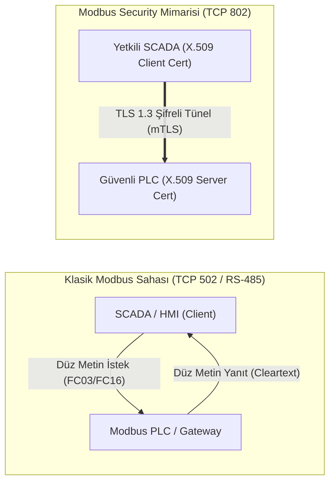

# Modbus Güvenliği ve İstismar Önleme Kılavuzu

Bu kılavuz, endüstriyel otomasyonda en yaygın kullanılan Modbus (TCP, RTU, ASCII ve Modbus Security) protokol ailesinin mimari yapısını, güvenlik zafiyetlerini, saldırı vektörlerini ve sahada uygulanabilir savunma kontrollerini inceler.

---

## 1. Modbus Protokol Mimarisi ve Varyantları

Modbus, istemci (Client / Master) ile sunucu (Server / Slave) arasında istek-yanıt (Request-Response) prensibiyle çalışan uygulama katmanı protokolüdür.



### Varyant Karşılaştırması

| Varyant | Fiziksel / Taşıma Katmanı | Port / Standart | Kimlik Doğrulama | Şifreleme | Hata Denetimi |
|---|---|---|---|---|---|
| **Modbus RTU** | Seri Hat (RS-485 / RS-232) | Portsuz (2-telli / 4-telli) | Yok | Yok | 16-bit CRC |
| **Modbus ASCII** | Seri Hat (RS-485 / RS-232) | Portsuz (ASCII 7-bit) | Yok | Yok | 8-bit LRC |
| **Modbus TCP** | Ethernet (TCP/IP) | TCP 502 | Yok | Yok | TCP Checksum |
| **Modbus Security** | Ethernet (TLS 1.3 / TCP) | TCP 802 | X.509 Karşılıklı (mTLS) | TLS 1.3 (AES-GCM) | Kriptografik MAC |

---

## 2. Kritik Fonksiyon Kodları (Function Codes)

Modbus protokolünde her işlem bir **Function Code (FC)** ile tanımlanır. Güvenlik denetimlerinde okuma ve yazma işlemlerinin kesin olarak ayrıştırılması gerekir:

| FC (Dec / Hex) | Fonksiyon Adı | Veri Tipi | İşlem Niteliği | Güvenlik Riski |
|---|---|---|---|---|
| **01 (`0x01`)** | Read Coils | Discrete Output (Bit) | Okuma | Düşük (Süreç ifşası) |
| **02 (`0x02`)** | Read Discrete Inputs | Discrete Input (Bit) | Okuma | Düşük (Durum ifşası) |
| **03 (`0x03`)** | Read Holding Registers | 16-bit Register | Okuma | Orta (Setpoint/proses parametresi ifşası) |
| **04 (`0x04`)** | Read Input Registers | 16-bit Input Register | Okuma | Düşük (Sensör verisi ifşası) |
| **05 (`0x05`)** | Write Single Coil | Discrete Output (Bit) | **Yazma** | **Kritik (Vana/röle doğrudan açma-kapama)** |
| **06 (`0x06`)** | Write Single Register | 16-bit Register | **Yazma** | **Kritik (Setpoint/alarm eşiği değiştirme)** |
| **15 (`0x0F`)** | Write Multiple Coils | Çoklu Bit | **Yazma** | **Yüksek (Toplu çıkış manipülasyonu)** |
| **16 (`0x10`)** | Write Multiple Registers | Çoklu 16-bit Register | **Yazma** | **Kritik (PID katsayıları, proses reçetesi bozma)** |
| **22 (`0x16`)** | Mask Write Register | 16-bit AND/OR Mask | **Yazma** | **Yüksek (Gizli bit seviyesinde değişiklik)** |
| **23 (`0x17`)** | Read/Write Registers | Çift Yönlü | **Okuma/Yazma**| **Kritik (Okuma kılıfında yazma işlemi)** |
| **43 (`0x2B`)** | Read Device Info (MEI) | ASCII String | Tanılama | Orta (Üretici, model, firmware sürüm keşfi) |

---

## 3. Saldırı Vektörleri ve İstismar Senaryoları

```text
[Saldırgan] --- (1. Sahte FC16 Paketi Enjeksiyonu) ---> [PLC - Hedef Register 40001]
               Setpoint: 100°C -> 999°C (Aşırı Isınma)
[SCADA]     <-- (2. Sahte FC03 Yanıtı Spoofing)  <--- [Saldırgan (Normal gösterir)]
               Gösterge: 95°C (Her şey yolunda simülasyonu)
```

### 1. Yetkisiz Register/Coil Manipülasyonu
- **Mekanizma:** Klasik Modbus TCP'de kimlik doğrulama bulunmadığından, Level 2 veya Level 1 ağına erişen herhangi bir cihaz doğrudan PLC'ye FC05 veya FC16 göndererek fiziksel aktüatörleri tetikleyebilir.
- **Sonuç:** Basınç limitlerinin aşılması, soğutma pompalarının durdurulması veya kimyasal dozajın bozulması.

### 2. Cihaz ve Ağ Keşfi (Scanning & Fingerprinting)
- **Mekanizma:** FC43 (MEI Type 14) sorguları veya 1-247 arası Unit ID taramaları ile ağdaki tüm PLC ve RTU'ların üretici, model ve yazılım sürümleri tespit edilir.

### 3. Seri Ağ Geçidi (Gateway) İstismarı
- **Mekanizma:** Modbus TCP - RTU dönüştürücü ağ geçitleri, TCP paketini seri hatta dönüştürürken güvenlik kontrolü yapmaz. Ağ geçidine gönderilen kötü niyetli paketler arkadaki izole seri hattı tamamen kontrol edebilir.

### 4. Hizmet Kesintisi (DoS - Denial of Service)
- **Mekanizma:** Modbus PLC'ler aynı anda sınırlı sayıda TCP soketini (genellikle 4–8 bağlantı) destekler. Sürekli açık bırakılan veya yarım kalan SYN bağlantıları ile SCADA'nın PLC ile iletişimi tamamen koparılabilir.

---

## 4. Savunma ve Sıkılaştırma Kontrolleri

### 1. Modbus Security (TLS 1.3 / TCP 802) Entegrasyonu
- Desteklenen yeni nesil PLC ve RTU'larda TCP 502 devre dışı bırakılmalı, TCP 802 üzerinden karşılıklı X.509 sertifika doğrulaması (mTLS) zorunlu tutulmalıdır.
- Sadece `TLS_AES_256_GCM_SHA384` veya `TLS_CHACHA20_POLY1305_SHA256` şifreleme paketleri etkinleştirilmelidir.

### 2. Endüstriyel Güvenlik Duvarı ile DPI (Deep Packet Inspection)
Eski Modbus TCP cihazlar için güvenlik duvarlarında (örneğin Fortinet, Palo Alto, Hirschmann Eagle) L7 DPI kuralları uygulanmalıdır:

```text
// Örnek L7 Modbus Firewall Politikası (IDMZ / SCADA -> PLC)
Kural 101:
  Kaynak: SCADA_HMI_IP (192.168.10.50)
  Hedef:  PLC_Boya_IP (192.168.20.10)
  Servis: MODBUS_TCP (Port 502)
  L7 DPI Filtresi:
    - İzin Verilen Fonksiyonlar: FC01, FC02, FC03, FC04 (Yalnızca Okuma)
    - Yasaklanan Fonksiyonlar: FC05, FC06, FC15, FC16, FC22, FC23 (Tüm Yazmalar Bloklu)

Kural 102:
  Kaynak: EWS_Muhendislik_IP (192.168.10.100)
  Hedef:  PLC_Boya_IP (192.168.20.10)
  Servis: MODBUS_TCP (Port 502)
  L7 DPI Filtresi:
    - İzin Verilen Fonksiyonlar: FC01, FC03, FC16 (Belirli Register Aralığı: 40100 - 40150)
    - Zaman Kısıtı: Yalnızca Bakım Penceresinde Aktif
```

### 3. Modbus Saldırı Tespit (Suricata / Snort) İmzaları

Ağ izleme sistemlerinde beklenmeyen yazma işlemlerini yakalamak için aşağıdaki kurallar devreye alınmalıdır:

```text
// İzinli olmayan IP'den Modbus Yazma Komutu (FC05/06/15/16)
alert tcp any any -> 192.168.20.0/24 502 (msg:"OT-ATTACK: Yetkisiz Modbus Yazma Komutu Algilandi"; flow:to_server,established; content:"|00 00|"; offset:2; depth:2; content:"|05|"; offset:7; depth:1; sid:1000021; rev:1;)
alert tcp any any -> 192.168.20.0/24 502 (msg:"OT-ATTACK: Yetkisiz Modbus FC16 Coklu Register Yazma"; flow:to_server,established; content:"|00 00|"; offset:2; depth:2; content:"|10|"; offset:7; depth:1; sid:1000022; rev:1;)
```

### 4. Ağ Geçidi (Gateway) İzolasyonu
- Seri ağ geçitleri doğrudan kurumsal ağa bağlanmamalı; yalnızca Level 2 DMZ içerisinde izole VLAN'a yerleştirilmelidir.
- Ağ geçidi yönetim arayüzü (HTTP/Telnet) kapatılmalı, yalnızca SSHv2 ve HTTPS ile yönetilmelidir.

---

## 5. İlgili Dokümanlar ve Devam Yolu

- [Master Protokol Seçim ve Karşılaştırma Rehberi](00-secim-ve-karsilastirma.md)
- [Siemens S7 İletişimi ve S7comm-Plus](02-siemens-s7-ve-s7comm-plus.md)
- [OPC UA ve OPC Classic Güvenliği](05-opc-ua-ve-opc-classic.md)
- [Trafik Analizi ve Protokol Seçimi](08-trafik-analizi-ve-protokol-secimi.md)
