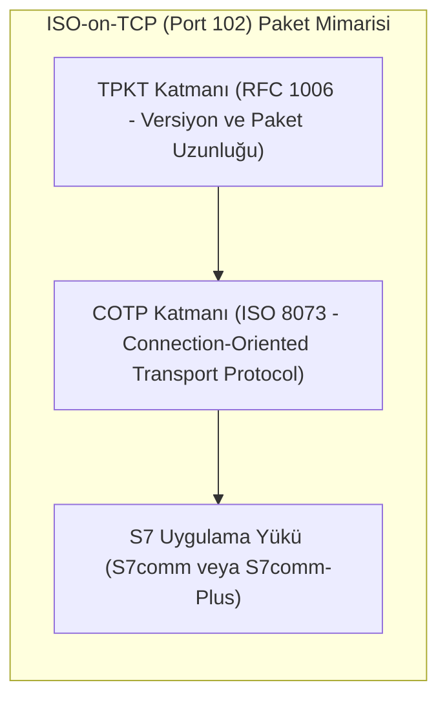
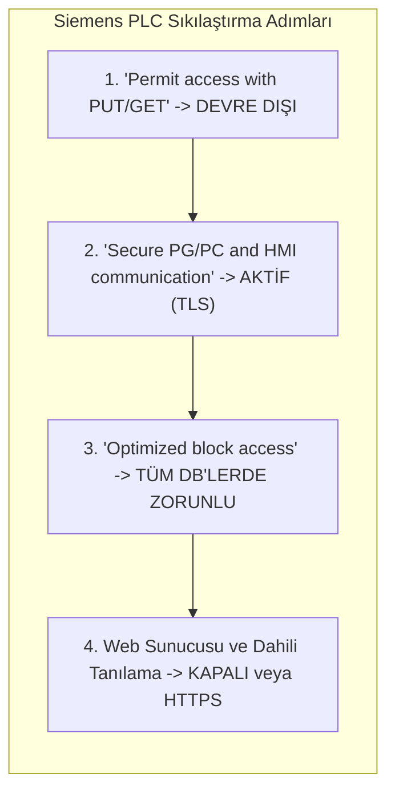

# Siemens S7 İletişimi ve S7comm-Plus Güvenlik Kılavuzu

Bu kılavuz, Siemens SIMATIC PLC ailelerinde (S7-300, S7-400, S7-1200, S7-1500) kullanılan S7 haberleşme protokollerinin mimarisini, klasik S7comm ile S7comm-Plus arasındaki güvenlik farklarını, CPU erişim seviyelerini ve TIA Portal sıkılaştırma adımlarını inceler.

---

## 1. S7 Haberleşme Protokol Mimarisi

Siemens S7 iletişimi, ISO-on-TCP (RFC 1006) standardı üzerinden TCP/IP katmanında **TCP Port 102** üzerinden çalışır.



### Klasik S7comm vs S7comm-Plus

| Özellik | Klasik S7comm (S7-300 / S7-400) | S7comm-Plus (S7-1200 / S7-1500) |
|---|---|---|
| **Kullanılan Port** | TCP 102 | TCP 102 (veya TLS üzerinde TCP 102) |
| **TIA Portal / FW** | STEP 7 v5.x / TIA v11-v16 | TIA Portal v17+ / CPU FW 4.0+ |
| **Paket İçeriği** | Düz Metin (Cleartext) | İmzalı / Şifreli İkili Format |
| **Oturum Güvenliği** | Yok (Herhangi bir uç komut gönderebilir) | Dinamik Oturum Anahtarı & Nonce (Anti-Replay) |
| **Kriptografik Bütünlük**| Yok (Yalnızca CRC) | HMAC-SHA256 ve X.509 Sertifikaları |
| **CPU Durum Değişimi** | Yetkisiz STOP komutu enjekte edilebilir | Yalnızca kimliği doğrulanmış mühendislik oturumu |
| **Hafıza Erişimi** | Doğrudan DB, M, I, Q offset okuma/yazma | Sembolik ve Optimize Blok Koruması |

---

## 2. CPU Erişim Seviyeleri (Access Levels)

TIA Portal üzerinde S7-1200 ve S7-1500 CPU'lar için dört farklı koruma seviyesi yapılandırılabilir:

```text
+-----------------------------------------------------------------------------------+
| ERIŞIM SEVIYESI          | OKUMA (HMI/SCADA) | YAZMA (KONTROL) | YÜKLEME / PROGRAMLAMA |
+-----------------------------------------------------------------------------------+
| 1. Full Access           | Şifresiz          | Şifresiz        | Şifresiz              |
| 2. Read Access           | Şifresiz          | Şifre Gerekir   | Şifre Gerekir         |
| 3. HMI Access            | Yalnızca HMI Tag  | Şifre Gerekir   | Şifre Gerekir         |
| 4. No Access (Complete)  | Şifre Gerekir     | Şifre Gerekir   | Şifre Gerekir         |
+-----------------------------------------------------------------------------------+
```

### Sıkılaştırma Kriteri
- **Üretim Tesisinde:** Tüm PLC'ler en az **HMI Access** veya **No Access** seviyesine alınmalı, şifreler kurumsal PAM sisteminde (Break-Glass) kasalanmalıdır.
- **Güvenlik Parolası:** CPU donanım konfigürasyon parolası en az 16 karakter, karmaşık alfa-nümerik yapıda olmalıdır.

---

## 3. TIA Portal Güvenlik Parametreleri ve Sıkılaştırma



### 1. PUT/GET Haberleşmesinin Kapatılması
- **Risk:** Eski tip `PUT/GET` mekanizması, istemcinin PLC hafızasına herhangi bir kimlik doğrulaması olmaksızın doğrudan erişmesine izin verir.
- **Uygulama:** TIA Portal -> `CPU Özellikleri` -> `Protection & Security` -> `Connection mechanisms` altındaki `Permit access with PUT/GET communication from remote partner` seçeneği **kesinlikle kaldırılmalıdır**.

### 2. Güvenli PG/PC ve HMI İletişimi (Secure Communication)
- **TIA Portal v17+ Özelliği:** Mühendislik istasyonu (PG/PC) ve SCADA/HMI panelleri arasındaki TCP 102 trafiği TLS 1.3 ile şifrelenir.
- **Sertifika Yönetimi:** PLC'ye donanım düzeyinde oluşturulan X.509 cihaz sertifikası yüklenir; mühendislik bilgisayarı da geçerli CA sertifikasını içermelidir.

### 3. Optimize Blok Erişimi (Optimized Block Access)
- Klasik DB'ler mutlak hafıza adresleri (ör. `DB1.DBX0.0`) kullanır ve saldırganların hafıza yapısını tahmin etmesini kolaylaştırır.
- Optimize bloklar sembolik adlandırma ve dahili veri karıştırma (scrambling) kullanarak yetkisiz hafıza enjeksiyonunu engeller.

---

## 4. Tehdit Vektörleri ve Saldırı Senaryoları

```text
[Sahte Mühendislik PC (Rogue PG)] --- (1. ISO-on-TCP Port 102 İstek) ---> [S7-300 / Eski PLC]
                                 --- (2. Düz Metin CPU STOP Komutu) ---> [PLC Durdu / Hat Kesildi]
```

### 1. Sahte CPU Durdurma (Rogue PLC STOP Injection)
- **Zafiyet:** Klasik S7comm kullanan sistemlerde, ağa bağlı bir saldırgan `0x29` (PLC Stop) fonksiyon kodunu içeren bir TCP 102 paketi göndererek tesisi anında durdurabilir.
- **Savunma:** CPU Access Level'ı "Complete Protection"a almak ve S7comm-Plus TLS oturumunu zorunlu kılmak.

### 2. Hafıza Bloğu Manipülasyonu (DB Memory Injection)
- **Zafiyet:** Klasik S7comm ile `0x05` (Write Var) fonksiyonu kullanılarak güvenlik limitleri ve acil durdurma eşikleri uzaktan değiştirilebilir.
- **Savunma:** PUT/GET kapatılması, Optimize DB kullanımı ve L7 DPI firewall denetimi.

### 3. Replay (Yeniden Oynatma) Saldırıları
- **Zafiyet:** Klasik iletimde yakalanan paketler tekrar yollandığında PLC tarafından geçerli kabul edilir.
- **Savunma:** S7comm-Plus dinamik nonce/token mekanizması ile yakalanan paketlerin tekrar kullanılmasını engeller.

---

## 5. Güvenlik Duvarı ve IDS İzleme Kuralları

### Endüstriyel Firewall Kuralı
- Level 2 SCADA dışındaki hiçbir ofis veya kurumsal IP'den PLC'lerin TCP 102 portuna erişim verilmemelidir.
- Mühendislik erişimi (EWS) yalnızca onaylı zaman pencerelerinde ve çift faktörlü PAM atlama sunucusu (Jump Server) üzerinden açılmalıdır.

### Suricata S7 Saldırı Tespit Kuralı

```text
// Yetkisiz IP'den S7 PLC STOP Komutu Algılama
alert tcp !$SCADA_IPS any -> $PLC_IPS 102 (msg:"OT-ATTACK: Yetkisiz S7comm PLC STOP Komutu Algilandi"; flow:to_server,established; content:"|03 00|"; depth:2; content:"|32|"; distance:2; within:1; content:"|29|"; distance:6; within:1; sid:1000031; rev:1;)

// Yetkisiz IP'den S7comm Hafıza Yazma Komutu (Write Var)
alert tcp !$SCADA_IPS any -> $PLC_IPS 102 (msg:"OT-ATTACK: Yetkisiz S7comm DB Yazma Girisimi"; flow:to_server,established; content:"|03 00|"; depth:2; content:"|32|"; distance:2; within:1; content:"|05|"; distance:6; within:1; sid:1000032; rev:1;)
```

---

## 6. İlgili Dokümanlar ve Devam Yolu

- [Master Protokol Seçim ve Karşılaştırma Rehberi](00-secim-ve-karsilastirma.md)
- [Modbus Güvenliği ve İstismar Önleme](01-modbus-guvenligi-ve-istismar.md)
- [EtherNet/IP ve CIP Security](03-ethernet-ip-ve-cip-security.md)
- [Siemens SIMATIC UMC ve Merkezi Kimlik](../08-mimari-ve-erisim/rbac/03-siemens-simatic-umc.md)
