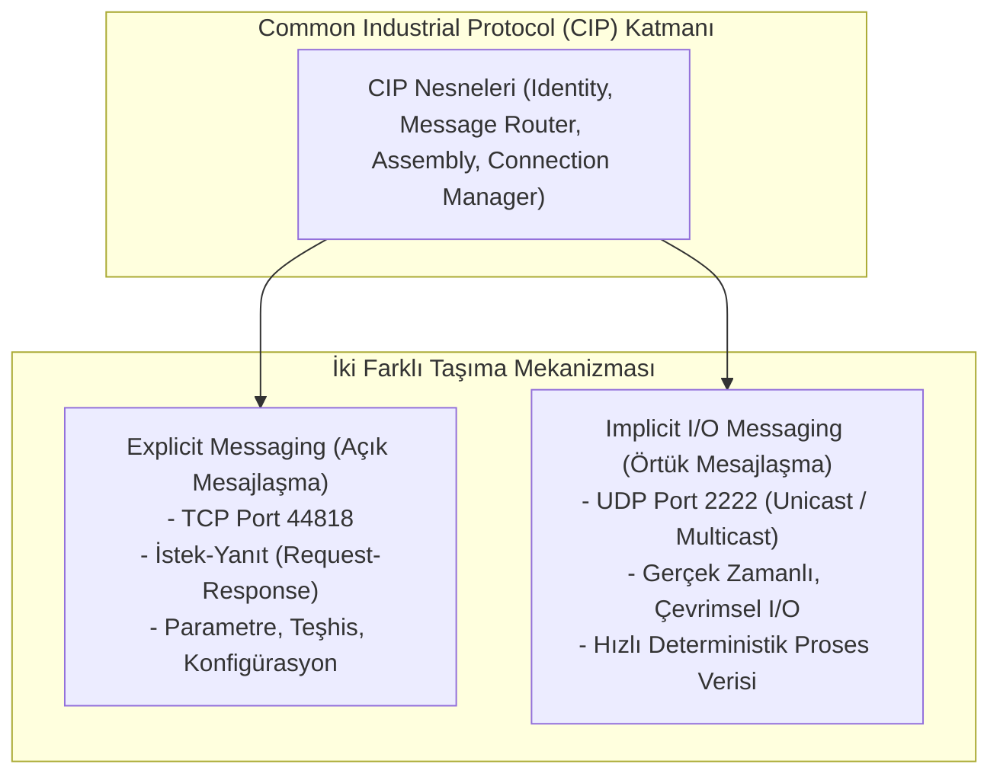
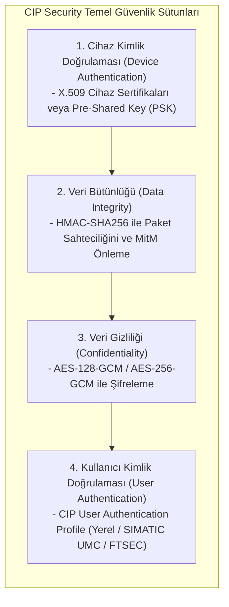

# EtherNet/IP ve CIP Security Kılavuzu

Bu kılavuz, ODVA tarafından standartlaştırılan EtherNet/IP (Ethernet Industrial Protocol) protokol ailesinin mimarisini, Explicit ve Implicit mesajlaşma farklarını, CIP Security (TLS/DTLS) standartlarını, Rockwell ekosistemi entegrasyonunu ve ağ seviyesinde savunma mekanizmalarını inceler.

---

## 1. EtherNet/IP ve CIP Protokol Mimarisi

EtherNet/IP, Common Industrial Protocol (CIP) uygulama katmanını standart Ethernet (IEEE 802.3) ve TCP/IP üzerinde çalıştıran endüstriyel haberleşme protokolüdür.



### Explicit ve Implicit Mesaj Karşılaştırması

| Özellik | Explicit Messaging (Açık) | Implicit Messaging (Örtük / I/O) |
|---|---|---|
| **Taşıma Katmanı** | TCP (Bağlantı Tabanlı) | UDP (Düşük Ek Yük / Hızlı) |
| **Port Numarası** | **TCP 44818** | **UDP 2222** |
| **İletişim Tipi** | Noktadan Noktaya (Point-to-Point) | Unicast veya Multicast |
| **Kullanım Amacı** | Program yükleme, parametre ayarı, alarm | Sensör/aktüatör döngüsel veri transferi |
| **Gecikme Toleransı**| 20–100 ms (Kritik değil) | 1–10 ms (Gerçek Zamanlı) |
| **Güvenlik Standardı**| Standart TLS (TCP 44818) | DTLS (Datagram TLS - UDP 2222) |

---

## 2. CIP Security Standartları ve Kriptografik Yetenekler

Klasik EtherNet/IP trafiğinde hiçbir kimlik doğrulama ve şifreleme bulunmaz. **CIP Security**, ODVA tarafından tanımlanan ve aşağıdaki güvenlik hedeflerini sağlayan uzantıdır:



### CIP Security Çalışma Modları

| Mod | Davranış | Kullanım Senaryosu | Güvenlik Riski |
|---|---|---|---|
| **Strict (Katı)** | Yalnızca CIP Security destekleyen cihazlarla haberleşir; klasik EtherNet/IP paketlerini reddeder | Yüksek güvenlikli yeni tesisler | Eski cihazlar haberleşemez |
| **Permissive (İzin Veren)**| CIP Security destekleyenlerle şifreli, desteklemeyen eski cihazlarla düz metin konuşur | Kademeli geçiş dönemleri | Saldırgan downgrade saldırısı yapabilir |
| **Disabled (Kapalı)** | Tüm şifreleme ve bütünlük kontrolleri kapalıdır | Eski klasik sistemler | Tamamen savunmasız |

---

## 3. Rockwell Automation ve Saha Entegrasyonu

Rockwell Automation ortamlarında (ControlLogix 5580, CompactLogix 5380, GuardLogix ve 1756-EN4TR iletişim modülleri) CIP Security yapılandırması:

```text
[FactoryTalk Policy Manager] --- (1. Güvenlik Politikası & Sertifika Dağıtımı) ---> [CIP Security Zone]
                                                                                       |-- 1756-EN4TR (Proxy)
                                                                                       |-- GuardLogix Safety PLC
                                                                                       |-- Kinetix 5700 Servo Sürücü
```

### 1. FactoryTalk Policy Manager (FTPM)
- Tesis genelindeki CIP Security bölgelerini (Security Zones) ve geçitlerini (Conduits) tanımlar.
- X.509 cihaz sertifikalarını veya güvenli PSK (Pre-Shared Key) anahtarlarını denetleyicilere otomatik olarak dağıtır.

### 2. CIP Security Proxy Cihazları
- CIP Security desteklemeyen eski sürücü ve I/O blokları için araya donanımsal **CIP Security Proxy** (örneğin 1756-EN4TR veya endüstriyel güvenlik ağ geçidi) yerleştirilir. Proxy, L2 I/O ağındaki düz metin trafiği üst hatta DTLS tüneline alır.

---

## 4. Tehdit Vektörleri ve İstismar Senaryoları

```text
[Saldırgan] --- (1. ARP Zehirleme / MitM) ---> [HMI / SCADA <---> ControlLogix PLC]
           --- (2. Sahte UDP 2222 I/O Paketi) --> [PLC Giriş Verisi Bozuldu]
           --- (3. TCP 44818 CIP Servis İstismarı) --> [Yetkisiz Firmware / Kod Yükleme]
```

### 1. Implicit I/O Paket Sahteciliği (I/O Spoofing)
- **Zafiyet:** Klasik UDP 2222 multicast trafiğinde imza doğrulaması yoktur. Ağa bağlı bir saldırgan sahte I/O paketleri enjekte ederek acil stop butonunun durumunu sürekli "basılı değil" olarak gösterebilir.
- **Savunma:** DTLS tabanlı CIP Security zorunlu kılınmalı veya IGMP Snooping + Port Security uygulanmalıdır.

### 2. Assembly ve Identity Nesnesi Manipülasyonu
- **Zafiyet:** TCP 44818 üzerinden `Set Attribute Single` komutuyla PLC konfigürasyon değişkenleri veya I/O haritaları ezilebilir.
- **Savunma:** Güvenlik duvarlarında CIP L7 filtreleme ile `Service 0x10` (Set Attribute Single) komutları kısıtlanmalıdır.

---

## 5. Ağ Güvenliği ve DPI Sıkılaştırma Kuralları

### 1. VLAN İzolasyonu ve IGMP Snooping
- Implicit UDP 2222 trafiği multicast olarak yayıldığında tüm anahtarları doyurabilir (flooding). Endüstriyel switchlerde **IGMP Snooping** zorunlu olarak açılmalıdır.
- EtherNet/IP trafiği kesinlikle Level 1 I/O VLAN'ı içerisinde izole edilmeli; kurumsal ağa geçirilmemelidir.

### 2. Suricata EtherNet/IP Saldırı Tespit İmzaları

```text
// Yetkisiz İstemciden CIP Forward Open Bağlantı İsteği Algılama
alert tcp !$SCADA_IPS any -> $PLC_IPS 44818 (msg:"OT-ATTACK: Yetkisiz EtherNet/IP CIP Forward Open Istegi"; flow:to_server,established; content:"|6f 00|"; offset:0; depth:2; sid:1000041; rev:1;)

// Yetkisiz CIP Program/Firmware İndirme Servisi (Service 0x4B / 0x4C)
alert tcp any any -> $PLC_IPS 44818 (msg:"OT-ATTACK: Supheli CIP Program Indirme Komutu"; flow:to_server,established; content:"|4b|"; distance:20; within:5; sid:1000042; rev:1;)
```

---

## 6. İlgili Dokümanlar ve Devam Yolu

- [Master Protokol Seçim ve Karşılaştırma Rehberi](00-secim-ve-karsilastirma.md)
- [Siemens S7 İletişimi ve S7comm-Plus](02-siemens-s7-ve-s7comm-plus.md)
- [PROFINET, PROFIBUS ve IEC 61850](06-profinet-profibus-ve-iec-61850.md)
- [Çoklu Üretici ve OPC UA Part 18](../08-mimari-ve-erisim/rbac/04-coklu-uretici-ve-opc-ua.md)
