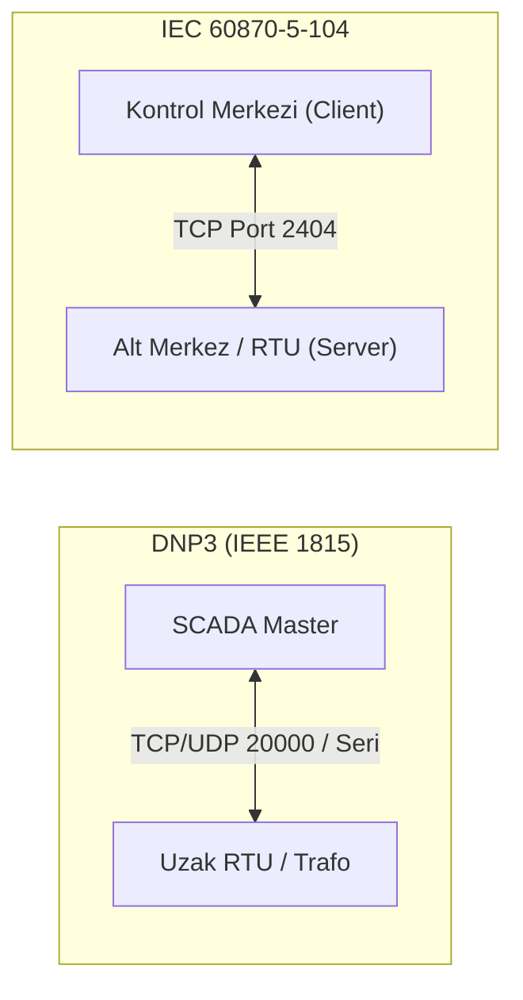
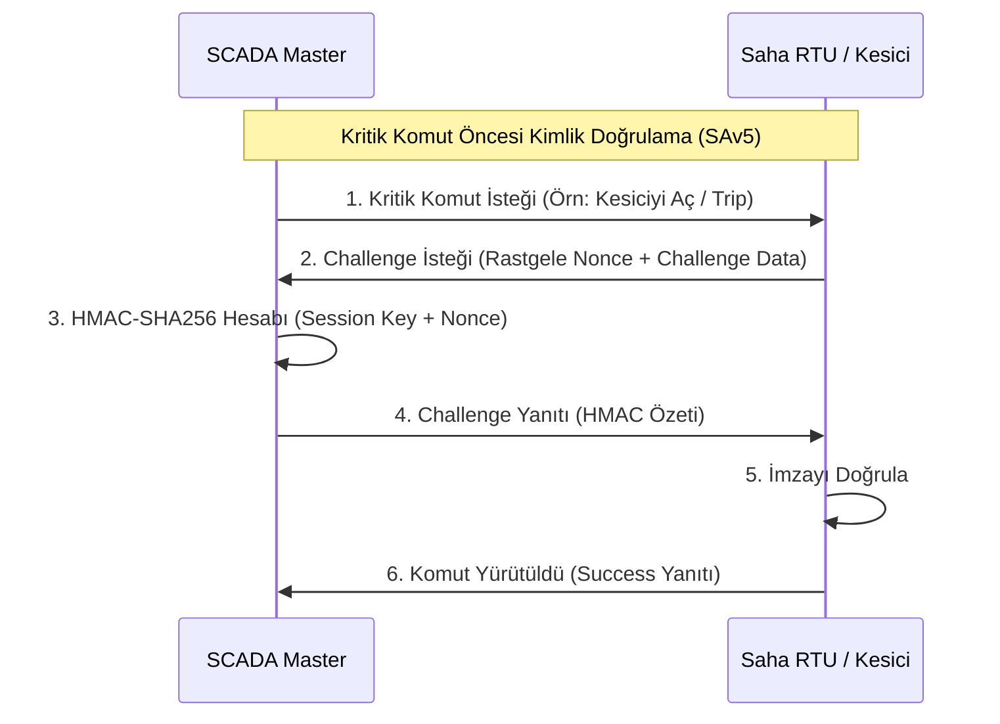

# DNP3 ve IEC 60870-5-104 Güvenlik Kılavuzu

Bu kılavuz, elektrik iletim/dağıtım, su şebekeleri ve petrol/doğal gaz boru hatlarında kullanılan telekontrol protokolleri DNP3 (IEEE 1815) ve IEC 60870-5-104 (IEC 104) standartlarının mimarisini, güvenlik mekanizmalarını (SAv5 ve IEC 62351) ve telekontrol savunma stratejilerini inceler.

---

## 1. Protokol Mimarisi ve Telekontrol Özellikleri

DNP3 ve IEC 104, uzak sahadaki RTU'lar (Remote Terminal Unit) ile merkezi SCADA kontrol merkezleri arasında geniş alan ağları (WAN) üzerinden güvenilir veri alışverişi sağlar.



### Karşılaştırmalı Telekontrol Özellikleri

| Özellik | DNP3 (IEEE 1815) | IEC 60870-5-104 |
|---|---|---|
| **Yaygın Coğrafya** | Kuzey Amerika, Asya, Su & Petrol Sektörü | Avrupa, Türkiye (TEİAŞ/TEDAŞ), Enerji Şebekeleri |
| **Taşıma / Port** | TCP/UDP 20000 veya Seri (RS-232/485) | TCP 2404 (veya IEC 62351 TLS) |
| **Mesaj Yapısı** | Nesne/Varyasyon Tabanlı (Object/Var) | ASDU (Application Service Data Unit) |
| **Olay Sırası (SOE)** | Milisaniye hassasiyetinde zaman damgalama | 24-bit / 56-bit CP56Time2a zaman damgaları |
| **Komut Güvenliği** | Select-Before-Operate (SBO) desteği | Select and Execute (Seç-ve-Yürüt) |
| **Güvenlik Standardı**| **DNP3 SAv5** (IEC 62351-5) | **IEC 62351-3 (TLS)** ve **IEC 62351-5** |

---

## 2. DNP3 Güvenli Kimlik Doğrulama (SAv5)

DNP3 Secure Authentication version 5 (SAv5), şifreleme ek yükü (overhead) getirmeden uygulama katmanında **Challenge-Response** kimlik doğrulaması sağlar:



### SAv5 Güvenlik Mekanizması
1. **Oturum Anahtarları (Session Keys):** Master ve Outstation arasında simetrik anahtarlar (HMAC-SHA256) kullanılır.
2. **Kritik İşlemler (Critical Functions):** `Direct Operate`, `Select/Operate`, `Cold Restart` gibi fiziksel şebekeyi etkileyen tüm komutlar zorunlu Challenge sürecinden geçer.
3. **Agresif Mod (Aggressive Mode):** Gecikmeyi azaltmak için Master ilk istek paketine doğrudan HMAC imzasını ekleyebilir (tek turda doğrulama).

---

## 3. IEC 60870-5-104 Güvenliği ve IEC 62351

IEC 104 paketleri **APDU (Application Protocol Data Unit)** yapısında taşınır. APDU, kontrol başlığı (**APCI**) ve veri yükünden (**ASDU**) oluşur.

```text
+--------------------------------------------------------------------------------+
| IEC 104 APDU YAPISI                                                            |
+------------------------------------+-------------------------------------------+
| APCI (4 Byte Kontrol Başlığı)      | ASDU (Uygulama Veri Yükü)                 |
| - STARTDT / STOPDT (Oturum Başlat) | - Type ID (45: Tek Komut, 46: Çift Komut)  |
| - TESTFR (Hat Canlılık Testi)      | - Common Address of ASDU (İstasyon Adresi)|
| - I-Frame (Sıra Numaralı Veri)     | - Information Object Address - IOA        |
+------------------------------------+-------------------------------------------+
```

### IEC 62351 Uygulaması
- **IEC 62351-3 (Taşıma Güvenliği):** TCP 2404 oturumu TLS 1.3 tüneli ile şifrelenir ve karşılıklı X.509 sertifika doğrulaması yapılır.
- **IEC 62351-5 (Uygulama Güvenliği):** ASDU seviyesinde kriptografik imza (MAC) eklenerek TLS sonlandırılsa dahi komutun kaynağı doğrulanır.

---

## 4. Tehdit Vektörleri ve Telekontrol İstismarı

```text
[Saldırgan] --- (1. Sahte IEC 104 Type 46 Çift Komut) ---> [Trafo Merkezi RTU]
               Hedef IOA: 5001 (Ana İletim Kesicisi)
               Komut: AÇ (TRIP) -> Şebeke Kesintisi (Blackout)
```

### 1. Yetkisiz Kesici Açma/Kapama Komutu Enjeksiyonu
- **Zafiyet:** Şifrelenmemiş IEC 104 veya klasik DNP3 hatlarında saldırgan araya girerek doğrudan Type 45/46 (Single/Double Command) veya DNP3 Function Code 05 (Direct Operate) paketi gönderebilir.
- **Sonuç:** Enerji iletim hatlarının devre dışı kalması, transformatörlerin aşırı yüklenmesi.

### 2. SOE (Zaman Damgası) Manipülasyonu ve İnceleme Yanıltma
- **Zafiyet:** Saldırgan sahte zaman senkronizasyon paketleri (`C_CS_NA_1` Type 103) enjekte ederek SCADA olay kayıtlarını (SOE) manipüle eder ve saldırı izlerini gizler.

### 3. APCI Bağlantı Koparma (DoS)
- **Zafiyet:** Sahte `STOPDT act` (Stop Data Transfer) paketleri enjekte edilerek RTU ile kontrol merkezi arasındaki telemetri akışı anında kesilebilir.

---

## 5. Savunma ve L7 DPI Sıkılaştırma Kontrolleri

### 1. IEC 104 L7 Güvenlik Duvarı Filtrelemesi

```text
// Örnek L7 Telekontrol Firewall Politikası (SCADA -> Substation RTU)
Kural 201:
  Kaynak: SCADA_Master_IP (10.100.1.10)
  Hedef:  RTU_TrafoA_IP (10.200.5.20)
  Servis: IEC-104 (Port 2404 / TLS)
  L7 DPI Filtresi:
    - İzinli ASDU Tipleri: Type 1-36 (Ölçüm ve Telemetri Okuma)
    - İzinli Komut Tipleri: Yalnızca Type 45 (Tek Komut) ve Tanımlı IOA Adresleri (1001-1010)
    - Yasaklanan Tipleri: Type 100 (General Interrogation dışındaki tüm konfigürasyon komutları)
```

### 2. Suricata Telekontrol Tespit İmzaları

```text
// Yetkisiz IEC 104 Komut Yürütme (Type 45 / 46 ASDU)
alert tcp !$SCADA_IPS any -> $RTU_IPS 2404 (msg:"OT-ATTACK: Yetkisiz IEC 104 Telekontrol Komutu (ASDU Type 45/46)"; flow:to_server,established; content:"|68|"; depth:1; content:"|2d|"; distance:5; within:1; sid:1000051; rev:1;)

// Yetkisiz DNP3 Cold Restart Komutu Algılama
alert tcp !$SCADA_IPS any -> $RTU_IPS 20000 (msg:"OT-ATTACK: Yetkisiz DNP3 Cold Restart Komutu"; flow:to_server,established; content:"|05 64|"; offset:0; depth:2; content:"|0d|"; distance:8; within:1; sid:1000052; rev:1;)
```

---

## 6. İlgili Dokümanlar ve Devam Yolu

- [Master Protokol Seçim ve Karşılaştırma Rehberi](00-secim-ve-karsilastirma.md)
- [PROFINET, PROFIBUS ve IEC 61850](06-profinet-profibus-ve-iec-61850.md)
- [IEC 62351 Endüstriyel Kriptografi ve Güvenlik](07-iec-62351-kriptografi-ve-guvenlik.md)
- [Trafik Analizi ve Protokol Seçimi](08-trafik-analizi-ve-protokol-secimi.md)
