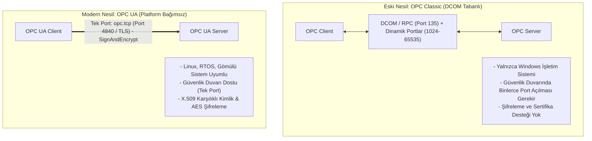
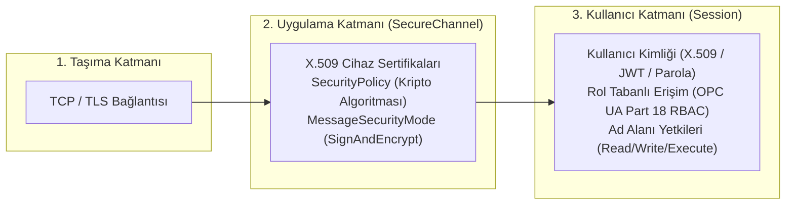
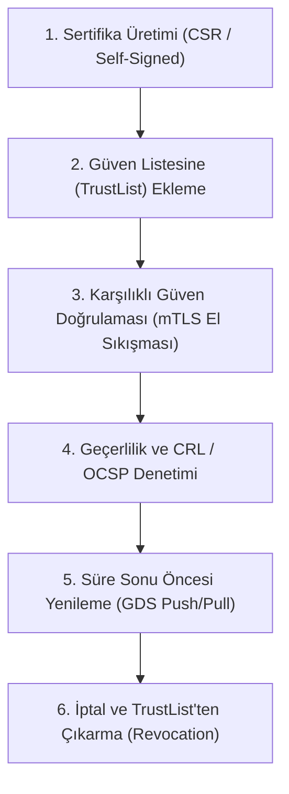

# OPC UA ve OPC Classic Güvenlik Kılavuzu

Bu kılavuz, endüstriyel veri entegrasyonunun standardı olan OPC Unified Architecture (OPC UA - IEC 62541) ile eski nesil OPC Classic (DA, HDA, A&E) mimarilerini karşılaştırır. OPC UA güvenlik politikalarını, X.509 sertifika yaşam döngüsünü, Global Discovery Server (GDS) yönetimini ve OPC Classic'ten modern mimariye güvenli geçiş stratejilerini inceler.

---

## 1. OPC Classic vs OPC UA Mimari Karşılaştırması



### Karşılaştırma Matrisi

| Özellik | OPC Classic (DA / HDA / A&E) | OPC UA (IEC 62541) |
|---|---|---|
| **Altyapı Temeli** | Microsoft COM / DCOM | Platform Bağımsız (TCP, HTTPS, WebSockets) |
| **Port Gereksinimi**| TCP 135 + Dinamik Port Havuzu (1024–65535) | Standart **TCP 4840** (`opc.tcp://`) |
| **Güvenlik Modeli** | Windows Kullanıcı & DCOM İzinleri | SecureChannel + X.509 Sertifikaları + Oturum RBAC |
| **Veri Yapısı** | Düz Etiket (Tag) Listesi | Nesne Yönelimli Zengin Bilgi Modeli (Information Model) |
| **IDMZ Uyumluluğu** | Çok Zor (DCOM güvenlik duvarı geçemez) | Tam Uyumlu (Tek TCP portu üzerinden proxy/tünel) |

---

## 2. OPC UA Güvenlik Mimarisi (Part 2, 4, 6)

OPC UA mimarisinde güvenlik üç bağımsız katmanda ele alınır:



### Güvenlik Politikaları (Security Policies)

| Güvenlik Politikası | Asimetrik İmza / Şifreleme | Simetrik Şifreleme | Özet (Hash) | Durum |
|---|---|---|---|---|
| `None` | Yok | Yok | Yok | **Kritik Risk (Üretimde Yasak)** |
| `Basic128Rsa15` | RSA-1024 / SHA-1 | AES-128-CBC | SHA-1 | **Kullanımdan Kaldırıldı (Güvensiz)** |
| `Basic256` | RSA-1024/2048 | AES-256-CBC | SHA-1 | **Eski (Tavsiye Edilmez)** |
| `Basic256Sha256` | RSA-2048 (RSA-OAEP) | AES-256-CBC | SHA-256 | **Standart (Tavsiye Edilir)** |
| `Aes128_Sha256_RsaOaep` | RSA-2048/3072 | AES-128-CBC | SHA-256 | **Standart (Hafif Cihazlar İçin)** |
| `Aes256_Sha256_RsaPss` | RSA-3072/4096 (RSA-PSS) | AES-256-CBC | SHA-256 | **En Yüksek Güvenlik Seviyesi** |

### Mesaj Güvenlik Modları (MessageSecurityMode)
1. **`None`:** Sıfır koruma; paketler düz metin iletilir.
2. **`Sign`:** Paketler X.509 sertifikasıyla imzalanır. Veri bütünlüğü ve orijinallik sağlanır, ancak veriler şifrelenmez.
3. **`SignAndEncrypt`:** Paketler hem imzalanır hem de AES ile şifrelenir. **Üretim ortamları için zorunlu moddur.**

---

## 3. Sertifika ve Güven Yaşam Döngüsü



### Dağıtım Modelleri

| Model | Çalışma Prensibi | Artıları | Eksileri / Sınırları |
|---|---|---|---|
| **Self-Signed (Yerel)** | Her sunucu/istemci kendi sertifikasını üretir; manuel onaylanır | Hızlı ve ek sunucu gerektirmez | Cihaz sayısı arttıkça yönetilemez hale gelir |
| **Kurumsal CA İmzalı** | Kurumsal OT PKI altyapısı üzerinden sertifika dağıtılır | Güven zinciri merkezi ve standarttır | Manuel TrustList güncellemesi gerektirir |
| **Global Discovery Server (GDS)** | OPC UA GDS üzerinden Push/Pull modeliyle otomatik sertifika yönetimi | Tam otomatik yenileme, CRL yönetimi ve denetim | GDS altyapısı ve lisans maliyeti |

---

## 4. Kullanıcı Yetkilendirme ve Rol Tabanlı Erişim (Part 18 RBAC)

OPC UA sunucusunda anonim kullanıcı (`Anonymous`) girişi tamamen kapatılmalı ve rol tabanlı yetkilendirme uygulanmalıdır:

```text
+-----------------------------------------------------------------------------------+
| KULLANICI ROLÜ    | VERİ OKUMA (Read) | VERİ YAZMA (Write) | METOT ÇAĞIRMA (Execute)|
+-----------------------------------------------------------------------------------+
| Anonymous         | KAPALI (Reddedildi)| KAPALI             | KAPALI                |
| Observer (İzleyici)| İZİNLİ           | KAPALI             | KAPALI                |
| Operator (Operatör)| İZİNLİ           | İZİNLİ (Süreç Değ.)| KAPALI                |
| Engineer (Mühendis)| İZİNLİ           | İZİNLİ             | İZİNLİ (Kalibrasyon)  |
| Administrator     | İZİNLİ           | İZİNLİ             | İZİNLİ (Blok Yükleme) |
+-----------------------------------------------------------------------------------+
```

---

## 5. OPC Classic'ten OPC UA'ya Geçiş Planı

Eski DCOM tabanlı OPC Classic sunucuları olan tesislerde doğrudan modernizasyon mümkün değilse **OPC UA Wrapper / Proxy** kullanılır:

```text
[Eski OPC Classic Server (Level 1)]
        | (Yerel Loopback DCOM - Ağ Dışına Çıkmaz)
[OPC UA Wrapper / Gateway]
        | (TCP 44818 / SignAndEncrypt Güvenli Bağlantı)
[Kurumsal SCADA / IT Entegrasyonu (Level 2/3)]
```

### Geçiş Kontrol Listesi
- [ ] DCOM trafiğinin güvenlik duvarlarından geçmesi durdurulmalı; DCOM yalnızca aynı makinede `localhost` üzerinde sonlandırılmalıdır.
- [ ] Wrapper veya Gateway üzerinden dışarıya yalnızca `Basic256Sha256` ve `SignAndEncrypt` profili açılmalıdır.
- [ ] Tüm istemcilerin X.509 uygulama sertifikaları doğrulanmalı, bilinmeyen sertifikaların otomatik kabul edilmesi engellenmelidir.

---

## 6. İlgili Dokümanlar ve Devam Yolu

- [Master Protokol Seçim ve Karşılaştırma Rehberi](00-secim-ve-karsilastirma.md)
- [Modbus Güvenliği ve İstismar Önleme](01-modbus-guvenligi-ve-istismar.md)
- [Siemens S7 İletişimi ve S7comm-Plus](02-siemens-s7-ve-s7comm-plus.md)
- [Çoklu Üretici ve OPC UA Part 18](../08-mimari-ve-erisim/rbac/04-coklu-uretici-ve-opc-ua.md)
