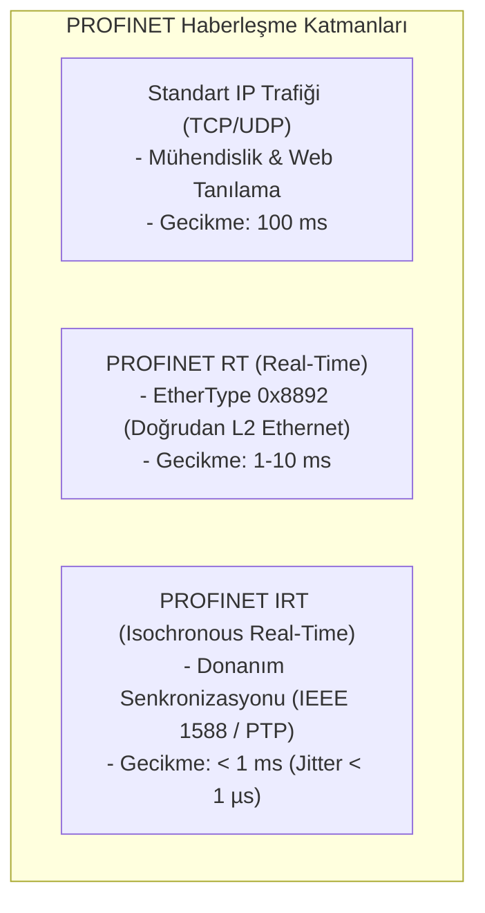
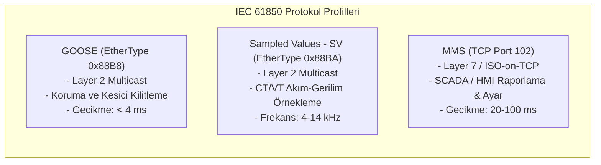
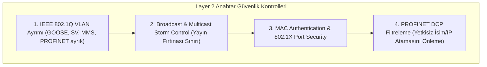

# PROFINET, PROFIBUS ve IEC 61850 Güvenlik Kılavuzu

Bu kılavuz; fabrika otomasyonunda gerçek zamanlı kontrol sağlayan PROFINET (RT/IRT) ve PROFIBUS (DP/PA) ile enerji iletim trafo merkezlerinde kullanılan IEC 61850 (GOOSE, SV, MMS) standartlarının Layer 2 / Layer 7 mimarisini, güvenlik sınıflarını ve mikro-segmentasyon savunma mekanizmalarını inceler.

---

## 1. PROFINET ve PROFIBUS Protokol Mimarisi

PROFINET, standart Ethernet (IEEE 802.3) üzerinde çalışan; fabrika otomasyonu, robotik ve hareket kontrolünde (motion control) kullanılan deterministik protokoldür.



### PROFINET Güvenlik Sınıfları (Security Classes)

PROFIBUS & PROFINET International (PI) tarafından tanımlanan güvenlik sınıfları:

| Güvenlik Sınıfı | Tanım ve Odak | Uygulanan Mekanizma | Koruma Kapsamı |
|---|---|---|---|
| **Class 1** | Sağlamlaştırma (Robustness) | Ağ fırtınası koruması, SNMPv3, DCP filtreleme | DoS ve yetkisiz taramaları engelleme |
| **Class 2** | Bütünlük ve Orijinallik | Kriptografik imzalama (HMAC) ve cihaz kimliği | MitM ve paket sahteciliğini önleme |
| **Class 3** | Tam Gizlilik (Confidentiality)| Uçtan uca şifreleme (AES-GCM) | Ağ dinlemeyi (sniffing) engelleme |

---

## 2. IEC 61850 Trafo Merkezi Protokol Mimarisi

IEC 61850, modern elektrik trafo merkezlerinde (Substation) akıllı elektronik cihazlar (IED) arasındaki haberleşmeyi standartlaştırır:



### Karşılaştırma Matrisi

| Protokol | Katman / Taşıma | EtherType / Port | Gecikme Gereksinimi | Kriptografik Koruma |
|---|---|---|---|---|
| **PROFINET RT** | Layer 2 Ethernet | `0x8892` | 1–10 ms | Class 2 HMAC Bütünlük |
| **PROFINET IRT** | Layer 2 Senkronize | `0x8892` | < 1 ms | Fiziksel İzolasyon & Class 2 |
| **IEC 61850 GOOSE** | Layer 2 Multicast | `0x88B8` | **< 4 ms** | **IEC 62351-6 (HMAC-SHA256)** |
| **IEC 61850 SV** | Layer 2 Multicast | `0x88BA` | **< 2 ms** | **IEC 62351-6 (HMAC-SHA256)** |
| **IEC 61850 MMS** | Layer 7 TCP/IP | TCP 102 | 20–100 ms | **IEC 62351-3 (TLS 1.3)** |

---

## 3. Layer 2 Ağ Güvenliği ve Mikro-Segmentasyon

GOOSE, SV ve PROFINET RT doğrudan Layer 2 Ethernet çerçeveleri kullandığından standart L3/L4 güvenlik duvarlarından geçirilemez. Güvenlik Layer 2 anahtarlama seviyesinde sağlanmalıdır:



### 1. VLAN Segmentasyonu
- **I/O & GOOSE VLAN:** Yalnızca IED'lerin ve denetleyicilerin bağlı olduğu portlara izole edilmeli; hiçbir ofis veya genel erişim portuna trunk edilmemelidir.
- **Multicast Filtreleme:** Endüstriyel anahtarlarda GMRP (GARP Multicast Registration Protocol) veya statık MAC multicast filtreleme ile paketlerin gereksiz portlara yayılması engellenmelidir.

### 2. PROFINET DCP (Discovery and Configuration Protocol) Güvenliği
- **Zafiyet:** PROFINET DCP, ağdaki cihazların adlarını ve IP adreslerini uzaktan değiştirebilir (`DCP Set`). Saldırgan ağa sahte `DCP Set` göndererek PLC'nin IP'sini ezebilir.
- **Savunma:** Anahtarlarda PROFINET DCP paketleri (EtherType `0x8892`, Frame ID `0xFEFD`/`0xFEFC`) yalnızca yetkili mühendislik portlarına izin verilmelidir.

---

## 4. Tehdit Vektörleri ve İstismar Senaryoları

```text
[Saldırgan (Saha Switch'e Takıldı)]
       |--- (1. Sahte GOOSE Kesici Açma Mesajı Enjeksiyonu) ---> [Trafo IED Kesicisi]
       |    sqNum: 100, stNum: 15, State: TRUE
       v
[Trafo Koruma Rölesi Tetiklendi -> Hat Açıldı -> Enerji Kesintisi]
```

### 1. Sahte GOOSE Mesajı Enjeksiyonu
- **Zafiyet:** Klasik GOOSE mesajlarında kimlik doğrulama yoktur. Saldırgan yüksek sıra numaralı (`sqNum` ve `stNum`) sahte bir GOOSE paketi göndererek trafo kesicisini açtırabilir.
- **Savunma:** IEC 62351-6 HMAC imzalama etkinleştirilmeli ve switch seviyesinde MAC Port Security uygulanmalıdır.

### 2. PROFINET DoS ve Çevrim Zamanı Aşımı
- **Zafiyet:** PROFINET RT cihazları watchdog zamanlayıcısı (Watchdog Timer - örn. 3 çevrim kaçırma) ile çalışır. Ağa gönderilen yüksek miktarda yayın trafiği kontrol döngüsünü düşürerek PLC'nin acil duruşa (Emergency Stop) geçmesine neden olur.
- **Savunma:** Switch üzerinde Broadcast/Multicast Storm Control eşiği %5'in altına çekilmelidir.

---

## 5. Savunma ve İzleme Kuralları

### Suricata / Snort İmzaları

```text
// Beklenmeyen Kaynaktan Gelen GOOSE Çerçevesi (EtherType 0x88B8)
alert eth any any -> any any (msg:"OT-ATTACK: Supheli Layer 2 GOOSE Cervevesi Algilandi"; eth.type == 0x88b8; sid:1000061; rev:1;)

// Yetkisiz PROFINET DCP Cihaz İsmi Değiştirme Komutu (DCP-Set)
alert eth any any -> any any (msg:"OT-ATTACK: PROFINET DCP-Set IP/Isim Degistirme Paketi"; eth.type == 0x8892; content:"|fe fd 00 04|"; depth:4; sid:1000062; rev:1;)
```

---

## 6. İlgili Dokümanlar ve Devam Yolu

- [Master Protokol Seçim ve Karşılaştırma Rehberi](00-secim-ve-karsilastirma.md)
- [EtherNet/IP ve CIP Security](03-ethernet-ip-ve-cip-security.md)
- [DNP3 ve IEC 60870-5-104 Güvenliği](04-dnp3-ve-iec-60870-5-104.md)
- [IEC 62351 Endüstriyel Kriptografi ve Güvenlik](07-iec-62351-kriptografi-ve-guvenlik.md)
