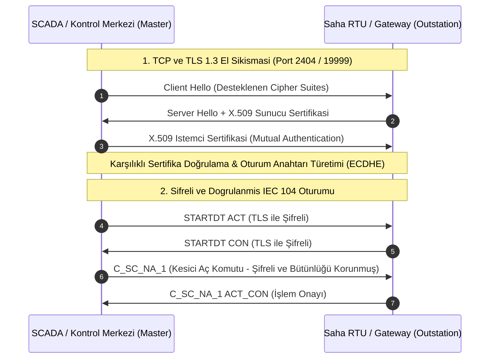
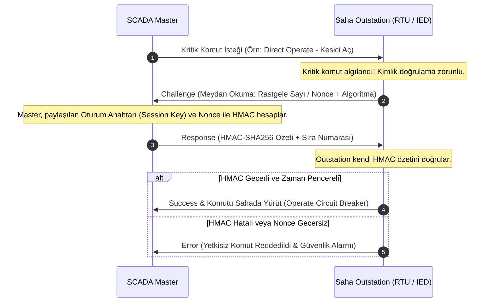
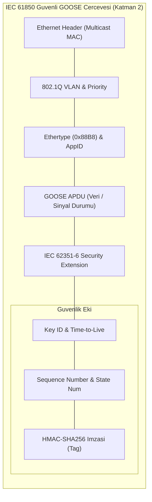
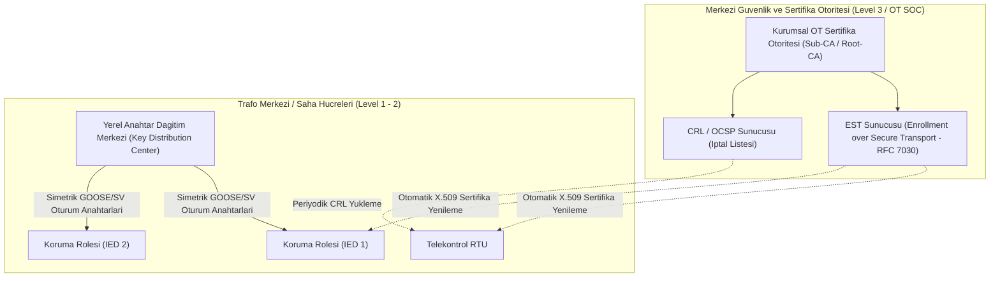

# IEC 62351 Endüstriyel Haberleşme Güvenliği ve Kriptografi

[Ana sayfa](../../README.md) · [Seçim ve Karşılaştırma](00-secim-ve-karsilastirma.md) · [DNP3 ve IEC 104](04-dnp3-ve-iec-60870-5-104.md) · [PROFINET ve IEC 61850](06-profinet-profibus-ve-iec-61850.md) · [Trafik Analizi](08-trafik-analizi-ve-protokol-secimi.md)

Bu bölüm, enerji iletim/dağıtım, su altyapıları ve akıllı şebekelerde kullanılan telekontrol protokollerinin (IEC 60870-5-104, DNP3, IEC 61850) siber güvenliğini sağlamak amacıyla **IEC TC 57 / WG 15** tarafından geliştirilen **IEC 62351** standart ailesini ve endüstriyel kriptografi mimarisini inceler.

---

## 1. Hangi Problemi Çözer?

Geleneksel SCADA ve telekontrol protokolleri (IEC 60870-5-101/104, DNP3, Modbus, IEC 61850 MMS/GOOSE), tasarlandıkları dönemde fiziksel olarak yalıtılmış hatlar üzerinden çalıştıkları varsayımıyla hiçbir kimlik doğrulama, şifreleme veya veri bütünlüğü mekanizması içermezdi.

Bu durum aşağıdaki temel saldırı vektörlerine yol açar:
1. **Paket Dinleme ve Casusluk (Eavesdropping):** Açık metin (cleartext) geçen telemetri ve durum verilerinin izlenmesi.
2. **Sahte Komut Enjeksiyonu (Command Injection):** Saldırganın doğrudan RTU/kesiciye "Aç" (Trip/Open) komutu göndermesi.
3. **Araya Girme ve Değiştirme (Man-in-the-Middle - MitM):** Ölçüm değerlerinin (gerilim, frekans) değiştirilerek koruma rölelerinin yanıltılması.
4. **Yeniden Oynatma Saldırıları (Replay Attacks):** Kaydedilmiş meşru bir kumanda paketinin zaman damgası kontrolü olmadan tekrar hatta basılması.

**IEC 62351**, otomasyon ve koruma lojiğinin gerçek zamanlı performans ve determinizm gereksinimlerini bozmadan bu protokollere kriptografik kimlik doğrulama, bütünlük ve gizlilik katmanları ekler.

---

## 2. IEC 62351 Standart Parçaları ve Protokol Eşleşmesi

```mermaid
flowchart TD
    subgraph IEC_62351_Framework["IEC 62351 Guvenlik Standart Ailesi"]
        P3["Part 3: TCP/IP & TLS (IEC 104, MMS)"]
        P4["Part 4: MMS Profilleri (IEC 61850 MMS, ICCP)"]
        P5["Part 5: IEC 60870-5 & DNP3 Guvenligi (SAv5)"]
        P6["Part 6: IEC 61850 GOOSE & Sampled Values (HMAC)"]
        P7["Part 7: Ag ve Sistem Yonetimi (NSM Log/SNMP)"]
        P8["Part 8: Guc Sistemlerinde RBAC / Yetki"]
        P9["Part 9: Kriptografik Anahtar ve X.509 PKI Yonetimi"]
    end

    subgraph Protocols["Hedef Endustriyel Protokoller"]
        IEC104["IEC 60870-5-104"]
        DNP3["DNP3 (IEEE 1815)"]
        MMS["IEC 61850-8-1 MMS"]
        GOOSE["IEC 61850-8-1 GOOSE"]
        SV["IEC 61850-9-2 Sampled Values"]
    end

    P3 -->|TLS 1.3 / Port 2404-19999| IEC104
    P3 -->|TLS 1.3 / Port 102| MMS
    P4 -->|Uygulama Yetkilendirme| MMS
    P5 -->|Challenge-Response & HMAC| DNP3
    P5 -->|Uygulama Butunlugu| IEC104
    P6 -->|HMAC-SHA256 (Sub-4ms Multicast)| GOOSE
    P6 -->|HMAC-SHA256 (Sub-3ms Multicast)| SV
    P9 -.->|Sertifika & Anahtar Dagitimi| P3
    P9 -.->|Sertifika & Anahtar Dagitimi| P5
    P9 -.->|Sertifika & Anahtar Dagitimi| P6
```

### 2.1. IEC 62351 Parça Kataloğu

| Standart Parçası | Kapsam ve Başlık | Kriptografik Mekanizma | İlgili Protokoller |
|---|---|---|---|
| **IEC 62351-3** | TCP/IP tabanlı profiller için veri ve iletişim güvenliği | TLS 1.2 / TLS 1.3 (TCP tünelleme, karşılıklı X.509 kimlik doğrulama) | IEC 60870-5-104, IEC 61850 MMS |
| **IEC 62351-4** | MMS (Manufacturing Message Specification) profilleri | Uygulama katmanı kimlik doğrulama ve oturum şifreleme | IEC 61850-8-1 MMS, TASE.2 (ICCP) |
| **IEC 62351-5** | IEC 60870-5 serisi ve DNP3 güvenliği | Meydan okuma-yanıt (Challenge-Response), Simetrik/Asimetrik Anahtarlar, HMAC | DNP3 (IEEE 1815 SAv5), IEC 60870-5-101/104 |
| **IEC 62351-6** | IEC 61850 eşler arası (Peer-to-Peer) profiller | HMAC-SHA256 / Dijital İmza (Zaman damgası, sayaç ve MAC özeti) | IEC 61850 GOOSE, Sampled Values (SV) |
| **IEC 62351-7** | Ağ ve Sistem Yönetimi (NSM) | SNMPv3, Syslog ve güvenlik olay veri modelleri | Trafo Merkezi Ağ Cihazları, IED, RTU |
| **IEC 62351-8** | Rol Tabanlı Erişim Kontrolü (RBAC) | X.509 Öznitelik Sertifikaları (Attribute Certificates), SAML belirteçleri | SCADA, Mühendislik İstemcileri, HMI |
| **IEC 62351-9** | Siber güvenlik anahtar ve sertifika yönetimi | PKI, EST (RFC 7030), SCEP, CRL ve OCSP | Tüm kriptografik IED ve RTU varlıkları |

---

## 3. Protokol Düzeyinde Kriptografik İşleyiş

### 3.1. IEC 60870-5-104 Güvenliği (IEC 62351-3 / TLS)

IEC 60870-5-104, TCP Port 2404 üzerinden çalışır. IEC 62351-3, bu trafiği doğrudan **TLS (Transport Layer Security)** katmanı içine alır:



* **Mutual TLS (mTLS):** Yalnızca sunucu (RTU) değil, istemci (SCADA) de kendi X.509 sertifikasını sunmak zorundadır. Yetkisiz hiçbir sahte istemci TCP oturumu kuramaz.
* **Cipher Suite Kısıtı:** Güvensiz şifreleme algoritmaları (RC4, 3DES, MD5, SHA-1) yasaktır; `TLS_AES_256_GCM_SHA384` veya `TLS_CHACHA20_POLY1305_SHA256` zorunludur.

---

## 4. DNP3 Secure Authentication v5 (IEC 62351-5 / SAv5 / IEEE 1815.1)

DNP3 SAv5, TLS gibi tüm kanalı şifrelemek yerine **Uygulama Katmanı Güvenli Kimlik Doğrulama (Application-Layer Challenge-Response)** yaklaşımını kullanır. Bu sayede seri hatlarda (RS-485) veya düşük bant genişlikli radyo linklerinde de çalışabilir:



* **Avantajı:** Sürekli şifreleme/çözme yükü getirmez; yalnızca kritik kumanda (Control) ve konfigürasyon işlemlerinde meydan okuma fırlatır.
* **Anti-Replay:** Her meydan okumada üretilen tek kullanımlık rastgele sayı (Nonce) ve artan sıra numarası (Sequence Number), kaydedilmiş paketlerin tekrar gönderilmesini tamamen engeller.

---

## 5. IEC 61850 GOOSE ve Sampled Values Güvenliği (IEC 62351-6 / HMAC)

IEC 61850 GOOSE ve Sampled Values (SV) protokolleri, koruma röleleri arasında açma sinyallerini (Trip) ve akım/gerilim dalga örneklerini taşır. Bu mesajlar **Katman 2 (Ethernet Multicast)** üzerinde doğrudan çalışır ve **3 ila 4 milisaniye (ms)** içinde hedefe ulaşmak zorundadır.



> [!WARNING]
> **Neden GOOSE/SV Tam Şifrelenmez?**
> Asimetrik RSA/ECC şifreleme veya ağır simetrik blok şifreleme algoritmaları mikrodenetleyici tabanlı IED'lerde 10-20 ms'yi aşan gecikmelere ve titreşime (jitter) yol açar. Bir bara arızasında kesicinin 4 ms içinde açılmaması patlamaya ve trafo yangınına sebep olur. Bu nedenle IEC 62351-6'da **gizlilik (encryption) yerine bütünlük ve kimlik doğrulama (HMAC-SHA256)** zorunlu kılınmıştır.

---

## 6. Anahtar Yönetimi ve PKI Mimarisi (IEC 62351-9)

Kriptografik güvenliğin sahadaki başarısı, yüzlerce RTU ve IED'nin sertifika/anahtar yaşam döngüsünün nasıl yönetildiğine bağlıdır:



### 6.1. Sertifika Dağıtım Protokolleri (EST vs SCEP)
* **EST (Enrollment over Secure Transport - RFC 7030):** IEC 62351-9 tarafından modern IED'ler için önerilen standarttır. TLS üzerinden çalışır ve ECC/RSA sertifikalarının otomatik olarak talep edilmesini, imzalanmasını ve yenilenmesini sağlar.
* **Offline / Manuel Yükleme:** İzole, dış ağa kapalı küçük trafo merkezlerinde sertifikalar şifreli USB bellekler veya yerel mühendislik istasyonu (EWS) üzerinden doğrudan yüklenir.

---

## 7. Sahada Uygulama Zorlukları ve Karşılaşma Matrisi

| Mühendislik Zorluğu | Risk / Olası Etki | IEC 62351 Çözümü ve Savunma Kuralı |
|---|---|---|
| **Eski (Legacy) IED Donanımı** | Eski mikroişlemcilerin TLS veya HMAC işleyecek kriptografik donanım hızlandırıcısına (Crypto Engine) sahip olmaması. | Hat başına endüstriyel kriptografik güvenlik ağ geçidi (**Bump-in-the-Wire Security Appliance**) veya SCALANCE S / Phoenix mGuard konumlandırma. |
| **Sertifika Süresinin Dolması** | Süresi biten X.509 sertifikasının tüm telekontrol iletişimini aniden kesmesi (Trafo merkezinin SCADA'da kör kalması). | Sertifika bitimine 90 gün kala IEC 62351-7 NSM SNMP uyarısı üretme; EST üzerinden otomatik yenileme (Renewal). |
| **Zaman Senkronizasyonu Kayması** | Nonce ve zaman damgalı doğrulamanın (SAv5 / GOOSE) saat farkı yüzünden kilitlenmesi. | Trafo merkezinde yedekli **GPS/GNSS destekli PTP (IEEE 1588v2 / IEC 61850-9-3 Power Profile)** saat sunucusu zorunluluğu. |
| **CRL / OCSP İzolasyonu** | İnternetsiz OT ağlarında sertifika iptal listelerine ulaşılamaması. | Trafo merkezi yerel yönetim sunucusunda yerel CRL dağıtım noktası (Local Distribution Point) barındırma. |

---

## 8. Kaynaklar ve İlgili Standartlar

- [IEC 62351-3:2014, Profiles including TCP/IP](https://webstore.iec.ch/en/publication/6905)
- [IEC 62351-5:2023, Security for IEC 60870-5 and Derivatives](https://webstore.iec.ch/en/publication/66042)
- [IEC 62351-6:2020, Security for IEC 61850 Profiles](https://webstore.iec.ch/en/publication/30740)
- [IEC 62351-9:2023, Cyber Security Key Management for Power System Equipment](https://webstore.iec.ch/en/publication/67868)
- [IEEE Std 1815-2012 (DNP3) and SAv5 Supplement](https://standards.ieee.org/ieee/1815/5160/)
- [Elektrik ve Enerji Sektörel Rehberi](../02-sektorler/02-elektrik-ve-enerji.md)
