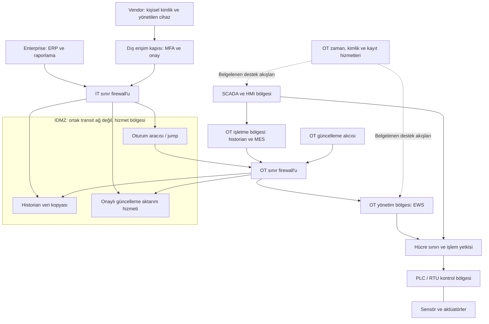

# OT mimarisi, endüstriyel DMZ ve uzak erişim

[Ana sayfa](../../README.md) · [Mimari temelleri](../01-temeller/03-mimari-ve-guven-bolgeleri.md) · [Kimlik ve ayrıcalıklı erişim](01-zero-trust-rbac-ve-pam.md) · [Sıkılaştırma](03-plc-hmi-ve-scada-sikilastirma.md)

Bu bölüm, 50 konulu kapsamın **2 — Mimari, 3 — Purdue, 11 — Industrial Firewall, 12 — Segmentasyon, 13 — Industrial DMZ ve 27 — Remote Access** konularını bir tasarım üzerinde birleştirir. Amaç, bir bağlantının gerekçesini ve izin sınırını belgelemektir. Çizim, tablolar, kural örnekleri ve alıştırma **kurgusal bir su işletmesi için özgün eğitim sentezidir**; çalıştırılabilir cihaz yapılandırması değildir.

## Bileşenler ve akışlar

PLC sensör girdilerini kontrol mantığıyla değerlendirir; RTU uzak sahanın ölçüm ve kontrol bağlantısını sağlayabilir. HMI operatöre süreç görünümü sunar; SCADA birden çok kontrol noktasının gözetimini birleştirir. Historian zamanla değişen proses verisini tutar. Engineering workstation (EWS), proje hazırlama ve yetkili mühendislik faaliyetinin yürütüldüğü istasyondur. Roller bir üründe birleşebilse de bağımlılıkları ayrı gösterilir. [NIST SP 800-82r3, §2.3](https://nvlpubs.nist.gov/nistpubs/SpecialPublications/NIST.SP.800-82r3.pdf)

**MES**, üretimin yürütülmesi ve izlenmesiyle; **ERP**, kurumsal kaynak ve iş planlamasıyla ilgilidir. Bunlar PLC'ye doğrudan proses komutu verme zorunluluğu oluşturmaz. Aşağıdaki işlev yerleşimi öğretim amaçlıdır; belirli bir ürünün kurulacağı tek seviye iddiası değildir. NIST'in mimari açıklamaları ve [ISA'nın ISA-95 tanıtımı](https://www.isa.org/standards-and-publications/isa-standards/isa-95-standard) iş/üretim ayrımını incelemek için başvuru noktalarıdır.

| Gösterim | Tipik işlev | Örnek iletişim ihtiyacı | Güvenlik tasarım sorusu |
|---|---|---|---|
| Level 0 | Sensör, aktüatör ve fiziksel süreç | Ölçüm ve fiziksel etki | Pano, saha kablosu ve ekipmana kim erişiyor? |
| Level 1 | PLC, RTU, kontrolör | Kontrol verisi ve yerel I/O | Kontrol mantığı ve mühendislik erişimi nasıl korunuyor? |
| Level 2 | HMI, gözetim ve SCADA işlevleri | Operatör görünümü, alarm, yetkili kumanda | Görüntüleme ile değişiklik yetkisi ayrılmış mı? |
| Level 3 | Tesis işletmesi, MES, yerel historian | Üretim takibi, raporlama ve işletme hizmetleri | IT kesilse gerekli işletme sürdürülebiliyor mu? |
| 3.5 gösterimi | Endüstriyel DMZ — IDMZ | Aracılı erişim ve veri kopyası | İki tarafın doğrudan oturumu yerine hangi hizmet sonlandırılıyor? |
| Level 4 | ERP ve kurumsal iş sistemleri | İş planı, rapor ve kaynak yönetimi | OT'ye gitmeden DMZ kopyasından hangi iş tamamlanabilir? |
| Level 5 gösterimi | İnternet ve dış hizmetler | Tedarikçi, dış raporlama, bulut | Dış bağımlılık ve kimlik hizmeti kaybının etkisi ne? |

"3.5" ve internet için "5", yaygın güvenlik çizimi gösterimleridir; özgün Purdue modelinin her ortamda zorunlu seviyeleri olarak sunulmaz. Historian veya SCADA işlevleri uygulamaya göre farklı bölgelerde bulunabilir. NIST, OT mimarilerini işlev, bölge ve saha dağılımıyla birlikte ele alır. [NIST §5.4](https://nvlpubs.nist.gov/nistpubs/SpecialPublications/NIST.SP.800-82r3.pdf)

**Data flow**, ölçüm, alarm veya raporun hareketidir. **Control flow**, bir işlevi veya proses davranışını değiştirebilecek kumanda ilişkisini gösterir. Burada "northbound", sahadan işletme/kurum yönüne; "southbound", işletmeden saha yönüne ilişkiyi anlatır. Bu sözcükler güvenlik derecesi veya oturumu kimin açtığını tek başına belirtmez: SCADA'nın açtığı bir sorgunun yanıtı kuzeye veri taşırken yeni oturum güney yönünde başlamış olabilir.

Bu ayrımı kaydetmek için bir akış satırına dört bilgi eklenir: **verinin yönü, oturumu başlatan uç, izinli işlem ve süreç etkisi**. Süreç verisinin dışarı kopyalanması, alıcıya kontrol yetkisi verilmesini gerektirmez. Kavramların bu kullanım biçimi özgün eğitim sentezidir.

## Zone, conduit ve segmentasyon araçları

Zone, ortak güvenlik gereksinimleri açısından gruplamayı; conduit, bölgeler arası iletişimin güvenlik açısından ele alınmasını sağlar. Purdue işlevin konumunu anlatırken bölge/geçiş çalışması güven sınırlarını ve izinleri tanımlar. ISA'nın kamuya açık kataloğunda 62443-3-2 sistem tasarımı risk değerlendirmesi, 62443-3-3 sistem güvenlik gereksinimleri ve seviyeleriyle ilgilidir; buradan madde bazında uygunluk sonucu çıkarılmaz. [ISA/IEC 62443 seri kataloğu](https://www.isa.org/standards-and-publications/isa-standards/isa-iec-62443-series-of-standards), [NIST §5.2.3.1](https://nvlpubs.nist.gov/nistpubs/SpecialPublications/NIST.SP.800-82r3.pdf)

| Araç / yaklaşım | İşlev | Tek başına neyi kanıtlamaz? |
|---|---|---|
| VLAN | Mantıksal ağ bölümlendirmesi | VLAN'lar arası yönlendirme serbestse erişim sınırı sağlamış olmaz |
| ACL | Tanımlı alanlara göre izin/ret | Kullanıcının iş emrini ve endüstriyel işlemin meşruluğunu bilmez |
| Durum izleyen firewall | Başlatılan oturumu ve dönüş trafiğini politika kapsamında değerlendirir | Aynı izinli hizmet içindeki her işlemin yetkili olduğunu göstermez |
| Uygulama/protokol farkındalığı | Desteklenen iletişimin uygulama içeriğine göre daha dar kısıt sağlayabilir | Desteklenmeyen, şifreli veya farklı sürümdeki protokolün yorumlanabildiğini göstermez |
| Jump server | Hedefe erişim için yönetim oturumunu aracıda sonlandırır | Kendiliğinden MFA, PAM veya tam oturum kaydı sağlamaz |
| Bastion host | Erişime açık konumda özel olarak korunan yönetim konağı | "Jump" adını taşımasıyla sıkılaştırılmış sayılmaz |
| Mikrosegmentasyon | Uygun bileşen çiftleri arasındaki izinleri daraltır | Zaman hassas kontrol veya eski cihaz uyumluluğu için otomatik çözüm değildir |

Tablodaki kullanım ve sınır değerlendirmeleri NIST'in [§5.2.3 ve Ek E.1](https://nvlpubs.nist.gov/nistpubs/SpecialPublications/NIST.SP.800-82r3.pdf) çerçevesinden türetilmiş özgün açıklamalardır. Industrial firewall seçiminde protokol sürümü, işlem denetimi, gecikme, yük altında davranış, yönetim güvenliği, yedeklilik ve çevresel uygunluk ayrıca kanıtlanır. "Industrial" adı bu yeteneklerin tamamını garanti etmez.

## Kurgusal mimari

Oklar kavramsal ilişkiyi gösterir; aşağıdaki matris yeni oturum yönünü ayrıca tanımlar. IDMZ sunucusunun iki ağa birden kontrolsüz bağlanması veya IP yönlendirmesi açılması bu tasarımda bir geçiş yolu oluşturmaz. Koruma/emniyet işlevleri ayrıca değerlendirilir; çizimde bulunmamaları genel yönetim bölgesine dahil edildikleri anlamına gelmez. NIST, kurumsal ve OT işletme arasındaki iletişim için DMZ hizmetlerini ve sınır denetimlerini ele alır. [NIST §5.4.1](https://nvlpubs.nist.gov/nistpubs/SpecialPublications/NIST.SP.800-82r3.pdf)

### IDMZ hizmetleri

| Hizmet | Neden burada? | Kontrol / kalan risk |
|---|---|---|
| Jump / uzak erişim aracısı | Dış kullanıcının oturumu belirli hedefe çevrilir | Geniş hedef erişimi veya ortak hesap aracıyı yeni bir risk merkezi yapar |
| Historian kopyası | Enterprise raporu OT historian'a doğrudan bağlanmadan okuyabilir | Veri kopyası gecikebilir; eski verinin yaşı görünür olmalı |
| Güncelleme aktarımı | Yama ve koruma yazılımı güncellemeleri inceleme noktasından geçer | Dosyanın burada olması üretimde uygulanma onayı değildir |
| Kayıt iletim aracısı | OT kayıtlarının kontrollü aktarımı | Kuyruk, saat farkı ve bağlantı kaybı görünür olmalı |

Bu yerleşim özgün tasarım örneğidir. Hizmetler aynı sunucuda birleştirilmek zorunda değildir; görev, hesap ve hata bağımlılıkları ayrı yazılır.

## Sembolik firewall izin/ret matrisi

`P_WEB`, `P_ADMIN`, `P_REPL`, `P_UPDATE`, `P_LOG`, `P_TIME`, `P_CONTROL` ve `P_ENGINEERING`, tasarımın **belirlenecek hedef portu/port kümesi** alanlarıdır; port numarası değildir. Uygulama ve sürüm belgesiyle doldurulmadıkça bu matris devreye alınabilir kural seti sayılmaz. "Seçilen taşıma" alanı da gerçek protokol incelemesiyle tamamlanır. Kaynak portları istemci/oturum davranışı açısından ayrıca değerlendirilir; gelişigüzel hedef port kısıtıyla karıştırılmaz.

| ID | Yeni oturumu başlatan kaynak | Hedef | Taşıma / hedef port | Karar ve kapsam | Gerekçe | Kayıt | Kabul kanıtı |
|---|---|---|---|---|---|---|---|
| FW-01 | Onaylı vendor cihazı | Dış erişim kapısı | TCP / P_WEB | İzin; MFA ve iş emriyle | Kimlikli erişim | Kişi, cihaz, sonuç, oturum | Geçerli iş kabul; süresi dolmuş iş reddedilir |
| FW-02 | Dış erişim kapısı | IDMZ jump | Seçilen taşıma / P_ADMIN | İzin; yalnız atanmış oturum | Aracılı bakım | Kapı–jump oturum eşlemesi | Kimlik ve hedef aynı iş emrine bağlanır |
| FW-03 | IDMZ jump | Atanmış EWS | Seçilen taşıma / P_ADMIN | İzin; hedef ve süre sınırlı | Mühendislik erişimi | Hedef, zaman, sonuç | Onaylı EWS erişimi; başka EWS reddi |
| FW-04 | EWS | Atanmış PLC | Seçilen taşıma / P_ENGINEERING | İzin; değişiklik onayıyla | Mühendislik işlevi | Bağlantı ve proje değişiklik kaydı | Ağ izni ile hedef işlem yetkisi ayrı kanıtlanır |
| FW-05 | SCADA | Atanmış PLC / RTU | Seçilen taşıma / P_CONTROL | İzin; onaylı süreç ilişkisi | Normal işletme | Akış özeti ve iletişim kalitesi | Onaylı iletişim sürer; yeni kaynak kapsam dışıdır |
| FW-06 | OT historian | IDMZ veri kopyası | Seçilen taşıma / P_REPL | İzin; bu senaryoda gönderici OT'dir | Rapor kopyası | Aktarım sonucu ve veri yaşı | IT okuyucusu OT'ye yeni oturum açmadan rapor alır |
| FW-07 | Enterprise raporlama | IDMZ veri kopyası | TCP / P_WEB | İzin; salt okunur uygulama rolü | Raporlama | Kullanıcı, sorgu bağlamı, sonuç | Rapor okunur; uygulama yazma yetkisi reddedilir |
| FW-08 | OT güncelleme alıcısı | IDMZ aktarım hizmeti | Seçilen taşıma / P_UPDATE | İzin; onaylı dosya paketi | Kontrollü güncelleme | Paket kimliği, bütünlük ve onay | Dosya aktarımı otomatik kurulum tetiklemez |
| FW-09 | Onaylı OT kayıt kaynakları | OT kayıt toplayıcı | Seçilen taşıma / P_LOG | İzin; belirtilen kaynaklar | İzleme | Kaynak sağlığı ve son kayıt zamanı | Kayıt boşluğu ayrı bildirim üretir |
| FW-10 | Onaylı OT zaman istemcileri | OT zaman hizmeti | Seçilen taşıma / P_TIME | İzin; desteklenen güvenlik ayarıyla | Ortak zaman | Kaynak değişimi ve sapma | Saat kaynağı kaybının etkisi ve alarmı belgelenir |
| FW-11 | Internet veya vendor | PLC / RTU | Tümü / tümü | Ret; aracı atlanamaz | Doğrudan erişimi önleme | Ret kaydı; hacim yönetimiyle | Politika incelemesinde doğrudan izin yok |
| FW-12 | Enterprise | OT kontrol ve yönetim bölgeleri | Tümü / tümü | Ret; yukarıdaki IDMZ yolları kullanılır | Güven sınırı | Ret ve kural kimliği | Alternatif kural/NAT/yönlendirme yolu incelenir |
| FW-13 | Her kaynak | Her hedef | Tümü / tümü | Önceki açık izinlerle eşleşmeyen yeni oturumları reddet | Gereksiz iletişimi sınırlama | Kapasiteyi aşmayacak ret özeti | Belgelenmemiş izin ve geniş kapsamlı istisna yok |

Bu örnek, DNS, kimlik, yedekleme, lisans ve yedeklilik iletişimlerinin otomatik olarak izinli olduğunu söylemez. Gerçek kapsamda gerekiyorsa her biri ayrı satıra eklenir. Durum izleyen cihazdaki mevcut oturum dönüş trafiği, karşı tarafın yeni oturum açma yetkisiyle aynı değildir. Kuralların sırası, çakışması, nesne grupları, yönlendirme ve NAT birlikte incelenir. Kabul sütunundaki ifadeler **tasarlanmış kontrollerdir; burada yürütülmüş test sonucu değildir**.

## VPN, ZTNA, PAM ve MFA birbirini nasıl tamamlar?

VPN güvenli bir taşıma kanalı sağlayabilir; hedefteki kullanıcı işleminin yetkili olduğuna tek başına karar vermez. ZTNA yaklaşımı kaynak erişimini kimlik ve politikayla sınırlandırmaya odaklanır; her OT protokolünün bir aracıyla uyumlu olması beklenmez. PAM ayrıcalıklı hesap/oturumu, MFA kimlik doğrulamayı güçlendirir. Sertifika doğrulaması kişi veya cihaz kimliği bağını destekleyebilir; anahtar saklama ve iptal yaşam döngüsü olmadan yalnız sertifika bulunması yeterli kanıt değildir. [NIST SP 800-207](https://csrc.nist.gov/pubs/sp/800/207/final), [NIST SP 800-82r3, §6.2.10](https://nvlpubs.nist.gov/nistpubs/SpecialPublications/NIST.SP.800-82r3.pdf)

Bu senaryoda vendor yolu: **kişisel kimlik ve cihaz kontrolü → MFA → süreli iş onayı → IDMZ aracı oturumu → atanmış EWS → ayrıca yetkilendirilmiş mühendislik işlemi**. Son adımın varlığı her vendor'a PLC programlama izni verildiği anlamına gelmez. Refakat, kayıt ve geri dönüş sorumlusu [erişim şablonunda](../../templates/06-tedarikci-ve-uzak-erisim.md) tutulur.

## Saat, kablosuz bağlantı ve IIoT sınırları

NIST, zaman bilgisini kayıt ilişkilendirme yanında kimlik, erişim ve bazı kontrol işlevleriyle de ilişkilendirir; zaman kaynaklarının izlenmesini önerir. Kablosuz erişimde kimlik ve bağlantı kısıtları kadar haberleşme güvenilirliği de incelenir. IIoT bileşenleri yeni bulut/kenar bağlantıları getirirken yerel proses etkisi ayrı değerlendirilir. [NIST §5.3.7, §6.2.9 ve §6.2.12](https://nvlpubs.nist.gov/nistpubs/SpecialPublications/NIST.SP.800-82r3.pdf)

Özgün inceleme soruları:

- Saat kaynağı kaybolunca hangi kayıtlar belirsizleşiyor; hangi kimlik işlemleri ve proses işlevleri etkileniyor?
- Wi-Fi veya hücresel geçit hangi zone içinde; yönetim yolu ve kablolu ağa geçişi hangi conduit'te?
- Bakım dizüstüsü aynı anda başka ağa bağlıysa kontrolsüz köprü oluşuyor mu?
- IIoT geçidi yalnız veri gönderiyor mu; bulut tarafında yeni kontrol veya yönetim oturumu açılabiliyor mu?
- Bulut, lisans veya WAN yokken yerel işlev sürüyor mu; kuyruklanan veri geri geldiğinde güncellik nasıl gösteriliyor?

Purdue görünümü bu ilişkileri çizmek için başlangıçtır; kimlik, ortak güç, kablosuz yol ve bulut yönetim bağımlılıkları yalnız bir seviye etiketiyle açıklanamaz.

## Artılar, eksiler ve maliyet etkenleri

IDMZ ve açık akış sahipliği doğrudan bağımlılıkları azaltabilir; hata noktalarının yerini görünür kılar. Ek aracı ve firewall'lar ise kapasite, yedeklilik, sertifika, izleme ve bakım gerektirir. Maliyete arayüz/cihaz sayısı, çevresel koşullar, protokol denetimi lisansı, saklama, destek ve kuralları gözden geçiren personel eklenir. Açık kaynak bir firewall veya standart sunucu bazı işlevleri karşılayabilir; endüstriyel çevre uygunluğu ve belirli protokol işlemi denetimi ayrıca değerlendirilir. Bu paragraf fiyat veya ürün üstünlüğü iddiası değil, özgün gereksinim analizidir.

Sık yapılan hata, bütün bölgelere aynı geniş hizmet grubunu açmak; veri kopyası ile kontrol erişimini birleştirmek; yedek yolun ana kural sınırını atladığını görmemektir. Kontrol seçimi, önce ilgili akışın sahibini ve kabul kanıtını belirlemelidir.

## Belge alıştırması ve kabul ölçütü

**Kurgusal girdi:** Enterprise raporu doğrudan OT historian'dan okunuyor. Vendor VPN profili bütün EWS'lere erişebiliyor. IDMZ sunucusu hem rapor hem yönetim aracı olarak kullanılıyor; görev ayrımı bilinmiyor. Saat kaynağı kaydı boş.

| Aşama | İstenen çıktı | Kabul ölçütü |
|---|---|---|
| THEORY | Purdue, zone ve conduit farkını bu tasarımla açıkla | İşlev seviyesi erişim izniyle karıştırılmamış |
| LAB | Düzeltilmiş Mermaid şeması ve sahipli akış matrisi | Her okta amaç, oturum başlatıcısı ve hedef işlevi belli |
| TEST | İzinli rapor, kapsam dışı EWS ve aracı kaybı için belge inceleme planı | Her senaryonun beklenen sonucu, veri kaynağı ve işletme etkisi yazılmış |
| DEFENSE | Geniş izinleri daralt; zaman ve yedek yol bağımlılıklarını ekle | Varsayılan ret, istisna sahibi ve geri dönüş koşulu tanımlı |
| REPORT | Üç bulgu ve düzeltilmiş tasarım gerekçesi | Bulguların akış/kural kimliği ve kabul kanıtı var; bilinmeyen portlar uydurulmamış |

Bu çalışma [mimari inceleme laboratuvarını](../../labs/02-mimari-inceleme.md) genişletir; cihaz bağlantısı veya tarama gerektirmez. Portföy çıktısı, tasarım ve inceleme belgesidir. İleri konu: yedek firewall geçişi, uygulama oturumları, asimetrik yönlendirme ve veri kopyası güncelliğinin birlikte modellenmesi.

## Kaynaklar ve kapsam

- NIST, *SP 800-82 Rev. 3: Guide to Operational Technology (OT) Security*, Eylül 2023, [nihai metin](https://nvlpubs.nist.gov/nistpubs/SpecialPublications/NIST.SP.800-82r3.pdf), erişim: 16.09.2026; §2.3, §5.2.3, §5.3.7, §5.4, §6.2.9, §6.2.10, §6.2.12 ve Ek E.1.
- NIST, *SP 800-207: Zero Trust Architecture*, Ağustos 2020, [yayın kaydı](https://csrc.nist.gov/pubs/sp/800/207/final), erişim: 16.09.2026; kimlik/kaynak merkezli erişim.
- ISA, *ISA/IEC 62443 Series of Standards*, [kamuya açık katalog](https://www.isa.org/standards-and-publications/isa-standards/isa-iec-62443-series-of-standards), sayfada tek yayın tarihi belirtilmiyor, erişim: 16.09.2026; yalnız seri parçalarının başlıkları ve genel kapsamı.
- ISA, *ISA-95 Standard*, [kamuya açık tanıtım](https://www.isa.org/standards-and-publications/isa-standards/isa-95-standard), sayfada tek yayın tarihi belirtilmiyor, erişim: 16.09.2026; kurumsal sistemlerle üretim/kontrol işlevlerinin bütünleştirilmesi.

Kurgusal yerleşim ve kural matrisi sertifika, uygunluk beyanı veya devreye alma talimatı değildir. İncelenen kaynak sınırları [araştırma kaydında](../../research/mimari-erisim-kaynaklar.md) tutulur.
