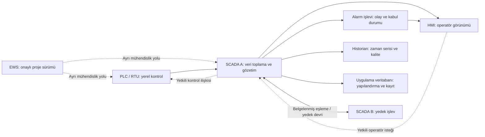

# PLC, HMI, SCADA ve destek sistemlerini sıkılaştırma

[Ana sayfa](../../README.md) · [RBAC ve PAM](01-zero-trust-rbac-ve-pam.md) · [Firewall ve DMZ](02-firewall-dmz-ve-uzak-erisim.md) · [Değişiklik ve kabul şablonu](../../templates/05-degisiklik-ve-kabul.md)

Sıkılaştırma, bir bileşenin gereken işi yapmasını sağlarken gereksiz erişim, hizmet ve değişiklik yollarını azaltmaktır. OT'de hizmet kapatma, güvenlik yazılımı veya güncelleme kararının proses etkisi incelenir. NIST, kullanılmayan yeteneklerin azaltılmasını ve yama öncesi test, telafi kontrolü ve işletme planlamasını birlikte ele alır. [NIST SP 800-82r3, §5.4.1 ve §6.2.11](https://nvlpubs.nist.gov/nistpubs/SpecialPublications/NIST.SP.800-82r3.pdf)

Bu bölüm, 50 konulu kapsamın **23 — PLC Security, 25 — SCADA Security, 26 — HMI Security ve 35 — OT Hardening** başlıklarını işler. Kontrol listeleri ve alıştırma **bu deponun özgün eğitim sentezidir**. Bir üreticideki ayarın başka model veya firmware'de bulunduğu varsayılmaz; burada donanıma işlem gönderilmez.

## SCADA bileşenlerini görevleriyle ayırma

SCADA sunucusu, HMI, historian ve mühendislik istasyonunun aynı bilgisayarda bulunması işlevlerinin aynı olduğu anlamına gelmez. Aşağıdaki kurgusal yerleşim, NIST'in [SCADA bileşenleri ve mimarileri](https://nvlpubs.nist.gov/nistpubs/SpecialPublications/NIST.SP.800-82r3.pdf) açıklamasından hareketle oluşturulmuş bir inceleme örneğidir.

Çizimdeki alarm ve veritabanı işlevleri ayrı sunucular olmak zorunda değildir. Oklar ağ kuralı değildir; gerçek oturum başlatıcısı ve uygulama portu [akış matrisinde](../../templates/01-envanter-ve-akis.md) ayrıca yazılır. Yedek SCADA bulunması yedekleme yapıldığı anlamına gelmez: mantıksal bir hata veya bozulmuş yapılandırma eşlenebilir. Bu nedenle kurtarma kopyası, yedek devri ve temiz sürümün doğrulanması ayrı kabul konularıdır.

| Bileşen | İncelenecek saldırı yüzeyi | İncelenecek işletme etkisi |
|---|---|---|
| SCADA sunucusu | Uygulama hesabı, yönetim servisi, dış entegrasyon, sürücü | Telemetri, kontrol isteği ve alarm aktarımı kesiliyor mu? |
| HMI | Yerel oturum, ekran yetkisi, USB, uzaktan masaüstü | Operatörün güncel değeri ve alarmı görmesi engelleniyor mu? |
| Historian | Veri alımı, sorgu yetkisi, veri kopyası | Kayıt eksikliği veya eski veri nasıl gösteriliyor? |
| Alarm işlevi | Alarm tanımı, susturma/kabul yetkisi, zaman | Kritik alarm bastırılıyor veya sahipsiz kalıyor mu? |
| Veritabanı | Servis kimliği, yönetim hesabı, yedek ve bağlantı | Şema/kimlik değişikliği uygulamayı durduruyor mu? |
| Yedek sunucu | Eşleme kanalı, ortak kimlik/güç/lisans bağımlılığı | Yedek devrinde hangi oturum, alarm ve veri kayboluyor? |
| EWS | Mühendislik projesi, eklenti, dosya aktarımı, yerel yönetici | Yanlış sürüm veya erişim kaybı hangi kontrol işlevini etkiliyor? |

## Kontrol listesini kullanma

Her madde için **durum, kanıt kimliği, kanıt tarihi, sorumlu ve istisna gerekçesi** tutulur. Durum seçenekleri: `doğrulandı`, `eksik`, `uygulanamaz — gerekçeli`, `doğrulanacak`. Ürün dokümanı bir özelliğin desteklendiğini; yapılandırma kaydı etkinleştirildiğini; kabul raporu ise beklenen davranışın incelendiğini gösterir. Bu kanıtlar birbirinin yerine geçmez.

Ortak değişiklik kaydında işlevsel başlangıç durumu, yedek/proje uyumu, bakım penceresi, durdurma koşulu, geri alma yolu ve kabul sahibi bulunur. Aşağıdaki maddeler **belge inceleme sorularıdır**; eksik görülen bir ayar canlı sistemde doğrudan değiştirilmez. Bu yaklaşım [NIST'in OT yama ve değişiklik çerçevesiyle](https://nvlpubs.nist.gov/nistpubs/SpecialPublications/NIST.SP.800-82r3.pdf) ilişkilendirilmiş özgün kabul tasarımıdır.

## PLC kontrol listesi

- [ ] **Kimlik ve erişim:** Varsayılan veya paylaşılan erişimlerin durumu, hedef işlemler ve mühendislik yolu kayıtlı. Kanıt: model/firmware'e ait erişim belgesi, rol kaydı ve onaylı yapılandırma özeti.
- [ ] **CPU koruması:** Yönetim, program değiştirme ve çalışma modu yetkileri ayrı incelenmiş. Kanıt: desteklenen koruma seçenekleri ve kabul ortamı raporu; parola konması tek başına bütün hizmetlerin korunduğu sayılmamış.
- [ ] **Program koruması:** Proje gizliliği, kopya koruması ve çalışma bütünlüğü ayrı gereksinim olarak yazılmış. Kanıt: özellik kapsamı ve proje erişim kaydı; gizleme özelliğinin yetkisiz değişikliği de engellediği varsayılmamış.
- [ ] **Firmware:** Ürün kodu, donanım revizyonu, firmware sürümü ve destek durumu biliniyor. Kanıt: üretici sürüm notu, onaylı paket kaynağı ve bütünlük/özgünlük doğrulama kaydı; imza doğrulama desteği varsayılmamış.
- [ ] **İletişim:** HMI, SCADA ve EWS ilişkileri ayrı listelenmiş; kullanılmayan hizmetler ve eski uyumluluk seçenekleri gerekçeli incelenmiş. Kanıt: protokol/akış envanteri ve kabul edilmiş hizmet listesi.
- [ ] **Güvenli iletişim:** Desteklenen kimlik, sertifika, imzalama ve şifreleme seçenekleri sürüm bazında değerlendirilmiş. Kanıt: uçların uyumluluğu ve sertifika yaşam döngüsü; dış tünelin PLC protokolüne yerel yetkilendirme eklediği iddia edilmemiş.
- [ ] **Yedek ve değişiklik:** Son onaylı proje ile kurtarma kopyası ilişkilendirilmiş. Kanıt: proje kimliği, değişiklik kaydı, donanım uyumu ve daha önce yapılmış izole geri yükleme raporu.
- [ ] **Fiziksel erişim:** Pano, yerel portlar ve bakım bağlantısı sahipli. Kanıt: fiziksel erişim kaydı, port/envanter listesi ve geçici bakım bağlantısının kapanış kaydı.

### Siemens S7-1200 / S7-1500 için belge okuma örneği

"S7-1500 kullanılıyor" bilgisi güvenlik yeteneği seçmek için yeterli değildir. Aşağıdaki kart her S7-1200 veya S7-1500 varlığı için ayrı doldurulur; G2 veya farklı CPU ailesi aynı satıra genellenmez.

| Alan | Kayda geçirilecek bilgi | Çıkarılmayacak sonuç |
|---|---|---|
| Ürün kimliği | Sipariş/ürün kodu, CPU ailesi, donanım revizyonu | Aynı ailede bütün CPU'lar eşdeğer değildir |
| Sürümler | Firmware ve mühendislik yazılımı sürümü | Menü görünmesi özelliğin hedef CPU'da desteklendiğini kanıtlamaz |
| Erişim modeli | Yerel kullanıcı/rol veya erişim seviyesi; hedefe özel işlev yetkileri | EWS kullanıcısının CPU yetkisini otomatik belirlediği varsayılmaz |
| İletişim | Kullanılan sürücü, protokol ve ilgili güvenlik seçeneği | OPC UA veya PROFINET adından aktif güvenlik ayarı çıkarılmaz |
| Kanıt | İlgili üretici belgesinin sürümü, bölümü ve yapılandırma kaydı | Eski bir kılavuz bütün yeni firmware'ler için geçerli sayılmaz |

Siemens'in **STEP 7 V20, 11/2024** tarihli çevrimiçi S7-1500 belgesinde erişim seviyeleri, yerel/merkezi kullanıcılar, sertifikalar ve güvenlik olayları için bölüm başlıkları listeleniyor. Bu araştırmada sayfanın ayrıntı gövdesi alınamadı; yalnız künye ve konu başlıkları doğrulandı. Dolayısıyla bu belgeye dayanarak belirli CPU/firmware için özellik desteği veya ayar tarifi verilmez. [Siemens V20 belge kaydı](https://docs.tia.siemens.cloud/r/en-us/v20/functional-description-of-s7-1500-cpus-s7-1500/setting-the-operating-behavior-s7-1500/protection-security-s7-1500/settings-for-access-levels-s7-1500)

## HMI kontrol listesi

- [ ] **Varsayılan ve yerel hesaplar:** Kurulum hesabı, operatör hesabı ve yönetici hesabı ayrılmış. Kanıt: yetki listesi, gereksiz hesap kapatma kaydı ve acil erişim gerekçesi.
- [ ] **İşlem yetkisi:** Görüntüleme, alarm kabulü, ayar değişikliği ve mühendislik ayrı incelenmiş. Kanıt: rol matrisi ve olumlu/olumsuz kabul kayıtları; gizli düğme yetki kontrolü yerine sayılmamış.
- [ ] **RDP ve uzaktan destek:** İş gerekçesi olmayan yol kapalı veya istisnası kayıtlı; gerekli yol aracı ve süreyle sınırlı. Kanıt: hizmet listesi, erişim kaydı ve hedef oturum eşlemesi.
- [ ] **Ekran kilidi:** Operatörün kritik durum bilgisini kaybetmesi ve vardiya devri değerlendirilmiş. Kanıt: işletmenin kabul ettiği oturum/kilit davranışı; genel ofis politikası doğrudan kopyalanmamış.
- [ ] **USB ve uygulamalar:** Onaylı medya ve uygulama listesi var. Kanıt: medya kabul kaydı, allowlist kapsamı ve uygulama güncellemesi sonrası inceleme; desteklenmeyen ajan zorunlu tutulmamış.
- [ ] **Yama ve yedek:** HMI uygulaması, işletim sistemi ve proje sürümü birlikte kaydedilmiş. Kanıt: uyumluluk belgesi, test raporu ve geri dönüş paketi.
- [ ] **Kayıt ve veri kalitesi:** Yetki olayları, operatör işlemleri, iletişim kaybı ve eski veri gösterimi incelenmiş. Kanıt: kurgusal veya onaylı örnek kayıt, zaman kaynağı ve alarm görünümü kabul raporu.

## SCADA ve historian kontrol listesi

- [ ] **Hizmet hesabı:** Uygulama ve veritabanı kimliklerinin görev ve ayrıcalıkları belli. Kanıt: servis–hesap eşlemesi; parola değişikliğinin bağımlılık ve geri dönüş kaydı.
- [ ] **İstemci ve sürücü ilişkileri:** Her HMI, PLC/RTU ve entegrasyonun amacı kayıtlı. Kanıt: akış matrisi, sürücü/sürüm envanteri ve onaylı kaynak listesi.
- [ ] **Alarm yönetimi:** Alarm tanımlama, susturma ve kabul rolleri ayrı. Kanıt: değişiklik geçmişi, bastırılmış alarm incelemesi ve işletme onayı.
- [ ] **Veritabanı:** Yönetim erişimi, uygulama erişimi ve rapor okuma birbirinden ayrılmış. Kanıt: hesap/yetki matrisi, yedek ve geri yükleme doğrulaması.
- [ ] **Historian:** Veri kaynağı, kalite bayrağı, saklama ve kopyalama ilişkisi belgelenmiş. Kanıt: veri boşluğu/eski veri örneği ve DMZ kopyası yaşı.
- [ ] **Yedeklilik:** Eşleme trafiği ve ortak güç, dizin, depolama, zaman ve lisans bağımlılıkları incelenmiş. Kanıt: yedek devri raporu; yedeklilik temiz kurtarma kopyası sayılmamış.
- [ ] **Güvenlik görünürlüğü:** Kimlik olayları, yapılandırma değişikliği ve toplayıcı kesintisi izleniyor. Kanıt: kayıt kapsamı matrisi ve son veri zamanı; yalnız SIEM'e bağlantı kurulması yeterli sayılmamış.

## Windows Server kontrol listesi

- [ ] **Rol sınırı:** SCADA, dizin, veritabanı veya dosya sunucusu görevi açık. Kanıt: hizmet listesi ve birlikte çalıştırılan rollerin gerekçesi.
- [ ] **Ayrıcalık:** Günlük kullanım, yönetim ve servis hesapları ayrılmış. Kanıt: yerel/merkezi grup üyeliği, acil hesap kaydı ve gözden geçirme tarihi.
- [ ] **RDP ve SMB:** Gereken istemci ve hizmetler belirlenmiş; eski uyumluluk istisnaları sahipli. Kanıt: yapılandırma incelemesi ve uygulama uyumluluk raporu; bütün SMB'nin gerekçesiz kapatılması önerilmemiş.
- [ ] **Host firewall:** İşlevsel akışlarla eşleşen kurallar var. Kanıt: akış kimliği–kural eşlemesi; profil veya geniş istisnayla sınırın atlanmadığı incelenmiş.
- [ ] **Koruma ve allowlisting:** Üretici desteği, performans ve güncelleme etkisi değerlendirilmiş. Kanıt: kabul raporu, istisna sahibi ve onaylı uygulama listesi.
- [ ] **Yama/yeniden başlatma:** Bakım penceresi ve bağımlılık sırası belirli. Kanıt: uyumluluk onayı, başlangıç durumu, geri alma ve kabul kaydı.
- [ ] **Log, saat ve kurtarma:** Kimlik/yetki olayları, saat kaynağı ve yedek kapsamı tanımlı. Kanıt: kayıt örneği, toplayıcı sağlığı, geri yükleme ve hizmet doğrulama raporu.

## Engineering workstation kontrol listesi

- [ ] **Proje bütünlüğü:** Çalışma kopyası, onaylı proje ve sahadaki sürüm ayrı tanımlı. Kanıt: sürüm/değişiklik kaydı ve proje kaynağı.
- [ ] **Yönetim ve mühendislik hesabı:** İşletim sistemi yönetimi ile PLC proje yetkisi ayrılmış. Kanıt: rol matrisi, araç yetkisi ve değişiklik onayı.
- [ ] **Araç ve eklentiler:** Mühendislik yazılımı, sürücü, eklenti ve lisans bağımlılıkları envanterde. Kanıt: onaylı yazılım listesi ve sürüm uyumluluğu.
- [ ] **Dosya aktarımı:** Vendor projesi veya güncellemesi kontrollü kabul noktasından geçiyor. Kanıt: dosya kaynağı, bütünlük, inceleyen rol ve kabul kararı.
- [ ] **USB / bakım cihazı:** Taşınabilir medya ve geçici bilgisayarın giriş–çıkışı izleniyor. Kanıt: kabul kaydı, bağlantı kapsamı, sorumlu ve kapanış kaydı.
- [ ] **Çoklu ağ bağlantısı:** Kablolu, Wi-Fi, hücresel ve sanal ağ yolları biliniyor. Kanıt: bağlantı envanteri ve yetkisiz köprü oluşmasını önleyen tasarım.
- [ ] **Kurtarılabilirlik:** Temiz istasyon, proje, sürücü ve lisans birlikte geri getirilebiliyor. Kanıt: izole kurtarma raporu ve proje doğrulama kaydı.

## Firewall kontrol listesi

- [ ] **Yönetim yolu:** Yönetim arayüzü, yönetici rolleri ve acil erişim sınırlı. Kanıt: yönetim akışı ve kimlik kaydı.
- [ ] **Kural sahipliği:** Her izin akış kimliği, iş gerekçesi, sahip ve gözden geçirme tarihi taşıyor. Kanıt: matris; süresiz geçici izinler ayrı bulgu.
- [ ] **İzin/ret:** Kaynak, hedef, hizmet, yön, sıra ve varsayılan davranış açık. Kanıt: gölgeleyen/çakışan kurallar ve nesne grupları incelemesi.
- [ ] **Endüstriyel denetim:** Protokol/işlem farkındalığının desteklenen kapsamı belli. Kanıt: sürüm bazında üretici belgesi ve kabul raporu; şifreli içeriğin görülebildiği varsayılmamış.
- [ ] **Yedeklilik:** Devralma, durum eşleme, kesinti ve hata davranışı belgelenmiş. Kanıt: uygulama oturumlarıyla birlikte değerlendirilmiş test raporu.
- [ ] **Kayıt ve zaman:** Kural/konfigürasyon değişikliği, yönetici oturumu ve önemli retler kayıtlı. Kanıt: zamanlı kayıt örneği, hacim ve saklama hesabı.
- [ ] **Yedek ve destek:** Yapılandırma kopyası, firmware ve geri dönüş uyumu belli. Kanıt: onaylı yedek kimliği, sürüm notu ve geri yükleme raporu.

## Industrial switch kontrol listesi

- [ ] **Port envanteri:** Her fiziksel portun cihazı, görevi, VLAN'ı ve boş port davranışı kayıtlı. Kanıt: port–varlık eşlemesi ve bakım sonrası gözden geçirme.
- [ ] **Yönetim ayrımı:** Yönetim IP/servisleri ve erişebilen roller sınırlı. Kanıt: yönetim bölgesi, yetki ve protokol listesi; desteklenmeyen güvenli yönetim için telafi kontrolü.
- [ ] **Trunk ve VLAN kapsamı:** Taşınan VLAN'lar ve yönlendirme sınırı gerekli işlevlerle eşleşiyor. Kanıt: topoloji ve trunk listesi; VLAN tek başına güvenlik duvarı sayılmamış.
- [ ] **Endüstriyel özellikler:** Multicast, halka yedekliliği, QoS ve zaman dağıtımı bağımlılıkları tanımlı. Kanıt: uygulama gereksinimi ve kabul raporu; genel IT şablonu körlemesine uygulanmamış.
- [ ] **İzleme portu:** SPAN/TAP kaynağı, görülen yönler ve kapasite sınırları belirli. Kanıt: sensör yerleşimi ve kapsama kaydı; izleme kablosu üretim yolu yerine geçmemiş.
- [ ] **Fiziksel ve geçici erişim:** Pano, konsol ve bakım portlarının sorumlusu var. Kanıt: erişim kaydı, geçici cihaz onayı ve bağlantı kapanışı.
- [ ] **Yapılandırma ve saat:** Yönetim değişikliği, yedek, firmware ve kayıt saatinin kaynağı izleniyor. Kanıt: değişiklik kaydı, uyumlu yedek ve zaman sapması kaydı.

Bu yedi listenin teknik dayanağı NIST'in fiziksel, ağ, donanım ve yazılım güvenliği ile kimlik, bakım ve medya bölümleridir. Maddeler NIST kontrol metinlerinin birebir çevirisi veya ürün bazında zorunlu ayar listesi değildir. [NIST §5.2.2–5.2.5, §6.2.1, §6.2.5–6.2.7 ve §6.2.11–6.2.12](https://nvlpubs.nist.gov/nistpubs/SpecialPublications/NIST.SP.800-82r3.pdf)

## Tehdit, savunma ve kalan risk

| Hedef | Ön koşul | Aşılan güven sınırı | Olası hizmet / fiziksel etki | Gözlenebilir belirti | Kontrol ve doğrulama kanıtı |
|---|---|---|---|---|---|
| Onaysız proje değişikliği | Mühendislik yetkisi veya onaylı EWS erişimi mevcut kabul edilir | Bakım yetkisinden proses değişikliğine | Kontrol davranışı beklenen sürümden ayrılabilir | İş emirsiz proje sürümü veya mühendislik oturumu | Proje sürüm kaydı, işlem yetkisi, çift onay ve kabul kaydı |
| Operatör görünümünü yanıltma | HMI ayarına erişim mevcut kabul edilir | Sunucu/ekran yönetiminden işletme kararına | Eski ölçüm güncel sanılabilir | Kalite bayrağı ile görünümün uyuşmaması | Veri yaşı gösterimi ve bağımsız kayıt karşılaştırması |
| Bakım cihazıyla bölge sınırını atlama | Geçici cihaz bağlantısı mevcut kabul edilir | Geçici bakım ağından kontrol bölgesine | İzinsiz erişim yolu veya kayıt dışı değişiklik oluşabilir | Yeni iletişim çifti ve onaysız port kaydı | Bağlantı kabulü, ağ kapsamı ve kapanış kanıtı |

Senaryoların başlangıç koşulları varsayımdır; koşulların nasıl oluşturulacağı anlatılmaz. Belirti tek başına saldırı kanıtı değildir; bakım, arıza veya eksik kayıt açıklamaları da incelenir.

## Artılar, eksiler ve maliyet

Sahipli bir başlangıç yapılandırması değişikliği görünür kılar; kurtarma paketinin kapsamını netleştirir. Ancak eski bileşenlerde güvenlik seçeneği kısıtlı olabilir; merkezi hesap, koruma yazılımı veya sertifika değişikliği ek bağımlılık getirir. Kontrol seçimi desteklenen özellik, süreç etkisi ve doğrulanabilir kanıt üzerinden yapılır.

Özgün maliyet çerçevesi: mühendislik incelemesi + kabul ortamı + bakım penceresi + yedek/uyumlu parça + proje/lisans kurtarma + kayıt saklama + dönemsel gözden geçirme. Belge envanteri, rol listesi ve değişiklik kaydı için yeni ticari ürün zorunlu değildir. Açık kaynak izleme veya işletim sistemi özellikleri değerlendirilirken ajan desteği, protokol görünürlüğü ve bakım sorumluluğu ayrıca yazılır; "ücretsiz" toplam işletme maliyetinin sıfır olduğu anlamına gelmez.

## Belge alıştırması ve kabul ölçütü

**Kurgusal girdi:** PLC'nin proje yedeği var, firmware uyumu bilinmiyor. HMI paylaşılan yönetici hesabıyla çalışıyor. SCADA yedeği ana sunucuyla aynı depolamada. EWS'de geçici vendor yazılımının sahibi yok. Switch boş port kaydı tutulmuyor. Firewall bakım izninin bitiş tarihi boş. Windows Server yeniden başlatma bağımlılıkları yazılmamış.

| Aşama | Teslim | Kabul ölçütü |
|---|---|---|
| THEORY | Sıkılaştırma, yedeklilik ve yedekten kurtarma farkını açıkla | Yedek sunucu temiz kurtarma kopyası sayılmamış |
| LAB | Yedi varlık sınıfı için kontrol listesini verilen bilgilerle doldur | Olmayan bilgi uydurulmamış; `doğrulanacak` alanlarının sahibi var |
| TEST | PLC yedeği, HMI yetkisi ve SCADA yedek devri için kabul planı | Beklenen işlev, olumsuz durum, kanıt ve geri dönüş ayrı yazılmış |
| DEFENSE | Bulguları hizmet etkisi ve telafi kontrolüyle sırala | Salt güvenlik faydası yanında değişiklik riski de açıklanmış |
| REPORT | Bulgu–varlık–değişiklik–kanıt eşleme tablosu | Her düzeltme için sorumlu, hedef ve kapanış kanıtı tanımlı |

Bu alıştırmanın tüm girdileri yukarıdadır; yazılım veya VM kurulumu gerekmez. Hazırlanan kabul planı yürütülmüş test diye raporlanmaz. Portföyde "yedi OT varlık sınıfı için sıkılaştırma ve kabul değerlendirmesi" olarak kullanılabilir. İleri çalışma: ürün/sürüm uyumluluk matrisi, uygulama izin listesi yaşam döngüsü ve bağımlılıkları kapsayan kurtarma tatbikatı.

## Kaynaklar ve kapsam

- NIST, *SP 800-82 Rev. 3: Guide to Operational Technology (OT) Security*, Eylül 2023, [nihai metin](https://nvlpubs.nist.gov/nistpubs/SpecialPublications/NIST.SP.800-82r3.pdf), erişim: 16.09.2026; §2.3, §5.2, §5.4.1, §6.2 ve Ek F. Ürün bağımsız çerçeve için kullanıldı.
- Siemens, *Functional description of S7-1500 CPUs — Settings for access levels*, STEP 7 V20, yayın: 11/2024, [çevrimiçi belge](https://docs.tia.siemens.cloud/r/en-us/v20/functional-description-of-s7-1500-cpus-s7-1500/setting-the-operating-behavior-s7-1500/protection-security-s7-1500/settings-for-access-levels-s7-1500), erişim: 16.09.2026; yalnız künye ve içerik başlıkları görülebildi. CPU/firmware özellik desteği bu kayıttan çıkarılmadı.

Kontrol listeleri, maliyet etkenleri ve senaryolar özgün eğitim sentezidir. Kaynak sınırlamaları ve kullanılmayan iddialar [araştırma kaydındadır](../../research/mimari-erisim-kaynaklar.md).
