# Güvenli PLC programlama uygulamaları (Top 20 Secure PLC Coding)

[Ana sayfa](../../README.md) · [Zero Trust ve RBAC](01-zero-trust-rbac-ve-pam.md) · [PLC ve HMI sıkılaştırma](03-plc-hmi-ve-scada-sikilastirma.md) · [Güvenli Kodlama Şablonu](../../templates/13-guvenli-plc-kodlama-denetim-matrisi.md) · [Sektörel senaryolar](../../docs/02-sektorler/senaryolar/README.md)

**İnceleme tarihi: 18.09.2026.** Bu bölüm; kontrol mühendislerinin ek bir güvenlik donanımı veya lisans satın almadan, yalnızca kontrolörün (PLC/DCS/PAC) kendi programlama dillerini (Structured Text / SCL, Ladder Diagram, Fonksiyon Blokları) kullanarak lojik seviyesinde siber dayanıklılık oluşturmasını sağlayan **Top 20 Secure PLC Coding Practices** (ISA Global Cybersecurity Alliance ve admeritia konsorsiyumu) standart metodolojisini inceler.

---

## 1. Hangi Problemi Çözer?

Geleneksel otomasyon projelerinde PLC kodu yalnızca "prosesin nominal şartlarda çalışması" için yazılır. Ağ seviyesindeki bir güvenlik duvarı aşıldığında veya yetkili bir HMI istasyonu ele geçirildiğinde:
- Saldırgan set değerlerini sınırların dışına çıkarabilir (ör. kimyasal dozajını 100 katına çıkarma).
- Birbirini dışlayan vanaları aynı anda açarak boru patlamasına yol açabilir.
- Zamanlayıcıları (Timer) baypas ederek reaksiyon sürelerini bozabilir.
- Dizi sınırlarını (Array boundary) aşarak hafıza yolsuzluğu (Memory corruption) tetikleyebilir.

> [!IMPORTANT]
> **Derinlemesine Savunmanın Son Hattı:** Güvenli PLC Kodlama, ağ güvenlik duvarı (Firewall) ve kimlik doğrulama katmanları geçilse dahi, PLC lojiğinin **hatalı, mantıksız veya zararlı komutları doğrudan reddetmesini** ve fiziksel süreci korumasını sağlar.

---

## 2. Top 20 Güvenli PLC Kodlama Kılavuzu

```mermaid
flowchart TD
    subgraph Top20_Categories["Top 20 Guvenli PLC Kodlama Kategorileri"]
        C1["1. Girdi ve Cikti Dogrulama (I/O Validation)"]
        C2["2. Mimari ve Butunluk (Architecture & Integrity)"]
        C3["3. Calisma ve Surec Izleme (Operational Monitoring)"]
        C4["4. Sikilastirma ve Yonetim (Hardening & Docs)"]
    end

    C1 --> P6["Pratik 6: Zamanlayici & Sayac Kontrolu"]
    C1 --> P7["Pratik 7: Birbirini Dislayan I/O (Paired Signals)"]
    C1 --> P8["Pratik 8: HMI Girdi Dogrulama (PLC Seviyesinde)"]
    C1 --> P9["Pratik 9: Dizi ve Isaretci Sinirlari (Array Bounds)"]
    C1 --> P11["Pratik 11: Proses Mantiksallik Dogrulamasi"]

    C2 --> P1["Pratik 1: Moduler Fonksiyon Bloklari"]
    C2 --> P3["Pratik 3: Operasyonel Lojigi PLC'de Tutma"]
    C2 --> P4["Pratik 4: Hata Bayraklari ile Butunluk Takibi"]
    C2 --> P5["Pratik 5: Kriptografik Checksum Denetimi"]
    C2 --> P10["Pratik 10: Veri Bloklarini Fonksiyona Gore Ayirma"]

    C3 --> P2["Pratik 2: Calisma Modu Takibi (RUN / STOP)"]
    C3 --> P12["Pratik 12: Guvenli Baslangic Durumu (OB100)"]
    C3 --> P15["Pratik 15: Cevrim Suresi (Cycle Time) Izleme"]
    C3 --> P16["Pratik 16: Uptime ve Yeniden Baslama Takibi"]
    C3 --> P17["Pratik 17: Donanimsal Hata ve Durus Kaydi"]
    C3 --> P18["Pratik 18: Hafiza Tuketim Sapmasi"]
    C3 --> P19["Pratik 19: Alarm Dogrulama Mantigi"]

    C4 --> P13["Pratik 13: Kullanilmayan Port ve Servisleri Kapatma"]
    C4 --> P14["Pratik 14: Ucuncu Taraf Veri Arayuzunu Kisitlama"]
    C4 --> P20["Pratik 20: Standart Isimlendirme ve Dokumantasyon"]
```



---

## 3. Detaylı Pratik Kataloğu

### Kategori 1: Girdi ve Çıktı Doğrulama (I/O Validation & Boundary Checks)

| No | Pratik Adı | Amacı ve Çalışma Mantığı | Uygulama Örneği (SCL / ST) |
|---|---|---|---|
| **P6** | **Zamanlayıcı ve Sayaçları Doğrulama** | Operatör veya HMI tarafından girilen Timer/Counter sürelerinin negatif, aşırı yüksek veya sıfır olmasını engelleme. | `IF HMI_TimerVal < T#1s OR HMI_TimerVal > T#60s THEN Actual_Timer := T#5s; Alarm_Invalid_Timer := TRUE; END_IF;` |
| **P7** | **Birbirini Dışlayan I/O Sinyallerini Doğrulama** | Bir vananın aynı anda hem "AÇ" hem "KAPA" sinyali üretmesi veya fiziksel limit switch'lerin çelişmesi durumunu tespit etme. | Her iki sinyal `TRUE` olduğunda komutu düşür, acil emniyet pozisyonuna geç ve güvenlik alarmı fırlat. |
| **P8** | **HMI Girdi Değişkenlerini PLC'de Doğrulama** | HMI üzerindeki JavaScript veya script kontrollerine güvenmeyip tüm setpoint sınırlarını doğrudan PLC lojiğinde zorlama. | PLC içinde `Min_Setpoint` ve `Max_Setpoint` sabitleri tanımlanır; gelen değer aralık dışındaysa eski güvenli değer korunur. |
| **P9** | **Dizi ve İşaretçi Sınır Denetimi** | Dinamik indeksleme kullanılan dizilerde indeks taşmalarını (Fence-post errors / Buffer overflow) engelleme. | `IF Index >= 1 AND Index <= 50 THEN Target_Array[Index] := Data; ELSE Alarm_Index_Overflow := TRUE; END_IF;` |
| **P11** | **Proses Mantıksallık (Plausibility) Denetimi** | Fiziksel olarak imkansız proses değişim hızlarını (ör. sıcaklığın 100 ms'de 20°C'den 300°C'ye fırlaması) algılama. | Son ölçüm ile şimdiki ölçüm farkı $\Delta T > \text{MaxRate}$ ise sensör arızası veya manipülasyon olarak işaretlenir. |

---

### Kategori 2: Mimari ve Veri Bütünlüğü (Architecture & Integrity)

| No | Pratik Adı | Amacı ve Çalışma Mantığı | Güvenlik Faydası |
|---|---|---|---|
| **P1** | **Kodu Modülerleştirme** | Monolitik dev bloklar yerine tekil görevli Function Block (FB) yapıları oluşturma. | Her fonksiyon bloğu bağımsız test edilebilir; yetkisiz lojik enjeksiyonları hızla tespit edilir. |
| **P3** | **Operasyonel Lojiği PLC'de Tutma** | Toplam debi hesabı, entegratör veya kilit lojiklerini HMI script'lerinde değil PLC'de çalıştırma. | HMI kapansa veya ağ kopsa dahi proses deterministik ve güvenli çalışmaya devam eder. |
| **P4** | **Sistem Hata Bayraklarını İzleme** | CPU'nun donanımsal bölme sıfır (Divide-by-zero) veya matematik taşma bitlerini sayaçlara bağlama. | Matematiksel saldırılar veya beklenmeyen taşmalar prosesi durdurmadan önce yakalanır. |
| **P5** | **Kriptografik Checksum Kontrolü** | PLC programının derleme hash değerini (Safety signature / Code checksum) periyodik doğrulamak. | İzinsiz online program yüklemeleri ve lojik modifikasyonları derhal alarm üretir. |
| **P10** | **Veri Bloklarını Fonksiyona Göre Ayırma** | HMI tarafından yazılabilen değişkenler ile PLC dahili durum değişkenlerini ayrı Data Block'larda (DB) tutma. | Harici ağdan gelebilecek yetkisiz yazma komutlarının kritik proses değişkenlerini ezmesi engellenir. |

---

### Kategori 3: Durum ve Süreç İzleme (Operational Monitoring)

| No | Pratik Adı | Amacı ve Çalışma Mantığı | İzleme Yöntemi |
|---|---|---|---|
| **P2** | **Çalışma Modu Takibi (RUN/STOP)** | PLC'nin donanımsal anahtar konumunu ve yazılımsal modunu (RUN/STOP/MEMORY RESET) takip etme. | CPU modunun RUN dışına çıkması durumunda HMI ve SCADA'da sesli/görsel kırmızı alarm üretilir. |
| **P12** | **Güvenli Başlangıç Durumu (OB100)** | PLC yeniden başladığında tüm vana ve motorların varsayılan güvenli (Safe-State) durumda açılmasını sağlama. | S7 Startup OB'sinde (OB100) tüm kritik çıkışlar `FALSE` yapılır; otomatik başlatma engellenir. |
| **P15** | **Çevrim Süresini (Cycle Time) İzleme** | PLC tarama süresindeki (Scan time) ani artışları ve sapmaları trendleme. | Sonsuz döngü veya ağ DoS saldırılarında tarama süresi fırlar; eşik aşıldığında alarm üretilir. |
| **P16** | **Uptime ve Yeniden Başlatma Takibi** | PLC'nin kesintisiz çalışma süresini saymak ve beklenmeyen CPU yeniden başlatmalarını kaydetmek. | Beklenmeyen reset olayları adli bilişim (forensics) incelemesi için loglanır. |
| **P17** | **Donanımsal Hata ve Duruş Kaydı** | Kritik I/O kart arızaları ve acil duruş (Trip) nedenlerini kalıcı hafızada (Retentive DB) saklama. | Enerji kesilse dahi arıza kök nedeninin silinmesi engellenir. |
| **P18** | **Hafıza Tüketim Sapması** | PLC veri ve yükleme belleği kullanım oranını izleme. | İzinsiz blok yüklemeleri veya dinamik hafıza sızıntıları tespit edilir. |
| **P19** | **Alarm Doğrulama Mantığı** | Kritik bir alarmın yalnızca tek bir sensör biti yerine, ilgili alt sistem durumlarıyla teyit edilerek üretilmesi. | Sensör aldatma veya DoS saldırılarında operatörün yanıltılması önlenir. |

---

### Kategori 4: Sıkılaştırma ve Dokümantasyon

| No | Pratik Adı | Amacı ve Açıklama |
|---|---|---|
| **P13** | **Kullanılmayan Port/Servisleri Kapatma** | PLC web sunucusu, SNMP, FTP veya kullanılmayan Ethernet portlarının donanım ayarlarından devre dışı bırakılması. |
| **P14** | **Üçüncü Taraf Arayüzlerini Kısıtlama** | ERP/MES veya harici gateway bağlantılarının yalnızca tanımlı salt-okunur DB bloklarına erişebilmesi. |
| **P20** | **Standart İsimlendirme ve Dokümantasyon** | Tüm tag, blok ve değişkenlerin standart IEC 61131-3 kuralına göre etiketlenmesi; yetkisiz eklenen sahte tag'lerin kolayca fark edilmesi. |

---

## 4. Uygulamalı SCL / Structured Text Kod Blokları

### 4.1. HMI Girdi Doğrulayıcı Bloğu (`FB_HMI_Input_Validator`)

```pascal
FUNCTION_BLOCK "FB_HMI_Input_Validator"
{ S7_Optimized_Access := 'TRUE' }
VERSION : 0.1
   VAR_INPUT
      Raw_HMI_Setpoint : Real;     // HMI veya harici ağdan gelen ham değer
      Min_Limit : Real;            // Mühendislik minimum emniyet limiti
      Max_Limit : Real;            // Mühendislik maksimum emniyet limiti
      Default_Safe_Val : Real;     // Hata durumunda atanacak güvenli değer
   END_VAR

   VAR_OUTPUT
      Validated_Setpoint : Real;   // Prosese aktarılacak güvenli değer
      Input_Out_Of_Bounds : Bool;  // Limit dışı saldırı/hata alarm bayrağı
      Violation_Count : DInt;      // Hatalı deneme sayacı
   END_VAR

BEGIN
   // Top 20 - Pratik 8: HMI girdi değişkenlerini doğrudan PLC'de doğrula
   IF (#Raw_HMI_Setpoint >= #Min_Limit) AND (#Raw_HMI_Setpoint <= #Max_Limit) THEN
      #Validated_Setpoint := #Raw_HMI_Setpoint;
      #Input_Out_Of_Bounds := FALSE;
   ELSE
      // Değer emniyet limitleri dışındaysa ezilmesini engelle
      #Validated_Setpoint := #Default_Safe_Val;
      #Input_Out_Of_Bounds := TRUE;
      #Violation_Count := #Violation_Count + 1;
   END_IF;
END_FUNCTION_BLOCK
```

---

### 4.2. Birbirini Dışlayan Sinyal Denetleyicisi (`FB_Paired_Signal_Monitor`)

```pascal
FUNCTION_BLOCK "FB_Paired_Signal_Monitor"
{ S7_Optimized_Access := 'TRUE' }
VERSION : 0.1
   VAR_INPUT
      Cmd_Open : Bool;             // Açma komutu
      Cmd_Close : Bool;            // Kapama komutu
      Feedback_Open : Bool;        // Açık limit switch geribildirimi
      Feedback_Closed : Bool;      // Kapalı limit switch geribildirimi
   END_VAR

   VAR_OUTPUT
      Safe_Cmd_Open : Bool;        // Doğrulanmış açma komutu
      Safe_Cmd_Close : Bool;       // Doğrulanmış kapama komutu
      Signal_Conflict_Alarm : Bool;// Çakışma ve manipülasyon alarmı
   END_VAR

BEGIN
   // Top 20 - Pratik 7: Birbirini dışlayan sinyalleri denetle
   IF (#Cmd_Open AND #Cmd_Close) OR (#Feedback_Open AND #Feedback_Closed) THEN
      // İki komut veya iki geribildirim aynı anda aktifse komutları kes
      #Safe_Cmd_Open := FALSE;
      #Safe_Cmd_Close := FALSE;
      #Signal_Conflict_Alarm := TRUE;
   ELSE
      #Safe_Cmd_Open := #Cmd_Open;
      #Safe_Cmd_Close := #Cmd_Close;
      #Signal_Conflict_Alarm := FALSE;
   END_IF;
END_FUNCTION_BLOCK
```

---

### 4.3. Çevrim Süresi ve Tarama Sapması İzleyicisi (`FB_CycleTime_Monitor`)

```pascal
FUNCTION_BLOCK "FB_CycleTime_Monitor"
{ S7_Optimized_Access := 'TRUE' }
VERSION : 0.1
   VAR_INPUT
      Current_Cycle_Time_ms : Real; // CPU'dan okunan anlık tarama süresi
      Max_Allowed_Cycle_ms : Real;  // İzin verilen maksimum çevrim süresi (ör. 50.0 ms)
   END_VAR

   VAR_OUTPUT
      Cycle_Time_Anomaly : Bool;    // Anormal tarama süresi alarmı
      Max_Recorded_Cycle_ms : Real; // Kaydedilen pik çevrim süresi
   END_VAR

BEGIN
   // Top 20 - Pratik 15: PLC çevrim süresini izle ve sapmayı yakala
   IF #Current_Cycle_Time_ms > #Max_Recorded_Cycle_ms THEN
      #Max_Recorded_Cycle_ms := #Current_Cycle_Time_ms;
   END_IF;

   IF #Current_Cycle_Time_ms > #Max_Allowed_Cycle_ms THEN
      #Cycle_Time_Anomaly := TRUE;
   ELSE
      #Cycle_Time_Anomaly := FALSE;
   END_IF;
END_FUNCTION_BLOCK
```

---

## 5. Mühendislik Değerlendirme ve Denetim

Tesisinizdeki mevcut PLC programlarının Top 20 kurallarına uygunluğunu ölçmek, eksikleri tespit etmek ve puanlamak için [Güvenli PLC Kodlama Denetim Matrisi Şablonunu](../../templates/13-guvenli-plc-kodlama-denetim-matrisi.md) kullanabilirsiniz.

---

## 6. Kaynaklar ve İlgili Standartlar

- [Top 20 Secure PLC Coding Practices (Resmî Proje Sitesi)](https://plc-security.com)
- [ISA Global Cybersecurity Alliance (ISAGCA)](https://www.isa.org/isagca)
- [NIST SP 800-82 Rev. 3, Guide to Operational Technology Security](https://csrc.nist.gov/pubs/sp/800/82/r3/final)
- [PLC, HMI ve SCADA Sıkılaştırma Rehberi](03-plc-hmi-ve-scada-sikilastirma.md)
- [OT RBAC ve Siemens UMC Tasarım Şablonu](../../templates/12-ot-rbac-ve-umc-tasarim-sablonu.md)
