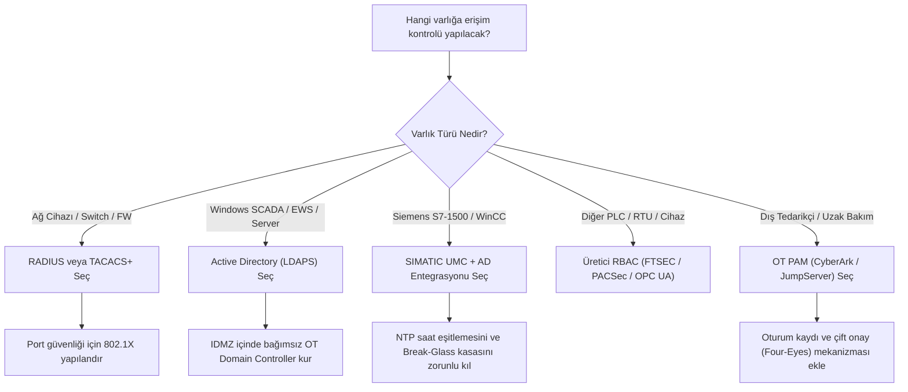

# OT kimlik ve erişim çözümleri seçim rehberi

[Ana sayfa](../../../README.md) · [Active Directory](01-active-directory-ve-ldap.md) · [RADIUS ve TACACS+](02-radius-ve-tacacs.md) · [Siemens UMC](03-siemens-simatic-umc.md) · [Çoklu Üretici ve OPC UA](04-coklu-uretici-ve-opc-ua.md) · [PAM ve Zero Trust](05-pam-ve-zero-trust.md) · [RBAC Tasarım Şablonu](../../../templates/12-ot-rbac-ve-umc-tasarim-sablonu.md)

Endüstriyel tesislerde (OT) tek bir kimlik çözümü tüm katmanların ihtiyacını karşılamaz. Ağ anahtarları, SCADA sunucuları, PLC kontrolörleri ve uzaktan erişim noktaları farklı protokol ve yetkilendirme modelleri gerektirir.

---

## 1. Karşılaştırma ve Seçim Matrisi

| Kimlik Çözümü | Birincil Kullanım Alanı | Desteklenen Protokoller | Artıları | Eksileri | Ne Zaman Seçilmeli? |
|---|---|---|---|---|---|
| **Active Directory (AD / LDAPS)** | SCADA sunucuları, Mühendislik İstasyonları (EWS), Historian (Level 2-3) | Kerberos, LDAPS (TCP 636) | Merkezi kullanıcı yönetimi, Windows ortamlarıyla tam entegrasyon, grup politikaları (GPO). | Doğrudan PLC seviyesine inemez; IT/OT bağımlılığı ve WAN kesintisi riski taşır. | Tesiste çok sayıda Windows tabanlı SCADA ve EWS istasyonu varsa. |
| **RADIUS / TACACS+** | Endüstriyel switch'ler, firewall'lar, router'lar ve 802.1X port güvenliği | RADIUS (UDP 1812), TACACS+ (TCP 49) | Ağ cihazlarında tek tek kullanıcı açmayı önler; port bazlı cihaz doğrulama (802.1X) sağlar. | PLC programlama veya SCADA ekran yetkilendirmesi yapamaz; sadece ağ cihazı yönetimidir. | Saha panolarındaki switch ve firewall yönetimini merkezileştirmek için. |
| **Siemens SIMATIC UMC** | Siemens TIA Portal, WinCC Unified ve S7-1500 PLC'ler | SADS, LDAPS, TLS Token | AD gruplarını doğrudan PLC CPU işlev haklarına (`CPU Function Rights`) ve HMI ekran butonlarına eşler. | Siemens dışı cihazlarda çalışmaz; NTP saat senkronizasyonuna aşırı bağımlıdır. | Ağırlıklı olarak Siemens S7-1500 ve WinCC Unified kullanılan hatlarda. |
| **Üretici Yerel Hesapları (Local / Standalone)** | Küçük/izole PLC'ler (S7-1200, Modicon M221, MicroLogix) | Yerel Firmware Veritabanı | Harici sunucu veya ağ bağımlılığı yoktur; bağlantı kopsa da çalışır. | Personel ayrılışlarında yüzlerce cihazın şifresini elle değiştirmek gerekir; denetim zordur. | Ağ bağlantısı olmayan izole makineler veya 5'ten az kontrolör içeren sistemler. |
| **PAM (Privileged Access Management)** | Tedarikçi uzaktan erişimi, kritik bakım oturumları, Break-Glass | RDP/SSH Proxy, HTTPS Kasa | Şifreyi kullanıcıya göstermez; oturumu videoya kaydeder; süreli ve onaylı erişim sağlar. | Yüksek lisans ve sunucu maliyeti; kurulum ve işletim uzmanlığı gerektirir. | Dış tedarikçilerin sahaya bağlandığı ve regülasyona tabi kritik tesislerde. |

---

## 2. Mimari Karar Akışı

---

## 3. Bölüm İçeriği ve Yönlendirmeler

- [Active Directory ve LDAP Mimarisi](01-active-directory-ve-ldap.md): OT'de güvenli AD kurulumu, RODC ve IDMZ yerleşimi.
- [RADIUS ve TACACS+ Rehberi](02-radius-ve-tacacs.md): Ağ cihazı yönetimi ve 802.1X port güvenlik ayarları.
- [Siemens SIMATIC UMC ve UMAC](03-siemens-simatic-umc.md): Ring Server, S7-1500 Central Logon ve Break-Glass.
- [Çoklu Üretici ve OPC UA RBAC](04-coklu-uretici-ve-opc-ua.md): Rockwell FTSEC, Schneider, ABB, DeltaV ve OPC UA Part 18.
- [PAM ve Zero Trust Mimarisi](05-pam-ve-zero-trust.md): Parola kasalama, süreli erişim ve oturum izolasyonu.
