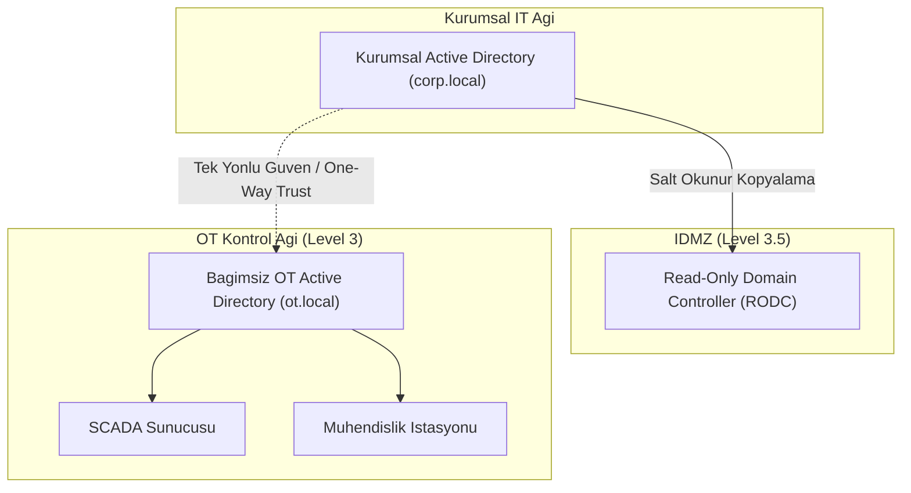

# Active Directory ve LDAP ile OT kimlik yönetimi

[Ana sayfa](../../../README.md) · [Seçim Rehberi](00-secim-ve-karsilastirma.md) · [RADIUS ve TACACS+](02-radius-ve-tacacs.md) · [Siemens UMC](03-siemens-simatic-umc.md) · [PAM ve Zero Trust](05-pam-ve-zero-trust.md)

Active Directory (AD), Windows tabanlı SCADA sunucuları, Historian veri tabanları ve Mühendislik İstasyonları (EWS) için merkezi kullanıcı ve grup politikası yönetimi sağlar.

---

## 1. OT Ortamında AD Mimari Modelleri

Kurumsal IT Active Directory yapısının doğrudan OT ağına uzatılması, IT tarafındaki bir fidye yazılımının (Ransomware) sahaya sıçramasına yol açar. Bu nedenle 3 farklı model uygulanır:

### Mimari Seçenekler:
1. **Bağımsız OT Ormanı (Dedicated OT Forest - Önerilen):** OT için ayrı bir alan adı (`ot.local`) kurulur. IT ağından tamamen bağımsızdır; IT çökse veya internet kesilse dahi saha çalışmaya devam eder.
2. **Tek Yönlü Güven (One-Way Trust):** OT etki alanı IT'ye güvenir, ancak IT etki alanı OT'ye güvenmez. IT kullanıcıları sahada kimlik doğrulaması yapabilir, ancak sahayı ele geçiren saldırgan kurumsal ağa geçemez.
3. **Read-Only Domain Controller (RODC):** IDMZ içine kurulan salt-okunur kopya; parola hash'lerini yerelde saklamaz ve saha güvenliğini riske atmaz.

---

## 2. Artılar ve Eksiler

| Artıları | Eksileri |
|---|---|
| Yüzlerce istasyonda tek noktadan hesap kapatma/açma. | PLC CPU'ları ve RTU'lar gibi mikroişlemcili cihazları doğrudan yönetemez. |
| Grup Politikaları (GPO) ile USB engelleme, ekran kilidi ve parola karmaşıklığı zorlama. | Yanlış yapılandırılmış bir GPO güncellemesi tüm SCADA istasyonlarını aynı anda kitleyebilir. |
| Kerberos ile şifrelenmiş, zaman damgalı bilet doğrulaması. | Domain Controller sunucusunun çökmesi yerel oturum açmaları yavaşlatabilir/engelleyebilir. |

---

## 3. Kritik OT Güvenlik Kuralları

- **LDAPS Zorunluluğu:** Dizin sorgularında şifresiz LDAP (Port 389) tamamen kapatılmalı; **LDAPS (TCP Port 636)** ve TLS 1.3 kullanılmalıdır.
- **NTLM Devre Dışı Bırakma:** Eski ve zafiyetli NTLMv1/v2 protokolü yerine **Kerberos AES-256** zorunlu kılınmalıdır.
- **Ayrıcalık Ayrımı (Tier Model):** Kurumsal Domain Admin hesabı asla OT istasyonlarında oturum açmamalıdır. OT için `OT_Domain_Admin` adında ayrı bir hesap tanımlanmalıdır.
- **Çevrimdışı Önbellek (Cached Credentials):** Ağ kesintisinde istasyonların kilitlenmemesi için Windows önbelleğe alınmış oturum açma sayısı (`CachedLogonsCount`) en fazla 3 ile sınırlandırılmalıdır.

---

## 4. Hızlı Konfigürasyon Kontrol Listesi

- [ ] OT için ayrı etki alanı (`ot.local`) kuruldu.
- [ ] Domain Controller sunucusu IDMZ veya Level 3 korumalı bölgeye yerleştirildi.
- [ ] LDAPS sertifikası (Port 636) yüklendi ve test edildi.
- [ ] GPO ile mühendislik istasyonlarında USB depolama birimleri engellendi.
- [ ] Güvenilir bir yerel NTP sunucusu ile zaman eşitlemesi yapıldı.
