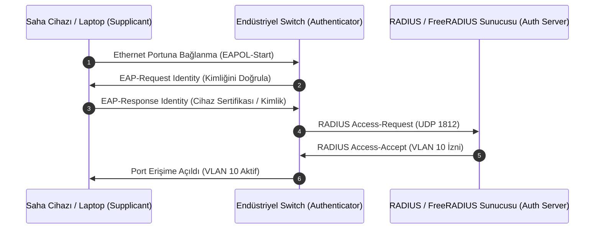

# RADIUS ve TACACS+ ile ağ cihazı ve port güvenliği

[Ana sayfa](../../../README.md) · [Seçim Rehberi](00-secim-ve-karsilastirma.md) · [Active Directory](01-active-directory-ve-ldap.md) · [Siemens UMC](03-siemens-simatic-umc.md) · [PAM ve Zero Trust](05-pam-ve-zero-trust.md)

Endüstriyel ağlarda çalışan yüzlerce switch (SCALANCE, Cisco IE, Hirschmann), firewall ve router üzerinde yerel kullanıcı açmak yerine **RADIUS** veya **TACACS+** protokolleri kullanılarak merkezi kimlik doğrulama (AAA) ve port güvenliği (802.1X) sağlanır.

---

## 1. RADIUS ve TACACS+ Karşılaştırması

| Özellik | RADIUS (RFC 2865/2866) | TACACS+ (Cisco / RFC 8907) |
|---|---|---|
| **Taşıma Protokolü** | UDP 1812 (Kimlik Doğrulama) & UDP 1813 (Muhasebe) | TCP 49 (Güvenilir ve bağlantı yönelimli) |
| **Paket Şifreleme** | Yalnızca parola alanı şifrelenir; paket başlığı ve kullanıcı adı açıktır. | Tüm paket gövdesi tamamen şifrelenir. |
| **AAA Ayrımı** | Kimlik Doğrulama (Authentication) ve Yetkilendirme (Authorization) birleşiktir. | Kimlik Doğrulama ve Yetkilendirme tamamen ayrı çalışır. |
| **Komut Düzeyi Yetki** | Yapılamaz; kullanıcıya sadece statik yetki seviyesi (Privilege Level) atanır. | Komut bazında denetim yapılır (ör. `show` çalışır, `configure terminal` engellenir). |
| **802.1X Port Güvenliği** | **Tam Destek:** IEEE 802.1X EAP mesajlaşmasını yerel olarak destekler. | 802.1X port doğrulamasında doğrudan kullanılmaz. |

---

## 2. IEEE 802.1X ile Saha Port Güvenliği

Saha panolarındaki switch'lerin boş RJ45 portlarına yetkisiz bir laptop veya kötü amaçlı cihaz takıldığında ağa erişmesini engellemek için **IEEE 802.1X** kullanılır:

### Eski (Legacy) Cihazlar İçin MAB (MAC Authentication Bypass):
802.1X desteklemeyen eski PLC ve sensörler için switch üzerinde **MAB** tanımlanır. Switch, cihazın MAC adresini RADIUS sunucusuna sorar; onaylı MAC listesindeyse portu ilgili izole VLAN'a bağlar.

---

## 3. Artılar ve Eksiler

| Artıları | Eksileri |
|---|---|
| Ağ cihazı yöneticilerinin tüm oturum ve komut kayıtları tek merkezde toplanır. | RADIUS/TACACS+ sunucusu çökerse yerel acil durum hesabı olmadan switch'e girilemez. |
| 802.1X ile saha panolarına yabancı donanım takılması fiziksel port seviyesinde engellenir. | MAB kullanılırken MAC adresi taklit edilebilir (MAC Spoofing riski). |
| AD/LDAP ile arkada entegre olarak kurumsal kullanıcı hesaplarını kullanabilir. | SCADA veya PLC içerisindeki uygulama lojiğini ve değişken haklarını yönetemez. |

---

## 4. Hızlı Konfigürasyon Kontrol Listesi

- [ ] Tüm switch ve firewall'larda yerel `admin` şifreleri kasaya kaldırıldı; AAA aktif edildi.
- [ ] RADIUS paylaşılan anahtarı (Shared Secret) en az 20 karakter karmaşık belirlendi.
- [ ] Saha panolarındaki boş switch portlarında 802.1X zorunlu kılındı.
- [ ] Ağ kesintisi senaryosu için yerel acil erişim hesabı test edildi.
