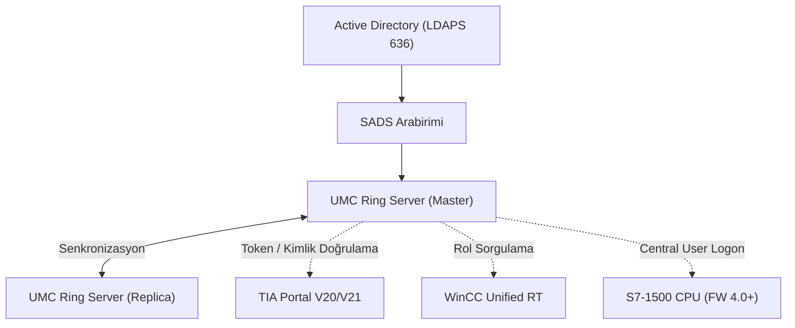
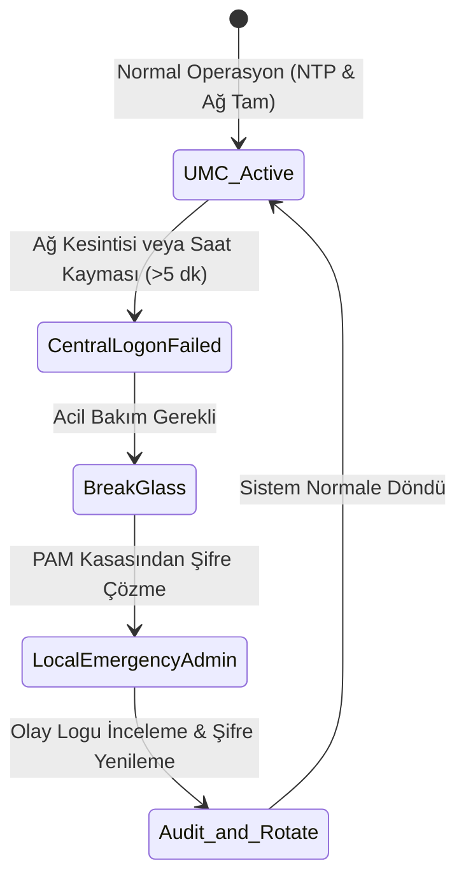

# Siemens SIMATIC UMC ve TIA UMAC ile merkezi kimlik yönetimi

[Ana sayfa](../../../README.md) · [Seçim Rehberi](00-secim-ve-karsilastirma.md) · [Active Directory](01-active-directory-ve-ldap.md) · [Çoklu Üretici ve OPC UA](04-coklu-uretici-ve-opc-ua.md) · [PAM ve Zero Trust](05-pam-ve-zero-trust.md) · [Tasarım Şablonu](../../../templates/12-ot-rbac-ve-umc-tasarim-sablonu.md)

Siemens ekosisteminde merkezi kimlik doğrulaması **SIMATIC UMC (User Management Component)** ile yapılırken, hedeflerdeki (TIA Portal, WinCC Unified, S7-1500 PLC) fonksiyonel işlev hakları **UMAC (User Management & Access Control)** arayüzü ile yönetilir.

---

## 1. Mimari ve Ring Server Topolojisi

SIMATIC UMC, tek hata noktası (SPOF) olmaması için yedekli **Ring Server** mimarisinde kurulur ve Active Directory ile **SADS (Secure Application Data Support)** üzerinden LDAPS (Port 636) ile konuşur:

### Donanım ve Yazılım Seviyesinde Yetkilendirme:
1. **S7-1500 (FW 4.0+) Central User Logon:** Kullanıcı PLC'ye bağlanırken UMC üzerinden doğrulanır; ancak ne yapabileceği (Program Yükleme, Force, Salt Okunur İzleme) CPU içindeki yerel `CPU Function Rights` tablosuna göre yürütülür.
2. **S7-1200 Sınırı:** S7-1200 (FW V4.7 dahil) doğrudan UMC sorgusu yapamaz; kullanıcılar TIA Portal projesinde yerel olarak tanımlanıp CPU'ya donanım yüklemesi ile aktarılır.
3. **WinCC Unified HMI:** UMC kullanıcı gruplarını buton bazlı ekran haklarına (`Operate`, `Recipe_Management`, `Modify_Safety_Parameters`, `Acknowledge_Alarms`) eşler.

---

## 2. Artılar ve Eksiler

| Artıları | Eksileri |
|---|---|
| AD gruplarını doğrudan TIA Portal ve PLC CPU seviyesindeki mühendislik haklarına bağlar. | Siemens dışı otomasyon cihazlarında (Rockwell, Schneider, ABB) kullanılamaz. |
| 10 kullanıcıya kadar ücretsizdir (TIA ve WinCC ile birlikte gelir). | S7-1500 PLC'lerin FW 4.0+ ve TIA V20+ sürümüne yükseltilmesini gerektirir. |
| Ring mimarisi ile sunucu arızalarında kesintisiz devralma (Failover) sağlar. | NTP zaman senkronizasyonu kayarsa (>5 dk) X.509 sertifika doğrulaması çöker ve girişler kilitlenir. |

---

## 3. Kritik İşletimsel Bağımlılıklar ve Break-Glass

1. **NTP Senkronizasyon Kuralı:** Tüm PLC ve UMC sunucuları ortak bir yerel Stratum-1/2 NTP saat kaynağına kilitlenmelidir.
2. **Break-Glass (Acil Erişim) Hesabı:** UMC veya ağ çöktüğünde CPU'ya erişebilmek için her S7-1500 üzerinde `Local_Emergency_Admin` yerel hesabı tanımlanmalı ve parolası merkezi PAM kasasında mühürlü saklanmalıdır. Kullanım sonrası şifre derhal yenilenmelidir.

---

## 4. Hızlı Konfigürasyon Adımları

1. Birincil ve ikincil sunuculara UMC kurun; dahili CA ile sertifika üretip Ring senkronizasyonunu başlatın.
2. SADS üzerinden AD bağlantısını (`ldaps://ot-dc.corp.local:636`) yapılandırın ve grupları içe aktarın.
3. TIA Portal projesinde `Central User Management (UMC)` seçin ve sunucu IP/sertifikasını girin.
4. S7-1500 CPU donanım ayarlarında `Central Users and Roles` $\to$ `Enable central user administration` kutusunu işaretleyin.
5. `CPU Function Rights` tablosunda rolleri eşleyin ve NTP istemcisini aktif ederek CPU'ya yükleyin.
