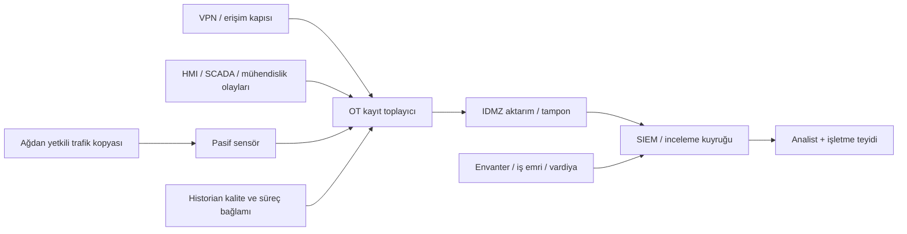

# OT SOC, algılama mühendisliği ve adli inceleme

[İzleme temelleri](../04-savunma/03-izleme-ve-algilama.md) · [Algılama kartı](../../templates/03-algilama-karti.md) · [Kayıt alıştırması](../../labs/01-kayit-analizi.md)

Bu bölüm, bir güvenlik gözleminin işletme kararına nasıl taşınacağını açıklar. SIEM farklı kaynakları birleştiren kayıt ve analiz katmanıdır; IDS gözlemlediği davranışı bildirir; IPS trafik yolunda engelleme uygulayabilir. Bir ürünün bu adlardan birini taşıması, bütün OT protokollerini veya şifreli trafiğin içeriğini çözümlediğini göstermez. Ürün kapsamları [araç karşılaştırmasında](../10-araclar-ve-maliyet/01-arac-ve-urun-karsilastirmasi.md) ayrıca değerlendirilir.

## 1. Kayıt ve izleme mimarisi

Aşağıdaki yapı özgün, kurgusal bir mimaridir. Oklar veri aktarımını gösterir; birebir firewall kuralı veya tek yönlü fiziksel bağlantı garantisi değildir.



SPAN, switchin seçilen trafiği kopyaladığı gözlem yoludur; TAP ayrı bir kopyalama elemanı olabilir. Bir gözlem noktasının kapasitesi, yönleri, etiketleri ve kayıp davranışı belgelenmeden "tüm ağı görüyoruz" denmez. Aynalanan paketin sensöre ulaşması ile SIEM'e anlamlı olay ulaşması ayrı kabul maddeleridir. Kurulum önerileri [NIST OT rehberinin](https://csrc.nist.gov/pubs/sp/800/82/r3/final) ağ izleme bağlamından hareketle oluşturulmuş özgün inceleme sorularıdır.

Pasif IDS kontrol trafiğini doğrudan engellemez; görünürlük kaybı yine alarm kaçırmaya yol açabilir. Inline IPS için kural hatası, cihaz arızası, gecikme ve bypass davranışı süreç açısından değerlendirilir. "Fail-open" güvenlik açığını, "fail-closed" hizmet kesintisini artırabilir; karar kullanılan süreç ve bağımsız korumalara bağlıdır. Hazır IT engelleme politikasını kontrol ağına taşımak kabul testi yerine geçmez.

## 2. Toplanacak alanlar ve sınırlar

| Kaynak | Asgari anlam | Birleştirilecek bağlam | Kayıt kaybolursa |
|---|---|---|---|
| Windows / mühendislik istasyonu | Oturum, ayrıcalık, uygulama ve proje olayı | Hesap, varlık, bakım işi, onaylı sürüm | Ajan/to playıcı sağlığı; yazılımın kayıt üretip üretmediği |
| Firewall / akış | Kaynak, hedef, yön, izin/ret ve kural | Akış sahibi ve kullanım amacı | Cihaz saati, kuyruk ve aktarım sağlığı |
| VPN / PAM | Kişi, hedef, süre, sonuç ve oturum kimliği | Tedarikçi onayı ve hedefteki işlem | Kapı kaydı ile hedef kaydı ayrı aranır |
| PLC / SCADA olayı | Cihazın gerçekten kaydettiği değişiklik veya durum | Ürün/sürüm, proje kimliği, operatör işlemi | Cihazda bu kayıt yeteneği yoksa görünürlük boşluğu yazılır |
| Historian | Ölçüm, kalite, özgün zaman ve varlık | İşletme modu ve bağımsız gösterge | Eski değer ile sabit süreç ayrılır |
| Ağ sensörü | İletişim çifti, protokol, görülebilen işlem | Envanter, gözlem noktası, desteklenen çözümleyici | Paket kaybı ve şifreli/gözlem dışı alan raporlanır |

Normalleştirilmiş kayıtta özgün olay korunur. `event_time`, `ingest_time`, `source_timezone`, `clock_uncertainty`, `asset_id`, `actor`, `action`, `target`, `change_id`, `quality`, `evidence_id` gibi alanlar kullanılabilir. Bu adlar özgün örnek şemadır; belirli SIEM'in hazır alanları değildir. Kimlik eşlemesi başarısızsa kullanıcıyı boş bir yönetici hesabıyla doldurmayın.

### Zaman ve temel davranış

- Saat dilimi bilinse de saat doğru olmayabilir. Kaynak saati, ölçülen sapma, belirsizlik aralığı ve merkezi zaman hizmetinin durumu ayrı kaydedilir.
- Aynı zaman sunucusundan türetilen iki kayıt birbirinin saat doğruluğuna bağımsız kanıt değildir.
- Olayların zaman belirsizliği aralıkları çakışıyorsa kesin bir önce/sonra sırası kurulmaz. Özgün zaman korunur; düzeltilmiş değer ayrı alana yazılır.
- Temel davranış (baseline) yalnız trafik ortalaması değildir. Normal üretim, duruş, bakım, devreye alma ve acil işletme ayrı bağlamlardır.
- Yeni iletişim çifti bir inceleme sebebidir; tek başına ihlal değildir. Otomatik öğrenilen profil onaysız veya bozuk başlangıç durumunu da öğrenebilir.

## 3. Altı algılama tasarımı

Bu tablo, test edilmiş ürün kuralları değil, sentetik kayıtlara uygulanacak özgün mantık tasarımlarıdır. Önce veri alanlarının gerçekten geldiği doğrulanır.

| Kimlik | Davranış ve mantık | Gerekli kanıt | Normal açıklama | Doğrulama çifti |
|---|---|---|---|---|
| DET-01 | Proje kimliği değişti ve onaylı değişiklikle eşleşmiyor | Önce/sonra proje, kullanıcı, cihaz olayı | Planlı yükleme veya kurtarma | Onaylı değişiklik alarm dışı; açıklamasız fark inceleme |
| DET-02 | Mühendislik rolünde konuşan kaynak izinli envanterde yok | Kaynak kimliği, sensör kapsamı, kayıt tarihi | Yeni kabul edilmiş bakım cihazı | Güncel kabul kaydıyla normal; kimlik belirsizse inceleme |
| DET-03 | Yeni Modbus istemci–sunucu çifti beklenen matriste yok | Akış, kullanım modu, cihaz değişikliği | Yedek sunucuya geçiş | Onaylı yedek normal; bilinmeyen çift inceleme |
| DET-04 | Gözlenen yazma işlemi rol/iş emri/çalışma moduyla uyuşmuyor | İşlem türü ve yetki bağlamı | Yetkili operatör veya bakım işlemi | Aynı işlem onaylı ve onaysız bağlamda ayrılmalı |
| DET-05 | Firmware değişikliği güvenilir sürüm kaydıyla eşleşmiyor | Gerçek sürüm kanıtı, onay, üretici bilgisi | Belgelenmiş firmware geçişi | Doğrulanmış geçiş normal; yalnız banner farkı belirsiz |
| DET-06 | Uzak oturum hedefi veya süresi izin kapsamını aşıyor | Kapı, hedef, onay aralığı, saat kalitesi | Onaylı acil uzatma | Kayıtlı uzatma normal; kapsam aşımı inceleme |

DET-04 işlem yetkisini inceler; ağ kaydındaki bir yazma isteğinin başarılı olduğu veya fiziksel değişiklik yaptığı ayrıca gösterilmelidir. DET-05 firmware kaydı olmadan sırf trafik miktarıyla firmware değişti sonucuna ulaşamaz.

### Örnek mantık ve küçük test kümesi

```text
Girdi: olay, varlık envanteri, değişiklik kaydı, zaman belirsizliği
Eğer olay veya onay kaydı eksikse: VERI_EKSIK
Eğer zaman belirsizliği izin sınırını aşıyorsa: ZAMAN_TEYIDI
Eğer işlem, hedef ve süre onayla eşleşiyorsa: BEKLENEN_BAKIM
Aksi halde: INCELEME_GEREKLI
Çıktı: karar + kanıt kimlikleri + eksik alanlar; otomatik PLC müdahalesi yok
```

| Kurgusal olay | Girdi | Beklenen çıktı |
|---|---|---|
| E-01 | ENG-01, PLC-01, değişiklik D-01 içinde proje güncellemesi | BEKLENEN_BAKIM |
| E-02 | Aynı hedefte başka kullanıcı; D-01 yalnız ENG-01'i kapsıyor | INCELEME_GEREKLI |
| E-03 | Kullanıcı kaydı yok; yalnız proje farkı var | VERI_EKSIK |
| E-04 | İşlem zaman aralığı bakım sonuyla çakışıyor; kaynak saati belirsiz | ZAMAN_TEYIDI |

Örneğin SQL benzeri bir arama için `action = 'project_changed' AND change_id IS NULL` aday kayıtları seçebilir. `change_id` yokluğu, onaysız değişiklik ile başarısız zenginleştirmeyi ayıramaz; yukarıdaki karar akışı bu ayrımı zorunlu kılar. Bu ifade canlı bir SIEM'de denenmiş entegrasyon değildir.

## 4. 24/7 OT SOC işletim modeli

| Rol | Karar / çıktı | Yetki sınırı |
|---|---|---|
| Tier 1 | Veri sağlığı, varlık ve iş emri kontrolü; olay açma | Tek başına süreç veya cihaz durdurmaz |
| Tier 2 | Kaynaklar arası korelasyon, alternatif açıklama, kapsam | Proses etkisini OT sorumlusuyla doğrular |
| Tier 3 / uzman | Karmaşık inceleme, kök neden ve teknik destek | Ürüne müdahale için ayrı kapsam/onay |
| Detection engineering | Kural yaşam döngüsü, test kümesi, yanlış pozitif | Kural geçişi değişiklik kaydıyla yapılır |
| Threat intelligence | Kuruma uygulanabilir tehdit/duyuru bağlamı | Aktör atfını kanıtın ötesine taşımaz |
| Incident response | Koordinasyon, kanıt ve müdahale seçenekleri | Emniyet ve işletme yetkisini devralmaz |
| OT mühendisi / vardiya amiri | Fiziksel durum, bakım, saha ve dönüş kabulü | Dijital olayın bütün nedenlerini tek başına varsaymaz |

Vardiya devri açık olay, eksik kanıt, sürmekte olan bakım ve sonraki karar zamanını içerir. 24/7 hizmet için gece işletme temsilcisine erişim, tedarikçi çağrı yolu ve kayıt sistemi arızasının bildirimi tasarlanır. Personel sayısı; alarm yükü, inceleme süresi, izin/eğitim ve yedek kapasiteyle hesaplanır. Bir dashboard veya nöbetçi telefon tek başına SOC hizmeti değildir.

NIST SP 800-61 Rev. 3 olay müdahalesini risk yönetimiyle bütünleştirir. Buradaki rol tablosu standardın zorunlu organizasyon şeması değil, özgün uygulama önerisidir. [NIST SP 800-61 Rev. 3](https://csrc.nist.gov/pubs/sp/800/61/r3/final)

## 5. Adli inceleme ve kanıtın korunması

1. Hangi soruya cevap arandığını ve hangi kaynağın bunu gösterebileceğini yazın.
2. Yetkili mevcut kayıtları özgün biçimiyle koruyun; çalışma kopyasını ayırın.
3. Kaynak, alan rol, zaman/saat dilimi, yöntem, bütünlük kaydı ve devirleri [kanıt zincirine](../../templates/04-olay-ve-kurtarma.md) yazın.
4. Ağ isteği, cihaz yanıtı ve fiziksel süreç sonucunu ayrı değerlendirin.
5. Eksik günlük veya saat belirsizliği nedeniyle verilemeyen kararı belirtin.
6. Toplama işleminin süreç etkisi varsa işletme/emniyet değerlendirmesini önceleyin; kontrolöre genel amaçlı inceleme aracı çalıştırıldığı varsayılmasın.

Bütünlük özeti, alınmış kopyanın sonradan değişmediğini kontrol etmeye yardım eder; kaynağın olaydan önce doğru olduğunu kanıtlamaz. Historian ile HMI aynı veri sunucusunu kullanıyorsa iki ekran bağımsız doğrulama oluşturmaz. Disk, bellek veya PLC projesi toplama yöntemi ürün/sürüm ve kapsam gerektirir; bu belge yalnız kayıt inceleme yöntemini öğretir.

## 6. Belge alıştırması ve kabul

**THEORY:** SIEM, IDS ve IPS'nin görev farkını yazın. **LAB:** Yukarıdaki dört olayı DET-01 için işleyin. **TEST:** Eksik iş emrini yanlışlıkla saldırı sayan bir kuralın hatasını gösterin. **DEFENSE:** Zaman ve kayıt sağlığı için iki kontrol ekleyin. **REPORT:** Bir alarm aktarım notu ve bir kanıt zinciri satırı hazırlayın.

Kabul: dört olayın gerekçeleri ayrılmış, veri eksikliği görünür, süreç etkisi kanıtsız ilan edilmemiş, alarm sahibinin sonraki kararı belli olmalıdır. Ölçütler: bağlamı tam kayıt oranı, kayıp kayıt aralığı, işletme teyidi süresi ve yanlış pozitif nedenleri; her oran kendi paydasıyla raporlanır.

## Kaynak ve kapsam

- NIST, SP 800-82 Rev. 3, Eylül 2023, [OT rehberi](https://csrc.nist.gov/pubs/sp/800/82/r3/final); OT izleme ve süreç bağlamı.
- NIST, SP 800-61 Rev. 3, 3 Nisan 2025, [yayın kaydı](https://csrc.nist.gov/pubs/sp/800/61/r3/final); olay müdahalesi/risk yönetimi ilişkisi.
- MITRE [ICS taktik ve teknikleri](https://attack.mitre.org/matrices/ics/), dinamik kayıt; davranış adları için mevcut [eşleme bölümü](../03-tehdit-modelleme/02-mitre-attack-ics.md).

Erişim: 16.09.2026. Mimari, şema, altı algılama mantığı, örnek kayıtlar ve kabul ölçütleri özgün eğitim sentezidir. Veri ve zaman sınırları gerçek bir ürün performansı iddiası değildir.
