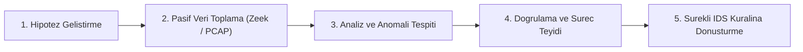
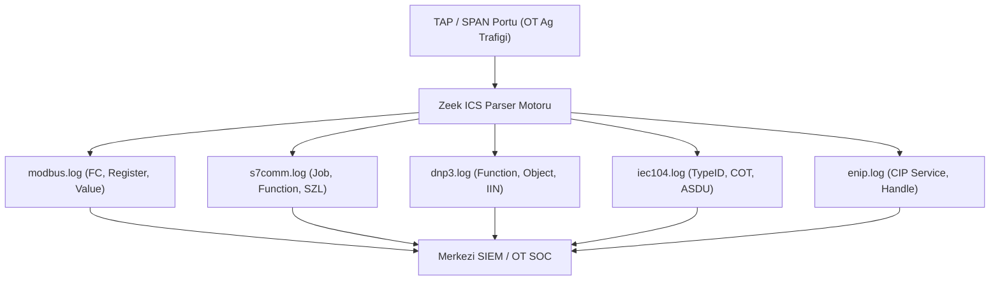

# OT ağlarında tehdit avcılığı ve IDS kural mühendisliği

[Ana sayfa](../../README.md) · [İzleme ve algılama](../04-savunma/03-izleme-ve-algilama.md) · [OT SOC ve adli inceleme](02-izleme-soc-ve-adli-inceleme.md) · [Suricata Kural Dosyası](../../research/suricata-ics-rules.rules) · [Sektörel senaryolar](../02-sektorler/senaryolar/README.md)

**İnceleme tarihi: 18.09.2026.** Bu bölüm; endüstriyel ağlarda pasif kural tabanlı alarmların ötesine geçerek, aktif tehdit avcılığı (OT Threat Hunting) metodolojisini, **Zeek (Bro)** ağ güvenlik izleme motorunun ICS çözümleyicilerini, **Suricata IDS** derin paket inceleme (DPI) imza mühendisliğini ve **Wireshark** paket analiz reçetelerini inceler.

---

## 1. OT Tehdit Avcılığı (Threat Hunting) Yaşam Döngüsü

Geleneksel IT tehdit avcılığından farklı olarak, OT ortamlarında aktif tarama (Active Scanning) veya uç nokta ajanları (EDR) ile bellek dökümü almak prosesi çökertebilir. Bu nedenle OT tehdit avcılığı **tamamen pasif ağ telemetrisi (SPAN/TAP), derin paket analizi ve protokol durum modellerine** dayanır.



### Hipotez Örnekleri:
1. *"Saldırgan, mesai saatleri dışında mühendislik istasyonundan PLC'ye yetkisiz S7comm program yüklemesi (Block Download) yapmış olabilir."*
2. *"Bir PLC'nin holding register'larına SCADA sunucusu dışındaki bilinmeyen bir IP adresinden Modbus FC16 yazma isteği gönderiliyor olabilir."*
3. *"DNP3 outstation cihazlarına yetkisiz soğuk yeniden başlatma (Cold Restart) komutu fırlatılmış olabilir."*

---

## 2. Zeek ICS Çözümleyicileri ve Log Mimarisi

Zeek, endüstriyel ağ trafiğini ham paket olarak değil, ayrıştırılmış ve yapılandırılmış metin günlükleri (Structured Logs) olarak sunar:



### 2.1. Temel Zeek ICS Log Alanları

| Log Dosyası | Kritik Alanlar | Tehdit Avcılığı Anlamı |
|---|---|---|
| `modbus.log` | `uid`, `id.orig_h`, `id.resp_h`, `func`, `unit_id`, `register`, `value` | Normalde salt okunur (`func=3 / 0x03`) çalışan sistemde `func=5` veya `func=16` yazma eylemlerini filtreleme. |
| `s7comm.log` | `rosctr`, `function`, `subfunction`, `job_id` | PLC'ye STOP komutu (`function=0x29`) veya Blok İndirme (`function=0x1A`) komutlarını yakalama. |
| `dnp3.log` | `fc`, `iin`, `objects`, `execute_status` | Outstation yeniden başlatma (`fc=13 / Cold Restart`) ve doğrudan kesici açma isteklerini izleme. |
| `iec104.log` | `type_id`, `cot`, `asdu_addr`, `ioa` | Tek komut (`type_id=45 / C_SC_NA_1`) enjeksiyonu ve genel sorgu (`type_id=100`) taramalarını tespit etme. |
| `enip.log` | `command`, `cip_service`, `session_handle` | EtherNet/IP üzerinden izinsiz `Set_Attribute_Single` veya `Write_Tag` servislerini listeleme. |

### 2.2. Örnek Tehdit Avcılığı SIEM Sorgusu (Splunk / Elastic)

```sql
-- Yetkisiz İstemcilerden Gelen Modbus Yazma İsteklerini Avlama
index=ot_network sourcetype=zeek_modbus func IN (5, 6, 15, 16)
| search NOT [ search index=ot_assets role="SCADA_Master" | fields id.orig_h ]
| stats count by id.orig_h, id.resp_h, func, register
```

---

## 3. Suricata ile Endüstriyel İmza Mühendisliği

Açık kaynaklı Suricata IDS, yerel endüstriyel protokol anahtar kelimeleri (`modbus.function`, `modbus.access`, `dnp3_ind`) ve durum denetimli akış (`flow:established,to_server;`) yetenekleri ile OT derin paket incelemesinde kullanılır.

Tam kural seti repoda [research/suricata-ics-rules.rules](../../research/suricata-ics-rules.rules) dosyasında sunulmaktadır.

### Seçilmiş Kritik Suricata İmzaları:

```suricata
// 1. Modbus FC05 Bobin Yazma Uyarısı (Yetkisiz Vana/Pompa Müdahalesi)
alert modbus $EXTERNAL_NET any -> $HOME_NET 502 (msg:"OT-IDS: Modbus FC05 Write Single Coil Request"; flow:established,to_server; modbus.function:5; modbus.access:write; classtype:protocol-command-decode; sid:1000001; rev:1;)

// 2. Siemens S7comm CPU STOP Komutu (PLC Durdurma Saldırısı)
alert tcp $EXTERNAL_NET any -> $HOME_NET 102 (msg:"OT-IDS: Siemens S7comm CPU Stop Command Sent to PLC"; flow:established,to_server; content:"|32 01|"; depth:2; offset:7; content:"|29 00 00 00 00 00 09 50 5f 50 52 4f 47 52 41 4d|"; distance:0; classtype:policy-violation; sid:1000005; rev:1;)

// 3. DNP3 Outstation Soğuk Yeniden Başlatma (Cold Restart)
alert tcp $EXTERNAL_NET any -> $HOME_NET 20000 (msg:"OT-IDS: DNP3 Outstation Cold Restart Command"; flow:established,to_server; content:"|05 64|"; depth:2; content:"|0d|"; offset:12; depth:1; classtype:policy-violation; sid:1000009; rev:1;)

// 4. IEC 60870-5-104 C_SC_NA_1 Kesici Kumanda Komutu
alert tcp $EXTERNAL_NET any -> $HOME_NET 2404 (msg:"OT-IDS: IEC 104 C_SC_NA_1 Single Command Sent to RTU"; flow:established,to_server; content:"|68|"; depth:1; content:"|2d|"; offset:6; depth:1; classtype:protocol-command-decode; sid:1000012; rev:1;)
```

---

## 4. Wireshark OT Paket İnceleme ve Filtreleme Reçeteleri

OT olay müdahalesi veya paket analizi sırasında analistin hızlıca filtreleme yapabilmesi için kullanılan kritik filtreler:

| Protokol | Wireshark Display Filter | Amacı ve Yakaladığı Olay |
|---|---|---|
| **Modbus TCP** | `mbtcp.prot_id == 0 && modbus.func_code in {5, 6, 15, 16}` | Tüm Modbus yazma (Coil & Register Write) işlemlerini listeleme. |
| **Modbus TCP** | `modbus.func_code == 8` | Modbus Diagnostic loopback / keşif taramalarını yakalama. |
| **Siemens S7** | `s7comm.header.rosctr == 1 && s7comm.param.func == 0x29` | S7 CPU STOP komutu enjeksiyonunu filtreleme. |
| **Siemens S7** | `s7comm.param.func == 0x1a` | PLC program bloğu indirme (Block Download) başlangıç istekleri. |
| **DNP3** | `dnp3.al.func == 0x05 \|\| dnp3.al.func == 0x06` | DNP3 Direct Operate ve Direct Operate No Ack kumanda paketleri. |
| **DNP3** | `dnp3.al.func == 0x0d \|\| dnp3.al.func == 0x0e` | DNP3 Cold Restart ve Warm Restart cihaz kapatma komutları. |
| **IEC 104** | `iec60870_104.asdu.typeid == 45 \|\| iec60870_104.asdu.typeid == 46` | Tekli/çiftli kesici aç-kapa telekontrol komutları. |
| **IEC 61850** | `goose.sqNum == 0 \|\| goose.stNum == 0` | GOOSE yeniden başlatma ve durum numarası anomalileri. |
| **EtherNet/IP** | `enip.command == 0x006f && cip.service == 0x4d` | CIP Tag Write servisi (Değişken üzerine yazma). |

---

## 5. Masa Başı Tehdit Avcılığı Alıştırması

**Vaka:** Gece 02:45'te SCADA sisteminde arıtma havuzu klorlama pompası aniden durmuş, ancak operatör loglarında hiçbir kumanda kaydı bulunamamıştır.

```text
[AVCILIK ADIMI 1] SPAN Portu PCAP Dökümünü İnceleme:
- Filtre: mbtcp && ip.dst == 192.168.10.50 (Klorlama PLC IP'si)
- Tespit: 02:44:58'de 192.168.30.105 (Mühendislik İstasyonu) IP'sinden FC 05 (Write Single Coil) paketi gönderilmiş; Coil 0x0012 (Pompa Run) = 0x0000 (STOP) yapılmıştır.

[AVCILIK ADIMI 2] Zeek Log Korelasyonu:
- modbus.log incelenmiş; id.orig_h=192.168.30.105, func=5, register=18 kaydı doğrulanmıştır.

[AVCILIK ADIMI 3] Kök Neden Tespiti:
- Mühendislik istasyonundaki EWS yetkisiz uzaktan erişim oturumu üzerinden saldırgan tarafından kullanılmıştır.

[AVCILIK ADIMI 4] İyileştirme:
- Suricata kuralı (sid: 1000001) devreye alınmış; mühendislik istasyonunun PLC'ye doğrudan Modbus FC05 atması firewall üzerinde bloke edilmiştir.
```

---

## 6. Kaynaklar ve İlgili Dokümanlar

- [Suricata ICS Kural Dosyası](../../research/suricata-ics-rules.rules)
- [OT SOC ve Adli İnceleme Rehberi](02-izleme-soc-ve-adli-inceleme.md)
- [İzleme ve Algılama Temelleri](../04-savunma/03-izleme-ve-algilama.md)
- [Protokol Kataloğu](../07-protokoller/01-protokol-katalogu.md)
- [Zeek Network Security Monitor ICS Analyzers](https://github.com/cisagov/ics-zeek-build)
- [CISA ICS-CERT Snort & Suricata Signatures](https://www.cisa.gov/resources-tools/resources/ics-cert-advisories)
