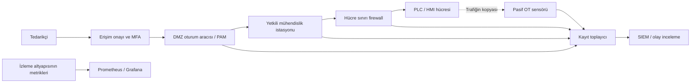

# OT güvenliği araç ve ürün karşılaştırması

[Ana sayfa](../../README.md) · [Siemens ve kullanıcı yönetimi](02-siemens-ve-merkezi-kullanici-yonetimi.md) · [Maliyet modeli](03-maliyet-ve-secim-modeli.md) · [Araştırma kaydı](../../research/arac-urun-kaynaklar.md)

**İnceleme tarihi: 16.09.2026.** Bu bölüm master programın 6, 11, 14, 15, 31, 36 ve 37. başlıklarının ürün tarafını karşılar. Amaç bir satın alma sıralaması yapmak değil, ihtiyacı doğru işlevle eşleştirmektir. Ürün ailesi, belirli model/sürüm ve satın alınan modül farklı şeylerdir. Aşağıdaki yerleşim, kısıt değerlendirmeleri, seçim soruları ve alıştırmalar **bu deponun özgün eğitim sentezidir**. Ürün özelliklerinin yanında üretici kaynağı bulunur; saha performansı ölçülmemiştir.

## Önce işlevi ayır

| İşlev | Yanıtladığı soru | Örnek çıktı | Yerini tutmadığı işlev |
|---|---|---|---|
| SIEM: güvenlik olaylarının toplanması ve ilişkilendirilmesi | Farklı sistemlerde aynı olaya ilişkin hangi kayıtlar var? | Zaman çizelgesi, alarm, olay kaydı | Trafiği görmeyen SIEM kendiliğinden PLC protokol çözümleyicisi olmaz |
| OT IDS / ağ izleme | Gözlenen endüstriyel iletişimde ne değişti? | Varlık ilişkisi, protokol olayı, anomali | Pasif sensörün alarm vermesi paketi engellediği anlamına gelmez |
| Firewall / IPS | Hangi akış geçebilir; hangi örüntü engellenecek? | İzin/ret kuralı, engelleme kaydı | Süreç sahibinin emniyet kararını vermez |
| PAM: ayrıcalıklı erişim yönetimi | Kim, hangi ayrıcalıkla, ne zaman erişti? | Süreli oturum, kayıt, kasa politikası | PLC'nin kendi fonksiyon yetkilendirmesini otomatik olarak kurmaz |
| Paket inceleme | Verilen pakette hangi alanlar var? | Çevrimdışı PCAP çözümlemesi | Tek başına merkezi SOC işletimi değildir |
| Metrik izleme | İzleme sisteminin kendisi çalışıyor mu? | Disk, kuyruk, paket kaybı, servis sağlığı | Güvenlik olaylarının tam kanıt arşivi değildir |
| Simülatör / honeypot | Eğitim süreci nasıl modellenir; sahte hizmette ne gözlenir? | Kurgusal proses veya etkileşim kaydı | Gerçek PLC'nin emniyet ve zamanlama eşdeğeri değildir |

Bu ayrımların uygulanacağı OT ortamında kontrol akışına eklenen bileşenin gecikmesi, arıza davranışı ve bakım penceresi de değerlendirilir. NIST, OT güvenliğini performans, güvenilirlik ve emniyet gereksinimleriyle birlikte ele alır. [NIST SP 800-82 Rev.3](https://csrc.nist.gov/pubs/sp/800/82/r3/final)

## Mimari yerleşim

Aşağıdaki akış **kurgusal belgesel tasarımdır**. Oklar hizmet ilişkisini gösterir; doğrudan izin verilen ağ bağlantısı veya kurulum talimatı değildir.

Belgeye sensörün gördüğü akışlar kadar göremedikleri de yazılır: yerel seri haberleşme, aynalanmayan port, şifreli içerik, zaman damgası belirsizliği. OT IDS adı taşıyan ürünlerde aktif sorgu seçenekleri bulunabilir; yalnızca seçilen pasif toplama kipinin tasarımı pasif sayılır.

## SIEM ve inceleme platformları

Yerleşim sütunu önerilen eğitim kullanımını; lisans sütunu incelenen resmî sayfanın kapsamını gösterir. Listede ürünlerin aynı işlev derinliğine sahip olduğu varsayılmaz.

| Ürün / incelenen kapsam | Amaç ve dağıtım | OT açısından değerlendirme | Lisans ve maliyet etkeni |
|---|---|---|---|
| Splunk Enterprise Security; canlı fiyat sayfası | Güvenlik analitiği; bulut veya kurum içinde yönetilen dağıtım | OT sensör ve uygulama kayıtları için veri modeli, alan eşleme ve içerik geliştirme planlanır | Sürüm/pakete göre ingest, workload veya activity modeli; depolama ve destek kapsamı ayrı; **teklif gerekli**. [Splunk](https://www.splunk.com/en_us/products/pricing.html) |
| Microsoft Sentinel; canlı fiyat sayfası | Bulut tabanlı SIEM; analytics ve data lake katmanları | OT'den çıkacak veri, bağlantı kesintisindeki kuyruk ve bölge seçimi değerlendirilir | Kullanıma göre veya taahhütlü kapasite; saklama, sorgu ve ek Azure servisleri maliyeti. Sayısal bölgesel fiyat erişilen tabloda görünmedi; hesaplayıcı/teklif gerekli. [Microsoft](https://www.microsoft.com/en-us/security/pricing/microsoft-sentinel/) |
| IBM QRadar SIEM; kurum içi ürün | Donanım veya sanal appliance; olay ve akış analizi | Kayıt olay hızı ile akış sayısı aynı ölçü değildir; kapasite ayrı belirlenir | EPS/FPM kullanım modeli veya MVS kurumsal modeli; abonelik/kalıcı lisans seçenekleri; **teklif gerekli**. Bu satır SaaS ürün yaşam döngüsünü açıklamaz. [IBM](https://www.ibm.com/products/qradar-siem/pricing) |
| Elastic Security / Elastic Stack; self-managed abonelik matrisi | Arama, veri alma ve güvenlik analitiği; kendi altyapısında işletim | İçerik, veri saklama ve küme işletimi için ekip gerekir; özellikler paket düzeyinde doğrulanır | Ücretsiz Basic ile ücretli Enterprise eşdeğer değildir; örneğin gelişmiş kimlik/denetim işlevleri pakete bağlıdır. **Ücretli kapsam için teklif gerekli.** [Elastic](https://www.elastic.co/subscriptions) |
| Wazuh; current dokümantasyonu | Ücretsiz açık kaynak SIEM/XDR; sunucu, indeksleyici, arayüz ve uygun uç sistemlerde ajan | Windows/Linux kayıtları ve dosya bütünlüğü gibi kaynakları birleştirmek için aday; PLC'ye ajan kurulabileceği varsayılmaz | Kendi barındırdığın açık kaynak yazılım için lisans bedeli yok; sunucu, depolama, destek ve kural bakımı maliyetlidir. [Wazuh](https://documentation.wazuh.com/current/getting-started/index.html) |
| Security Onion; 3/main dokümantasyonu | Suricata, Zeek, paket ve uç sistem kayıtlarıyla ağ/olay inceleme platformu | Sensör yerleşimi ve paket saklama gereksinimi ayrıca boyutlandırılır | Ücretsiz kullanılabilen kapsam bulunur; Elastic ve Security Onion bileşenleri **ELv2** lisanslıdır. Tümü açık kaynak sayılmaz; Pro/destek ayrıca değerlendirilir. [İşlev](https://docs.securityonion.net/en/3/main/introduction/), [lisans](https://docs.securityonion.net/en/3/main/license/) |

**Eğitim yorumu:** Bir üründeki hazır bağlayıcının varlığı, bütün PLC olaylarının toplandığını kanıtlamaz. Deneme veri kümesinde kaynak zamanı, alım zamanı, varlık kimliği, kullanıcı, olay sonucu ve bakım kaydı ilişkisinin korunması istenir. Örnek algılama kartı [izleme bölümündedir](../04-savunma/03-izleme-ve-algilama.md).

## OT görünürlüğü ve IDS ürünleri

Bu karşılaştırma üretici beyanının işlev sınırıdır. Protokol sayısı başarı puanı olarak kullanılmaz. Aynı protokolün varlığını tanımak, mesaj alanlarını çözmek, varlık sürümünü belirlemek ve yazma işlemini engellemek ayrı yeteneklerdir.

| Ürün | Belgelenen toplama / dağıtım | Belgelenen işlev | Kapsam, destek ve maliyet sorusu |
|---|---|---|---|
| Nozomi Guardian | Aynalanan port/TAP üzerinde pasif sensör; donanım, VM, gömülü veya container; CMC kurum içi, Vantage bulut seçenekleri | Trafik izleme, envanter ve tehdit görünürlüğü | Hangi sensör ve merkezi yönetim lisansı alınacak? Protokol sürümü ve SIEM dışa aktarımı örnekle doğrulanır. **Teklif gerekli.** [Guardian](https://www.nozominetworks.com/platform/guardian) |
| Dragos Platform | Pasif öncelikli keşif; ayrıca Active Collector seçeneği | Envanter, risk bağlamı ve tehdit algılamayı besleyen protokol görünürlüğü; Knowledge Pack içerikleri | Aktif toplama pasif izlemeyle aynı kabul edilmez. Sensör, merkezi platform, istihbarat/destek paketinin sözleşme kapsamı istenir. **Teklif gerekli.** [Varlık görünürlüğü](https://www.dragos.com/cybersecurity-platform/asset-visibility/), [platform](https://www.dragos.com/cybersecurity-platform/) |
| Claroty CTD | Sürekli görünürlük; pasif, aktif ve AppDB keşif yöntemleri | Varlık görünürlüğü, maruziyet/risk ve tehdit algılama | Bu satır CTD içindir; xDome ve Secure Access aynı lisans sayılmaz. Aktif yöntemlerin koşulları ayrıca yazılır. **Teklif gerekli.** [CTD](https://claroty.com/industrial-cybersecurity/ctd) |
| Microsoft Defender for IoT | OT cihazlarında ajan gerektirmeyen izleme | Özel protokol/cihaz/davranış görünürlüğü | OT lisansı fiziksel tesis ve tesis büyüklüğü temelindedir; Enterprise IoT lisansıyla karıştırılmaz. Bulut/yerel yönetim bileşeninin destek durumu ayrıca doğrulanır. **Tesis lisansı için teklif gerekli.** [Kapsam](https://learn.microsoft.com/en-us/azure/defender-for-iot/organizations/overview), [faturalama](https://learn.microsoft.com/en-us/azure/defender-for-iot/organizations/billing) |

**IPS konusunda sınır:** Bu dört satırdan hiçbirine kaynak göstermeden “inline IPS” etiketi verilmez. Bir firewall entegrasyonuyla engelleme başlatmak, sensörün kendisinin veri yolunda IPS olmasıyla aynı mimari değildir. Belge alıştırmasında otomatik engelleme kapalı varsayılır; önerilen yanıt önce OT sorumlusunun değerlendirmesine gider. Inline cihazın kesilme/yanlış alarm davranışı [segmentasyon tasarımında](../04-savunma/02-segmentasyon-ve-uzak-erisim.md) ayrı incelenir.

## Endüstriyel firewall adayları

Katman 3/4 kuralı kaynak, hedef, taşıma protokolü ve port gibi alanlarla akışı sınırlar. Derin paket inceleme (DPI), desteklenen uygulama mesajının iç alanlarını değerlendirebilir. **Bir protokolün DPI listesinde bulunması her komutunun veya şifreli içeriğinin çözüldüğünü göstermez.** Bu ayrım aşağıdaki üretici belgelerinden yapılan eğitim sentezidir; tesis kuralı [akış matrisinden](../../templates/01-envanter-ve-akis.md) türetilir.

| Üretici / örnek | İncelenen işlev ve yerleşim | Model, protokol ve lisans sınırı | Teklifte ayrılacak maliyet |
|---|---|---|---|
| Fortinet FortiGate Rugged | Endüstriyel donanım üzerinde NGFW; OT Security Service ile endüstriyel IPS içeriği | Donanım modeli, FortiOS, abonelik ve imza kapsamı birlikte seçilir | Appliance, OT içerik aboneliği, merkezi yönetim, HA ve destek; **teklif gerekli**. [Fortinet](https://www.fortinet.com/products/rugged) |
| Palo Alto Networks NGFW + OT/Device Security | Ağ politikası ve cihaz görünürlüğü; endüstriyel ortam için rugged seçenekler | Device Security belgeleri IoT/OT adlandırmasının evrimini açıklar; görünürlük hizmeti ile firewall aynı lisans değildir | Model, bulut hizmeti, yönetim ve destek; çevrimdışı veri gereksinimi doğrulanır; **teklif gerekli**. [OT çözümü](https://www.paloaltonetworks.com/network-security/ot-security-solution), [Device Security](https://docs.paloaltonetworks.com/iot) |
| Check Point Quantum Rugged | Zorlu çevre koşulları için endüstriyel güvenlik ağ geçidi | Rugged ürün adı tek başına tüm ICS protokollerinin komut düzeyinde kontrolünü kanıtlamaz | Model, güvenlik servisleri, yönetim ve destek; **teklif gerekli**. [Check Point](https://www.checkpoint.com/quantum/next-generation-firewall/industrial-control-systems-appliances) |
| Siemens SCALANCE S | Hücre/saha sınırında firewall ve VPN | S615 örneği VPN, firewall, NAT/NAPT ve SINEMA RC bağlantısı içerir. Bu katalogdan genel IDS/IPS veya bütün S7 komutlarını inceleme çıkarılmaz | Cihaz, uzak erişim altyapısı ve destek; **teklif gerekli**. [SCALANCE S](https://www.siemens.com/en-gb/products/scalance/s-industrial-security-appliance/), [S615 katalog](https://mall.industry.siemens.com/mall/en/interhydroilown/Catalog/Product?SiepCountryCode=OE&mlfb=6GK5615-0AA00-2AA2) |
| Hirschmann / Belden EAGLE40-4F-SECURITY | Saha düzeyinde firewall; DPI modülleri bu ürün varyantına dahil | Veri sayfasında Modbus TCP, OPC, EtherNet/IP, IEC104 ve DNP3 gibi modüller listelenir; tüm EAGLE modellerine genellenmez | SECURITY varyantı, yedek cihaz, yönetim, destek; **teklif gerekli**. [Ürün](https://www.belden.com/products/industrial-networking-cybersecurity/cybersecurity/firewalls/eagle40-4f-security), [veri sayfası](https://catalog.belden.com/techdata/EN/EAGLE40-4F-Security_techdata.pdf) |
| Phoenix Contact FL mGuard | Endüstriyel ağ sınırı ve bakım bağlantısı; firewall/VPN/router ailesi | İncelenen aile sayfası bütün modeller için DPI veya OT IDS garantisi vermez; hedef model ayrıca doğrulanır | Model, VPN kapasitesi, yönetim/uzak erişim hizmeti ve destek; **teklif gerekli**. [Phoenix Contact](https://www.phoenixcontact.com/en-ca/products/industrial-communication/industrial-routers-and-cybersecurity/fl-mguard) |
| Moxa EDR-G9010 | Firewall/NAT/VPN/router/switch; DPI ve IDS/IPS | Sayfa Modbus, DNP3, IEC104, IEC61850 MMS ve S7 gibi DPI protokollerini listeler; **IPS ek lisans gerektirir** | Donanım, IPS lisansı, MXsecurity yönetimi ve destek; **teklif gerekli**. [Moxa teknik özellikleri](https://www.moxa.com/en/products/industrial-network-infrastructure/network-security-appliance/edr-g9010-series) |

**Özgün seçim ölçütleri:** Sıcaklık/besleme/EMC uygunluğu, kurala dahil port sayısı, protokol alanı, şifreleme durumu, gerçek trafikle kapasite ölçümü, gecikme, HA davranışı, bypass gereksinimi, çevrimdışı güncelleme, yedek parça, ürün ömrü ve kural dışa aktarma. Model datasheet'indeki azami throughput değeri bu koşulların tamamının birlikte karşılandığını göstermez.

## PAM ve uzak oturum seçenekleri

| Araç | Belgelenen amaç | Kullanım alanı ve sınır | Lisans / maliyet |
|---|---|---|---|
| CyberArk PAM / erişilen yeni Idira PAM sayfası | Kasa, ayrıcalık yaşam döngüsü ve oturum izolasyonu/kaydı | Kurumsal ayrıcalıklı erişim adayı; eski ürün URL'si inceleme tarihinde Palo Alto Networks Idira sayfasına yönlendi. Mevcut CyberArk kurulumunun sürüm ve sözleşme hakları bu sayfadan çıkarılmaz | Ticari; kullanıcı/hedef/özellik ve dağıtım kapsamı teyit edilir; **teklif gerekli**. [Resmî yönlendirme hedefi](https://www.paloaltonetworks.com/idira/human/privileged-access-management) |
| BeyondTrust Privileged Remote Access | Yetkili hedeflere aracılı bağlantı, oturum kaydı, süreli erişim ve kasa entegrasyonu | Tedarikçi oturumunu kayıt altına almak için aday; PLC içindeki eylem hakkı ayrıca yönetilir | Ticari; oturum/hedef/kullanıcı modeli ve Password Safe dahil olup olmadığı teklifte ayrılır. [BeyondTrust](https://www.beyondtrust.com/products/privileged-remote-access) |
| JumpServer topluluk projesi | SSH/RDP/veritabanı gibi erişimler için PAM/bastion | Açık kaynak bileşenlerle erişim yönetimi öğrenmek için aday; Enterprise bileşenleri topluluk sürümünün özelliği sayılmaz | Ana depo GPLv3; kendi barındırma ve bakım maliyeti var. [Resmî depo](https://github.com/jumpserver/jumpserver) |
| Apache Guacamole | Tarayıcı üzerinden RDP/VNC/SSH ağ geçidi | Uzak masaüstü bileşeni; tek başına tam PAM kasası ve otomatik ayrıcalık yaşam döngüsü olarak sunulmaz | Açık kaynak; ağ geçidi, kimlik entegrasyonu ve kayıt saklama işletimi gerekir. [Apache](https://guacamole.apache.org/) |

**Eğitim yorumu:** Küçük ekipte az sayıda hedefin yönetimi kolaylaşabilir; buna karşın güncelleme ve kayıt incelemesini üstlenecek kişi yoksa ücretsiz çözüm de sürdürülemez. Kurumsal ölçekte yedeklilik, oturum saklama, onay delegasyonu ve hesap iptali kanıtı önem kazanır. Siemens uyumluluğu “TIA mühendislik istasyonuna RDP erişimi” ile “S7 CPU'nun yerel haklarını yönetme” için ayrı ayrı sorulur; ikincisi bu PAM sayfalarında doğrulanmış değildir.

## Açık kaynak, ücretsiz kullanım ve araştırma araçları

Buradaki araçlar aynı tür ürün değildir. “Ücretsiz kullanım” ile “açık kaynak lisans” ayrı sütunda değerlendirilir. Sürüm numarası belirtilmeyen satırlar, erişim günündeki proje tanımını gösterir; güncel üretim desteği taahhüdü değildir.

| Araç | Gerçek işlev | Bir ticari yığındaki karşılığı / eksik kalan kısım | Lisans ve bakım sınırı |
|---|---|---|---|
| Wireshark | Paket yakalama dosyasını protokol alanlarıyla inceleme | Paket analizinin bir kısmını karşılar; sürekli merkezi varlık/risk yönetimi yerine geçmez | Ücretsiz açık kaynak; Windows yakalama sürücüsünün koşulları ayrıca incelenir. [Proje](https://www.wireshark.org/about.html) |
| Zeek | Ağ güvenliği izleme ve olay/metadata üretimi | Ağ gözlem kaynağı sağlar; OT ayrıştırıcısı, kural ve envanter eşlemesi ayrıca gerekir | Açık kaynak proje; bakım ve protokol eklentisi sahipliği yazılır. [Proje](https://zeek.org/about/) |
| Suricata | İmza tabanlı IDS/IPS ve ağ kayıtları | Paket kural motoru sağlar; ticari OT platformunun varlık ve mühendislik bağlamını tek başına karşılamaz | Açık kaynak motor ile kullanılan kural beslemesinin koşulları ayrıdır. [Özellikler](https://suricata.io/features/) |
| Snort | Kural tabanlı ağ IDS/IPS | Ağ alarm motorudur; OT süreç anlamlandırması ayrıca gerekir | Açık kaynak motor; ücretsiz Community Ruleset ile abonelikli Subscriber Ruleset ayrılır. [Proje](https://www.snort.org/) |
| Wazuh | Uç sistem/kayıt odaklı SIEM/XDR | Ticari SIEM'in kayıt toplama/inceleme işlevlerinin bir bölümüne aday | Ücretsiz açık kaynak; destek ve barındırma ayrı. [Belgeler](https://documentation.wazuh.com/current/getting-started/index.html) |
| Security Onion | Birleşik ağ ve olay inceleme platformu | Sensör, arama ve inceleme iş akışının bir bölümünü birleştirir | Bileşenleri farklı lisanslı; ELv2 kapsamı nedeniyle “tamamen açık kaynak” etiketi kullanılmaz. [Lisans](https://docs.securityonion.net/en/3/main/license/) |
| Elastic | Veri alma, arama ve güvenlik analitiği | SIEM/veri platformu işlevleri; lisans paketi ve sürümle sınırlı | Ücretsiz Basic tüm ücretli özellikleri kapsamaz; dağıtım ve lisans seçimi kayda geçer. [Abonelikler](https://www.elastic.co/subscriptions) |
| OpenPLC | IEC 61131-3 programlarını çalıştıran yazılımsal PLC çalışma zamanı | Eğitimde kontrol mantığına aday; IDS veya üretici PLC'sinin tam emülasyonu değildir | **v3 EOL, 04.04.2026'da arşivlenmiş**; yeni v4 runtime deposu MIT lisansını gösterir. Eklenti/editör koşulları ayrıca incelenir. [v3 durumu](https://github.com/thiagoralves/OpenPLC_v3), [v4](https://github.com/autonomy-logic/openplc-runtime) |
| Conpot | ICS/SCADA honeypot; sahte hizmete yönelen etkileşimlerin gözlenmesi | Araştırma/erken işaret bileşeni; gerçek tesis envanteri veya proses simülatörü yerine geçmez | GPL-2.0; proje bağımlılıkları ve bakım durumu seçilen sürümde değerlendirilir. [Resmî depo](https://github.com/mushorg/conpot) |
| HoneyPLC | PLC modelleri ve S7comm etkileşimleri odaklı araştırma honeypot'u | PLC benzeri yüzey araştırması; emniyet sertifikalı kontrolör değildir | GPL-3.0 araştırma kodu; desteklenen güncel dağıtım/SLA doğrulanmadı. [Araştırmacıların deposu](https://github.com/sefcom/honeyplc) |
| Nmap | Aktif ağ keşfi ve hizmet tanıma aracı | Keşif aracıdır; pasif OT IDS veya zafiyet yönetiminin bütünü değildir | NPSL; ücretsiz son kullanım ve OEM dağıtım koşulları farklıdır. Üretici olası sistem çökmesini açıkça belirtir. Bu depoda tarama komutu verilmez. [Resmî kapsam ve lisans](https://nmap.org/book/man-legal.html) |
| Greenbone Community Edition / OpenVAS | Zafiyet yönetimi yazılım yığını | Onaylı varlıklarda zafiyet değerlendirme işlevine aday; güvenli OT testi otomatik varsayılmaz | Community yazılımı, besleme ve ticari destek kapsamı ayrılır; geliştirme dalı üretim sürümü sayılmaz. [Greenbone](https://greenbone.github.io/docs/latest/index.html) |
| Grafana OSS | Veri kaynaklarını görselleştirme ve panolar | İzleme görünümü; kendi başına paket çözümleme veya SIEM kanıt deposu değildir | OSS ile ücretli eklenti/bulut hizmeti ayrılır. [Grafana](https://grafana.com/oss/grafana/) |
| Prometheus | Zaman serisi metrik toplama ve uyarı | Sensör/sunucu sağlığı için aday; olay loglarının tam yerine geçmez | Açık kaynak; HTTP pull modeli kullanır. PLC'ye doğrudan sorgu eklemek yerine izleme altyapısı metrikleriyle sınırlandırılmış tasarım yapılır. [Prometheus](https://prometheus.io/docs/introduction/overview/) |
| OPNsense | Açık kaynak firewall/router platformu | Belgesel Budget tasarımında L3/L4 güven sınırını temsil eder | Endüstriyel çevre uygunluğu veya tüm OT protokollerinde DPI eşdeğerliği çıkarılmaz. [Proje](https://docs.opnsense.org/intro.html) |

## Kanıta dayalı seçim kartı

Aşağıdaki boş kart **özgün öneridir**. Ürün adına puan verilmez; kanıtlanan gereksinime puan verilir. “Doğrulanmadı” değeri “desteklemiyor” demek değildir.

| Alan | Doldurulacak kanıt |
|---|---|
| Kimlik | [üretici, ürün, model, sürüm, eklenti, lisans paketi] |
| Deployment | [sensör/yönetici yerleşimi, bulut bağımlılığı, çevrimdışı kip] |
| Protokol desteği | [protokol, sürüm, okunabilen alan, şifreli trafik sınırı] |
| Asset discovery | [pasif/aktif kip, gözlem süresi, kimlik doğrulama yöntemi] |
| IDS ve IPS | [alarm yeteneği] ile [engelleme noktası] ayrı |
| SIEM integration | [format, alanlar, yeniden gönderim, kopma/kuyruk davranışı] |
| Threat intelligence | [besleme/modül, güncelleme yolu, çevrimdışı aktarım, bedel] |
| OT visibility | [kapsanan akışlar / tasarımda beklenen akışlar], bilinmeyenler ayrı |
| Complexity | [ilk kurulum ve aylık bakım işgücü varsayımı] |
| Support | [SLA, dil/saat dilimi, ürün ömrü, yedek parça, sürüm desteği] |
| Vendor lock-in | [veri/kural/envanter dışa aktarımı, API hakkı, çıkış bedeli] |
| Cost | [ilk yıl, yenileme, üç yıllık toplam; kaynak veya örnek varsayım] |

## Riskten savunmaya

Bu tablo **kurgusal tehdit modelidir**; ön koşulun nasıl elde edileceğini anlatmaz.

| Hedef | Ön koşul | Aşılan güven sınırı | Olası hizmet/fiziksel etki | Gözlenebilir belirti | Karşılık gelen kontrol |
|---|---|---|---|---|---|
| Görünmeden erişmek | Bir bakım hesabının geçerli kaldığı kabul ediliyor | Bakım onayı → uzaktan erişim | Yetkisiz mühendislik erişimi olasılığı | Bakım kaydı olmayan PAM/VPN oturumu | Süreli izin, iptal kanıtı, oturum–bilet eşlemesi |
| İzlemeyi körleştirmek | Sensör yönetimine erişim mevcut kabul ediliyor | Yönetim → kanıt toplama | Algılama gecikmesi; sahadaki etkinin belirsiz kalması | Paket sayısı düşmesi, sensör heartbeat kaybı | Ayrı yönetim rolü, izleme sağlığı alarmı, dış kayıt kopyası |
| Güvenlik aracından veri toplamak | SIEM hesabı erişimi mevcut kabul ediliyor | Analist rolü → tüm kayıt arşivi | Hassas süreç/ağ bilgisinin açığa çıkması | Yetki dışı geniş sorgu veya dışa aktarım | Kayıt erişim kapsamı, denetim kaydı, saklama minimizasyonu |

## Belge alıştırması: ürün seçimini savun

**Kurgusal girdi:** Bir tesis, iki OT hücresi, bir bakım istasyonu, bir uzak tedarikçi ve yalnızca çevrimdışı eğitim kayıtları vardır. Süreç kontrol trafiğine yeni inline cihaz eklenmesi bu alıştırmanın kapsamı dışındadır. Yeni ürün kurulmaz.

1. **THEORY:** SIEM, IDS, firewall, PAM ve metrik izlemeyi birer cümleyle ayır.
2. **LAB:** Yukarıdaki mimariyi yeniden çiz; her işlev için bir aday ve bir alternatif seç. Ticari adayın fiyatını “teklif gerekli” bırakabilirsin.
3. **TEST:** [Örnek algılama kartına](../../templates/03-algilama-karti.md) “bakım kaydı olmayan erişim” ekle. Hangi araçtan hangi alan gerektiğini yaz; eksik alanı destekleniyor kabul etme.
4. **DEFENSE:** Sensör kaybı, kimlik servisi kesintisi ve SIEM doluluğu için sorumlu ve karar yolunu belirle.
5. **REPORT:** Seçim kartı, bilinmeyenler, alternatifin elenme gerekçesi ve üç yıllık [maliyet hesabını](03-maliyet-ve-secim-modeli.md) teslim et.

### Kabul ölçütleri

- [ ] Her adayın tam ürün/sürüm/lisans kapsamı veya henüz bilinmediği yazılmış.
- [ ] Pasif sensör, aktif keşif, inline IPS ve SIEM aynı işlev sayılmamış.
- [ ] En az bir açık kaynak adayın karşılayamadığı gereksinim belirtilmiş.
- [ ] UMC, PAM ve üretici CPU yetkileri ayrı değerlendirilmiş.
- [ ] Lisanssız yazılım için işgücü, depolama ve bakım maliyeti sıfır sayılmamış.
- [ ] Sonuç “kuruldu/test edildi” yerine “belgesel olarak değerlendirildi” diye raporlanmış.

## Kaynaklar ve kapsam

Ürün başına kullanılan bölüm, sürüm/tarih, erişim kısıtı ve kullanılmayan iddialar [araştırma kaydında](../../research/arac-urun-kaynaklar.md) bulunur. Erişim: **16.09.2026**. Sayfada yayın tarihi olmayan canlı ürün sayfaları için yayın tarihi türetilmemiştir. Karşılaştırmanın yerleşim, risk ve seçim ölçütleri bu deponun özgün eğitim sentezidir; bütün üreticilerde aynı özelliklerin etkin olduğunu veya bir ürünün başka birinin tam karşılığı olduğunu iddia etmez.
