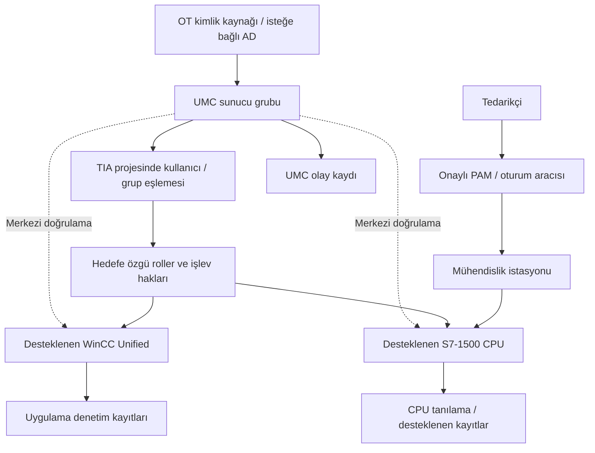

# Siemens güvenliği ve merkezi kullanıcı yönetimi

[Ana sayfa](../../README.md) · [Araç karşılaştırması](01-arac-ve-urun-karsilastirmasi.md) · [Maliyet modeli](03-maliyet-ve-secim-modeli.md) · [Araştırma kaydı](../../research/arac-urun-kaynaklar.md)

**İnceleme tarihi: 16.09.2026.** Bu bölüm master programın 24 ve 38. başlıklarını; 5, 6 ve 23. başlıkların üretici örneklerini karşılar. Siemens'in belgelerinde merkezi kullanıcı yönetimi bileşeninin adı **User Management Component (UMC)** olarak geçer. İstekteki “SIMATIC UCM” bu bağlamda **SIMATIC UMC** olarak düzeltilmiştir. TIA Portal'daki **User Management & Access Control (UMAC)** ise kullanıcı, rol ve işlev haklarını yapılandırma bağlamıdır; UMC ile aynı terim değildir. [UMC tanımı](https://docs.tia.siemens.cloud/r/en-us/v21/configuring-users-and-roles-rt-unified/basics-rt-unified/central-user-management-and-umc-rt-unified), [S7-1200 UMAC](https://docs.tia.siemens.cloud/r/en-us/v20/functional-description-of-s7-1200-cpus-s7-1200/setting-the-operating-behavior-s7-1200/protection-security-s7-1200/settings-for-users-and-roles-s7-1200/useful-information-on-the-local-user-administration-and-access-control)

## Hangi problemi çözer?

UMC, desteklenen yazılım ve cihazlar için kullanıcı/grupları merkezi olarak tanımlar; Microsoft Active Directory'den kullanıcı ve grup alınabilir. Bu kimliklerin TIA projesindeki haklara bağlanması ayrıca gerekir. **Eğitim yorumu:** Merkezi kimlik kaynağı, her hedefte aynı yetkinin otomatik veya güvenli biçimde tanımlandığı anlamına gelmez. [WinCC Unified V21 belgesi](https://docs.tia.siemens.cloud/r/en-us/v21/configuring-users-and-roles-rt-unified/basics-rt-unified/central-user-management-and-umc-rt-unified)

IT'de bir uygulamaya giriş reddi çoğunlukla kullanıcı işini etkiler. OT tasarımında aynı reddin arıza teşhisi veya bakım erişimine etkisi ayrıca değerlendirilir. Bu nedenle aşağıdaki öneriler kullanıcı yaşam döngüsünü erişilebilirlik ve geri dönüş planıyla birlikte ele alan **özgün eğitim sentezidir**; üretici kurulum prosedürü değildir.

## Siemens ekosisteminde görev sınırları

| Bileşen / kaynak kapsamı | Güvenlik açısından görevi | Sınırı ve belge incelemesinde sorulacak soru |
|---|---|---|
| SIMATIC S7-1200; TIA V20, CPU FW V4.7 örneği | Yerel kullanıcı, rol ve CPU işlev haklarını proje üzerinden yönetme | Bu özellik tüm eski S7-1200 firmware'lerine genellenmez. CPU erişim, web ve OPC UA haklarının hangi hizmette uygulandığı incelenir. [Siemens V20](https://docs.tia.siemens.cloud/r/en-us/v20/functional-description-of-s7-1200-cpus-s7-1200/setting-the-operating-behavior-s7-1200/protection-security-s7-1200/settings-for-users-and-roles-s7-1200/useful-information-on-the-local-user-administration-and-access-control) |
| SIMATIC S7-1500; TIA V20, CPU FW V4.0 ve sonrası örneği | Desteklenen CPU'da UMC'ye merkezi kimlik doğrulama; CPU'da rol/işlev hakkı eşlemesi | Erişilebilir UMC sunucusu, tanımlı kullanıcı/grup ve uygun CPU yapılandırması gerekir; tam sipariş numarası ayrıca doğrulanır. [Merkezi oturum açma](https://docs.tia.siemens.cloud/r/en-us/v20/functional-description-of-s7-1500-cpus-s7-1500/setting-the-operating-behavior-s7-1500/protection-security-s7-1500/settings-for-central-users-and-roles-s7-1500/logon-of-central-users-s7-1500) |
| TIA Portal | Projede kullanıcı/grup ile hedefin rol/işlev haklarını ilişkilendirme | Mühendislik projesinin hakkı ile CPU runtime hakkı ayrı gözden geçirilir. Proje kilidi tek başına ağdaki bütün erişimleri yetkilendirmez. [UMAC açıklaması](https://docs.tia.siemens.cloud/r/en-us/v20/functional-description-of-s7-1200-cpus-s7-1200/setting-the-operating-behavior-s7-1200/protection-security-s7-1200/settings-for-users-and-roles-s7-1200/useful-information-on-the-local-user-administration-and-access-control) |
| WinCC Unified V21 | HMI/SCADA kullanıcı ve gruplarının UMC ile merkezi kaynaktan alınması | Bu kanıt WinCC Unified içindir; WinCC Classic, Professional ve tüm panel modelleri aynı entegrasyonu taşır diye genellenmez. [Siemens V21](https://docs.tia.siemens.cloud/r/en-us/v21/configuring-users-and-roles-rt-unified/basics-rt-unified/central-user-management-and-umc-rt-unified) |
| SCALANCE S | Ağ sınırında firewall ve VPN | Uygulama kullanıcı yetkisi ile ağ akış izni farklı kontrollerdir. “SCALANCE” ailesindeki her switch/router firewall sayılmaz. [Siemens SCALANCE S](https://www.siemens.com/en-gb/products/scalance/s-industrial-security-appliance/) |
| SINEC NMS + SINEC INS | Siemens'in su tesisi blueprint'inde SCALANCE cihazları için merkezi kullanıcı yönetimine katkı | UMC'nin doğrudan her ağ cihazına aynı biçimde bağlandığı varsayılmaz; blueprint'teki aracı bileşen ve sürüm koşulları korunur. [Siemens blueprint, §5.2.2](https://www.water.c2.dc.siemens.com/system/files/c2cms_asset/109780322_WWTP_Blueprints_WinCC_Unified_DOC_V1_0_en.pdf) |

### Industrial Ethernet, PROFINET ve OPC UA

Bu bölümün **özgün değerlendirme önerisi**, üç ayrı kanıt istemektir: ağ portu/akışı, uygulama protokolü ve kimlik/güvenlik yapılandırması. Bir cihazın Industrial Ethernet veya PROFINET kullanması, OPC UA oturumunun kimlik ve sertifika ayarlarını açıklamaz. OPC UA kullanıcı kimliği de ağ firewall'ının izin kuralının yerine geçmez. Protokol güvenlik mekanizmaları için [protokol bölümü](../01-temeller/04-endustriyel-protokoller.md) esas alınır.

S7-1500 merkezi oturum açma örneğinde OPC UA veya web istemcisinin kimliği UMC üzerinden doğrulanabilir; dönen grup bilgisi CPU'nun yerel rol eşlemesine göre yetkilendirilir. Bu, bütün S7/PROFINET haberleşmesinin UMC tarafından şifrelendiği iddiasını desteklemez. [Siemens merkezi oturum açma belgesi](https://docs.tia.siemens.cloud/r/en-us/v20/functional-description-of-s7-1500-cpus-s7-1500/setting-the-operating-behavior-s7-1500/protection-security-s7-1500/settings-for-central-users-and-roles-s7-1500/logon-of-central-users-s7-1500)

## Kimlik akışı ve yerleşim

Aşağıdaki model **kurgusal eğitim tasarımıdır**. UMC, korunan OT yönetim hizmetleri bölgesinde değerlendirilir; internetten erişilen bir oturum giriş noktası olarak çizilmez. Erişim aracısı, kimlik servisi ve mühendislik istasyonu ayrı sorumluluklar taşır.

Siemens belgesi UMC bilgisayar rollerini ve AD'den alma akışını tanımlar; TIA kullanımı için SADS gereksinimini ayrıca vurgular. Buradaki diyagramdan belirli bir ürünün HA, ağ portu veya işletim sistemi desteği çıkarılmaz; bunlar seçilen UMC/istemci sürümünün sistem kılavuzundan doğrulanır. [UMC V21 bağlantısı](https://docs.tia.siemens.cloud/r/en-us/v21/configuring-users-and-roles-rt-unified/basics-rt-unified/central-user-management-and-umc-rt-unified), [S7-1500 merkezi yönetim bilgisi](https://docs.tia.siemens.cloud/r/en-us/v20/functional-description-of-s7-1500-cpus-s7-1500/setting-the-operating-behavior-s7-1500/protection-security-s7-1500/settings-for-central-users-and-roles-s7-1500/useful-information-on-central-user-management-and-access-control-s7-1500)

## UMC özellikleri: doğrulanan ile varsayımı ayır

| İstenen başlık | Doğrulanan kapsam | Varsayılmaması gereken kapsam |
|---|---|---|
| RBAC / access control | UMC 2.15.2'de UM işlev hakları UM rollerine atanır | UM yöneticisinin bütün PLC proses haklarını tek başına yönettiği |
| Configuration management | UM kullanıcı/grup/rol/politika verileri için yönetim ve import/export işlev hakları | Bütün PLC, HMI ve firewall yapılandırmalarının sürüm karşılaştırması |
| Audit / monitoring | `UM_VIEWELG`, UM olay kaydını görüntüleme hakkıdır | OT ağ IDS, proses anomali algılama veya bütün operatör eylemlerinin UMC içinde kaydı |
| Backup | `UM_BACKUP`, UM yapılandırmasının tam yedeği için haktır | PLC programı, HMI projesi veya historian verisinin yedeği |
| Change management | Merkezi kullanıcı/grup değişikliğinin yönetimi; hedefte ayrıca rol eşlemesi | Tesisin bakım onayı, bağımsız inceleme ve geri dönüş iş akışının otomatik tamamlanması |

Bu tablonun olumlu özellikleri **UMC 2.15.2, 08/2025, “UM function rights”** kapsamındadır. Son sütun bu kaynağın desteklemediği genellemeleri sınırlar; ürünün hiçbir sürümünde başka özellik olamayacağı anlamına gelmez. [Siemens işlev hakları](https://docs.tia.siemens.cloud/r/en-us/2.15.2/central-user-management-umc-2.15.2/basics-of-umc/definitions/um-function-rights)

## Örnek rol tasarımı

Aşağıdaki adlar **özgün eğitim rolleri**dir; üreticinin hazır rol adları değildir. Haklar ayrı hedeflerde uygulanır. İzinli hedef, işlev, zaman ve onay bir arada kaydedilir.

| Eğitim rolü | Hedef ve izin | Ayrı tutulacak hak | Gerekli kanıt |
|---|---|---|---|
| Operator | Atandığı HMI alanında onaylı işletim işlevleri | Kullanıcı yönetimi, PLC projesi değiştirme | HMI rol özeti ve uygulama kaydı |
| Engineer | Yetkili mühendislik istasyonu ve onaylı proje | Varsayılan olarak UM yöneticiliği | Proje/CPU hak eşlemesi, değişiklik kaydı |
| Maintenance | Onaylı cihaz grubunda tanılama | Süresiz mühendislik veya administrator üyeliği | Hedef listesi, bakım süresi |
| Supervisor | İşletim/bakım onayı ve kendi alanında gözetim | Kendi talebini tek başına uygulama/onaylama | Onaylayan–uygulayan ayrımı |
| Administrator | UM kullanıcı/grup yaşam döngüsü | Varsayılan proses işletimi | UM rolü, denetim kaydı, ikinci göz incelemesi |
| Vendor | Oturum aracısı üzerinden belirli istasyona süreli erişim | Doğrudan CPU ağına genel erişim | Kişisel hesap, onay ve oturum kaydı |
| Security Analyst | Kayıt ve alarm inceleme | Proses değiştirme ve kullanıcı yönetimi | SIEM erişim rolü |
| Read-only Auditor | Onaylı yapılandırma ve rapor kopyası | Canlı sistem ayarı değiştirme | Salt okunur kanıt paketi |

**Sık hata:** UMC grubuna üyelik ile hedefteki gerçek hakkı eş anlamlı saymak. Doğru belgesel kontrol; `kimlik → grup → hedef rolü → işlev → kanıt` zincirini izler. Başka grup üyeliğinden gelen ek hakkı da araştırır.

## Kesinti, sertifika ve kurtarma değerlendirmesi

Siemens S7-1500 belgesi merkezi girişin UMC erişilebilirliğine bağlı olduğunu ve tanılama için yerel kullanıcı düşünülmesini açıklar. Başka Siemens sayfası CPU zamanı sıfırlanıp uygun zaman eşitlemesi yoksa sertifika doğrulaması nedeniyle merkezi girişin başarısız olabileceğini belirtir. [Oturum açma koşulları](https://docs.tia.siemens.cloud/r/en-us/v20/functional-description-of-s7-1500-cpus-s7-1500/setting-the-operating-behavior-s7-1500/protection-security-s7-1500/settings-for-central-users-and-roles-s7-1500/logon-of-central-users-s7-1500), [zaman ve UMC bağımlılığı](https://docs.tia.siemens.cloud/r/en-us/v20/functional-description-of-s7-1500-cpus-s7-1500/setting-the-operating-behavior-s7-1500/protection-security-s7-1500/settings-for-central-users-and-roles-s7-1500/useful-information-on-central-user-management-and-access-control-s7-1500)

**Özgün savunma önerileri:** Yerel acil erişim hesabının sorumlusu, saklanması ve kullanım sonrası incelemesi yazılır. UMC yapılandırma yedeği, sertifika/anahtar bağımlılıkları ve uygulama projeleri farklı kurtarma kalemleri olarak tutulur. Hesap iptalinin mevcut oturumlara etkisi varsayılmaz; hizmet ve sürüm bazında belge kanıtı aranır. “Oturum zaman aşımı tanımlandı” ifadesi bütün CPU hizmetlerinin bunu uyguladığı şeklinde raporlanmaz.

## Diğer üreticilerde rol yönetimi

Bu örnekler aynı ürünlerin yerine geçen evrensel kimlik platformları değildir. Aynı eğitsel soruya farklı ürün bağlamlarında cevap verirler: kimlik nereden gelir ve hangi işleve nerede izin verilir?

| Üretici / okunan kapsam | Resmî örnek | Karşılaştırma sınırı |
|---|---|---|
| Schneider Electric; Control Expert Security Editor, EIO0000004105 v05, 01.07.2026 kayıt sayfası | Kullanıcı/profil, politika, kimlik doğrulama; yerel/merkezi veritabanı, LDAP/AD ve olay/syslog kapsamı tanımlanır | Belge kayıt özeti okundu; bütün Schneider PLC'lerinde aynı enforcement ve UMC uyumluluğu doğrulanmış değildir. [Schneider](https://www.se.com/be/en/download/document/EIO0000004105/) |
| Rockwell Automation; FactoryTalk Services Platform 6.60 yardım ve FTSEC-QS001V-EN-E, 09/2025 | FactoryTalk Directory'de kullanıcı/grup ve izinler; Windows/LDAP bağlantılı gruplar; grup üyelikleri ve izin önceliği | Deny/Allow ve üyelik yenilenmesi ürün bağlamında incelenir; bütün Logix sürümlerinde aynı hak seti varsayılmaz. [Yardım](https://www.rockwellautomation.com/en-us/docs/factorytalk-services-platform/6-60/factorytalk-services-platform-help-ditamap/-ftsp--help/secure-a--ft--system.html), [kılavuz, bölüm 3](https://literature.rockwellautomation.com/idc/groups/literature/documents/qs/ftsec-qs001_-en-e.pdf) |
| ABB; System 800xA 5.1, Administration and Security, 3BSE037410-510 D | Kullanıcı/grup ve Security Definition aspect üzerinden nesne/yapı alanında izin; denetim yapılandırması | **Tarihsel, sürümle sınırlı örnek.** 6.1.1 PDF erişimi 403 verdi; güncel sürümün ayrıntı ve lisans eşdeğerliği doğrulanmadı. Yeni projede bu eski kılavuz kurulum önerisi değildir. [ABB kılavuzu, bölüm 4](https://library.e.abb.com/public/d36a54baa12dc0eac1257b400026ff78/3BSE037410-510_D_en_System_800xA_5.1_Administration_and_Security.pdf) |

## UMC ve alternatif yaklaşım seçimi

Avantaj, dezavantaj ve uygunluk sütunları **özgün değerlendirme çerçevesidir**; üretici pazar iddiası değildir. “Küçük” ve “kurumsal” çalışan sayısından çok hedef sayısı, bağımlılık ve işletme sorumluluğu anlamında kullanılır.

| Yaklaşım | Avantaj / kullanım alanı | Dezavantaj / işletme yükü | Küçük işletme / kurumsal değerlendirme | Siemens uyumluluğu ve maliyet |
|---|---|---|---|---|
| Yerel UMAC | Az sayıda hedefte hedefe özgü hakları açıkça görme | Hesap iptali ve parola politikasını çok sayıda hedefte izlemek zorlaşabilir | Az hedefte basit olabilir; çok hedefte yaşam döngüsü emeği hesaplanır | Yalnız desteklenen TIA/CPU sürümü; cihaz ve mühendislik lisansı maliyeti sürer |
| UMC + gerekirse AD | Desteklenen hedeflerde ortak kullanıcı/grup kaynağı | Kimlik sunucusu, sertifika, zaman ve ağ bağımlılıkları | Küçük kurulumda altyapı yükü ölçülür; çok projede merkezi işletim sorumlusu gerekir | Desteklenen Siemens entegrasyonları; kullanıcı kapasitesi lisansı ve Windows/altyapı ayrıca |
| Mevcut AD / kimlik sağlayıcısı | Kimlik yaşam döngüsü için ortak kaynak | Hedefin ilgili entegrasyonu yoksa CPU işlevlerini yönetmez | Mevcut işletme becerisi kullanılabilir; IT/OT bağımlılığı ve kesinti etkisi değerlendirilir | AD'nin varlığı doğrudan tüm S7 modellerinde kullanıcı desteği sağlamaz; UMC/uygulama bağlantısı ayrıca |
| FactoryTalk / Control Expert / 800xA'nın yerel ürün güvenliği | Kendi üretici ekosisteminde işlem ve alan hakları | Farklı rol modelleri için ayrı eşleme ve kanıt gerekir | Bir ekosistemde yönetim kolaylaşabilir; çok üreticili tesiste ortak rol kataloğu gerekir | Siemens'in yerine doğrudan takılan UMC alternatifleri sayılmaz; tam ürün/sürüm için teklif gerekli |
| Ticari PAM veya açık kaynak JumpServer | Bakım oturumunu süre ve hedefle sınırlandırma | Oturum erişimi ile uygulama hakkı iki ayrı denetimdir | Az hedefte bakım emeği; kurumsalda HA, destek ve oturum saklama değerlendirilir | TIA istasyonuna erişim ile UMC/S7 yönetimi ayrılır; [ürün ve lisans karşılaştırması](01-arac-ve-urun-karsilastirmasi.md) |

### Lisans ve fiyat doğrulaması

WinCC Unified V21 belgesinin **03/2026** sürümü UMC lisansının **10 kullanıcıya kadar ücretsiz** olduğunu; daha büyük kapsam için **100 veya 4.000 kullanıcı hesabı / 365 gün** rental lisanslarını listeler. Bu, ücretsiz Windows, TIA Portal, WinCC veya sunucu hakkı değildir. İncelenen İngilizce belgede ücretli lisans tutarı ve ülkeye özgü satış fiyatı bulunmadı: **teklif gerekli**. [Siemens lisans tablosu](https://docs.tia.siemens.cloud/r/en-us/v21/configuring-users-and-roles-rt-unified/basics-rt-unified/central-user-management-and-umc-rt-unified)

**Özgün maliyet kontrolü:** Kullanıcı sayısı, lisans süresi, sunucu/OS, AD bağımlılığı, yedeklilik, sertifika yönetimi, yedekleme, destek ve yıllık rol gözden geçirme emeği ayrı yazılır. “10 hesabın altında olduğumuz için toplam maliyet sıfır” sonucu kullanılmaz.

## Tehdit ve kontrol bağlantısı

Aşağıdaki tablo **kurgusal tehdit modelidir**.

| Hedef | Ön koşul | Aşılan güven sınırı | Olası hizmet/fiziksel etki | Gözlenebilir belirti | Karşılık gelen kontrol |
|---|---|---|---|---|---|
| Fazla yetkiyle işlem yapmak | Hatalı grup üyeliği mevcut kabul ediliyor | Kimlik grubu → CPU/HMI işlevi | Onaysız değişiklik veya yanlış işletim olasılığı | Rol kataloğunda olmayan etkin hak | Grup–rol–işlev incelemesi, görev ayrımı |
| Merkezi kimliği değiştirmek | UM yönetici erişimi mevcut kabul ediliyor | UM yönetimi → bütün bağlı kimlikler | Birden çok hedefte yetki kaybı/fazlası | Beklenmeyen grup/politika değişikliği | Sınırlı UM yöneticiliği, olay kaydı, bağımsız onay |
| Kesinti sırasında kontrolsüz hesaba yönelmek | UMC/zaman/sertifika hatası var kabul ediliyor | Acil erişim → normal bakım sınırı | Denetimsiz ayrıcalıklı erişim riski | Yerel hesabın olağan dışı kullanımı | Kayıtlı acil erişim, olayla bağlantı, kullanım sonrası gözden geçirme |

## Belge alıştırması: merkezi kullanıcı tasarımını incele

**Kurgusal girdi:** TIA V20 ile tanımlanmış iki hedef vardır: S7-1200 FW4.7 için yerel UMAC, S7-1500 FW4.0 için merkezi UMC tasarımı. WinCC Unified'ın sürümü henüz bilinmiyor. Mühendis UM yöneticisi yapılmış; tedarikçinin süresiz grup üyeliği var; UM yedeği PLC proje yedeği diye etiketlenmiş. Bunlar gerçek cihaz verisi değildir.

1. **THEORY:** UMC, UMAC, AD, PAM ve SIEM görevlerini ayır.
2. **LAB:** Rol tablosunu düzelt; bilinmeyen WinCC sürümüne “uyumlu” yazma. Hangi üretici belgesinin istendiğini belirt.
3. **TEST:** Cihaza bağlanmadan beş masa başı test kartı oluştur: operatörün mühendislik hakkı, tedarikçi süresinin bitmesi, başka gruptan gelen hak, UMC erişim kaybı, zamanı belirsiz CPU.
4. **DEFENSE:** Kimlik servisinin kurtarma sırasını ve kontrollü yerel tanılama hesabının sorumlusunu belirle. UM yedeğini diğer yedeklerden ayır.
5. **REPORT:** Mimari, rol eşleme matrisi, beş testin beklenen kanıtı, maliyet girdileri ve doğrulanmamış özellikleri teslim et.

### Kabul ölçütleri

- [ ] UMC adı doğru; UMAC ile farkı açık.
- [ ] Her Siemens iddiası CPU/TIA/WinCC sürüm sınırı taşıyor.
- [ ] Kimlik doğrulama, uygulama yetkisi ve ağ akış izni ayrılmış.
- [ ] UM yedeği ve UM event log bütün tesisin yedeği/izlemesi sayılmamış.
- [ ] Kesinti ve hesap iptalinin mevcut oturumlara etkisi kanıtsız kesinleştirilmemiş.
- [ ] ABB örneğinin tarihsel kapsamı ve erişim kısıtı korunmuş.
- [ ] Test sonuçları gerçekleştirilmiş ölçüm gibi raporlanmamış; beklenen kanıt ile eldeki kanıt ayrı.

## Kaynaklar ve kapsam

Birincil kaynak künyeleri, okunan bölümler ve kullanılmayan iddialar [araştırma kaydındadır](../../research/arac-urun-kaynaklar.md). Erişim **16.09.2026**. Bu bölüm ürün kurmaz, sürüm yükseltmez veya gerçek sistemde hesap değiştirmez. Diyagram, rol matrisi, tehdit modeli, maliyet ve değerlendirme önerileri bu deponun özgün eğitim sentezidir.
