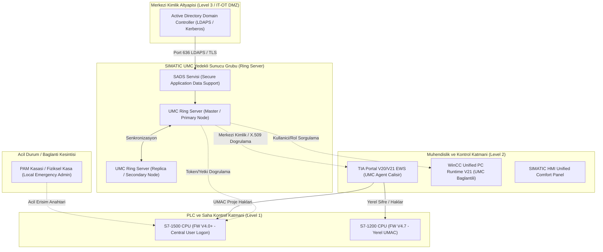
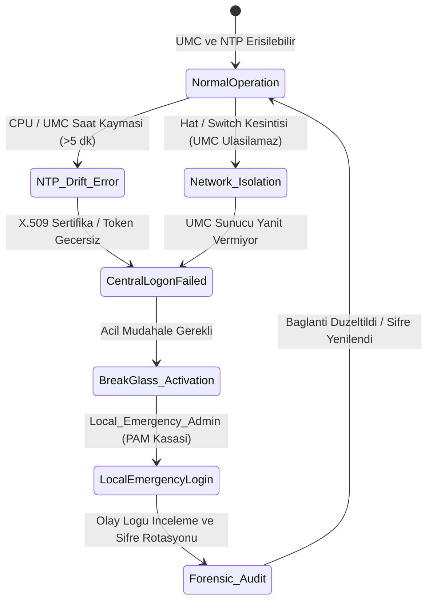
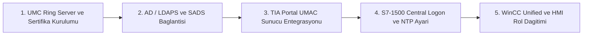

# Siemens güvenliği ve merkezi kullanıcı yönetimi

[Ana sayfa](../../README.md) · [Zero Trust, RBAC ve PAM](../08-mimari-ve-erisim/01-zero-trust-rbac-ve-pam.md) · [Araç karşılaştırması](01-arac-ve-urun-karsilastirmasi.md) · [Maliyet modeli](03-maliyet-ve-secim-modeli.md) · [RBAC ve UMC Şablonu](../../templates/12-ot-rbac-ve-umc-tasarim-sablonu.md) · [Araştırma kaydı](../../research/arac-urun-kaynaklar.md)

**İnceleme tarihi: 18.09.2026.** Bu bölüm master programın 24 ve 38. başlıklarını; 5, 6 ve 23. başlıkların üretici örneklerini karşılar. Siemens ekosisteminde merkezi kullanıcı yönetiminin ana bileşeni **User Management Component (UMC)**'dir. TIA Portal içerisindeki **User Management & Access Control (UMAC)** ise kullanıcı, rol ve fonksiyonel işlev haklarını yerel veya merkezi kaynakla eşleştiren mühendislik yapılandırma arayüzüdür. [UMC tanımı](https://docs.tia.siemens.cloud/r/en-us/v21/configuring-users-and-roles-rt-unified/basics-rt-unified/central-user-management-and-umc-rt-unified), [S7-1200 UMAC](https://docs.tia.siemens.cloud/r/en-us/v20/functional-description-of-s7-1200-cpus-s7-1200/setting-the-operating-behavior-s7-1200/protection-security-s7-1200/settings-for-users-and-roles-s7-1200/useful-information-on-the-local-user-administration-and-access-control)

---

## 1. Hangi problemi çözer?

Endüstriyel tesislerde (OT) en yaygın güvenlik açıklarından biri, mühendislik iş istasyonlarında (EWS), SCADA sistemlerinde, HMI panellerinde ve PLC CPU'larında paylaşılan genel hesapların (ör. `admin`, `operator`, `bakim`) ve statik parolaların kullanılmasıdır. Personel işten ayrıldığında veya görev değiştirdiğinde yüzlerce sahadaki cihazın parolasını tek tek güncellemek operasyonel olarak imkansız hale gelir; bu durum denetimsiz erişimlere ve yetkisiz değişikliklere yol açar.

**SIMATIC UMC**, heterojen Siemens cihaz ve yazılımları (TIA Portal, WinCC Unified, S7-1500 PLC'ler, SINEC NMS) için tekil, merkezi bir kimlik doğrulama (Authentication) ve grup yönetim altyapısı sunar. Kurumsal IT/OT Active Directory (AD) dizin hizmetleri ile entegre olarak kimlik yaşam döngüsünü merkezileştirir.

> [!IMPORTANT]
> **Kritik Mühendislik Ayrımı:** Merkezi kimlik doğrulaması (Authentication), yetkilendirmenin (Authorization) her hedefte otomatik sağlandığı anlamına gelmez. UMC kimliği doğrular; ancak o kullanıcının TIA Portal projesinde, WinCC ekranında veya S7-1500 CPU'sunda hangi işlevleri yapabileceği (okuma, yazma, blok yükleme, zorlama - force) hedef cihaz/yazılımın yerel **UMAC Rol Eşleme Tablosu** tarafından belirlenir.

---

## 2. SIMATIC UMC Mimarisi ve Ring Server Topolojisi

SIMATIC UMC, tesis büyüklüğüne ve süreklilik (High Availability - HA) gereksinimlerine göre üç farklı modda konumlandırılır:

### 2.1. UMC Sunucu Rolleri ve Topoloji Bileşenleri

1. **UMC Ring Server (High Availability):**
   - Kritik üretim hatlarında UMC sunucusunun tek hata noktası (Single Point of Failure - SPOF) olmasını engellemek için birden fazla UMC sunucusu "Ring" yapısında birbirine bağlanır.
   - Ring sunucuları kullanıcı, grup ve yetki veritabanını aralarında güvenli biçimde senkronize eder. Birincil sunucuya ulaşılamadığında ikincil Ring sunucusu kimlik doğrulama işlemlerini kesintisiz devralır.
2. **UMC Agent (İstemci Servisi):**
   - TIA Portal kurulu mühendislik istasyonlarına (EWS) veya WinCC Unified sunucularına kurulan hafif arka plan servisidir.
   - İstemci uygulamanın UMC Ring sunucuları ile TLS şifreli kanal üzerinden hızlı ve güvenli haberleşmesini sağlar.
3. **Active Directory Entegrasyonu ve SADS (Secure Application Data Support):**
   - UMC, kurumsal Active Directory üzerinden kullanıcı ve grupları içe aktarırken **SADS** servis arabirimini kullanır.
   - İletişim kesinlikle şifrelenmemiş LDAP (Port 389) üzerinden değil; sertifika tabanlı **LDAPS (TCP Port 636)** veya **Kerberos over TLS** protokolüyle gerçekleştirilir.

---

## 3. TIA Portal UMAC ve Donanım Düzeyi Rol Eşleme

### 3.1. S7-1500 CPU FW V4.0+ "Central User Logon" İşleyişi

Siemens S7-1500 PLC ailesi (FW V4.0 ve sonrası, TIA Portal V20/V21 ile birlikte) doğrudan merkezi UMC kullanıcı doğrulaması desteğine (**Central User Administration / Central User Logon**) kavuşmuştur.

İşleyiş adımları şu şekildedir:

1. **Oturum Başlatma:** Mühendis veya operatör, TIA Portal, Web Server veya OPC UA istemcisi üzerinden PLC'ye bağlanırken merkezi kullanıcı adı ve parolasını girer.
2. **Kimlik Doğrulama:** S7-1500 CPU, güven ilişkisi kurulmuş olan UMC Ring sunucusuna güvenli TLS kanalı üzerinden bağlanarak kimlik doğrulaması talep eder.
3. **Rol ve Yetki Belirleme:** UMC kullanıcının kimliğini ve ait olduğu AD/UMC gruplarını onaylar.
4. **Yerel İşlev Hakkı Yürütme (Function Rights Enforcement):** S7-1500 CPU, UMC'den dönen grup bilgisini CPU içerisindeki yerel **UMAC Rol Eşleme Tablosu** ile karşılaştırır ve ilgili fonksiyonel hakları (Function Rights) aktif hale getirir:
   - `Read access` (Salt okunur izleme)
   - `HMI access` (HMI tag okuma/yazma)
   - `Write access / Modify process values` (Proses değişkeni değiştirme)
   - `Full access / Engineering download` (PLC program yükleme, donanım konfigürasyonu değiştirme)
   - `Diagnostics & Safety buffer read` (Tanılama ve Safety kayıtlarını okuma)

### 3.2. S7-1200 ve Eski Firmware Sınırları (Yerel UMAC)

S7-1200 CPU'lar (FW V4.7 dahil) ve eski S7-1500 donanımları doğrudan merkezi UMC sunucusuna gerçek zamanlı kimlik doğrulama sorgusu yapamaz. Bu cihazlarda:
- Kullanıcı ve roller TIA Portal projesinde **Yerel UMAC (Local User Administration)** olarak tanımlanır ve donanım yüklemesi (Download to hardware) ile CPU'nun kalıcı hafızasına aktarılır.
- Parola veya rol değişiklikleri merkezi olarak anında yansımaz; TIA Portal projesinin güncellenip CPU'ya yeniden yüklenmesi gerekir.

---

## 4. WinCC Unified Runtime ve HMI Rol Eşleme

WinCC Unified Runtime (PC ve Comfort Panel), kullanıcı haklarını doğrudan UMC gruplarıyla senkronize yönetir:

| WinCC Unified Fonksiyonel Hakkı | Karşılık Gelen OT Rolü | İzin Verilen Eylemler |
|---|---|---|
| `Operate` | Operatör | Butonlara basma, standart vanaları açma/kapama, temel set değerlerini değiştirme. |
| `Recipe_Management` | Proses Teknisyeni | Reçete yükleme, reçete parametrelerini düzenleme ve kaydetme. |
| `Modify_Safety_Parameters` | Emniyet Mühendisi | Emniyet limitlerini, kritik alarm eşiklerini ve koruma parametrelerini değiştirme. |
| `Acknowledge_Alarms` | Vardiya Amiri / Operatör | Süreç alarmlarını ve arıza bildirimlerini onaylama (Acknowledge). |
| `User_Administration` | UMC Yöneticisi | Yerel operatör hesabı yönetimi (yalnızca yerel modda izin verilir). |
| `Read_Only_Monitoring` | Denetçi / İzleyici | Ekranlar arasında gezinme, canlı trendleri izleme; hiçbir yazma veya buton eylemine izin verilmez. |

---

## 5. Kritik İşletimsel Bağımlılıklar ve Hata Senaryoları (Failure Modes)

Merkezi kimlik yönetiminin OT ortamındaki en büyük riski, altyapı bağımlılıklarının kontrol sisteminde erişim kilitlenmelerine (lockout) yol açabilmesidir.

### 5.1. Zaman ve NTP Eşitleme Bağımlılığı (Clock Drift)

Merkezi kimlik doğrulamada X.509 sertifikaları ve zaman damgalı güvenlik belirteçleri (tokens) kullanılır.
- **Problem:** Eğer S7-1500 CPU saati veya UMC sunucu saati kayarsa (clock drift > 300 saniye), sertifika geçerlilik pencereleri uyuşmaz ve CPU merkezi oturum açma isteklerini **güvenlik ihlali** olarak reddeder.
- **Savunma Kuralı:** Tüm PLC'ler, UMC sunucuları, EWS istasyonları ve SCADA sunucuları yerel bir **Stratum-1 veya Stratum-2 PTP/NTP Zaman Sunucusuna (NTP over OT DMZ)** kilitlenmelidir. CPU saatlerinin elle ayarlanmasına izin verilmemelidir.

### 5.2. Ağ Kesintisi ve UMC Çökmesi Senaryosu

Saha seviyesindeki bir PLC ile Level 3'teki UMC sunucusu arasındaki ağ bağlantısı koptuğunda:
- CPU üzerindeki merkezi oturum açma (Central Logon) istekleri zaman aşımına uğrar ve reddedilir.
- Proses çalışmaya devam eder (PLC run modunda kalır), ancak mühendis veya bakım teknisyeni arıza anında PLC'ye bağlanamaz.

### 5.3. Acil Durum (Break-Glass) ve Yerel Yedek Hesap Prosedürü

Merkezi kimlik altyapısının çökmesi veya ağ izolasyonu durumunda tesisin kör kalmaması için her kritik PLC ve HMI üzerinde **Break-Glass** mekanizması kurulmalıdır:

1. **Yerel Acil Durum Hesabı (`Local_Emergency_Admin`):** Her S7-1500 CPU üzerinde UMC'den bağımsız çalışan tek bir yerel yönetici hesabı oluşturulur.
2. **Kasa / PAM Saklama:** Bu hesabın 24+ karakterli karmaşık parolası merkezi bir PAM kasasında (CyberArk, HashiCorp Vault vb.) veya fiziksel mühürlü kasada saklanır.
3. **Çift Kişilik Onay (Four-Eyes Principle):** Acil durum parolası yalnızca Vardiya Amiri ve OT Güvenlik Yöneticisinin ortak onayı ile serbest bırakılır.
4. **Zorunlu Denetim ve Parola Rotasyonu:** Break-glass hesabı kullanılarak yapılan her müdahale sonrasında CPU Teşhis Tamponu (`CPU Diagnostic Buffer`) incelenir, yapılan değişiklikler tutanağa bağlanır ve yerel acil durum parolası derhal değiştirilir.

---

## 6. Adım Adım UMC Kurulum ve Mühendislik Uygulama Kılavuzu

### Aşama 1: UMC Ring Server ve Sertifika Kurulumu
1. Birincil ve ikincil UMC sunucularına SIMATIC UMC yazılımı kurulur.
2. Sunucular arasında Ring mimarisi aktifleştirilir ve dahili CA (Certificate Authority) üzerinden sunucu sertifikaları üretilip karşılıklı güven deposuna (Trust Store) eklenir.
3. TLS 1.3 zorunlu kılınır; eski SSL/TLS protokolleri devre dışı bırakılır.

### Aşama 2: Active Directory LDAPS ve SADS Yapılandırması
1. UMC yönetim konsolunda SADS arabirimi üzerinden kurumsal AD bağlantısı yapılandırılır (`ldaps://ot-dc01.corp.local:636`).
2. AD üzerindeki OT grupları (`OT_Operators`, `OT_Engineers`, `OT_Maintenance`, `OT_Security`) UMC içerisine içe aktarılır (import).
3. Parola politikaları (en az 12 karakter, karmaşıklık, 90 gün rotasyon, 5 hatalı denemede 15 dk kilitleme) UMC genelinde devreye alınır.

### Aşama 3: TIA Portal Projesinde UMAC Entegrasyonu
1. TIA Portal `Security features` menüsünden `User administration` seçilir.
2. Kimlik doğrulama kaynağı olarak `Central User Management (UMC)` seçilir ve UMC sunucusunun IP/FQDN adresi ile Root CA sertifikası projeye eklenir.
3. İçe aktarılan UMC grupları TIA Portal mühendislik rollerine (`Engineering Standard`, `Engineering Safety`, `Read-Only`) eşlenir.

### Aşama 4: S7-1500 CPU Donanım Konfigürasyonu
1. TIA Portal Device Configuration ekranında S7-1500 CPU özellikleri açılır $\to$ `Protection & Security` $\to$ `Central Users and Roles`.
2. `Enable central user administration` kutucuğu işaretlenir.
3. `CPU Function Rights` tablosunda UMC gruplarının PLC seviyesindeki hakları atanır.
4. `Time synchronization` sekmesinde NTP istemcisi aktifleştirilir ve yerel OT NTP sunucu IP adresleri girilir.
5. `Local Emergency User` tanımlanır, parolası PAM kasasına kaydedilir ve donanım konfigürasyonu CPU'ya yüklenir.

### Aşama 5: WinCC Unified Runtime Rol Dağıtımı
1. WinCC Unified projesinde `Security` $\to$ `Users and roles` açılır.
2. UMC ile bağlantı kurularak HMI fonksiyonel hakları (`Operate`, `Acknowledge_Alarms`, `Recipe_Management`) ilgili UMC kullanıcı gruplarına atanır.
3. Runtime derlenip hedef HMI / SCADA sunucusuna dağıtılır.

---

## 7. Siemens Ekosisteminde Görev ve Yetki Sınırları

| Bileşen / Kaynak | Güvenlik Açısından Görevi | Mühendislik İncelemesinde Sorulacak Soru |
|---|---|---|
| **SIMATIC S7-1200** (FW V4.7 örneği) | Yerel kullanıcı, rol ve CPU işlev haklarını proje üzerinden yönetme (Local UMAC) | CPU üzerindeki yerel kullanıcılar en son ne zaman güncellendi? Personel ayrılışlarında proje yeniden derlenip yüklendi mi? [Siemens V20](https://docs.tia.siemens.cloud/r/en-us/v20/functional-description-of-s7-1200-cpus-s7-1200/setting-the-operating-behavior-s7-1200/protection-security-s7-1200/settings-for-users-and-roles-s7-1200/useful-information-on-the-local-user-administration-and-access-control) |
| **SIMATIC S7-1500** (FW V4.0+ örneği) | UMC üzerinden merkezi kimlik doğrulama ve CPU yerel rol/işlev hakkı yürütme | UMC sunucusuna erişim kesildiğinde devreye girecek acil durum yerel hesabı kasalandı mı? NTP saat senkronizasyonu devrede mi? [Merkezi oturum açma](https://docs.tia.siemens.cloud/r/en-us/v20/functional-description-of-s7-1500-cpus-s7-1500/setting-the-operating-behavior-s7-1500/protection-security-s7-1500/settings-for-central-users-and-roles-s7-1500/logon-of-central-users-s7-1500) |
| **TIA Portal V20/V21** | Projede kullanıcı/grup ile hedefin rol ve fonksiyonel işlev haklarını ilişkilendirme | Mühendislik projesinin erişim şifresi ile CPU runtime erişim hakları ayrıldı mı? Proje arşivi yetkisiz dışa aktarıma karşı korumalı mı? [UMAC açıklaması](https://docs.tia.siemens.cloud/r/en-us/v20/functional-description-of-s7-1200-cpus-s7-1200/setting-the-operating-behavior-s7-1200/protection-security-s7-1200/settings-for-users-and-roles-s7-1200/useful-information-on-the-local-user-administration-and-access-control) |
| **WinCC Unified V21** | HMI/SCADA kullanıcı ve gruplarının UMC ile merkezi kaynaktan alınması ve ekran haklarının yönetimi | Operatör ekranında buton bazlı fonksiyonel haklar (`Operate`, `Recipe`) doğru gruplara bağlandı mı? Oturum zaman aşımı (inactivity timeout) tanımlı mı? [Siemens V21](https://docs.tia.siemens.cloud/r/en-us/v21/configuring-users-and-roles-rt-unified/basics-rt-unified/central-user-management-and-umc-rt-unified) |
| **SCALANCE S Güvenlik Cihazları** | Hücre ve bölge sınırında endüstriyel firewall ve IPsec/OpenVPN sonlandırma | Uygulama katmanındaki UMC kullanıcı kimliği ile ağ seviyesindeki firewall paket filtreleme kuralları ayrı ayrı test edildi mi? [Siemens SCALANCE S](https://www.siemens.com/en-gb/products/scalance/s-industrial-security-appliance/) |
| **SINEC NMS + SINEC INS** | Ağ cihazlarının merkezi konfigürasyon, envanter ve kullanıcı yönetimi | Ağ switch'leri ve firewall'lar için RADIUS/TACACS+ üzerinden UMC/AD kimlik doğrulaması devrede mi? [Siemens blueprint, §5.2.2](https://www.water.c2.dc.siemens.com/system/files/c2cms_asset/109780322_WWTP_Blueprints_WinCC_Unified_DOC_V1_0_en.pdf) |

---

## 8. UMC İşlev Hakları ve Güvenlik Denetimi (Audit & Hardening)

SIMATIC UMC 2.15.2 sürümü kapsamında yönetici ve denetçi hakları modüler yetkilendirme kodları ile ayrıştırılmıştır:

| UMC İşlev Kodu | Fonksiyonel Tanım | Güvenlik Açısından Kritiklik |
|---|---|---|
| `UM_VIEWELG` | UMC olay ve denetim kayıtlarını görüntüleme hakkı | **Orta:** Yalnızca güvenlik analistlerine ve denetçilere verilmelidir. |
| `UM_BACKUP` | UMC kullanıcı ve rol yapılandırmasının tam yedeğini alma | **Yüksek:** Yedek dosyası kullanıcı hash'lerini içerebileceğinden güvenli depolanmalıdır. |
| `UM_IMPORT` / `UM_EXPORT` | Kullanıcı ve rol veritabanını dışa/içe aktarma | **Yüksek:** Yetkisiz kullanıcı enjeksiyonunu önlemek için sıkı denetime tabidir. |
| `UM_USER_MGMT` | Yeni kullanıcı oluşturma, silme ve parola sıfırlama | **Kritik:** Yalnızca yetkili UMC Yöneticilerine verilmelidir; ikinci göz onayı aranmalıdır. |
| `UM_POLICY_MGMT` | Parola karmaşıklığı ve kilitleme politikalarını değiştirme | **Kritik:** Güvenlik politikasını zayıflatma riskine karşı loglanmalıdır. |

> [!CAUTION]
> **Audit Log Ayrımı:** `UM_VIEWELG` hakkı ile erişilen UMC Event Log, yalnızca UMC sunucusundaki kimlik doğrulama ve kullanıcı değişiklik olaylarını gösterir. PLC seviyesindeki program yükleme, force etme veya operatör set değeri değişikliklerini kaydetmez. Bütünsel OT güvenliği için UMC logları, CPU tanılama logları ve SCADA denetim izleri (Audit Trail) merkezi SIEM/Syslog sunucusuna aktarılmalıdır.

---

## 9. Kurumsal OT RBAC Rol Kataloğu

| OT Rolü | Hedef Sistem | İzin Verilen Fonksiyonel Haklar | Yasaklanan / Ayrı Tutulan Haklar | Gerekli Kanıt / Denetim İzi |
|---|---|---|---|---|
| **Operator** | WinCC Unified HMI | `Operate`, `Acknowledge_Alarms`, Ekran İzleme | PLC program yükleme, parametre ayarı değiştirme, kullanıcı yönetimi | HMI eylem logları, operatör oturum açma kayıtları |
| **Shift Supervisor** | WinCC Unified & TIA Portal | Reçete yönetimi, limit parametresi değiştirme, onay verme | UMC yönetici hakları, safety lojik değişikliği | Çift onay kayıtları, reçete audit trail |
| **Process Engineer** | TIA Portal & WinCC | PLC proses bloklarını düzenleme, online izleme, tag oluşturma | Safety PLC lojik değişikliği, UMC kullanıcı silme/ekleme | TIA Portal değişiklik günlüğü, CPU download logları |
| **Safety Engineer** | TIA Portal Safety | F-CPU Safety programını düzenleme, safety signature güncelleme | Standart proses lojiğini denetimsiz değiştirme | Safety imza tutanağı, bağımsız mühendis onayı |
| **Maintenance Tech** | TIA Portal / Web Server | Donanım tanılama, I/O testi, arıza okuma, force (süreli) | Süresiz PLC program indirme, güvenlik politikası değiştirme | Geçici izin formu, force aktivasyon logu |
| **UMC Administrator** | SIMATIC UMC Konsolu | UMC kullanıcı yaşam döngüsü, AD senkronizasyonu | PLC prosesini çalıştırma/durdurma, SCADA buton kontrolleri | UMC audit logları, AD grup değişiklik logları |
| **Remote Vendor** | PAM $\to$ TIA Portal | Onaylı tekil PLC'de süreli arıza teşhisi ve blok yükleme | Diğer hücre PLC'lerine erişim, genel ağ taraması | PAM video oturum kaydı, bağlantı zaman damgası |
| **OT Security Auditor** | SIEM / UMC / Web Server | `UM_VIEWELG`, CPU Diagnostic Buffer okuma, salt okunur izleme | Konfigürasyon değiştirme, write/download yetkileri | Salt okunur denetim raporu |

---

## 10. Lisanslama ve Maliyet Modeli

Siemens SIMATIC UMC lisanslama yapısı kullanıcı ölçeğine göre kademelendirilmiştir (WinCC Unified V21 / UMC 2.15.2 belgeleri referans alınmıştır):

- **Temel Paket (Ücretsiz):** 10 kullanıcı hesabına kadar ek lisans ücreti gerekmez (TIA Portal ve WinCC Unified kurulumlarıyla birlikte gelir).
- **Kurumsal Rental Lisanslar:** 100 kullanıcı veya 4.000 kullanıcı hesabı için 365 günlük kiralama (rental) lisans paketleri mevcuttur.
- **Gizli / Ek Altyapı Maliyetleri:**
  - Windows Server işletim sistemi ve CAL lisansları (Ring Server düğümleri için).
  - Active Directory ve SADS entegrasyonu için kurumsal IT/OT altyapı maliyeti.
  - S7-1500 CPU donanım/firmware yükseltme gereksinimleri (FW V4.0+ desteği).
  - Yıllık sertifika yönetim ve bakım destek anlaşmaları.

---

## 11. Uygulamalı Mühendislik Denetim Alıştırması

**Kurgusal Vaka:** Bir kimya tesisinde TIA Portal V20 ile programlanan S7-1500 FW4.0 PLC'ler ve WinCC Unified V21 SCADA sistemi bulunmaktadır. Yapılan güvenlik denetiminde şu bulgular tespit edilmiştir:
1. Tüm mühendisler UMC üzerinde `UM_USER_MGMT` yetkisine sahiptir.
2. S7-1500 PLC'lerde NTP sunucu ayarı yapılmamış, CPU saatleri 12 dakika geridedir.
3. PLC'lerde merkezi oturum açma aktifleştirilmiş ancak acil durum yerel hesabı tanımlanmamıştır.
4. Tedarikçi firmaya UMC üzerinde süresiz `Full access` grubu atanmıştır.

### Denetim ve İyileştirme Adımları:
1. **THEORY:** UMC, UMAC, AD, PAM ve NTP rollerinin sorumluluk sınırlarını ayrıştırın.
2. **LAB:** [OT RBAC ve SIMATIC UMC Tasarım Şablonunu](../../templates/12-ot-rbac-ve-umc-tasarim-sablonu.md) kullanarak AD Grupları $\to$ UMC Rolleri $\to$ PLC/HMI Fonksiyonel Hakları matrisini yeniden yapılandırın.
3. **TEST:** Aşağıdaki 4 hata modunu simüle eden masa başı test kartı hazırlayın:
   - NTP saat kayması nedeniyle merkezi oturum açmanın kilitlenmesi.
   - UMC sunucu kesintisinde yerel acil durum hesabının (`Local_Emergency_Admin`) PAM üzerinden devreye alınması.
   - Operatörün HMI üzerinden reçete değiştirme girişiminin engellenmesi.
   - Tedarikçi oturumunun 2 saat sonunda otomatik sonlandırılması.
4. **DEFENSE:** SADS LDAPS sertifika yenileme prosedürünü ve CPU Break-Glass kullanım sonrası parola rotasyon politikasını yazın.
5. **REPORT:** Bulguları, düzeltici önlemleri ve kanıt dokümanlarını yönetime sunulacak denetim raporuna dönüştürün.

---

## 12. Kaynaklar ve İlgili Dokümanlar

- [Zero Trust, RBAC ve PAM Mimarisi](../08-mimari-ve-erisim/01-zero-trust-rbac-ve-pam.md)
- [OT RBAC ve SIMATIC UMC Tasarım Şablonu](../../templates/12-ot-rbac-ve-umc-tasarim-sablonu.md)
- [PLC, HMI ve SCADA Sıkılaştırma Rehberi](../08-mimari-ve-erisim/03-plc-hmi-ve-scada-sikilastirma.md)
- [Siemens SIMATIC UMC V21 Dokümantasyonu](https://docs.tia.siemens.cloud/r/en-us/v21/configuring-users-and-roles-rt-unified/basics-rt-unified/central-user-management-and-umc-rt-unified)
- [Siemens S7-1500 Central User Administration Guide](https://docs.tia.siemens.cloud/r/en-us/v20/functional-description-of-s7-1500-cpus-s7-1500/setting-the-operating-behavior-s7-1500/protection-security-s7-1500/settings-for-central-users-and-roles-s7-1500/logon-of-central-users-s7-1500)
- [Araştırma ve Ürün Kaynakları Kaydı](../../research/arac-urun-kaynaklar.md)
