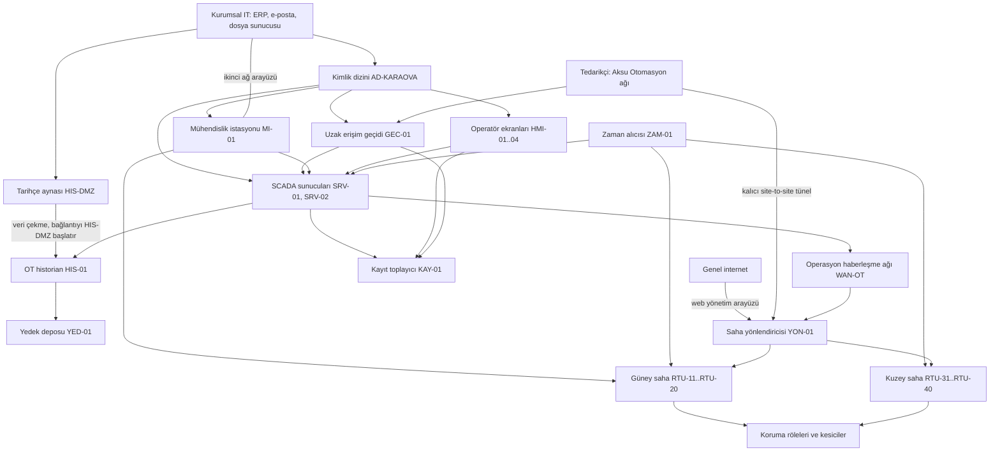

# Laboratuvar 2: mimari inceleme

[Laboratuvarlar](README.md) · [Ana sayfa](../README.md) · [Çözüm](cozumler/02-mimari-inceleme-cozum.md)

Bu laboratuvarda kurgusal bir orta ölçekli elektrik dağıtım işletmesinin OT mimarisi verilir. Göreviniz bu tasarımı incelemek, güven bölgelerini adlandırmak, bozulan güven varsayımlarını bulmak ve düzeltmeleri gerekçeli biçimde sıraya koymaktır.

Çalışma tamamen kâğıt üzerindedir. Hiçbir sisteme bağlanılmaz, araç kurulmaz, adres veya cihaz aranmaz. İnceleme tehdit modelleme düzeyinde kalır: hedef, ön koşul, aşılan güven sınırı, hizmet etkisi, belirti ve karşılık gelen kontrol. Saldırı adımı, komut veya ürün istismarı bu laboratuvarın konusu değildir ve cevapta beklenmez.

## 1. Amaç ve kapsam

| Başlık | İçerik |
|---|---|
| Amaç | Verilen tasarımı incelemek, güven bölgelerini adlandırmak, bozulan güven varsayımlarını bulmak ve düzeltmeleri gerekçeli biçimde sıraya koymak |
| Süre tahmini | 90–120 dakika, tek kişi veya ikili |
| Ön okuma | [Mimari ve güven bölgeleri](../docs/01-temeller/03-mimari-ve-guven-bolgeleri.md), [segmentasyon, kimlik ve uzak erişim](../docs/04-savunma/02-segmentasyon-ve-uzak-erisim.md), [elektrik ve enerji](../docs/02-sektorler/02-elektrik-ve-enerji.md) |
| Gereken araç | Bir metin düzenleyici; tablolar için isteğe bağlı bir hesap tablosu programı. Ağ bağlantısı, laboratuvar ortamı veya araç kurulumu gerekmez |
| Girdi | Bu dosyadaki kurgusal mimari çizimi ve bileşen tablosu |
| Çıktı | Bölüm 6'daki teslim listesi: bölge ve geçiş adlandırması, akış matrisi, sıralanmış kusur listesi, kabul kanıtları, emniyet işaretlemeleri, doğrulanacak varsayımlar listesi |
| Kapsam dışı | Gerçek sisteme bağlanma, tarama, saldırı adımı, ürün zafiyeti değerlendirmesi ve ürün önerisi |

## 2. Kurgusal senaryo

**Karaova Elektrik Dağıtım (kurgusal)** orta büyüklükte bir dağıtım işletmesidir. Kurgudaki özellikleri şunlardır:

- Bir kontrol merkezi, kırk dağıtım merkezi. Sahalar iki bölgeye ayrılmış: güney sahaları ve sonradan devralınan kuzey sahaları.
- SCADA ile uzaktan izleme ve kesici kumandası yapılır. Koruma işlevi saha rölelerinde yereldir.
- Kuzey sahaları iki yıl önce başka bir işletmeden devralınmıştır; haberleşme ve kayıt düzeni farklıdır.
- Otomasyon bakımı **Aksu Otomasyon (kurgusal)** adlı tedarikçi tarafından sözleşmeyle yürütülür.
- İşletme, mimariyi geçen yıl bir proje dosyasında belgelemiştir. Aşağıdaki çizim ve tablo o dosyanın özetidir.

Bütün kod, ad, sayı ve yerleşim kurgusaldır. Gerçek bir işletmenin adresi, adresleme planı, koruma ayarı veya sözleşmesi kullanılmamıştır.

## 3. Verilen mimari

Oklar örnek bilgi ve erişim ilişkileridir; kablolama planı veya güvenlik duvarı kural listesi değildir. Enerji akışı çizimde yoktur.

## 4. Bileşen tablosu

“Proje dosyasındaki not” sütunu kurgusal işletmenin kendi belgesinden alınmış gibi okunmalıdır. Notlar tarafsız yazılmıştır; hangisinin bir kusura işaret ettiğini siz değerlendireceksiniz.

| Kod | Bileşen | İşlevi | Proje dosyasındaki not |
|---|---|---|---|
| SRV-01, SRV-02 | SCADA sunucuları | Saha telemetrisini toplar, kumanda isteklerini iletir | Windows sunucu; oturum açma AD-KARAOVA üzerinden |
| HMI-01..04 | Operatör ekranları | Şebeke durumunun izlenmesi ve kumanda | Vardiya personeli kendi kurumsal hesabıyla oturum açar |
| HIS-01 | OT historian | Ölçüm geçmişi ve olay kaydı | Kontrol merkezi ağında; verisi HIS-DMZ tarafından kopyalanır |
| MI-01 | Mühendislik istasyonu | RTU ve SCADA yapılandırması, proje dosyaları | İki ağ arayüzü var: biri kontrol merkezi ağına, biri kurumsal ağa bağlı. Lisans sunucusu ve dosya paylaşımı kurumsal tarafta |
| GEC-01 | Uzak erişim geçidi | İç personel ve tedarikçi için bakım oturumu | Çok faktörlü doğrulama etkin; oturum kaydı KAY-01'e gider |
| HIS-DMZ | Tarihçe aynası | Raporlama için ölçüm kopyası | HIS-01'e kendisi bağlanıp periyodik olarak veri çeker |
| AD-KARAOVA | Kimlik dizini | Kullanıcı hesapları ve grupları | Tek dizin; kurumsal ve OT hesapları aynı yapıda, yönetimi IT ekibinde |
| ZAM-01 | Zaman alıcısı | Ortak zaman kaynağı | Kontrol merkezinde tek cihaz; SCADA, historian ve bütün RTU'lar buradan zaman alır |
| YED-01 | Yedek deposu | SCADA yedeği, RTU projeleri, röle ayar dosyaları | Kontrol merkezi teknik odasında; gecelik kopya alır |
| KAY-01 | Kayıt toplayıcı | Kayıtların merkezî toplanması | Kaynaklar: SRV-01/02, HMI-01..04, GEC-01. Kuzey saha segmenti ve YON-01 kapsamda değil |
| WAN-OT | Operasyon haberleşme ağı | Kontrol merkezi ile sahalar arası taşıma | Kiralık hat; yedek yol mobil abonelik, aynı YON-01 üzerinde sonlanır ve aynı yönetim hesabıyla yönetilir |
| YON-01 | Saha haberleşme yönlendiricisi | Saha bağlantılarının toplandığı nokta | Web yönetim arayüzü genel internetten erişilebilir; sözleşme gereği tedarikçi de yönetiyor |
| RTU-11..RTU-20 | Güney saha RTU'ları | Telemetri ve kesici kumandası | MI-01'den doğrudan yapılandırılabiliyor |
| RTU-31..RTU-40 | Kuzey saha RTU'ları | Telemetri ve kesici kumandası | Devralınan düzen; yerel kayıt tutuyor, merkeze göndermiyor |
| Koruma röleleri | Saha koruma işlevi | Elektriksel arızada koruyucu işlem | Ayar değişikliği koruma mühendisi onayına tabi; ayar dosyaları YED-01'de |
| Aksu Otomasyon | Tedarikçi (kurgusal) | Sözleşmeli otomasyon bakımı | İki yol var: GEC-01 üzerinden oturum ve YON-01'de sonlanan kalıcı tünel. Kalıcı tünelin kullanımı için ayrı onay istenmiyor |

## 5. Görev adımları

Cevaplarınızı kendi dosyanıza yazın. Her adımda gerekçe ve dayandığınız veri satırı belirtilsin.

### Adım 1 — bölgeleri ve geçişleri adlandırın

Çizimdeki bileşenleri ortak güvenlik gereksinimine göre gruplayın ve her gruba bir ad verin. Ardından gruplar arasındaki her geçişi ayrı satır olarak yazın: geçişin adı, iki ucu, hangi işlevi taşıdığı ve bağlantıyı hangi ucun başlattığı.

Bir bileşenin birden fazla gruba ait görünmesi bir bulgudur; bunu gizlemeyin, işaretleyin. Fiziksel yerleşim ile güven bölgesi aynı şey değildir.

### Adım 2 — akış matrisini doldurun

[Envanter ve akış şablonunu](../templates/01-envanter-ve-akis.md) kopyalayın ve çizimdeki her akış için doldurun. Şu alanların boş kalmaması hedeflenir: kaynak bölge/varlık, hedef bölge/varlık, işlev, başlatan uç, kimlik doğrulama, kayıt noktası, sahibi ve “Hata davranışı”.

Proje dosyasında bilgi yoksa alanı “verilmedi” yazarak işaretleyin ve bunu doğrulanacaklar listesine ekleyin. Tahmini veri gibi yazmayın.

### Adım 3 — kusurları güven varsayımı diliyle yazın

Bulduğunuz her kusuru şu kalıpla yazın:

> Bu tasarım **[şu varsayımın]** doğru olmasına dayanıyor. Varsayım bozulursa **[şu güven sınırı]** aşılmış olur ve **[şu hizmet etkisi]** mümkün hale gelir. Bunu **[şu belirtiden]** fark edebiliriz.

Örnek kalıp doldurması (biçim örneğidir, cevabın kendisi değildir): “Bu tasarım *raporlama bileşeninin kontrol bölgesindeki hiçbir sistemi değiştiremeyeceği* varsayımına dayanıyor.”

Tasarımda **en az dokuz** ayrı kusur bulunmaktadır. Daha azını bulursanız hangi bileşenleri incelemediğinizi yazın; daha fazlasını bulursanız her birini aynı kalıpla gerekçelendirin. Kusurları ürün veya marka sorunu olarak değil, tasarım kararı olarak ifade edin.

### Adım 4 — kusurları sıraya koyun

Her kusuru iki eksende değerlendirin ve tabloyu doldurun:

- **Etki:** Varsayım bozulursa hizmete, görünürlüğe, kurtarmaya veya koruma işlevine ne olur?
- **Uygulanabilirlik:** Düzeltme ne kadar sürede, hangi kesinti ve hangi onaylarla yapılabilir?

| Sıra | Kusur | Etki gerekçesi | Uygulanabilirlik gerekçesi | Önerilen düzeltme | Sahip |
|---|---|---|---|---|---|
| 1 | [kusur adı] | [etki] | [kesinti, onay, süre] | [düzeltme] | [rol] |
| 2 | [kusur adı] | [etki] | [kesinti, onay, süre] | [düzeltme] | [rol] |

Sıralama yalnızca “en tehlikeli” olana göre yapılmaz. Kısa sürede yapılabilen ve kalıcı görünürlük kazandıran işlerin öne alınması savunulabilir bir tercihtir; bu tercihi yazın.

### Adım 5 — üç kontrolün kabul kanıtını tanımlayın

Sıralamanızın ilk üç maddesi için kabul kanıtı yazın. Kabul kanıtı, “yapıldı” denildiğinde bir üçüncü kişinin bakıp doğrulayabileceği somut çıktıdır.

Her kontrol için şunları belirtin: kontrolün amacı, gerekli işin sürdüğünü gösteren test, gereksiz geçişin engellendiğini gösteren test, kaydın nerede göründüğü, geri dönüş planı ve kanıtı kimin onayladığı. Testler kurgusal kabul ortamında tanımlanır; canlı sistemde doğaçlama deneme kabul yöntemi sayılmaz. [Değişiklik ve kabul şablonu](../templates/05-degisiklik-ve-kabul.md) bu adım içindir.

### Adım 6 — emniyet değerlendirmesi gerektirenleri işaretleyin

Kusur listenizde, düzeltmesi **emniyet ve koruma değerlendirmesi olmadan yapılamayacak** olanları işaretleyin. Her işaret için şunu yazın: düzeltme sırasında hangi işlev geçici olarak güvenilmez hale gelebilir, bu sırada hangi telafi uygulanır, kim onaylar ve hangi koşulda işlem durdurulur.

Bir düzeltmenin “teknik olarak basit” olması, emniyet açısından serbest olduğu anlamına gelmez. Zamanlama, koruma koordinasyonu ve telekontrol kabiliyeti bu değerlendirmenin parçasıdır.

## 6. Teslim edilecek çıktılar

- [ ] Bölge ve geçiş adlandırması yapıldı; çok bölgeli bileşenler işaretlendi.
- [ ] Akış matrisi dolduruldu; eksik alanlar “verilmedi” olarak işaretlendi.
- [ ] En az dokuz kusur, güven varsayımı kalıbıyla yazıldı.
- [ ] Kusurlar etki ve uygulanabilirlik gerekçeleriyle sıralandı.
- [ ] İlk üç kontrol için kabul kanıtı ve geri dönüş planı tanımlandı.
- [ ] Emniyet değerlendirmesi gerektiren düzeltmeler ayrıca işaretlendi.
- [ ] Doğrulanacak varsayımlar listesi çıkarıldı; kimin cevaplayacağı yazıldı.

İsteğe bağlı genişletme: bulduğunuz kusurlardan birini [tehdit modeli şablonuna](../templates/02-tehdit-modeli.md) taşıyın ve tedarikçi erişimini [tedarikçi ve uzak erişim şablonuyla](../templates/06-tedarikci-ve-uzak-erisim.md) ayrıca değerlendirin.

## 7. Sık düşülen tuzaklar

- Kusuru bir ürüne yüklemek. Bu laboratuvarda ürün zafiyeti verilmemiştir; incelenen şey tasarım kararlarıdır.
- Çizimdeki bir okun varlığını yetki kanıtı saymak. Ok bir ilişkiyi gösterir, o ilişkinin doğru yapılandırıldığını göstermez.
- Ayrı bir kutuda görünen bileşeni ayrı güven bölgesi saymak. Ortak kimlik, ortak yönetim veya ortak güç aynı bağımlılığı sürdürebilir.
- Bütün düzeltmeleri “segmentasyon” başlığına yığmak. Kimlik, kayıt, zaman ve kurtarma ayrı kontrol aileleridir.
- Düzeltmenin kendi riskini yazmamak. Bir değişikliğin nasıl geri alınacağı, düzeltme önerisinin parçasıdır.

## Kapsam notu

Karaova Elektrik Dağıtım, Aksu Otomasyon, bileşen kodları, mimari ve bilerek yerleştirilmiş kusurlar **kurgusaldır** ve bu deponun özgün eğitim sentezidir. Gerçek bir işletmenin topolojisi, sözleşmesi veya yapılandırması kullanılmamıştır. Kusurların hangi savunma ilkesine karşılık geldiği, rehberin [mimari](../docs/01-temeller/03-mimari-ve-guven-bolgeleri.md), [segmentasyon](../docs/04-savunma/02-segmentasyon-ve-uzak-erisim.md) ve [elektrik](../docs/02-sektorler/02-elektrik-ve-enerji.md) bölümlerinde kaynaklarıyla birlikte açıklanmıştır. Bu dosya kaynaklı yeni bir olgu iddiası içermez. Erişim tarihi: 13.09.2026.

Beklenen tespitler ve değerlendirme ölçeği: [mimari inceleme çözümü](cozumler/02-mimari-inceleme-cozum.md).
