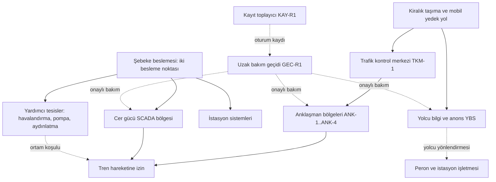

# Laboratuvar 3: masa başı tatbikatı

[Laboratuvarlar](README.md) · [Ana sayfa](../README.md) · [Değerlendirme ve puanlama](cozumler/03-masa-basi-degerlendirme.md)

Bu laboratuvarda kurgusal bir hafif raylı sistem işletmesinde, enerji ve telekom bağımlılıklarıyla birlikte gelişen bir olay masa başında çalışılır. Katılımcılar bilgisayar başında değil, kâğıt ve tartışma üzerinden ilerler.

**Tatbikatın amacı saldırıyı bulmak değildir.** Amaç, bilgi eksikken karar vermeyi, kararın sahibini doğru yerde tutmayı, emniyet ile siber güvenliği ayırmayı ve ekipler arası koordinasyonu çalışmaktır. Senaryonun sonunda “bu bir saldırıydı” veya “değildi” yargısına varılması gerekmez; hangi kanıtın hangi yargıyı desteklediğinin yazılması yeterlidir.

Ön okuma: [olay müdahalesi ve kurtarma](../docs/04-savunma/05-olay-mudahalesi-ve-kurtarma.md), [raylı sistemler](../docs/02-sektorler/03-rayli-sistemler.md), [telekom ve baz istasyonları](../docs/02-sektorler/04-telekom-ve-baz-istasyonlari.md), [risk, emniyet ve altyapı bağımlılıkları](../docs/01-temeller/05-risk-emniyet-ve-bagimliliklar.md).

## 1. Sınırlar

- Hiçbir gerçek sisteme bağlanılmaz, tarama yapılmaz, cihaz veya adres aranmaz. Bütün girdiler bu dosyadaki kurgusal kartlardır.
- Senaryo tehdit modelleme düzeyinde kalır: hedef, ön koşul, aşılan güven sınırı, hizmet etkisi, gözlenebilir belirti ve karşılık gelen kontrol. Araç adı, komut veya saldırı prosedürü yazılmaz, katılımcıdan da beklenmez.
- Kurgusal işletmenin bütün adları, kodları, saatleri ve kayıtları uydurmadır. Gerçek bir hat, işletme, tedarikçi veya sözleşme temsil edilmez.
- Tatbikatta verilen kararlar gerçek bir işletmenin prosedürünün yerine geçmez. Gerçek olayda geçerli olan, kurumun kendi onaylı olay planı ve emniyet talimatlarıdır.

## 2. Kurgusal işletme: Denizkent Hafif Raylı Sistem

**Denizkent HRS (kurgusal)**, on dört istasyonlu tek hatlı bir kent içi raylı sistem işletmesidir. Kurgudaki özellikler şunlardır:

- Trafik kontrol merkezi **TKM-1**, hattın orta bölümünde bir istasyon binasındadır. Yedek merkez yoktur; yedek işletme düzeni “istasyonlardan yerel yönetim” olarak tanımlanmıştır ve son iki yılda denenmemiştir.
- Anklaşman ve hat algılama işlevleri dört bölgede toplanmıştır: **ANK-1** … **ANK-4**. Hareket izni bu bölgelerden yürür.
- Cer gücü ve trafo merkezleri **CER-SCADA** ile izlenir. Şebeke beslemesi iki ayrı noktadan gelir; besleyen kuruluş kurgusal **Körfez Enerji Dağıtım**’dır.
- Yardımcı tesisler bölgesi istasyon havalandırması, drenaj pompaları ve aydınlatmayı kapsar.
- Yolcu bilgi ekranları ve anons sistemi **YBS** olarak tek bir sunucu kümesinden yönetilir.
- Hat boyu taşıma bağlantısı kiralık hattır; yedek yol bir mobil operatör aboneliğidir. İkisi de kurgusal **Kıyı Telekom**’dan alınmıştır.
- Sinyalizasyon, SCADA ve YBS bakımı kurgusal **Tepe Sistem** ile tek sözleşme üzerinden yürütülür. Tedarikçinin uzak erişimi **GEC-R1** geçidinden geçer; oturum kayıtları **KAY-R1**’de toplanır.

Oklar bağımlılık ve izinli yönetim ilişkilerini gösterir; kablolama planı, güvenlik duvarı kuralı veya hat planı değildir. Kesikli oklar veri ve bağımlılık ilişkisidir, sürekli erişim izni anlamına gelmez.

**Katılımcılara önceden verilmeyen kurgu:** Tepe Sistem’in erişimi üç bölgeye birden tanımlıdır ve oturum onayı iş emri numarasıyla eşleştirilmez. Bu ayrıntı üçüncü enjektede ortaya çıkar; kolaylaştırıcı önceden söylemez.

## 3. Roller

Dokuz rol tanımlıdır. Grup küçükse roller birleştirilir; birleştirme tabloda verilmiştir.

| Rol | Tatbikattaki sorumluluğu | Dört kişilik grupta |
|---|---|---|
| İşletme ve trafik kontrol amiri | Sefer düzeni, hareket izni, kısıtlı işletme kararı, saha personeli koordinasyonu | Ayrı tutulur |
| Otomasyon mühendisi | Sinyalizasyon, SCADA ve YBS tarafındaki teknik değerlendirme; değişiklik ve geri yükleme görüşü | Bakımla birleşir |
| Bakım şefi | Saha ekibi, fiziksel doğrulama, kabin ve ekipman durumu | Otomasyonla birleşir |
| SOC nöbetçisi | Kayıt incelemesi, kanıt koruma, kapsam önerisi, sınırlama seçenekleri | Ayrı tutulur |
| Hukuk ve uyum | Sözleşme yükümlülükleri, bildirim yükümlülüğü sorusunun yürütülmesi, kayıt saklama | Üst yönetimle birleşir |
| Kurumsal iletişim | Yolcuya ve basına verilecek bilginin içeriği, zamanı ve kanalı | Üst yönetimle birleşir |
| Üst yönetim | Kaynak, öncelik ve dışa açılan mesaj onayı; roller arası anlaşmazlığın çözümü | Hukuk ve iletişimi devralır |
| Tedarikçi temsilcisi | Tepe Sistem adına bilgi verir; bilmediğini bilmediği olarak söyler | Kolaylaştırıcı canlandırır |
| Kolaylaştırıcı | Enjekteleri verir, süreyi tutar, tartışmayı yönetir, karar günlüğünü denetler | Ayrı tutulur |

Emniyet yöneticisi ve enerji dağıtım irtibatı ayrı rol olarak eklenebilir. Eklenmiyorsa bu görüşler kolaylaştırıcı tarafından kart üzerinden verilir; “kimse söylemedi” diye atlanmaz.

Gözlemci rolü isteğe bağlıdır ve puanlama gözlemci varsa daha güvenilir olur. Gözlemci tartışmaya katılmaz, [değerlendirme dosyasındaki](cozumler/03-masa-basi-degerlendirme.md) ölçeği kullanır.

## 4. Kolaylaştırıcı rehberi

### 4.1 Hazırlık listesi

- [ ] Senaryo, enjekteler ve varyantlar okundu; hangi varyantın uygulanacağına önceden karar verildi.
- [ ] Rol kartları basıldı; her katılımcı yalnızca kendi rolünün bilgisine sahip.
- [ ] Karar günlüğü şablonu çoğaltıldı; kaydı tutacak kişi belirlendi.
- [ ] [Olay ve kurtarma şablonu](../templates/04-olay-ve-kurtarma.md) kopyalandı; asıl dosya doldurulmayacak.
- [ ] Salonda gerçek sisteme bağlı bir ekran veya terminal bulunmadığı doğrulandı.
- [ ] Katılımcılara “bu bir sınav değil” kuralı yazılı olarak duyuruldu.
- [ ] Gerçek bir olay çıkarsa tatbikatın nasıl durdurulacağı ve kimin nöbete döneceği kararlaştırıldı.
- [ ] Tatbikat sonrası 30 dakikalık değerlendirme için süre ayrıldı; katılımcıların takvimi buna göre bloke edildi.
- [ ] Çıktıların nerede saklanacağı ve kimin erişebileceği belirlendi.

Gerçek olay kesintisi kuralı önemlidir. Nöbetçi personel tatbikattayken gerçek bir çağrı gelirse tatbikat beklemeye alınır; iki olayın kayıtları karıştırılmaz.

### 4.2 Zaman planı

Kısa sürüm üç enjekte ile ilerler ve tartışmayı sıkı tutar. Tam sürüm beş enjekte ile ilerler ve isteğe bağlı altıncı enjekteyi içerir. Laboratuvar dizinindeki yaklaşık 3,5 saatlik süre tam sürüm içindir; aşağıdaki tablo bu sürenin nasıl dağıldığını gösterir.

| Bölüm | 90 dakikalık sürüm | Yarım günlük sürüm (yaklaşık 3,5 saat) |
|---|---|---|
| Giriş, kurallar, roller | 10 dakika | 15 dakika |
| Kurgusal işletmenin tanıtımı ve soru | 10 dakika | 15 dakika |
| Enjekte 1 ve tartışma | 15 dakika | 25 dakika |
| Enjekte 2 ve tartışma | 15 dakika | 25 dakika |
| Enjekte 3 ve tartışma | 20 dakika | 30 dakika |
| Ara | Yok | 10 dakika |
| Enjekte 4 ve tartışma | Atlanır | 25 dakika |
| Enjekte 5 ve tartışma | Atlanır | 25 dakika |
| Karar günlüğünün okunması | 10 dakika | 10 dakika |
| Değerlendirme oturumu | 10 dakika | 30 dakika |

Kısa sürümde enjekte 4 ve 5 atlanır; bu durumda emniyet baskısı ve dış iletişim boyutu çalışılmamış olur. Kolaylaştırıcı bunu kapanışta açıkça söyler, böylece ekip kendini olduğundan hazır saymaz.

### 4.3 Salon düzeni

Tek bir U masa düzeni, ortada bir tahta ve tahtada üç sütun önerilir: **doğrulanmış**, **varsayım**, **bilinmeyen**. Kartlar geldikçe bilgi bu sütunlardan birine yazılır ve gerektiğinde sütun değiştirir. Sütun değiştiren her bilgi için gerekçe söylenir.

Roller arasındaki mesafe kasıtlıdır: SOC ile işletme yan yana oturmaz, çünkü tatbikatın amaçlarından biri aralarındaki bilgi aktarımının nasıl işlediğini görmektir. Tedarikçi temsilcisi masanın dışında oturur ve yalnızca çağrıldığında konuşur.

Telefon ve dizüstü kullanımı kapalıdır. Bir bilginin gerçek sistemden teyidi gerekiyorsa katılımcı bunu “şunu teyit etmem gerekir” diye söyler; kolaylaştırıcı cevabı karttan verir veya “bu bilgi tatbikatta yok” der. İkinci cevap da bir bulgudur ve karar günlüğüne yazılır.

### 4.4 Kayıt tutma

Kaydı tutan kişi tartışmaya katılmaz. Her karar için şu alanlar doldurulur: saat, karar, kararı veren rol, dayanılan kanıt ve kanıt referansı, o an bilinmeyen, değerlendirilen alternatifler, geri alınabilirlik ve koşulu, bilgilendirilenler. Karar verilmediyse bu da yazılır; “karar ertelendi, gerekçe: şu bilgi bekleniyor” geçerli bir satırdır.

Kolaylaştırıcı, ekip bir bilgiyi kanıtlanmış gibi kullanmaya başladığında araya girer ve tek bir soru sorar: bunu nereden biliyoruz? Cevap bir kayıt, bir kişi veya bir ölçüme dayanmıyorsa bilgi “varsayım” sütununa taşınır.

### 4.5 Kimse cezalandırılmaz kuralı

Tatbikatta verilen kararlar performans değerlendirmesine, disiplin sürecine veya sözleşme görüşmesine girdi olarak kullanılmaz. Kural oturumun başında yüksek sesle okunur ve çıktı dosyasının başına yazılır.

Kuralın nedeni pratiktir: cezalandırılacağını düşünen kişi, bilmediğini söylemek yerine tahmin eder. Tatbikatın ürettiği en değerli bilgi ise tam olarak “burada bilgi yoktu” cümlesidir. Aynı nedenle çıktı dosyasında kişi adı yerine rol adı kullanılır.

Tedarikçi temsilcisi tatbikata katılıyorsa bu kural sözleşme tarafına da açıkça bildirilir. Aksi halde tedarikçi savunmaya geçer ve senaryonun koordinasyon boyutu çalışılamaz.

### 4.6 Kolaylaştırıcı için uyarı işaretleri

Aşağıdaki davranışlar görüldüğünde kolaylaştırıcı tartışmayı durdurur ve karar günlüğüne dönmeyi ister.

- Beş dakika içinde tek bir nedene kilitlenilmesi.
- “Ele geçirildik” veya “sadece arıza” cümlelerinin kanıt gösterilmeden kullanılması.
- Emniyet kararının siber ekipten beklenmesi veya siber kararın işletmeden beklenmesi.
- Kanıt üretecek bir kaydın, hizmeti hızlandırmak amacıyla silinecek veya üzerine yazılacak olması.
- Dışa açılacak mesajın doğrulanmamış bir yargı içermesi.

## 5. Enjekteler

Her enjekte bir kart olarak okunur. Kolaylaştırıcı kartı okur, soruları sorar, tartışmayı süreyle sınırlar ve karar günlüğünün dolduğunu görür. Varyantlar isteğe bağlıdır; ekip fazla hızlı ilerliyorsa uygulanır.

Senaryo saati kurgusaldır ve sabah zirve saatinde başlar. Enjekte başlıklarındaki tatbikat dakikaları tam sürümün blok sürelerinden (bölüm 4.2) türetilmiştir ve ilk enjektenin başlangıcından sayılır; süre kaynağı olarak 4.2 tablosu esas alınır.

### E1 — senaryo saati 07:10, tatbikat dakikası 0

**Katılımcılara verilen bilgi:** Üç istasyonda yolcu bilgi ekranları boş, anons sistemi çalışmıyor. Aynı dakikalarda TKM-1 operatörü, ANK-2 bölgesinden gelen durum bilgisinde kesiklik görüyor; bu bölgede sinyaller kısıtlayıcı durumda kalıyor ve trenler yavaşlıyor. Sefer aralığı altı dakikadan on bir dakikaya çıkmış durumda. Peronlarda yolcu birikmeye başlıyor. Bakım ekibi henüz sahaya çıkmadı.

**Bilinmeyenler:**

- Yolcu bilgi ekranları ile ANK-2 kesikliği aynı nedenden mi kaynaklanıyor?
- Kesiklik taşıma hattında mı, saha ekipmanında mı, merkezde mi?
- Gece boyunca bir bakım çalışması yapıldı mı?
- Etkilenen bölge genişliyor mu, sabit mi?

**Beklenen karar noktaları:**

- Olay lideri kim ve bu kararı kim verdi?
- Sefer sürdürülecek mi, hangi kısıtla sürdürülecek?
- İlk yolcu bilgilendirmesi hangi kanaldan ve hangi içerikle yapılacak?
- Hangi kayıtların şimdiden korunması istenecek?

**Kolaylaştırıcının soracağı sorular:**

- Şu anda doğrulanmış olan kaç bilgi var, varsayım olan kaç bilgi var?
- ANK-2’den gelen bilginin kesilmesi ile hareket izninin bozulması aynı şey mi?
- Bu bilgiyi kim, hangi kayıttan gördü? İkinci bir kaynak var mı?

**Siber olmayan açıklama:** Kıyı Telekom gece 02:00–05:00 arasında bölgesel taşıma bakımı yapmış olabilir; ayrıca ANK-2 yakınındaki bir altyapı çalışmasında kablo hasarı görülmüş olabilir. Kolaylaştırıcı bu açıklamayı henüz vermez; ekip sorarsa “teyit edilmedi” der.

**“Yanlış giden” varyant:** SOC nöbetçisi durumu erkenden siber olay ilan eder ve TKM-1 ile saha arasındaki bağlantıların kesilmesini ister. Bağlantı kesilirse merkez telemetriyi tümden kaybeder ve işletme kararsız kalır. Bu varyant uygulanırsa ekibin sınırlama kararını kimin onayladığını yazması istenir.

### E2 — senaryo saati 07:35, tatbikat dakikası 25

**Katılımcılara verilen bilgi:** Körfez Enerji Dağıtım, besleme noktalarından birinde gece boyunca dalgalanma kaydı olduğunu ve sabaha karşı bir koruma işleminin devreye girdiğini bildiriyor. Aynı sırada yardımcı tesisler SCADA ekranında iki istasyonun havalandırma ve pompa telemetrisi sabit değerde duruyor; veri kalite bilgisi “eski” görünüyor. Kıyı Telekom, bölgesel bir taşıma arızası açtığını ve tahmini onarım süresinin belirsiz olduğunu bildiriyor. YBS ekranları hâlâ boş.

**Bilinmeyenler:**

- Donmuş telemetri gerçek bir tesis sorununu mu gizliyor, yoksa yalnızca haberleşme mi kesildi?
- Enerji olayı ile telekom arızası bağımsız mı, ortak bir kökene mi bağlı?
- Mobil yedek yol devreye girdi mi, girdiyse neden bilgi akmıyor?
- Sahada fiziksel bir durum var mı?

**Beklenen karar noktaları:**

- Hizmeti kısıtlayarak sürdürme kararı: sefer aralığının uzatılması, bazı istasyonların geçilmesi veya hattın bir bölümünde seferin durdurulması.
- Hangi ölçüme güvenileceği; saha doğrulaması istenecek noktalar.
- Bakım ekibinin hangi istasyona hangi öncelikle gönderileceği.
- Enerji ve telekom tedarikçilerinden istenecek bilginin içeriği ve kimin isteyeceği.

**Kolaylaştırıcının soracağı sorular:**

- Kısıtlı işletme kararını kim veriyor ve bu karar hangi belgeye dayanıyor?
- Donmuş bir ölçümü “normal” saymakla “bilinmiyor” saymak arasındaki fark bugün hangi kararı değiştirir?
- Yedek yol gerçekten bağımsız mı, yoksa aynı noktada mı sonlanıyor?

**Siber olmayan açıklama:** Enerji dalgalanması ile taşıma arızası, aynı bölgedeki bir altyapı çalışmasının iki ayrı sonucu olabilir. Bu açıklama makuldür ve kayıtlarla çelişmez.

**“Yanlış giden” varyant:** Ekip enerji ve telekom açıklamasını yeterli bulup olayı kapatır, kanıt toplamayı durdurur ve tedarikçi erişim kayıtlarını incelemez. Kolaylaştırıcı bu durumda üçüncü enjekteyi sorulmadan verir ve ekibin hipotezi ne kadar hızlı güncellediğini not eder.

### E3 — senaryo saati 08:05, tatbikat dakikası 50

**Katılımcılara verilen bilgi:** SOC nöbetçisi, GEC-R1 kayıtlarında gece 02:40 ile 03:20 arasında Tepe Sistem’e ait bir bakım hesabıyla açılmış bir oturum buluyor. Oturumun hedefinde YBS sunucuları ve bir bakım atlama sunucusu görünüyor. Tepe Sistem temsilcisi o saatte planlı bir iş bulunmadığını, kendi çağrı kayıtlarında bu işin görünmediğini söylüyor ve kesin cevap için zaman istiyor. Ayrıca KAY-R1 üzerinde 03:05–03:25 arasında yaklaşık yirmi dakikalık bir kayıt boşluğu var; boşluğun nedeni belirsiz.

**Bilinmeyenler:**

- Oturum yetkili miydi, hesap kötüye mi kullanıldı, yoksa kayıt hatası mı var?
- Kayıt boşluğu kapasiteden mi, ağdan mı, başka bir nedenden mi kaynaklandı?
- Oturum yalnızca YBS’ye mi dokundu? Aynı hesap ANK ve CER-SCADA bölgelerine de yetkili mi?
- Sabahki kesiklikler ile bu oturum arasında nedensellik var mı, yoksa zaman yakınlığı mı var?

**Beklenen karar noktaları:**

- Kanıt koruma: hangi kayıtlar dondurulacak, kim erişebilecek, saklama süresi ne olacak.
- Erişim kısıtlaması: tek hesap mı, tedarikçinin bütün erişimi mi askıya alınacak. Tedarikçi aynı zamanda sinyalizasyon destek sözleşmesinin tarafıdır; askıya almanın arıza desteğine etkisi tartışılmalıdır.
- Hukuk ve uyum rolünün devreye alınması; sözleşmedeki bildirim ve kayıt yükümlülüklerinin çıkarılması.
- Olay kapsamının güncellenmesi ve üst yönetimin bilgilendirilmesi.

**Kolaylaştırıcının soracağı sorular:**

- Bu oturumun kaydı ile aynı olayı gösteren ikinci bir bağımsız kayıt var mı?
- Kayıt boşluğunu neyin kanıtı sayıyoruz, neyin kanıtı saymıyoruz?
- Tedarikçi erişimi askıya alınırsa bugün hangi işler yapılamaz hale gelir?

**Siber olmayan açıklama:** Oturum, acil bir çağrı üzerine açılmış ve iş emri sisteme geç girilmiş olabilir. Kayıt boşluğu, gece yapılan bakım sırasında toplayıcının yeniden başlatılmasından kaynaklanabilir. İki açıklama da mümkündür ve ikisi de doğrulanmamıştır.

**“Yanlış giden” varyant:** Otomasyon mühendisi, YBS’yi hızla ayağa kaldırmak için sunucuyu yeniden başlatır ve önbelleği temizler. Bu işlem uçucu kanıtı ve bazı yerel kayıtları ortadan kaldırır. Varyant uygulanırsa ekipten, kaybedilen kanıtın hangi soruyu artık cevaplayamayacağını yazması istenir.

### E4 — senaryo saati 08:40, tatbikat dakikası 90

**Katılımcılara verilen bilgi:** İki istasyonda peron doluluğu güvenli seviyenin üzerine çıkıyor; istasyon personeli giriş turnikelerini kısmen kapatmak istiyor. İşletme tarafı, sefer sıklığını artırmak için TKM-1’den daha yoğun biçimde el ile güzergâh verilmesini öneriyor. Aynı dakikalarda bakım ekibi, ANK-2 yakınındaki bir saha kabininin kapağının açık olduğunu ve mührün kopuk olduğunu bildiriyor. Kabinin içinde gözle görülür hasar yok; ne zamandan beri açık olduğu bilinmiyor.

**Bilinmeyenler:**

- Açık kabin sabahki kesikliğin nedeni mi, sonucu mu, yoksa ilgisiz mi?
- Kabine fiziksel müdahale oldu mu? Bunu bugün hangi yöntemle anlayabiliriz?
- El ile güzergâh verme yoğunluğu arttığında operatör iş yükü ve hata olasılığı ne olur?
- Peron doluluğu hangi eşikte hangi kararı zorunlu kılar?

**Beklenen karar noktaları:**

- **Emniyet kararı siber karardan önce gelir.** Peron doluluğu ve kabin bulgusu karşısında hattın ilgili bölümünde seferin durdurulması veya kısıtlı sürdürülmesi kararı, işletme ve emniyet yetkilisine aittir. Siber ekibin kanıt talebi bu kararı geciktiremez.
- Kanıt koruma ile emniyet doğrulaması arasındaki sıranın açıkça belirlenmesi: kabine kim, hangi amaçla, hangi kayıtla yaklaşacak.
- Turnike ve istasyon giriş kısıtlamasının kimin onayıyla uygulanacağı.
- Kısıtlı işletmenin süresi ve hangi koşulda gözden geçirileceği.

**Kolaylaştırıcının soracağı sorular:**

- Bu kararı verecek kişi salonda mı? Değilse ulaşma süresi ve yedek karar sahibi kim?
- Emniyet gereği yapılacak bir işlem kanıtı bozuyorsa ne yapılır, bu nasıl kayda geçer?
- Kısıtlı işletmeye geçmenin yolcuya maliyeti ile sürdürmenin riski nasıl karşılaştırıldı?

**Siber olmayan açıklama:** Kabin kapağı, önceki gün yapılan bir bakım sonrası düzgün kapatılmamış olabilir. Mühür kaydı tutuluyorsa bu kontrol edilebilir; kurguda mühür kayıtları düzenli tutulmuyor.

**“Yanlış giden” varyant:** SOC, kanıt bozulmasın diye kabine dokunulmamasını ister ve bakım ekibi bekletilir. Emniyet doğrulaması gecikir. Varyant uygulanırsa ekibin, bu isteğin kimin yetkisinde olduğunu ve nasıl çözülmesi gerektiğini tartışması beklenir.

### E5 — senaryo saati 09:20, tatbikat dakikası 115

**Katılımcılara verilen bilgi:** Sosyal medyada peron görüntüleri yayılıyor. Bir haber sitesi “raylı sistemde siber saldırı iddiası” başlığıyla yayın yapıyor ve işletmeden görüş istiyor. Bir kamu kurumundan (kurguda adı verilmemiştir) olayın niteliğine ilişkin bilgi talebi geliyor. Aynı sırada Tepe Sistem, YBS için elindeki “temiz sürümü” yükleyip hizmeti hemen açmayı öneriyor; sürümün hangi tarihli olduğunu ve nereden geldiğini henüz belgelemiş değil.

**Bilinmeyenler:**

- Gece oturumunun sabahki kesiklikle ilişkisi hâlâ doğrulanmadı.
- Tedarikçinin önerdiği sürümün kaynağı, bütünlüğü ve sahadaki yapılandırmayla uyumu bilinmiyor.
- Bilgi talebinin hangi yükümlülüğe dayandığı ve hangi süre sınırının geçerli olduğu salonda bilinmiyor.

**Beklenen karar noktaları:**

- Dışa verilecek mesajın içeriği: doğrulanmış olan, doğrulanmamış olan ve söylenmeyecek olan ayrı ayrı belirlenir.
- Yolcuya verilecek bilgi ile basına verilecek bilginin farkı ve zamanlaması.
- **Düzenleyici bildirim:** yükümlülüğün varlığı, muhatabı ve süresi bu tatbikatta karara bağlanmaz. Bildirim, kurumun kendi güncel yükümlülük listesinden ve olay planındaki iletişim adımından yürütülür. Salondaki beklenen çıktı, listeyi kimin açacağı, kimin onaylayacağı ve hangi bilgilerin hazır tutulacağıdır.
- Hizmete dönüş kapıları: tedarikçinin önerisi hangi koşullarda kabul edilir, hangi kabul kanıtı istenir, geri alma planı nedir.

**Kolaylaştırıcının soracağı sorular:**

- “Siber saldırı yoktur” cümlesini bugün hangi kanıtla kurabiliriz? Kuramıyorsak ne söyleriz?
- Bildirim yükümlülüğü listesini kim, nereden açacak? Bu liste güncel mi, en son ne zaman gözden geçirildi?
- Tedarikçinin sürümü kabul edilirse hangi kayıt, hangi imza ve hangi test bu kararı destekler?

**Siber olmayan açıklama:** Haber, yolcu paylaşımlarından üretilmiş bir yorum olabilir; kurumun elinde saldırıyı doğrulayan veya yalanlayan kanıt henüz yoktur. Belirsizliğin açıkça söylenmesi geçerli bir iletişim seçeneğidir.

**“Yanlış giden” varyant:** İletişim rolü, teyit edilmemiş biçimde “sistemlerimize siber saldırı olmamıştır” açıklamasını yapar. Kırk dakika sonra SOC, aynı bakım hesabıyla ikinci bir oturum kaydı bulur. Varyant uygulanırsa ekipten açıklamanın nasıl düzeltileceği ve güvenin nasıl korunacağı tartışılır.

### E6 — isteğe bağlı, ertesi gün

Yalnızca tam sürümde ve zaman kalırsa uygulanır. Kısa bir kapanış enjektesidir.

**Katılımcılara verilen bilgi:** YBS’nin yedekten geri yüklenmesi deneniyor. Yedek okunuyor, ancak proje sürümü sahadaki yapılandırmayla uyuşmuyor; aradaki fark hangi değişiklikten kaynaklandığı bilinmeyen iki güncelleme. Ayrıca yedeği geri yüklemek için gereken lisans bilgisine sahip kişi izinli.

**Beklenen karar noktaları:** kurtarma paketinin eksiklerinin kayda geçirilmesi; kısıtlı işletmenin ne kadar süreceğine ilişkin güncel tahmin; iyileştirme listesine yazılacak maddeler ve sahipleri.

**Kolaylaştırıcının sorusu:** Bu eksiklik tatbikat öncesinde biliniyor muydu? Biliniyorsa neden açık kaldı, bilinmiyorsa bunu hangi düzenli kontrol ortaya çıkarırdı?

## 6. Karar günlüğü

Aşağıdaki tablo tatbikat boyunca doldurulur. Köşeli parantezli alanlar doldurulacak yerlerdir. Tablo [olay ve kurtarma şablonuyla](../templates/04-olay-ve-kurtarma.md) birlikte kullanılır; şablonun “2. Karar günlüğü” tablosu doğrudan bu günlükten, “5.5 Mühendislik ve işletme onayı” ile “6. Normal hizmete dönüş” bölümleri ise buradaki dönüş kararlarından beslenir. Sütunlar şablonun alanlarıyla eşleşecek biçimde yazılmıştır; tatbikat kurgusal bir senaryo saati kullandığı için ilk sütun şablondaki “Zaman (saat dilimiyle)” alanının karşılığıdır.

| Saat (senaryo saati) | Karar veya erteleme | Kararı veren rol | Dayanılan kanıt ve kanıt referansı | O an bilinmeyen | Değerlendirilen alternatifler | Geri alınabilirlik ve koşulu | Bilgilendirilenler |
|---|---|---|---|---|---|---|---|
| [ss:dd] | [verilen karar veya ertelendi] | [rol adı] | [kayıt, kişi veya ölçüm]; [kanıt kimliği] | [açık kalan soru] | [değerlendirilen seçenekler] | [geri alınabilir/kısmen/geri alınamaz] — [hangi bilgide karar değişir] | [roller] |
| [ss:dd] | [verilen karar veya ertelendi] | [rol adı] | [kayıt, kişi veya ölçüm]; [kanıt kimliği] | [açık kalan soru] | [değerlendirilen seçenekler] | [geri alınabilir/kısmen/geri alınamaz] — [hangi bilgide karar değişir] | [roller] |

Kanıt sütununa “herkes biliyordu” veya “mantıken öyle” yazılmaz. Bu tür bir gerekçe varsa satır boş bırakılır ve “o an bilinmeyen” sütununa taşınır.

Enjekte başına en az bir satır beklenir. Bir enjektede hiç karar verilmediyse bu da yazılır; hangi bilginin beklendiği ve kimin beklediği not edilir.

## 7. Tatbikat sonrası 30 dakikalık değerlendirme

Değerlendirme tatbikatın parçasıdır ve atlanmaz. Akış şöyledir:

| Süre | Bölüm | Yürütme |
|---|---|---|
| 5 dakika | Sıcak izlenimler | Her katılımcı tek cümleyle: bugün en zor an hangisiydi? Tartışma yok, yalnızca not alınır |
| 10 dakika | Zaman çizelgesinin okunması | Karar günlüğü sırayla okunur; eksik kalan kanıt ve belirsizlik alanları tamamlanır |
| 10 dakika | İşleyen ve zorlayan üçer madde | Ekip üç iyi işleyen ve üç zorlayan noktayı belirler; her madde bir enjekteye bağlanır |
| 5 dakika | Sahiplendirme | Zorlayan maddeler iyileştirme listesine yazılır; her maddeye sahip ve hedef tarih atanır |

Değerlendirme kişi eleştirisiyle değil, karar noktasıyla ilgilenir. “Şu kişi geç kaldı” yerine “şu bilgi şu role şu kanaldan ulaşmadı” biçiminde yazılır.

Gözlemci varsa puanlama sonuçları burada değil, ayrı bir oturumda paylaşılır. Puan, kişilerin değil tatbikatın çıktısıdır.

## 8. İyileştirme listesi şablonu

| No | Bulgu | Hangi enjektede görüldü | Önerilen iyileştirme | Sahip | Hedef tarih | Kabul kanıtı | İlgili şablon |
|---|---|---|---|---|---|---|---|
| 1 | [gözlenen eksiklik] | [E1..E6] | [yapılacak iş] | [rol] | [gg.aa.yyyy] | [üçüncü kişinin doğrulayabileceği çıktı] | [şablon adı] |
| 2 | [gözlenen eksiklik] | [E1..E6] | [yapılacak iş] | [rol] | [gg.aa.yyyy] | [üçüncü kişinin doğrulayabileceği çıktı] | [şablon adı] |

Kabul kanıtı sütunu “yapıldı” ifadesini kabul etmez. Doğrulanabilir bir çıktı yazılır: güncellenmiş liste, imzalı tutanak, kabul ortamında alınmış test sonucu veya gözden geçirilmiş prosedür sürümü.

Listedeki maddelerden tehdit modeline dönüşenler [tehdit modeli şablonuna](../templates/02-tehdit-modeli.md), erişim düzenine ilişkin olanlar [tedarikçi ve uzak erişim şablonuna](../templates/06-tedarikci-ve-uzak-erisim.md), geri dönüş ve kabul koşullarına ilişkin olanlar [değişiklik ve kabul şablonuna](../templates/05-degisiklik-ve-kabul.md) taşınır.

## 9. Teslim edilecek çıktılar

- [ ] Karar günlüğü dolduruldu; her enjekte için en az bir satır var.
- [ ] Doğrulanmış bilgi, varsayım ve bilinmeyen ayrımı tatbikat sonunda yazılı halde duruyor.
- [ ] Kısıtlı işletme kararının sahibi, gerekçesi ve gözden geçirme koşulu kayıtlı.
- [ ] Emniyet kararı ile siber karar ayrı satırlarda ve doğru sahiplerle yazıldı.
- [ ] Kanıt koruma isteği, kapsamı ve sorumlusu kayıtlı.
- [ ] Yolcu, basın ve kurum içi mesajların taslakları ayrı ayrı yazıldı.
- [ ] Bildirim yükümlülüğü listesini kimin açacağı ve kimin onaylayacağı belirlendi.
- [ ] Hizmete dönüş kapıları ve kabul kanıtları listelendi.
- [ ] İyileştirme listesi sahipler ve tarihlerle dolduruldu.
- [ ] Kapanışta, tatbikatta çalışılmayan konular açıkça yazıldı.

## Kapsam notu

Denizkent HRS, Körfez Enerji Dağıtım, Kıyı Telekom, Tepe Sistem, bileşen kodları, saatler, kayıtlar ve enjekteler **kurgusaldır** ve bu deponun özgün eğitim sentezidir. Herhangi bir standardın, kılavuzun veya üretici belgesinin çevirisi değildir; belirli bir işletmenin olay planı, hat yapısı veya sözleşmesi kullanılmamıştır.

Tatbikatın dayandığı kaynaklı arka plan [olay müdahalesi ve kurtarma](../docs/04-savunma/05-olay-mudahalesi-ve-kurtarma.md), [raylı sistemler](../docs/02-sektorler/03-rayli-sistemler.md), [telekom ve baz istasyonları](../docs/02-sektorler/04-telekom-ve-baz-istasyonlari.md), [izleme ve algılama](../docs/04-savunma/03-izleme-ve-algilama.md) ve [risk, emniyet ve altyapı bağımlılıkları](../docs/01-temeller/05-risk-emniyet-ve-bagimliliklar.md) bölümlerinde verilmiştir. Bu dosya kaynaklı yeni bir olgu iddiası içermez. Erişim tarihi: 13.09.2026.

Beklenen yanıtlar, sık görülen hatalar ve puanlama ölçeği: [masa başı değerlendirmesi](cozumler/03-masa-basi-degerlendirme.md).
