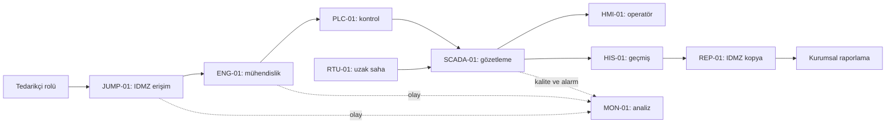

# Laboratuvar 5 — Bütünleşik su tesisi tasarım dosyası

[Su ve atıksu](../docs/02-sektorler/01-su-ve-atiksu.md) · [Final teslim şablonu](../templates/09-final-proje-teslimleri.md) · [Laboratuvarlar](README.md)

Bu dosya tamamen **kurgusal ve doldurulmuş bir tasarım örneğidir**. Amaç envanter, akış, yetki, bulgu, algılama ve kurtarma kayıtlarının aynı kimliklerle nasıl bağlandığını göstermektir. Gerçek tesis, kurulmuş lab, kabul edilmiş mühendislik projesi veya yapılmış güvenlik testi değildir. Bütün kabul sonuçları aşağıda beklenen davranış olarak belirtilir.

## 1. Yönetici özeti ve kapsam

SU-A, bir depo ve uzak terfi noktasının gözlemini yapan kurgusal işletmedir. Tasarımın önceliği operatörün güvenilir ölçümü ayırt etmesi, mühendislik değişikliğinin izlenebilirliği ve kontrollü kurtarmadır. Tasarım incelemesinde erişim süresinin hedefte doğrulanması, eski ölçümün gösterilmesi ve yedek uyumluluğu üç açık konu olarak seçilmiştir. Önerilen mimari dış bakımı kontrollü erişim kapısında sonlandırır; kontrol kaynaklarını ve raporlama akışını ayırır. Normal hizmete dönüş, işletme ve otomasyon rollerinin kabulüyle tanımlanır; bu belgede söz konusu kabulün gerçekleştiği iddia edilmez.

Fiziksel örnek, seviye ölçümü ve pompa durumudur. Kimyasal doz, gerçek eşik, koruma ayarı veya tehlikeli işlem tanımlanmaz. Haberleşme kaybındaki yerel kontrol davranışı süreç tasarımında doğrulanacak bir varsayımdır; "PLC her durumda güvenle devam eder" sonucu çıkarılmaz.

## 2. Varlık ve bölge modeli

Purdue sütunu eğitim amaçlı işlev eşlemesidir; cihazın değişmez seviye etiketi değildir. IDMZ için 3.5 yaygın gösterimi kullanılır. Bölge/geçiş kararı [mimari bölümündeki](../docs/08-mimari-ve-erisim/02-firewall-dmz-ve-uzak-erisim.md) gereksinimlere dayanır.

| Varlık | İşlev | Bölge / Purdue yorumu | Sahip rol | Ana bağımlılık |
|---|---|---|---|---|
| PLC-01 | Yerel pompa döngüsü | Z-KONTROL / 1 | Otomasyon | Sensör, güç, onaylı proje |
| RTU-01 | Uzak saha telemetrisi | Z-SAHA / 1 | Saha otomasyon | Güç, saha taşıyıcısı, zaman |
| HMI-01 | Yerel operatör görünümü | Z-ISLETME / 2 | Vardiya amiri | SCADA/veri kaynağı, kalite bilgisi |
| SCADA-01 | Merkezi gözetleme ve alarm | Z-ISLETME / 2 | Otomasyon | Kontrol/saha akışları, kimlik, zaman |
| HIS-01 | Süreç geçmişi | Z-OPERASYON / 3 | İşletme veri sorumlusu | Kaynak kalitesi, depolama |
| ENG-01 | Proje ve bakım | Z-MUHENDISLIK / 2–3 işlevi | Otomasyon | Onaylı araç/sürüm ve süreli yetki |
| SW-01 | Bölgesel ağ bağlantısı | Yönetim işlevi ayrıca sınırlı | OT ağ sorumlusu | Güç, yapılandırma, yönetim erişimi |
| FW-01 | Bölge geçişleri | Bölge sınırları | OT ağ sorumlusu | Akış matrisi, zaman, yapılandırma |
| JUMP-01 | Kontrollü bakım aracısı | Z-IDMZ / 3.5 gösterimi | Erişim sorumlusu | Kimlik, onay, kayıt |
| REP-01 | Raporlama kopyası | Z-IDMZ / 3.5 gösterimi | İşletme veri sorumlusu | HIS-01 ile tanımlı aktarım |
| MON-01 | Sensör ve merkezi kayıt işlevleri | Z-IZLEME / işlevsel bölge | Güvenlik analisti | Kayıt aktarımı, saat ve kapasite |

Marka, model, firmware, destek tarihi ve adresler bu tasarımda seçilmemiştir. Bunlar gerçek ürün özellikleri varmış gibi doldurulmaz. [Envanter şablonunda](../templates/01-envanter-ve-akis.md) alanlar `doğrulanacak` olarak tutulur.

Oklar işlevsel veri ilişkileridir; firewall satırlarıyla birebir aynı değildir. Örneğin sorgu istemcisinin açtığı oturumda yanıt verisi ters yönde akar. FW-01/SW-01 çizimde her okun üzerine tekrarlanmaz; aşağıdaki matriste geçişler tanımlanır.

## 3. Protokol ve firewall matrisi

Protokoller kurgu için seçilmiştir; cihaz desteği ve güvenli profil henüz doğrulanmamıştır. Modbus Security veya OPC UA güvenli mod desteği bir porttan varsayılmaz. [Protokol kataloğu](../docs/07-protokoller/01-protokol-katalogu.md)

| Akış | Oturumu başlatan → hedef | İşlev / tasarım seçimi | Karar ve koşul | Kayıt / kabul |
|---|---|---|---|---|
| AK-01 | SCADA-01 → PLC-01 | Modbus TCP durum okuma | Yalnız onaylı kaynak/hedef/işlev; klasik profil sınırlaması kayıtlı | MON-01; TEST-01 |
| AK-02 | SCADA-01 → RTU-01 | DNP3 telemetri sorgusu | Saha taşıyıcısı ve uç profili doğrulanınca daraltılacak | Akış + veri kalitesi; TEST-02 |
| AK-03 | HMI-01 → SCADA-01 | OPC UA üzerinden durum | Onaylı uç/kullanıcı ve güvenli profil planı | Kullanıcı + kalite; TEST-03 |
| AK-04 | HIS-01 → SCADA-01 | Tarihsel veri alımı | Yalnız gereken okuma kapsamı | HIS alım/kalite; TEST-03 |
| AK-05 | HIS-01 → REP-01 | Kontrollü veri kopyası | Yalnız raporlama verisi; yöntem/profil seçimi açık | Aktarım/başarısızlık kaydı |
| AK-06 | Kurumsal rapor istemcisi → REP-01 | Rapor okuma | REP hedefiyle sınırlı; PLC/SCADA'ya doğrudan yol yok | FW-01 ret ve REP erişim kaydı |
| AK-07 | Tedarikçi rolü → JUMP-01 → ENG-01 | Süreli bakım | Kişisel hesap, uygun MFA, iş emri, onaylı hedef | Kapı + hedef oturumu; TEST-04 |
| AK-08 | ENG-01 → PLC-01 | Onaylı proje yönetimi | Ürüne özgü protokol seçilene kadar kural ayrıntısı açık | Proje kimliği + D-01; TEST-05 |
| AK-09 | Kayıt kaynakları → MON-01 | Güvenlik ve işletme olayları | Yalnız tanımlı toplama yolu; kuyruk/sağlık planı | TEST-06 |
| AK-10 | Diğer bölge geçişleri | İş gerekçesi yok | Varsayılan ret; gerekli dönüş trafiği onaylı oturumla ilişkili | Ret örneği ve istisna incelemesi |

Servis/port, hedef ürünün seçimiyle [teknik firewall matrisi](../docs/08-mimari-ve-erisim/02-firewall-dmz-ve-uzak-erisim.md) üzerinden ayrıntılandırılır. Bu tablo üretim cihazına aktarılacak kural dosyası değildir. Zone/conduit envanterinde her AK kimliği kaynak ve hedef bölge, sorumlu, güven gereksinimi ve hata davranışıyla tutulur.

## 4. RBAC ve ayrıcalıklı erişim

| Rol | İzin verilen tasarım görevi | Ayrı onay gereken / varsayılan yetki dışı iş |
|---|---|---|
| Operatör | HMI durum, alarm ve tanımlı işletme işlemleri | Proje/firmware ve hesap yönetimi |
| Mühendis | ENG üzerinden D-01 kapsamında proje yönetimi | Süresiz erişim veya kendi değişikliğini tek başına kabul |
| Bakım | İş emrindeki tanılama/kayıt incelemesi | Kapsam dışı kontrol değişikliği |
| Vardiya amiri | İşletme teyidi, bakım penceresi ve hizmet kabulü | Teknik yönetici yetkisi otomatik verilmez |
| Yönetici | Tanımlı altyapı/hesap yönetimi | Süreç onayı ve kontrol projesi yetkisi ayrı |
| Tedarikçi | JUMP üzerinden belirli ENG hedefi ve süre | Doğrudan PLC yolu ve paylaşılan kalıcı hesap |
| Güvenlik analisti | MON kayıt incelemesi ve olay açma | PLC izolasyonu veya proses değişikliği |
| Salt okunur denetçi | Onaylı belge ve kanıt kopyası | Canlı sistem yazma veya sır erişimi |

PAM tasarımında sır saklama, erişim onayı, oturum kaydı ve iptal ayrı işlevlerdir. JUMP-01 arızasında veya kimlik servisi kesildiğinde kontrollü acil erişimin sahibi ve sonradan incelemesi tanımlanır. UMC gibi merkezi kullanıcı yönetimi ürünlerinin bu dört işlevin tamamını sağladığı varsayılmaz. [RBAC/PAM açıklaması](../docs/08-mimari-ve-erisim/01-zero-trust-rbac-ve-pam.md)

## 5. Bulgular, riskler ve izleme

| Bulgu / risk | Kurgu inceleme bulgusu | Olası sonuç | İşlem sahibi / hedef | Kabul kanıtı |
|---|---|---|---|---|
| B-01 / R-01 | Tedarikçi izninin hedefteki açık oturuma etkisi tanımsız | Bakım süresi sonrası işlem | Erişim sorumlusu; ilk bakım öncesi | TEST-04 ve iptal kaydı |
| B-02 / R-02 | HMI eski veri davranışı açıklanmamış | Güncel olmayan ölçümle karar | Otomasyon; tasarım kabulü öncesi | TEST-03 ve kalite gösterimi |
| B-03 / R-03 | PLC/HMI yedeğinde araç/lisans uyumu belirsiz | Kurtarma gecikmesi | Bakım sorumlusu; dönüş planı kabulü öncesi | TEST-07 ve paket kayıtları |

Bu bulgular gerçek ürün zafiyeti/CVE değildir. Zafiyet değerlendirmesinde ürün seçilince üretici duyurusu, sürüm ve etkin işlev eşleşmesi ayrıca kaydedilir. Risk sahibi, geçici önlem, kalan risk ve yeniden inceleme tarihi [risk formunda](../templates/08-degerlendirme-ve-risk-kaydi.md) tutulur.

SIEM tasarımı; JUMP, ENG, SCADA, FW ve MON kaynaklarını iş emri/varlık kimlikleriyle birleştirir. IDS tasarımı; AK-01/02/08 için hangi gözlem noktasının gerçekten trafik göreceğini ve şifreli akışların kör noktalarını belirtir. Kayıt akışının sağlığı da izlenir. [Algılama bölümündeki](../docs/09-degerlendirme/02-izleme-soc-ve-adli-inceleme.md) DET-01 proje değişikliği, DET-03 yeni Modbus istemcisi ve DET-06 uzak erişim süresi bu tasarıma bağlanabilir.

ATT&CK eşlemesi önerisi: B-01'in tehdit senaryosu için T0822/T0859, proje aktarımı için T0843; yalnız gerçekten program farkı kanıtlanırsa T0889. Bu kimlikler gerçekleşmiş saldırı iddiası değildir. B-02 bir arıza/kalite sorunu da olabilir; otomatik olarak T0832 atanmaz.

## 6. Beklenen kabul davranışları

| Test | Girdi / inceleme | Beklenen davranış | Henüz yapılmamış olan |
|---|---|---|---|
| TEST-01 | AK-01 kaynağı/işlevi ile akış matrisi | Yetkili okuma tanımlı; başka kaynak incelemeye gider | Cihaz ve kural üzerinde doğrulama |
| TEST-02 | Saha taşıyıcısı kesintisi masa başı durumu | Eski veri açık işaretlenir; yerel davranış doğrulanacak olarak kalır | RTU/gerçek süreç kesinti denemesi |
| TEST-03 | Eski ölçüm ve kalite bayrağı | Operatör eski veriyi güncel sanmaz | Seçilen HMI ürününde gösterim testi |
| TEST-04 | Süresi dolan bakım oturumu | Kapı ve hedef durumu birlikte teyit edilir | Gerçek oturum iptal testi |
| TEST-05 | Onaylı D-01 ve açıklamasız proje farkı | Onaylı bakım ile inceleme gerektiren fark ayrılır | Ürün olayının gerçekten üretilmesi |
| TEST-06 | Kayıt akışı durması | Sessizlik normal sayılmaz; sağlık olayı açılır | Kuyruk/kayıp davranışının ölçümü |
| TEST-07 | Uyumsuz araç veya eksik lisans | Dönüş kabulü açık kalır | Geri yükleme ve bağımsız saha kabulü |

Sıkılaştırma kapsamı PLC/HMI/SCADA, ENG, Windows sunucusu, FW ve SW için [yedi kontrol listesiyle](../docs/08-mimari-ve-erisim/03-plc-hmi-ve-scada-sikilastirma.md) yürütülür. Bir kontrol işaretlenirken kanıt, doğrulayan ve tarih yazılır.

## 7. Olay ve kurtarma planı

DET-06 geldiğinde analist varlık, kişi, hedef, saat ve onayı toplar; işletme mevcut süreç durumunu teyit eder. Tedarikçi işlemi sürüyorsa erişimi kesmenin etkisi değerlendirilir. Kanıt korunur, yetkili rol sınırlama kararını verir. Süreç etkisi doğrulanmadan bütün PLC ağını kapatma kararı verilmez.

Kurtarma paketi PLC projesi, HMI/SCADA projesi, historian verisi, FW/SW yapılandırması, gerekli araç/sürüm/lisans ve kimlik/sertifika geri kazanımını içerir. Yedeklerin ayrı korunan kopyaları ve erişim bağımlılıkları kayda girer. RTO/RPO bu dosyada gerçek işletme adına belirlenmemiştir; [kurtarma alıştırması](04-kurtarma-dogrulama.md) hesaplamayı kurgusal hedeflerle öğretir.

Geri dönüş kapıları: kapsam/neden yeterince anlaşılmış → güvenilir sürüm seçilmiş → araç/kimlik/ağ bağımlılıkları hazır → uygulama işlevi doğrulanmış → bağımsız saha ve işletme kabulü → kademeli dönüş ve izleme. Her kapının sorumlusu ve kanıtı [olay/kurtarma şablonuna](../templates/04-olay-ve-kurtarma.md) yazılır.

## 8. Üç maliyet mimarisi ve yol haritası

| Tasarım | Bileşen yaklaşımı | Kabulde özellikle aranacak |
|---|---|---|
| Budget | Belgeler, açık lisansı doğrulanmış simülasyon/analiz araçları ve kurumun yönettiği kayıt/erişim katmanı | Eksik PAM, OT çözümleyici veya destek işlevleri açık; insan emeği bütçelenmiş |
| Professional | Destekli sınır/erişim bileşenleri ile seçilmiş açık kaynak analiz | Ürünler arası kimlik/kayıt entegrasyonu ve bakım sorumlusu |
| Enterprise | Yönetilen OT görünürlüğü, ayrıcalıklı erişim, SIEM, yedeklilik ve destek hizmetleri | Sözleşme, kapsam, kapasite, kurtarma ve tedarikçiden çıkış kanıtı |

Bu üç ad güvenlik seviyesi sıralaması değildir. Aynı AK/B/R/TEST kayıtları her tasarımda karşılaştırılır. Donanım, lisans, kayıt saklama, entegrasyon, eğitim, destek ve bakım hesabı [maliyet modelinde](../docs/10-araclar-ve-maliyet/03-maliyet-ve-secim-modeli.md) verilir; burada teklif veya fiyat tekrarı yapılmaz.

Özgün yol haritası: önce B-01/B-02/B-03 sahiplerini ve kanıt taleplerini kapatın; sonra seçilen mimarinin TEST-01–07 kabul planını hazırlayın; ardından tedarik/sürüm/geri dönüş incelemesini bitirin. Takvim, [90 günlük çerçeveye](../docs/04-savunma/06-90-gunluk-yol-haritasi.md) gerçek iş ve kaynaklarla yerleştirilir.

## 9. Yirmi üç teslimin izlenebilirliği

| No | Teslim | Bu dosyadaki başlangıç / tamamlanma koşulu |
|---|---|---|
| 1 | Executive Summary | Bölüm 1; üç risk ve yönetim kararı |
| 2 | OT Architecture | Bölüm 2; bütün işlevler ve bağımlılıklar |
| 3 | Purdue Mapping | Bölüm 2; seviye yorumları ve sınırları |
| 4 | Asset Inventory | Bölüm 2; eksik ürün alanları ayrıca doldurulur |
| 5 | Network Diagram | Bölüm 2; FW/SW uygulama ayrıntısı ayrıca çizilir |
| 6 | Protocol Inventory | Bölüm 3; profil/sürüm seçimi kanıtla tamamlanır |
| 7 | RBAC Matrix | Bölüm 4; hedef sistemde uygulanabilirlik ayrıca incelenir |
| 8 | Firewall Matrix | Bölüm 3; seçilen ürünün nesne/servis ayrıntıları eklenir |
| 9 | Zone/Conduit Architecture | Bölüm 2–3; AK kimlikleriyle bölge geçişleri |
| 10 | Vulnerability Assessment | Bölüm 5; ürün seçilmeden CVE etkilenmesi ilan edilmez |
| 11 | Security Assessment | Bölüm 5–6; bulgu ve kanıt sınırları |
| 12 | MITRE ATT&CK Mapping | Bölüm 5; kanıtla desteklenen teknik ayrımı |
| 13 | Risk Register | Bölüm 5; risk sahibi/kalan risk/tarih ayrı forma |
| 14 | SIEM Architecture | Bölüm 5; kayıt zinciri ve bağlam |
| 15 | IDS Architecture | Bölüm 5–6; sensör kapsamı ve kör noktalar |
| 16 | Incident Response Plan | Bölüm 7; roller ve karar kapıları |
| 17 | Backup/DR Plan | Bölüm 7; paket, bağımlılık ve kabul |
| 18 | Hardening Checklist | Bölüm 6; yedi varlık sınıfı listeleri |
| 19 | Security Testing Plan | Bölüm 6; yetki/RoE formuyla tamamlanır |
| 20 | Remediation Roadmap | Bölüm 8; bulguya bağlı iş sırası |
| 21 | Budget Architecture | Bölüm 8; maliyet varsayımı ve açık kapsam |
| 22 | Professional Architecture | Bölüm 8; entegrasyon ve destek |
| 23 | Enterprise Architecture | Bölüm 8; kapasite, kabul ve çıkış |

Bu eşleme, 23 teslimin hepsinin saha doğrulaması tamamlanmış olduğu anlamına gelmez. [Final şablonu](../templates/09-final-proje-teslimleri.md) hangi alanların kanıtla tamamlanacağını belirtir.

## 10. Görev ve değerlendirme

**THEORY:** AK-01 veri yönünü oturum başlatma yönünden ayırın. **LAB:** B-01 için R-01, DET-06 ve TEST-04 bağını çizin. **TEST:** `doğrulanacak` alanlardan üçü kapanmadan hangi iddiaların kurulamayacağını gösterin. **DEFENSE:** Bir erişim, bir veri kalitesi ve bir kurtarma kontrolü önerin. **REPORT:** Şablonla güncellenmiş yönetici özeti ve beş satırlık iyileştirme listesi hazırlayın.

Kabul: varlık/akış/bulgu/risk/test kimlikleri tutarlı; gerçekleşmemiş testler geçmiş zamanla yazılmamış; öneriler kaynak, yetki ve kabul kanıtına bağlı. Kendi çalışmanızda bir mimari tercihi değiştirip bütün etkilenen belgeleri birlikte güncelleyin; yalnız diyagramı değiştirmek yeterli değildir.

## Kaynak ve kapsam

Bu dosyanın bütün tesis verisi, kimlikleri, matrisleri, beklenen test davranışları ve örnek kararları 17.09.2026 tarihli özgün eğitim sentezidir. Teknik arka plan ve birincil kaynaklar bağlantı verilen sektör, protokol, erişim, algılama ve kurtarma bölümlerindedir. Hazır tesis tasarımı veya uygunluk beyanı değildir.
