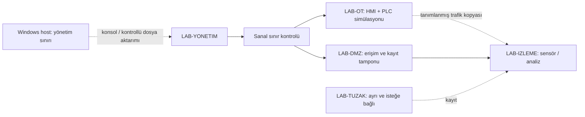

# Laboratuvar 6 — Tek bilgisayarda OT laboratuvarı tasarlama

[Laboratuvarlar](README.md) · [Araç karşılaştırması](../docs/10-araclar-ve-maliyet/01-arac-ve-urun-karsilastirmasi.md) · [Protokol çalışmaları](../docs/07-protokoller/01-protokol-katalogu.md)

Bu Markdown alıştırmasının çıktısı bir mimari ve kabul planıdır. VMware, Windows, Linux, PLC simülatörü veya güvenlik ürünü kurulması gerekmez; bu depoda hazırlanmış VM, çalıştırılmış ortam ya da hazır PCAP yoktur. Kurulum yapmak isteyen okur seçtiği ürünün güncel resmî belgesini ve lisansını ayrıca değerlendirir. Aşağıdaki bütün varlık ve akışlar kurgusaldır.

## 1. Bileşenleri görevlerine ayırmak

| İşlev | Tasarım seçeneği | Gerekçe ve sınır |
|---|---|---|
| Ana sistem | Windows host + mevcut VMware ortamı | Kaynak, disk, ağ ve dış bağlantı kontrolünün sahibi |
| Kontrol temsili | PLC simülatörü / desteklenen OpenPLC sürümü | Mantık ve telemetriyi öğretir; gerçek PLC zamanlama/emniyet davranışını kanıtlamaz |
| Operatör | SCADA/HMI simülatörü | Ölçüm, kalite ve rol ilişkisini gösterir |
| Protokol uçları | Modbus istemci/sunucu işlevleri | Ayrı VM olmak zorunda değildir; istemci rolü ile PLC rolü ayrı tanımlanır |
| Mühendislik | Windows veya desteklenen geliştirme ortamı | Proje sürümü ve değişiklik onayı çalışılır |
| Kimlik ve kayıt | İsteğe bağlı Windows Server; desteklenen kayıt toplayıcı | AD bağımlılığı, rol ve olay alanları belgelenir |
| İnceleme | Wireshark; isteğe bağlı Zeek/Suricata | Çevrimdışı analiz veya sensör işlevi; doğru trafik kopyası varsayılmadan tasarlanır |
| Merkezi analiz | Wazuh veya seçilen başka çözüm | İşlev/lisans/kaynak sınırları ürün belgesinden alınır |
| Yardımcı inceleme istasyonu | İsteğe bağlı Kali Linux | Bu ders için gerekli değildir; cihaz tarama veya istismar görevi yoktur |
| Tuzak sistem | Ayrı Conpot/HoneyPLC değerlendirme bölgesi | Denetleyici taklidi ile gerçek PLC davranışı ayrılır; sahaya bağlanmaz |

Araç adları kurulum paketi veya birbiriyle doğrulanmış uyumluluk listesi değildir. OpenPLC sürüm yaşam döngüsü dahil güncel sınırlamalar [araç belgesinde](../docs/10-araclar-ve-maliyet/01-arac-ve-urun-karsilastirmasi.md) tutulur. Windows sürümü, destek ve lisans kullanılacak tarihte doğrulanır; Windows 10/11 adının bulunması destek garantisi değildir.

## 2. Kurgusal ağ düzeni

Diyagramdaki çizgiler izinli akış tasarımıdır; yalnız aynı sanal ağa bağlanmak segmentasyon sağlamaz. Sensörün sanal switch üzerindeki başka makinelerin trafiğini göreceği varsayılmaz. Görünürlük yöntemi ve gözlem kapsamı ayrıca yazılır.

Broadcom, VMware ağ seçeneklerinde bridged, NAT ve host-only ayrımını açıklar. NAT dışarı çıkışı mümkün kılabilir; host-only etiketini hosttan tam ayrım gibi okumamak gerekir. İzolasyon bütün sanal ağ kartları, host yönlendirmesi/paylaşımı ve dış ağ geçitleri birlikte incelenerek değerlendirilir. [Broadcom Workstation SSS](https://knowledge.broadcom.com/external/article/315616)

## 3. Kaynak planı ve maliyet

Makinenin "güçlü" olması bütün bileşenlerin aynı anda çalışabileceğini göstermez. Şu tabloyu seçilen ürünlerin güncel asgari/önerilen gereksinimleriyle doldurun; bu dokümanda ölçülmemiş RAM veya performans garantisi verilmez.

| Bileşen / sürüm | CPU / RAM kaynağı | Disk ve kayıt büyümesi | Birlikte çalışacaklar | Lisans / destek | Kaynak belge |
|---|---|---|---|---|---|
| [ürün ve sürüm] | [gereksinim + host payı] | [imaj + snapshot + kayıt] | [bileşen kimlikleri] | [koşul ve tarih] | [resmî bağlantı] |

Az kaynaklı çalışma için ağ çizimi, metin kayıtları ve çevrimdışı analiz yeterlidir. Genişletilmiş tasarımda kimlik, merkezi analiz ve honeypot eklenebilir. Snapshot büyümesi, kayıt saklama, güncelleme indirme ve analist zamanı toplam maliyete dahil edilir. VM snapshot'ı bağımsız yedek veya temiz başlangıç kanıtı sayılmaz.

## 4. Tasarımın kabul planı

| Kontrol | Beklenen kanıt | Başarısızlık halinde belge kararı |
|---|---|---|
| Dış ağ ayrımı | Her VM'nin bütün ağ kartları ve bağlı ağlarının listesi; dış rota/paylaşım değerlendirmesi | İzolasyon doğrulanmadı; canlı deneme planlanmaz |
| Bölge sınırları | Kaynak/hedef/işlev için izin ve ret matrisi | Hangi yolun açık kaldığı düzeltilir |
| Dosya aktarımı | Paylaşılan klasör, clipboard, USB ve indirme yollarının sahipleri | Otomatik veya sahaya uzanan aktarım kaldırılacak iş olarak kaydedilir |
| Kimlik ve sırlar | Yalnız kurgu hesapları; gerçek kurumsal sır yok | Gerçek bilgiyle doldurulmuş alanlar kullanılmaz |
| Görünürlük | Hangi akışın hangi sensöre ulaşacağı ve kör noktalar | Trafik görünürlüğü iddiası daraltılır |
| Geri dönüş | Başlangıç sürümleri, kayıtların korunması ve geri yükleme planı | Test sonucu gibi yazılmaz; açık hazırlık işi kalır |
| Tuzak bölgesi | Üretim/kurum/ev cihazlarına kontrol yolu olmadığının tasarım incelemesi | Honeypot kapsamı ayrılana kadar ertelenir |

## 5. Görev ve örnek değerlendirme

**THEORY:** NAT ile izolasyon arasındaki farkı açıklayın. **LAB:** Dört temel işlevi çizime yerleştirin. **TEST:** İkinci ağ kartı NAT'a bağlı bir PLC simülatörü varsayımı ekleyin; neden izolasyon kabulünün açık kaldığını gösterin. **DEFENSE:** İzin/ret, kontrollü dosya aktarımı ve sensör görünürlüğü için düzeltme yazın. **REPORT:** Kaynak planını ve tamamlanmamış kabul maddelerini sunun.

Örnek doğru yorum: "LAB-OT adı kendi başına güven sınırı değildir; ikinci kart üzerinden dış yol vardır. Mimari revize edilmeden izole lab kabulü verilemez. Sensör görünürlüğü ve geri dönüş henüz plan düzeyindedir." Kabul için bu üç ayrımın belgede görünmesi yeterlidir; kurulum yaptığınızı iddia etmeniz beklenmez.

## Kaynak ve kapsam

- Broadcom, Workstation SSS, [ağ seçenekleri](https://knowledge.broadcom.com/external/article/315616); sayfada tek yayın tarihi bu incelemede saptanmadı, erişim 17.09.2026. Menü/sürüm bazlı kurulum talimatı çıkarılmadı.
- Ürünlerin ayrı görev ve lisans kaynakları [araç karşılaştırmasında](../docs/10-araclar-ve-maliyet/01-arac-ve-urun-karsilastirmasi.md).

Mimari, kaynak tablosu ve kabul planı 17.09.2026 tarihli özgün eğitim tasarımıdır; kurulmuş veya güvenlik testi yapılmış ortam değildir.
