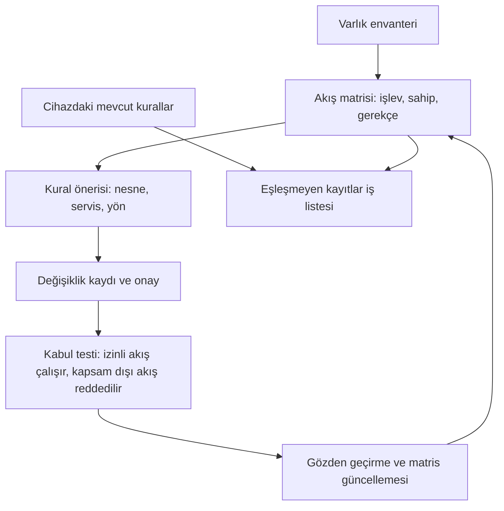

# Varlık envanteri ve veri akışı şablonu

[Ana sayfa](../README.md) · [Şablon dizini](README.md) · [Varlık envanteri ve görünürlük](../docs/04-savunma/01-envanter-ve-gorunurluk.md)

Bu şablon iki bölümden oluşur: **(1) varlık envanteri** ve **(2) veri akışı matrisi**. Birincisi "ne var, ne işe yarıyor, kime bağlı" sorusunu; ikincisi "hangi işlev hangi işlevle, neden ve hangi kimlikle konuşuyor" sorusunu yanıtlar. İki bölüm aynı varlık kodlarını kullanır.

Alan grupları [varlık envanteri ve görünürlük](../docs/04-savunma/01-envanter-ve-gorunurluk.md) bölümündeki asgari alanlardan türetilmiştir: kimlik, yazılım, işlev, bağımlılık, erişim, yaşam döngüsü ve kanıt. Bu dosya boş formdur; doldurma kurumun kontrollü kayıt sisteminde yapılır. Buradaki bütün örnek değerler **kurgusaldır** ve yalnızca biçimi gösterir.

## 1. Varlık envanteri

### 1.1 Alan tanımları

| Alan grubu | Alan | Kurgusal örnek değer | Doldurma kuralı | Kalite kontrolü |
|---|---|---|---|---|
| Kimlik | Varlık kodu | `SU-PLC-014` | Kurum içinde tekil; cihaz değişse de işlev sürüyorsa kod korunur | Kod bakım, değişiklik ve akış kayıtlarında aynı mı? |
| Kimlik | Saha etiketi | `2 nolu terfi kontrol panosu` | Operatörün sahada kullandığı ad yazılır | Pano etiketi ile kayıt aynı adı mı gösteriyor? |
| Kimlik | Üretici ve model | `Üretici K, model K-200` | Ürün belgesinden veya etiketten alınır; tahminse kanıt alanına işlenir | İkinci bir kaynakla karşılaştırıldı mı? |
| Kimlik | Donanım revizyonu | `Rev. C` | Aynı modelin farklı revizyonları ayrı kaydedilir | Revizyon farkı yedek ve yazılım uyumunu etkiliyor mu? |
| Kimlik | Konum referansı | `Saha A-3, pano P-07` | Açık adres veya koordinat yerine kurum içi konum kodu | Konum kodunun tesis planında karşılığı var mı? |
| Yazılım | Donanım yazılımı sürümü | `4.1.2` | Okunduğu tarihle birlikte yazılır | Sürüm, bakım sonrası tekrar okundu mu? |
| Yazılım | İşletim sistemi / çalışma ortamı | `Gömülü; ayrı işletim sistemi yok` | Gömülü, iş istasyonu veya sanal ortam ayrımı belirtilir | Ortamın destek durumu yaşam döngüsü alanıyla tutarlı mı? |
| Yazılım | Kontrol projesi / uygulama sürümü | `PRJ-TERFI-2026-03` | Onaylı sürümün kimliği yazılır; proje içeriği şablona konmaz | Sahadaki sürüm ile onaylı sürüm karşılaştırıldı mı? |
| Yazılım | Yapılandırma yedeği kimliği | `YED-2026-06-11-014` | Yedeğin kimliği yazılır; saklama yeri erişim kontrollü kayıtta tutulur | Yedek, bu donanım revizyonuyla uyumlu mu? |
| İşlev | Sağlanan hizmet | `2 nolu terfi noktasının pompa kontrolü` | Cihaz tipi değil, ürettiği hizmet yazılır | Hizmet tanımı süreç sahibince onaylandı mı? |
| İşlev | Rol | `Kontrol` | Ölçüm, kontrol, koruma, gözetim veya veri rolünden seçilir | Koruma rolü taşıyan varlıklar ayrıca işaretlendi mi? |
| İşlev | Süreç kritikliği | `Yüksek` | Ölçek kurumca tanımlanır; seçim gerekçesiyle birlikte yazılır | Kritiklik iş etkisine mi, cihaz fiyatına mı dayanıyor? |
| İşlev | Kaybında beklenen etki | `Uzak noktada otomatik seviye kontrolü durur; saha ziyareti gerekir` | Etki hizmet, kalite ve ekipman açısından ayrı yazılır | Etki tahmini işletmeyle doğrulandı mı? |
| Bağımlılık | Güç | `Pano beslemesi UPS-2; kesintide süre doğrulanacak` | Besleme kaynağı ve kesintideki davranış yazılır | Yedek yol ana yolla aynı kaynağa mı bağlı? |
| Bağımlılık | Zaman kaynağı | `Merkezi zaman hizmeti` | Zaman kaynağı ve sapma davranışı yazılır | Kayıt sırası incelemesinde saat farkı biliniyor mu? |
| Bağımlılık | Haberleşme yolu | `Saha–merkez bağlantısı H-04` | Taşıyıcı ve yol kimliği yazılır; ağ adresi yazılmaz | Birden çok varlık aynı tek yola mı bağlı? |
| Bağımlılık | Kimlik ve lisans | `Yerel hesap; merkezi dizine bağlı değil` | Kimlik doğrulamanın ve lisansın kaynağı yazılır | Merkezi hizmet yokken cihaz yönetilebiliyor mu? |
| Bağımlılık | Bağlı diğer varlıklar | `SU-RTU-009 telemetriyi bu varlıktan alır` | Hem neye bağımlı hem kimin ona bağımlı olduğu yazılır | Kurtarma sırası bu ilişkilerden çıkarılabiliyor mu? |
| Erişim | Bölge | `Süreç kontrol bölgesi` | Mimaride tanımlı bölge adı kullanılır | Bölge adı akış matrisiyle aynı mı? |
| Erişim | Yönetim yolu | `Mühendislik istasyonu üzerinden; doğrudan uzak yönetim yok` | Yönetimin hangi yoldan yapıldığı yazılır | Kayıt dışı ikinci bir yol var mı (bakım dizüstüsü, geçici bağlantı)? |
| Erişim | Roller | `Gözlem: vardiya; değişiklik: otomasyon ekibi` | Gözlem ve değişiklik yetkisi ayrı yazılır | Paylaşılan hesap kullanılıyor mu? |
| Erişim | Tedarikçi erişimi | `Yüklenici T; iş emrine bağlı süreli erişim` | Tedarikçi, kapsam ve süre koşulu yazılır | Süre bitiminde yetkinin kalktığı doğrulandı mı? |
| Yaşam döngüsü | Destek durumu | `Üretici desteği sürüyor; bitiş tarihi doğrulanacak` | Destek sonu bilinmiyorsa `doğrulanacak` yazılır | Destek bilgisi üretici belgesine mi dayanıyor? |
| Yaşam döngüsü | Değişiklik sahibi | `Otomasyon ekibi sorumlusu (rol)` | Kişi adı değil rol yazılır | Rol boşaldığında kayıt güncelleniyor mu? |
| Yaşam döngüsü | Yedek konumu referansı | `Kurtarma kaydı YED-2026-06-11-014` | Konumun kendisi değil kayıt kimliği yazılır | Yedeğin geri yüklenebildiği izole ortamda denendi mi? |
| Yaşam döngüsü | Son değişiklik kaydı | `DEG-2026-041` | Değişiklik kaydı kimliği yazılır | Değişiklikten sonra envanter alanları güncellendi mi? |
| Kanıt | Bilginin kaynağı | `Pano etiketi ve onaylı proje dosyası` | Belge, kayıt, görüşme veya gözlem olarak belirtilir | İki kaynak aynı sistemden mi türüyor? |
| Kanıt | Doğrulayan | `Bakım sorumlusu (rol)` | Bilgiyi teyit eden rol yazılır | Doğrulayan ile kaydı giren aynı kişi mi? |
| Kanıt | Doğrulama tarihi | `2026-09-02` | `YYYY-AA-GG` biçiminde yazılır | Tarih, son değişiklikten sonrasına ait mi? |
| Kanıt | Güven düzeyi | `Doğrulandı` | `doğrulandı`, `belgeye dayanıyor` veya `tahmin` | Kritik varlıklarda tahmin kalan alan sayısı azalıyor mu? |
| Kanıt | Kalan belirsizlik | `Yedeğin sahadaki sürümle uyumu denenmedi` | Bilinmeyen açıkça yazılır; boş bırakılmaz | Belirsizlik bir iş listesine bağlandı mı? |

"Kalan belirsizlik" alanı bu şablonun eklediği alandır; kaynak bölümdeki kanıt grubunu tamamlamak içindir. Bilinmeyeni yazmak, kaydı eksiksiz göstermekten daha güvenilir bir çıktı verir.

### 1.2 Kopyalanabilir liste tablosu

Aşağıdaki tablo hızlı bakış içindir; alanların tamamı 1.3'teki kayıt kartında tutulur. Köşeli parantezli alanlar doldurulacak yerlerdir.

| Varlık kodu | İşlev ve rol | Bölge | Üretici/model | Yazılım sürümü | Kritiklik | Değişiklik sahibi | Son doğrulama | Güven düzeyi |
|---|---|---|---|---|---|---|---|---|
| [varlık kodu] | [sağlanan hizmet], [rol] | [bölge adı] | [üretici]/[model] | [donanım yazılımı], [proje sürümü] | [kritiklik] | [rol adı] | [YYYY-AA-GG] | [doğrulandı/belgeye dayanıyor/tahmin] |
| [varlık kodu] | [sağlanan hizmet], [rol] | [bölge adı] | [üretici]/[model] | [donanım yazılımı], [proje sürümü] | [kritiklik] | [rol adı] | [YYYY-AA-GG] | [doğrulandı/belgeye dayanıyor/tahmin] |

Kurgusal doldurulmuş örnek:

| Varlık kodu | İşlev ve rol | Bölge | Üretici/model | Yazılım sürümü | Kritiklik | Değişiklik sahibi | Son doğrulama | Güven düzeyi |
|---|---|---|---|---|---|---|---|---|
| SU-PLC-014 | 2 nolu terfi pompa kontrolü, kontrol | Süreç kontrol bölgesi | Üretici K/K-200 | 4.1.2, PRJ-TERFI-2026-03 | Yüksek | Otomasyon ekibi sorumlusu | 2026-09-02 | Doğrulandı |

### 1.3 Kopyalanabilir kayıt kartı

Her varlık için bir kart doldurulur. Kart, liste tablosundaki satırın kaynağıdır.

| Alan | Değer |
|---|---|
| Varlık kodu | [varlık kodu] |
| Saha etiketi | [sahada kullanılan ad] |
| Üretici ve model | [üretici], [model] |
| Donanım revizyonu | [revizyon] |
| Konum referansı | [saha kodu], [pano/oda kodu] |
| Donanım yazılımı sürümü | [sürüm] (okuma tarihi: [YYYY-AA-GG]) |
| İşletim sistemi / çalışma ortamı | [gömülü / iş istasyonu / sanal ortam ve sürüm] |
| Kontrol projesi / uygulama sürümü | [proje kimliği] |
| Yapılandırma yedeği kimliği | [yedek kayıt kimliği] |
| Sağlanan hizmet | [hizmet tanımı] |
| Rol | [ölçüm/kontrol/koruma/gözetim/veri] |
| Süreç kritikliği ve gerekçesi | [kritiklik] — [gerekçe] |
| Kaybında beklenen etki | Hizmet: [etki] / Kalite: [etki] / Ekipman: [etki] |
| Güç bağımlılığı | [besleme kaynağı], kesintide: [davranış] |
| Zaman kaynağı | [zaman hizmeti] |
| Haberleşme yolu | [yol kimliği], yedek yol: [var/yok, kimlik] |
| Kimlik ve lisans bağımlılığı | [kimlik kaynağı], [lisans bağımlılığı] |
| Bağlı diğer varlıklar | Bağımlı olduğu: [kodlar] / Ona bağımlı olan: [kodlar] |
| Bölge | [bölge adı] |
| Yönetim yolu | [yol tanımı] |
| Roller | Gözlem: [rol] / Değişiklik: [rol] |
| Tedarikçi erişimi | [tedarikçi], kapsam: [kapsam], süre koşulu: [koşul] |
| Destek durumu | [destek sonu veya `doğrulanacak`] |
| Değişiklik sahibi | [rol] |
| Yedek konumu referansı | [kurtarma kayıt kimliği] |
| Son değişiklik kaydı | [değişiklik kimliği] |
| Bilginin kaynağı | [belge/kayıt/görüşme/gözlem] |
| Doğrulayan ve tarih | [rol], [YYYY-AA-GG] |
| Güven düzeyi | [doğrulandı/belgeye dayanıyor/tahmin] |
| Kalan belirsizlik | [belirsizlik] — iş kaydı: [iş kaydı kimliği] |
| İlgili akış kimlikleri | [akış kodları] |

Boş bırakılan alana `doğrulanacak` yazılır; yanına sorumlu rol ve hedef tarih eklenir. Ağda görünmeyen varlıklar için ayrı bir doğrulama yolu tanımlanır; trafik görülmemesi varlığın bulunmadığını göstermez.

## 2. Veri akışı matrisi

Matris, bölgeler ve varlıklar arasındaki iletişimi işlev düzeyinde tanımlar. Bir satır, "bu iletişim neden var, kim sahibi, nasıl doğrulanıyor, nerede kaydediliyor, bozulduğunda ne oluyor" sorularını yanıtlamalıdır.

### 2.1 Alan tanımları

| Alan | Ne yazılır? | Kurgusal örnek | Kalite kontrolü |
|---|---|---|---|
| Akış kimliği | Kurum içinde tekil kod | `AK-012` | Kod değişiklik ve kabul kayıtlarında aynı mı? |
| İşlev | Akışın ürettiği iş çıktısı | `Uzak terfi noktası telemetrisinin merkeze taşınması` | Çıktı işletme diliyle anlaşılıyor mu? |
| Sahibi | Akışın iş gerekçesini savunan rol | `Proses otomasyon sorumlusu` | Sahibi belirsizse akış gözden geçirmeye alındı mı? |
| Kaynak bölge/varlık | Bölge adı ve varlık kodu | `Uzak saha bölgesi / SU-RTU-009` | Varlık kodu envanterde var mı? |
| Hedef bölge/varlık | Bölge adı ve varlık kodu | `Süreç kontrol bölgesi / SU-SRV-003` | Hedef bölge sınırında bir geçiş noktası tanımlı mı? |
| Başlatan uç | Oturumu hangi ucun açtığı | `Kaynak uç (RTU)` | Dönüş trafiği ayrı akış olarak mı yazılmalı? |
| Protokol ailesi | Aile ve sürüm bilgisi | `DNP3 ailesi` | Port ve servis ayrıntısı kural kaydında tutuluyor mu? |
| Veri yönü | Verinin yönü; oturum yönünden ayrı | `Ölçüm: saha → merkez. Kontrol komutu: yok` | Yön kısıtı gerçekten uygulanıyor mu? |
| Gereklilik gerekçesi | İhtiyaç ve alternatifin maliyeti | `Depo seviyesinin merkezden izlenmesi; alternatifi saha ziyareti` | "Eskiden beri var" gerekçe yerine mi kullanılıyor? |
| Çalışma saatleri | Sürekli veya tanımlı pencere | `Sürekli` | Pencereli akış pencere dışında da açık mı? |
| Kimlik doğrulama | Uç ve kullanıcı kimliğinin yöntemi | `Cihaz kimliği; uygulama katmanı doğrulaması doğrulanacak` | Ürün desteği ile etkin yapılandırma ayrıldı mı? |
| Kayıt noktası | Kaydın üretildiği yer ve okuyan | `Sınır cihazı bağlantı kaydı; SCADA iletişim kalite bayrağı` | Kayıt kesildiğinde boşluk görünür oluyor mu? |
| Hata davranışı | Bağlantı koptuğunda, gecikme olduğunda veya kimlik doğrulama başarısız olduğunda uçların ve sürecin davranışı | `Hat kesilirse RTU yerel kontrole düşer; merkez son değeri eski veri bayrağıyla gösterir` | Bu davranış denendi mi, yoksa varsayım mı? |
| Onay kaydı | Akışı onaylayan karar kaydı | `DEG-2026-041` | Onay, mevcut kapsamla hâlâ örtüşüyor mu? |
| Gözden geçirme tarihi | Son ve sonraki gözden geçirme | `Son: 2026-05-18 / Sonraki: 2027-05-18` | Tarihi geçmiş satırlar listeleniyor mu? |
| Kalan belirsizlik | Test edilmemiş veya bilinmeyen davranış | `Hat kesintisinde yeniden bağlanma davranışı denenmedi` | Belirsizlik bir iş kaydına bağlandı mı? |

### 2.2 Kopyalanabilir tablo: tanım ve yol

| Akış kimliği | İşlev | Sahibi | Kaynak bölge/varlık | Hedef bölge/varlık | Başlatan uç | Protokol ailesi | Veri yönü |
|---|---|---|---|---|---|---|---|
| [akış kimliği] | [işlev] | [rol] | [bölge]/[varlık kodu] | [bölge]/[varlık kodu] | [kaynak/hedef] | [aile ve sürüm] | [veri yönü] |
| [akış kimliği] | [işlev] | [rol] | [bölge]/[varlık kodu] | [bölge]/[varlık kodu] | [kaynak/hedef] | [aile ve sürüm] | [veri yönü] |

### 2.3 Kopyalanabilir tablo: kontrol ve kanıt

| Akış kimliği | Gereklilik gerekçesi | Çalışma saatleri | Kimlik doğrulama | Kayıt noktası | Hata davranışı | Onay kaydı | Gözden geçirme | Kalan belirsizlik |
|---|---|---|---|---|---|---|---|---|
| [akış kimliği] | [gerekçe ve alternatif] | [sürekli/pencere] | [yöntem] | [kayıt kaynağı ve okuyan] | [kopma/gecikme/doğrulama hatasında davranış] | [onay kimliği] | [son]/[sonraki] | [belirsizlik] |
| [akış kimliği] | [gerekçe ve alternatif] | [sürekli/pencere] | [yöntem] | [kayıt kaynağı ve okuyan] | [kopma/gecikme/doğrulama hatasında davranış] | [onay kimliği] | [son]/[sonraki] | [belirsizlik] |

Kurgusal doldurulmuş örnek (aynı akışın iki tablodaki satırı):

| Akış kimliği | İşlev | Sahibi | Kaynak bölge/varlık | Hedef bölge/varlık | Başlatan uç | Protokol ailesi | Veri yönü |
|---|---|---|---|---|---|---|---|
| AK-012 | Uzak terfi noktası telemetrisinin merkeze taşınması | Proses otomasyon sorumlusu | Uzak saha bölgesi/SU-RTU-009 | Süreç kontrol bölgesi/SU-SRV-003 | Kaynak uç (RTU) | DNP3 ailesi | Ölçüm: saha → merkez; kontrol komutu yok |

| Akış kimliği | Gereklilik gerekçesi | Çalışma saatleri | Kimlik doğrulama | Kayıt noktası | Hata davranışı | Onay kaydı | Gözden geçirme | Kalan belirsizlik |
|---|---|---|---|---|---|---|---|---|
| AK-012 | Depo seviyesinin merkezden izlenmesi; alternatifi düzenli saha ziyareti | Sürekli | Cihaz kimliği var; uygulama katmanı doğrulaması doğrulanacak | Sınır cihazı bağlantı kaydı; SCADA iletişim kalite bayrağı | Hat kesilirse RTU yerel kontrole düşer; merkez son değeri eski veri bayrağıyla gösterir (denenmedi) | DEG-2026-041 | 2026-05-18/2027-05-18 | Hat kesintisinde yeniden bağlanma davranışı denenmedi |

### 2.4 Akış matrisi bir güvenlik duvarı kural dökümü değildir

İkisi farklı soruları yanıtlar ve farklı hızda değişir. Matris işin gerekçesini, kural dökümü ise bir cihazdaki uygulamayı anlatır.

| Konu | Akış matrisi | Kural dökümü |
|---|---|---|
| Sorduğu soru | Bu iletişim neden var, sahibi kim? | Hangi nesne, hangi servis, hangi yön, hangi sıra? |
| Ayrıntı düzeyi | İşlev, bölge, varlık kodu | Cihaza özgü nesne adları ve servis tanımları |
| Sahibi | Süreç ve işlev sahibi | Ağ/güvenlik yöneticisi |
| Değişim nedeni | Süreç veya sözleşme değişikliği | Kural bakımı, cihaz değişimi, taşıma |
| Kanıtı | Onay kaydı ve gözden geçirme | Yapılandırma dökümü ve kabul testi sonucu |

Matris kural üretimine girdi olur: bir satır, bir kural önerisine dönüşür; öneri değişiklik kaydıyla onaylanır; kabul testi hem izinli akışın çalıştığını hem kapsam dışı geçişin reddedildiğini gösterir; sonuç matrise geri yazılır.

Eşleme birebir değildir: bir matris satırı sıfır, bir veya birden çok kurala karşılık gelebilir; bazı akışlar kimlik ve uygulama katmanında sınırlanır. Ters yönde, hiçbir matris satırının açıklamadığı mevcut kurallar bulunabilir. Bunlar sessizce silinmez veya sessizce meşrulaştırılmaz; sahibi aranarak iş listesine alınır. Kabul testi kontrol ağında gelişigüzel tarama anlamına gelmez; tanımlı, onaylı ve süreç etkisi değerlendirilmiş bir plan gerektirir.

### 2.5 Veri sınıfı uyarısı

Matris ve envanter, tek tek parçalarından daha çok şey anlatır. Aşağıdaki içerik şablonun gövdesine yazılmaz; kurumun kontrollü kayıt sisteminde tutulur ve şablonda yalnızca kimlik/referansı geçer:

- Açık adres, koordinat ve saha planı → saha/konum kodu yazılır.
- Ağ adresleri, alt ağ planı, kural dökümü ve topoloji çizimi → bölge adı ve akış kimliği yazılır.
- Hesap adları, kimlik sırları ve sertifikalar → rol adı yazılır; sır hiçbir alana yazılmaz.
- Kontrol projesi, koruma ayarı ve parametre dosyası → proje/sürüm kimliği yazılır.
- Tedarikçi sözleşme ayrıntıları ve iletişim listeleri → sözleşme kimliği ve rol yazılır.

Doldurulmuş kopya herkese açık bir depoya veya genel erişimli paylaşım alanına konulmaz. Bu kural, dosyanın kolay okunması için değil, birleşik bilginin değeri nedeniyle vardır.

### 2.6 Envanterin kendisi kurtarılabilir ve erişim kontrollü olmalıdır

Envanter ve akış kaydı bir olay sırasında en çok ihtiyaç duyulan belgedir; aynı olayda erişilemez hale gelebilecek sistemde durabilir.

- [ ] Kaydın okuma ve yazma yetkileri ayrı tanımlı.
- [ ] Sürüm geçmişi tutuluyor; önceki sürümler silinmiyor.
- [ ] Kurumun kendi sistemleri erişilemezken okunabilecek güncel bir kopya var.
- [ ] Kopyanın tazeliği ve kimin güncelleyeceği belirlenmiş.
- [ ] Kaydın kendisi de bir varlık olarak envanterde yer alıyor.
- [ ] Kayda erişim, olay sırasında kimlerin kullanacağı düşünülerek denenmiş.

## Kalite kontrol listesi

- [ ] Her kritik işlev bir varlık koduna ve sahibe bağlandı.
- [ ] Ağda görünmeyen varlıklar için ayrı doğrulama yolu tanımlandı.
- [ ] Her alanda kaynak, doğrulayan ve doğrulama tarihi var.
- [ ] Tahmin ile doğrulanmış bilgi güven düzeyiyle ayrıldı.
- [ ] Boş alan yerine `doğrulanacak` ve sorumlu rol yazıldı.
- [ ] Her akışın sahibi, gerekçesi, kayıt noktası, hata davranışı ve onay kaydı belli.
- [ ] Matris satırları ile mevcut kurallar karşılaştırıldı; eşleşmeyenler iş listesinde.
- [ ] Hassas içerik yerine kurum içi kayıt kimlikleri kullanıldı.
- [ ] Gözden geçirme tarihi geçmiş satırlar listelenebiliyor.

## İlgili belgeler

- [Varlık envanteri ve görünürlük](../docs/04-savunma/01-envanter-ve-gorunurluk.md): alan grupları ve envanter oluşturma yaklaşımı.
- [Segmentasyon, kimlik ve uzak erişim](../docs/04-savunma/02-segmentasyon-ve-uzak-erisim.md): akış matrisinin kontrol ve kabul kanıtına dönüşmesi.
- [Mimari ve güven bölgeleri](../docs/01-temeller/03-mimari-ve-guven-bolgeleri.md): bölge ve geçiş kavramları, ilk akış matrisi örneği.
- [Mimari inceleme laboratuvarı](../labs/02-mimari-inceleme.md): şablonu kurgusal veriyle doldurma alıştırması.

## Kaynak ve kapsam

- Alan grupları (kimlik, yazılım, işlev, bağımlılık, erişim, yaşam döngüsü, kanıt) bu deponun [envanter ve görünürlük bölümünden](../docs/04-savunma/01-envanter-ve-gorunurluk.md) türetilmiştir. O bölümün envanter/taksonomi ilkesi şu kaynağa dayanır: CISA, EPA, NSA, FBI ve uluslararası ortaklar, *Foundations for OT Cybersecurity: Asset Inventory Guidance for Owners and Operators*, Ağustos 2025, [ACSC tam metin yayını](https://www.cyber.gov.au/business-government/secure-design/operational-technology-environments/foundations-for-ot-cybersecurity-asset-inventory-guidance-for-owners-and-operators), erişim: 13.09.2026.

Alan listeleri, doldurma kuralları, kalite kontrolleri, akış matrisi tasarımı ve kural üretimi akışı bu deponun **özgün eğitim sentezidir**; kaynak belgenin çevirisi veya bir standardın resmî formu değildir. Bütün örnek değerler kurgusaldır; gerçek bir tesisi, ürünü veya yapılandırmayı temsil etmez. Lisans ve atıf koşulları [LICENSE.md](../LICENSE.md) dosyasındadır.
