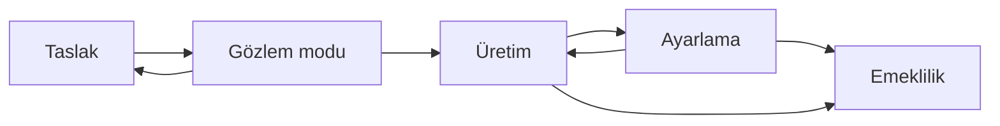

# Algılama kartı şablonu

[Çalışma şablonları](README.md) · [İzleme ve algılama](../docs/04-savunma/03-izleme-ve-algilama.md) · [Çevrimdışı kayıt analizi](../labs/01-kayit-analizi.md)

Bu şablon, bir alarmın veya analitiğin neyi, neden ve hangi bağlamla yakalamaya çalıştığını yazılı kayda dönüştürmek içindir. Bir OT alarmının değeri, hangi fiziksel işlevle ilişkili olduğunun ve hangi kararı desteklediğinin bilinmesidir; "şüpheli trafik bulundu" ifadesi operatör için yetersizdir. Kart, alarmı bu bağlamla birlikte taşır.

Kartlar ürün bağımsızdır. **Çalıştırılabilir kural, sorgu, arama ifadesi veya eşik dosyası bu şablona yazılmaz.** Mantık sözel olarak, hangi veri alanlarının hangi ilişkiyle değerlendirildiği düzeyinde anlatılır. Uygulama, kurumun kendi izleme ortamında ve kendi değişiklik sürecinde yapılır; şablonun kopyası o uygulamanın gerekçesini ve sahibini kaydeder.

Doldurma disiplini [şablon dizininin giriş sayfasındadır](README.md). Girdi olarak [envanter ve akış şablonu](01-envanter-ve-akis.md) ile [tehdit modeli şablonu](02-tehdit-modeli.md) kullanılır. Kartları gerçek bir tesise dokunmadan denemek için [çevrimdışı kayıt analizi laboratuvarındaki](../labs/01-kayit-analizi.md) sentetik kayıtlar kullanılabilir.

## 1. Kart alanları

Aşağıdaki blok kopyalanır ve her yeni kart için ayrı doldurulur. Köşeli parantezli alanlar doldurulacak yerlerdir.

- **Kart kimliği ve sürüm:** [ALG-XX, v1.0]
- **Durum:** [taslak / gözlem modu / üretim / ayarlama / emekli]
- **Korunan işlev:** [ISL-XX ve kısa adı; tehdit modelindeki karşılığı]
- **Bağlı senaryo:** [TM-XXX-01 veya `yok`]
- **Hipotez:** [hangi davranışı yakalamaya çalışıyoruz ve bu davranış neden inceleme gerektiriyor]
- **Veri kaynağı ve kapsamı**
  - Kaynak: [kayıt türü; hangi sistem üretiyor]
  - Kapsam: [hangi varlıklar, sahalar ve sürümler; kapsam dışında kalanlar]
  - Zaman: [ofset, saat kaynağı, bilinen sapma]
  - Saklama: [süre ve saklama yeri referansı]
  - Kör nokta: [şifreli içerik, gözlem dışı segment, kayıt üretmeyen cihaz]
- **Mantık özeti (sözel):** [hangi alanlar, hangi ilişki, hangi pencere; ürün bağımsız]
- **Birleştirilecek bağlam:** [varlık işlevi, sahip rolü, çalışma modu, iş emri, değişiklik kaydı, vardiya, envanter durumu]
- **Beklenen normal açıklamalar:** [bu gözlemi üreten olağan işletme durumları]
- **Alarm metni şablonu:** [ilk cümle kalıbı ve ardından gelen başlıklar]
- **İlk üç doğrulama adımı:** [analistin sırayla bakacağı üç şey]
- **İşletmeye aktarım kuralı ve karar sahibi:** [hangi koşulda kime, hangi kanaldan]
- **Otomatik eylem izni:** [var/yok; varsa hangi varlık sınıfı, hangi sınır, nasıl geri alınır]
- **Yanlış pozitif kaydı:** [tablo referansı; bölüm 4]
- **Ayarlama geçmişi:** [tablo referansı; bölüm 5]
- **Sağlık kontrolü:** [verinin aktığı nasıl anlaşılır; sessizlik ne zaman uyarı üretir]
- **Emeklilik koşulu:** [kart hangi durumda kaldırılır]
- **Sahibi:** [rol; SOC tarafı ve OT işlev sorumlusu]
- **Gözden geçirme tarihi:** [YYYY-AA-GG]

Alanlara ilişkin notlar:

| Alan | Doldururken dikkat edilecek |
|---|---|
| Hipotez | Teknik adı değil, gözlenebilir davranış yazılır. "T0822'yi görüyoruz" yerine hangi kaydın hangi koşulda inceleme ürettiği yazılır |
| Veri kaynağı | Her kaynağın tek başına göstermediği bir şey vardır; [veri katmanları tablosu](../docs/04-savunma/03-izleme-ve-algilama.md) bu sınırları listeler |
| Mantık özeti | Ürün, alan adı ve sorgu sözdizimi yazılmaz. Kart taşınabilir kalmalı, uygulama değişince geçerliliğini korumalıdır |
| Birleştirilecek bağlam | Bağlam alanı doldurulamıyorsa bu bir eksiklik kaydıdır; kart yine de üretime alınabilir, fakat eksiklik yazılır |
| Normal açıklamalar | En az bir tane bulunmayan kart, incelenmeden kapanan alarm üretme eğilimindedir |
| Otomatik eylem | İş istasyonu, kontrolör ve emniyet sistemine aynı müdahale kuralı uygulanmaz |
| Sağlık kontrolü | Alarmın oluşmaması, izlenen davranışın olmadığını değil, verinin akmadığını da gösterebilir |

## 2. Kartın yaşam döngüsü

Bir kart doğrudan üretime alınmaz. Aşağıdaki sıra bu deponun özgün önerisidir; süreler ve eşikler kuruma göre belirlenir.

| Aşama | Bu aşamada ne yapılır? | Çıkma koşulu |
|---|---|---|
| Taslak | Hipotez, korunan işlev, veri kaynağı ve normal açıklamalar yazılır; verinin var olduğu kontrol edilir | Kaynak erişilebilir, kapsam ve kör noktalar yazılı, sahip ve karar sahibi belli, en az bir normal açıklama listelenmiş |
| Gözlem modu | Kart çalışır fakat işletmeye bildirim üretmez; çıktılar yalnızca analist tarafından incelenir | Belirlenen pencerede çıkan bulguların tümü incelenmiş, bağlam alanlarının doldurulabildiği görülmüş, yanlış pozitif nedenleri en az bir kez sınıflandırılmış |
| Üretim | Alarm işletmeye aktarılabilir; aktarım kuralı ve karar sahibi uygulanır | Ayarlama gerektiren bir bulgu çıkana veya emeklilik koşulu oluşana kadar devam eder |
| Ayarlama | Bağlam, pencere veya kapsam değişikliği gerekçesiyle birlikte kaydedilir | Değişikliğin etkisi bir gözden geçirme penceresinde ölçülmüş ve ayarlama geçmişine yazılmış |
| Emeklilik | Kart kaldırılır; yerine geçen kart varsa belirtilir | Kaldırma kaydı yazılmış, artık kapsanmayan davranış ve bunun kabul edildiği rol not edilmiş |

Gözlem modundan taslağa dönmek bir başarısızlık değildir. Bağlam alanları doldurulamıyorsa sorun kartta değil, veri kapsamında olabilir.

## 3. Alarm metni ve işletmeye aktarım

İlk cümle kalıbı:

`[saha/bölge] sahasında, [varlık veya hesap rolü] için [gözlenen davranış] görüldü; [süreç etkisi doğrulandı / henüz doğrulanmadı].`

Ardından gelen başlıklar:

1. **Bilinenler:** Doğrudan kayıtta görülen bilgiler.
2. **Bilinmeyenler:** Henüz kanıtı olmayan noktalar.
3. **Destekleyen kayıtlar:** Hangi kaynaklardan hangi kayıtlar kullanıldı.
4. **İstenen teyit:** İşletmeden hangi somut bilgi isteniyor.
5. **Karar sahibi:** Kararı kimin vereceği ve hangi süre içinde beklendiği.

"Sistem ele geçirildi" gibi kanıtın ötesine geçen özetler kullanılmaz. Gözlem ile çıkarım ayrı yazılır. İşletmeye bildirim kanalı ve nöbetçi roller önceden tanımlanır; bir alarm sırasında kanal aranmaz.

## 4. Yanlış pozitif kaydı

Yanlış pozitif, kartın işe yaramadığının değil, bağlamın eksik olduğunun göstergesi olabilir. Neden sınıflandırılmadan kapatılan alarm, aynı nedenin tekrarını görünmez kılar.

| Tarih | Alarm kimliği | Neden sınıfı | Kanıt | Alınan aksiyon |
|---|---|---|---|---|
| [YYYY-AA-GG] | [kayıt kimliği] | [planlı bakım / değişiklik kaydı eksik / veri kalitesi / saat kayması / envanter eksikliği / mantık kapsamı] | [hangi kayıt teyit etti] | [bağlam eklendi / kapsam daraltıldı / envanter güncellendi / değişiklik yok] |

İstisnalar yalnızca bir adresi sessize almak biçiminde değil; sorumlu rol, süre ve gerekçeyle kaydedilir. Süresi dolan istisna kendiliğinden kapanmalıdır; kapanmıyorsa bu da bir bulgudur.

## 5. Ayarlama geçmişi

| Sürüm | Tarih | Değişiklik | Gerekçe | Değiştiren rol | Gözlenen etki |
|---|---|---|---|---|---|
| [v1.1] | [YYYY-AA-GG] | [ne değişti] | [hangi bulguya dayanıyor] | [rol] | [sonraki pencerede ne görüldü] |

Önceki sürüm silinmez. Bir olay incelemesinde "o tarihte kart hangi kapsamla çalışıyordu?" sorusunun yanıtı gerekir.

## 6. Sağlık kontrolü

Kartın sessiz kalması iki farklı anlama gelebilir: izlenen davranış oluşmamıştır ya da veri akmamaktadır. İkisini ayırmak için kartın kendi sağlık ölçütleri yazılır.

- Beklenen kayıt aralığı ve son kaydın yaşı.
- Toplayıcı veya kaynak sistemin kendi sağlık kayıtları.
- Saat senkronizasyonu ve ofset tutarlılığı.
- Kaynak sessizleştiğinde kime, ne kadar sürede uyarı gideceği.
- Kapsamdaki varlık sayısının envanterle karşılaştırılması.

Oturum veya kayıt akışının kesilmesi, bir kanıt boşluğudur ve olay kaydına yazılır.

## 7. Kurgusal doldurulmuş kart: ALG-01

**Kurgusaldır.** Yeşilova terfi merkezi, hesaplar ve iş emri numaraları uydurmadır; [kayıt analizi laboratuvarındaki](../labs/01-kayit-analizi.md) sentetik ortamla aynı adları kullanır.

- **Kart kimliği ve sürüm:** ALG-01, v1.2
- **Durum:** üretim
- **Korunan işlev:** ISL-01 — Kurgusal TERFI-02 noktasında pompa işletmesinin onaylı kontrol mantığıyla sürmesi
- **Bağlı senaryo:** TM-SU-01
- **Hipotez:** Mühendislik yetkisiyle yapılan bir işlem, onaylı bakım penceresinin veya iş emrinin kapsamı dışında gerçekleşiyorsa incelenmelidir. Yetkinin varlığı, o anda kullanılmasının onaylı olduğunu göstermez
- **Veri kaynağı ve kapsamı**
  - Kaynak: Erişim geçidi oturum kaydı, mühendislik istasyonu işlem kaydı, değişiklik/iş emri kaydı
  - Kapsam: Mühendislik bölgesindeki iş istasyonları ve bunların eriştiği kontrolörler. Saha panosundan yerel bağlantı kapsam dışıdır
  - Zaman: Geçit kaydı UTC, istasyon kaydı +03:00; karşılaştırmadan önce tek eksene taşınır
  - Saklama: Kurum kayıt politikasına göre; kayıt kimliği ile atıf yapılır
  - Kör nokta: Kayıt üretmeyen eski istasyonlar; yerel bağlantılar; kayıt aktarımının kesildiği pencereler
- **Mantık özeti (sözel):** Mühendislik işlemi kaydı ile o işlemi kapsayan onaylı iş emri penceresi karşılaştırılır. İşlemin zamanı pencerenin dışındaysa, ya da işlem bir iş emrine bağlanmamışsa inceleme açılır. Pencere uzatma onayı varsa yeni bitiş dikkate alınır
- **Birleştirilecek bağlam:** Kullanıcının rolü ve hesap türü, hedef varlığın işlevi ve sahibi, iş emri numarası ve onaylı pencere, vardiya kaydı, proje sürüm etiketi, oturumun geldiği bölge
- **Beklenen normal açıklamalar:** Onaylı acil bakım; sözlü onay alınmış ancak kayda geçmemiş pencere uzatması; devreye alma sonrası ayar düzeltmesi; ikinci bir iş emriyle çalışma; saat ofsetinin yanlış yorumlanması
- **Alarm metni şablonu:** "Yeşilova sahasında, tedarikçi rolündeki bir hesabın mühendislik işlemi onaylı pencere dışında görüldü; süreç etkisi henüz doğrulanmadı." Ardından bilinenler, bilinmeyenler, destekleyen kayıtlar, istenen teyit ve karar sahibi
- **İlk üç doğrulama adımı:** 1) İşlemin zamanını ve iş emri penceresini ortak saat ekseninde karşılaştır. 2) İşlemin hedefi olan varlığın işlev sahibini ve o anki çalışma modunu belirle. 3) Aynı pencerede bağımsız bir kaynakta (proses kaydı veya ağ gözlemi) karşılık gelen bir iz olup olmadığına bak
- **İşletmeye aktarım kuralı ve karar sahibi:** İş emri eşleşmesi bulunmazsa vardiya amirine bildirilir; kontrolör üzerinde yapılandırma değişikliği izi varsa OT işletme sorumlusu ve süreç mühendisi aynı çizelgeye alınır. Karar sahibi OT işletme sorumlusudur
- **Otomatik eylem izni:** Yok. Oturum sonlandırma önerisi analist tarafından yapılır, kararı işletme verir. Kontrolör ve emniyet ilgili varlıklar için otomatik eylem tanımlı değildir
- **Yanlış pozitif kaydı:** 2026-04-02, ALR-2026-0412, planlı bakım, pencere uzatma onayı kaydının geç girilmesi, bağlam alanına uzatma onayı eklendi
- **Ayarlama geçmişi:** v1.1 (2026-03-24) pencere uzatma onayı bağlama eklendi — gerekçe: ALR-2026-0412 incelemesi; değiştiren: SOC analisti (rol); gözlenen etki: sonraki pencerede aynı nedenli kayıt görülmedi. v1.2 (2026-05-08) saat ofseti farkı nedeniyle ortak eksene taşıma kuralı kart metnine yazıldı — gerekçe: iki kaydın farklı saat ekseninde karşılaştırılması; değiştiren: SOC analisti (rol); gözlenen etki: zaman kaynaklı eşleşmeme yinelenmedi
- **Sağlık kontrolü:** Geçit ve istasyon kayıtlarının son kayıt yaşı günlük kontrol edilir; iki saatten uzun sessizlik SOC nöbetçisine uyarı üretir. Kayıt kesintisi olay kaydına kanıt boşluğu olarak yazılır
- **Emeklilik koşulu:** Mühendislik işlemleri iş emrine teknik olarak bağlanır ve pencere dışında işlem yapılamaz hâle gelirse kart, kapsam daraltılarak yeniden değerlendirilir
- **Sahibi:** SOC analisti (birincil), OT işletme sorumlusu (işlev tarafı)
- **Gözden geçirme tarihi:** 2026-11-30

## 8. Kurgusal doldurulmuş kart: ALG-02

**Kurgusaldır.** Kavakdere ve komşu sahalar uydurmadır; gerçek bir operatör topolojisini anlatmaz.

- **Kart kimliği ve sürüm:** ALG-02, v1.0
- **Durum:** gözlem modu
- **Korunan işlev:** ISL-07 — Kurgusal Kavakdere sahasında enerji ve soğutma durumunun merkezden güvenilir biçimde izlenmesi
- **Bağlı senaryo:** TM-TLK-01
- **Hipotez:** Bir saha ölçümünün değeri uzun süre hiç değişmiyor ya da güncellenme yaşı büyüyorsa, merkez ekranındaki "normal" görüntü gerçek saha durumunu temsil etmiyor olabilir
- **Veri kaynağı ve kapsamı**
  - Kaynak: Saha izleme ölçümleri (sıcaklık, batarya, giriş gücü), toplayıcı sağlık kayıtları, saha ziyaret/bakım kayıtları
  - Kapsam: Seçilmiş saha grubundaki enerji ve soğutma denetleyicileri. Şebeke performans metrikleri kapsam dışıdır
  - Zaman: Kaynakların ofsetleri farklı olabilir; kart tek eksende değerlendirir
  - Saklama: Kurum kayıt politikasına göre
  - Kör nokta: Ölçüm çözünürlüğü düşük noktalar; kendi kaydını üretmeyen eski denetleyiciler; taşıma kesintisinde toplanamayan veriler
- **Mantık özeti (sözel):** Bir ölçümün değeri belirlenen pencerede hiç değişmiyorsa ve güncellenme yaşı beklenen aralığın üzerine çıkıyorsa inceleme açılır. Aynı durum birden çok sahada yakın zamanda görülüyorsa, ortak bağımlılık (taşıma, güç, toplayıcı) incelemesi ayrıca başlatılır
- **Birleştirilecek bağlam:** Sahanın enerji ve soğutma sahibi, toplayıcı sağlığı, taşıma bağlantısının durumu, son saha ziyareti, planlı bakım kaydı, ölçümün beklenen değişim aralığı
- **Beklenen normal açıklamalar:** Gerçekten kararlı ortam koşulları; düşük ölçüm çözünürlüğü; toplayıcı veya taşıma arızası; yazılım güncellemesi sonrası ilk yayın gecikmesi; sensör arızası
- **Alarm metni şablonu:** "Kavakdere sahasında, saha izleme ölçümünün değeri [süre] boyunca değişmedi ve güncellenme yaşı beklenen aralığın üzerinde; fiziksel durum henüz bağımsız olarak doğrulanmadı." Ardından bilinenler, bilinmeyenler, destekleyen kayıtlar, istenen teyit ve karar sahibi
- **İlk üç doğrulama adımı:** 1) Aynı sahadaki diğer ölçümlerin de donup donmadığına bak; tek ölçüm ile tüm akışı ayır. 2) Toplayıcı ve taşıma sağlık kayıtlarını aynı pencerede karşılaştır. 3) Yakın zamanda planlı bir bakım veya güncelleme olup olmadığını kayıttan doğrula
- **İşletmeye aktarım kuralı ve karar sahibi:** Tek sahada ve tek ölçümde ise saha operasyon ekibine bilgi verilir. Birden çok sahada eşzamanlı ise ortak bağımlılık incelemesi başlatılır ve NOC nöbetçisi çizelgeye alınır. Karar sahibi saha operasyon sorumlusudur
- **Otomatik eylem izni:** Yok. Saha enerji anahtarlaması, soğutma ayarı veya toplu yeniden başlatma güvenlik ekibinin kararı değildir
- **Yanlış pozitif kaydı:** Gözlem modunda; ilk pencerede iki bulgu "ölçüm çözünürlüğü" nedeniyle sınıflandırıldı, beklenen değişim aralığı bağlama eklenecek
- **Ayarlama geçmişi:** v1.0 (2026-09-01) ilk taslak; gözlem moduna alındı — gerekçe: kartın ilk yayımı; değiştiren: SOC analisti (rol); gözlenen etki: ilk pencere sonuçları yanlış pozitif kaydına işlendi
- **Sağlık kontrolü:** Kapsamdaki saha sayısı envanterle haftalık karşılaştırılır. Ölçüm akışı beklenen aralıkta gelmiyorsa kartın kendisi "veri yok" uyarısı üretir; bu uyarı alarm sayısına dahil edilmez
- **Emeklilik koşulu:** Aynı davranış, tazelik ve kalite bilgisini taşıyan tek bir veri kalitesi kartıyla kapsanır hâle gelirse ALG-02 birleştirilerek kaldırılır
- **Sahibi:** SOC analisti (birincil), saha OT sorumlusu (işlev tarafı)
- **Gözden geçirme tarihi:** 2026-12-15

## 9. Ölçüm

**Alarm sayısı bir başarı ölçütü değildir.** Artan alarm sayısı görünürlüğün arttığını da, gürültünün arttığını da gösterebilir; ikisini ayıran şey bağlam ve inceleme sonucudur. Aşağıdaki üç ölçüt kart başına tutulur.

| Ölçüt | Nasıl hesaplanır? | Ne söyler, ne söylemez? |
|---|---|---|
| Bağlam tamlık oranı | Kartın "birleştirilecek bağlam" alanlarının kaçının alarm anında dolu geldiği | Alarmın karar verilebilir olup olmadığını gösterir; alarmın doğru olduğunu göstermez |
| İşletme teyidine ulaşma süresi | Alarmın oluşmasından işletmeden somut teyit alınana kadar geçen süre | Aktarım kuralının işlediğini gösterir; ortalamanın yanında geciken kritik olaylar ayrıca incelenir |
| Yanlış pozitif neden dağılımı | Kapatılan alarmların neden sınıflarına göre dağılımı | Eksikliğin kartta mı, veride mi, kayıt disiplininde mi olduğunu gösterir |

Ek olarak kanıt kaybı yaşanan olay oranı izlenebilir. Eşikler ve hedefler tesise özgü belirlenir; bu şablon sayısal hedef önermez. Ölçüt tanımlarının genel çerçevesi [izleme ve algılama bölümündedir](../docs/04-savunma/03-izleme-ve-algilama.md).

## 10. Gözden geçirme kontrol listesi

- [ ] Kart bir korunan işleve ve mümkünse bir tehdit modeli senaryosuna bağlı.
- [ ] Hipotez, teknik adıyla değil gözlenebilir davranışla yazılmış.
- [ ] Veri kaynağının kapsamı, zaman ofseti ve kör noktaları yazılı.
- [ ] Mantık özeti ürün bağımsız; kartta çalıştırılabilir kural veya sorgu yok.
- [ ] En az bir normal işletme açıklaması listelenmiş.
- [ ] Alarm metni ilk cümle kalıbına uyuyor ve gözlem ile çıkarımı ayırıyor.
- [ ] İlk üç doğrulama adımı ve karar sahibi belli.
- [ ] Otomatik eylem izni açıkça yazılmış; yoksa "yok" denmiş.
- [ ] Yanlış pozitifler neden sınıfıyla kaydediliyor.
- [ ] Ayarlama geçmişi tutuluyor ve önceki sürümler duruyor.
- [ ] Sağlık kontrolü tanımlı; sessizlik uyarı üretiyor.
- [ ] Emeklilik koşulu yazılı.
- [ ] Sahibi ve gözden geçirme tarihi güncel.

## Kaynaklar ve kapsam

Kartın alanları, yaşam döngüsü, alarm metni kalıbı, ölçütler ve iki kurgusal örnek bu deponun **özgün eğitim sentezidir**; belirli bir ürünün kural formatı, bir standardın resmî formu veya çevirisi değildir. Veri katmanları ve örnek alarm mantığı için [izleme ve algılama bölümü](../docs/04-savunma/03-izleme-ve-algilama.md) esas alınmıştır. Erişim: **13.09.2026**.

| Yayıncı ve kaynak | Tarih | Desteklediği içerik |
|---|---|---|
| MITRE, [ATT&CK for ICS Matrix](https://attack.mitre.org/matrices/ics/) | Yaşayan sayfa | Davranışların ortak adla anılması; teknik kimliği yerel alarm doğruluğunu veya risk önceliğini belirlemez |

Kartlarda geçen saha, hesap, iş emri ve varlık adları kurgusaldır. Doldurulmuş kopyalar herkese açık bir yerde tutulmaz; hassas alanlar kurum içi kayıt kimliğiyle taşınır.

**İlgili şablonlar:** [Tehdit modeli](02-tehdit-modeli.md) · [Olay ve kurtarma](04-olay-ve-kurtarma.md) · [Envanter ve akış](01-envanter-ve-akis.md)
