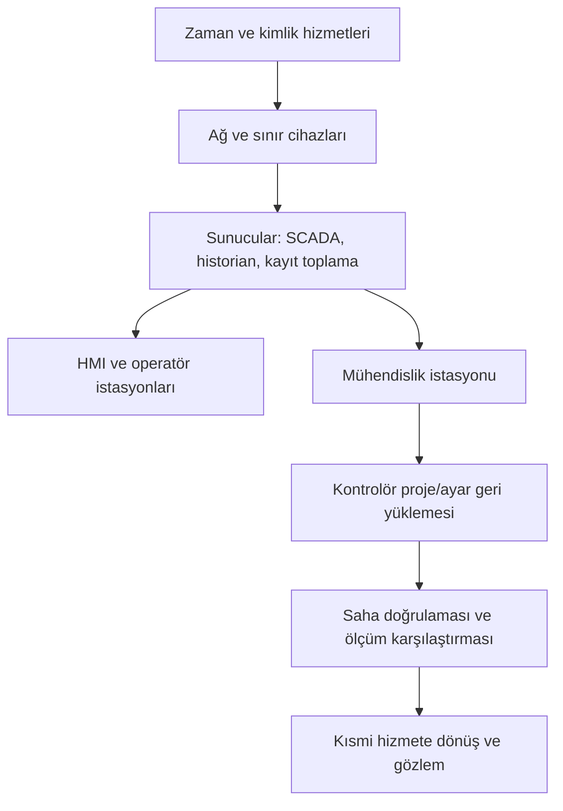

# Olay ve kurtarma şablonu

[Ana sayfa](../README.md) · [Şablon dizini](README.md) · [Olay müdahalesi ve kurtarma](../docs/04-savunma/05-olay-mudahalesi-ve-kurtarma.md)

Bu şablon bir OT olayının ilk kaydını, verilen kararların gerekçesini, kanıtın korunmasını ve doğrulanmış hizmete dönüşü tek bir yerde tutmak içindir. Yedi bölümü olayın akışına göre sırayla doldurulur. Dosya boş formdur; doldurma kurumun kontrollü olay kayıt sisteminde yapılır. Buradaki bütün örnek değerler **kurgusaldır** ve yalnızca biçimi gösterir.

Şablon acil durum prosedürünün yerine geçmez. Personel ve çevre güvenliğine ilişkin kararlar işletmenin kendi acil durum talimatlarından yürütülür; kayıt tutmak bu kararların önüne geçirilmez. Bölüm sırası [olay müdahalesi ve kurtarma](../docs/04-savunma/05-olay-mudahalesi-ve-kurtarma.md) bölümündeki karar akışıyla eşleşir. Şablonu gerçek bir olay beklemeden denemek için [masa başı tatbikatı](../labs/03-masa-basi-tatbikati.md) kullanılabilir.

## 1. İlk kayıt

İlk kaydın amacı olayı çözmek değil, o an bilinenleri ve bilinmeyenleri ayırmaktır. Emniyet ve süreç durumu alanları önce doldurulur; diğer alanlar bilgi geldikçe sürüm notuyla güncellenir.

### 1.1 Alan tanımları

| Alan | Ne yazılır? | Kurgusal örnek | Doldurma notu |
|---|---|---|---|
| Olay kimliği | Kurum içinde tekil kod | `OLY-2026-014` | Kod bütün kanıt, karar ve değişiklik kayıtlarında aynı kullanılır |
| Açılış zamanı ve saat dilimi | Kaydın açıldığı an, saat dilimiyle | `2026-09-13 04:22 (UTC+03)` | Gözlem zamanı ile kayıt zamanı ayrı alanlardır |
| İlk gözlem zamanı | Belirtinin ilk görüldüğü an | `2026-09-13 03:58 (UTC+03), kaynağın saati` | Kaynağın saati doğrulanmadıysa `doğrulanacak` yazılır |
| Bildiren | Bildirimi yapan rol ve kanal | `Vardiya operatörü (rol), nöbetçi telefonu` | Kişi adı değil rol yazılır; kişi bilgisi kurum kaydında tutulur |
| İlk gözlem | Görülen belirti, yorum katmadan | `Uzak saha telemetrisinde zaman damgaları güncellenmiyor` | "Saldırı var" gibi sonuç ifadeleri bu alana yazılmaz |
| Etkilenen işlev | Hangi hizmet veya işlev etkilendi | `2 nolu terfi noktasının uzaktan izlenmesi` | Cihaz adı yerine işlev yazılır; varlık kodu ayrı alanda verilir |
| İlgili varlık kodları | Envanterdeki kodlar | `SU-RTU-009, SU-SRV-003` | [Envanter ve akış şablonundaki](01-envanter-ve-akis.md) kodlarla aynı olmalıdır |
| Emniyet durumu | Emniyet işlevlerinin bilinen durumu ve kim teyit etti | `Emniyet işlevleri etkilenmedi; vardiya amiri teyidi 04:30` | Teyit edilmediyse "teyit edilmedi" yazılır, "sorun yok" yazılmaz |
| Süreç durumu | Otomatik, kısıtlı, yerel/manuel veya durmuş | `Yerel otomatik kontrol sürüyor; merkezden izleme yok` | Süreç durumu ile bilgi sistemi durumu ayrı yazılır |
| Hizmet etkisi | Kullanıcıya yansıyan etki | `Abone hizmetinde kesinti gözlenmedi (04:30 itibarıyla)` | Etki yoksa "gözlenmedi" ve gözlem saati yazılır |
| Bilinenler | Doğrulanmış bulgular ve dayanağı | `Sınır cihazı kaydında 03:41'de oturum sonlanması var` | Her madde kaynağıyla birlikte yazılır |
| Bilinmeyenler | Cevabı henüz olmayan sorular | `Kesintinin nedeni haberleşme mi, cihaz mı?` | Boş bırakılmaz; bilinmeyeni yazmak kaydın kalitesini artırır |
| Olay yöneticisi | Kaydı ve kararları yürüten rol | `Olay yöneticisi (rol), nöbet listesi NL-2026-37` | Devir olduğunda devir zamanı karar günlüğüne yazılır |
| Kanıt konumu | İlk kanıtların nerede tutulduğu | `Kanıt kaydı KNT-2026-014-01` | Kanıt içeriği bu forma kopyalanmaz, kimlikle atıf yapılır |
| Kaydın sürümü | Sürüm ve son değiştiren rol | `v3, olay yöneticisi, 06:10` | Önceki sürüm silinmez |

### 1.2 Kopyalanabilir ilk kayıt kartı

| Alan | Değer |
|---|---|
| Olay kimliği | [olay kodu] |
| Kaydın açılış zamanı ve saat dilimi | [YYYY-AA-GG SS:DD] ([saat dilimi]) |
| İlk gözlem zamanı ve saatin kaynağı | [YYYY-AA-GG SS:DD] ([kaynak sistem ve saat dilimi]) |
| Bildiren rol ve kanal | [rol], [kanal] |
| İlk gözlem | [görülen belirti] |
| Etkilenen işlev | [hizmet/işlev] |
| İlgili varlık ve akış kodları | [varlık kodları] / [akış kodları] |
| Emniyet durumu ve teyit eden | [durum] — [rol], [saat] |
| Süreç durumu | [otomatik/kısıtlı/yerel/durmuş] — [açıklama] |
| Hizmet etkisi ve gözlem saati | [etki] ([saat] itibarıyla) |
| Bilinenler | 1. [bulgu] — kaynak: [kayıt] 2. [bulgu] — kaynak: [kayıt] |
| Bilinmeyenler | 1. [açık soru] — sorumlu: [rol] 2. [açık soru] — sorumlu: [rol] |
| Olay yöneticisi | [rol] |
| Bilgilendirilen roller | [rol], [rol] |
| Kanıt kaydı kimliği | [kanıt kayıt kodu] |
| Kaydın sürümü ve değiştiren | [sürüm], [rol], [saat] |

Kurgusal doldurulmuş örnek:

| Alan | Değer |
|---|---|
| Olay kimliği | OLY-2026-014 |
| Kaydın açılış zamanı ve saat dilimi | 2026-09-13 04:22 (UTC+03) |
| İlk gözlem | Kurgusal A sahasının telemetri değerleri sabit; kalite bayrağı eski |
| Emniyet durumu ve teyit eden | Emniyet işlevlerinde belirti yok — vardiya amiri (rol), 04:30 |
| Süreç durumu | Yerel otomatik kontrol sürüyor; merkezden izleme yok |
| Bilinmeyenler | Haberleşme arızası mı, yetkisiz erişim mi? — sorumlu: otomasyon sorumlusu (rol) |

Bir olayın nedeni ilk saatte çoğunlukla belirsizdir. Kaydın "arıza" veya "saldırı" olarak erken etiketlenmesi, sonraki kanıt toplama kararlarını daraltabilir. Sınıflandırma alanı geçici olarak işaretlenir ve değiştiğinde karar günlüğüne yazılır.

## 2. Karar günlüğü

| Zaman (saat dilimiyle) | Karar | Gerekçe ve o an bilinenler | Karar sahibi (rol) | Değerlendirilen alternatifler | Geri alınabilirlik | Kanıt referansı |
|---|---|---|---|---|---|---|
| [YYYY-AA-GG SS:DD] ([dilim]) | [verilen karar] | [gerekçe]; o an bilinmeyen: [eksik bilgi] | [rol] | [alternatif 1], [alternatif 2] | [geri alınabilir/kısmen/geri alınamaz] — [koşul] | [kanıt kimliği] |
| [YYYY-AA-GG SS:DD] ([dilim]) | [verilen karar] | [gerekçe] | [rol] | [alternatif] | [geri alınabilirlik] | [kanıt kimliği] |

Kurgusal doldurulmuş örnek:

| Zaman (saat dilimiyle) | Karar | Gerekçe ve o an bilinenler | Karar sahibi (rol) | Değerlendirilen alternatifler | Geri alınabilirlik | Kanıt referansı |
|---|---|---|---|---|---|---|
| 2026-09-13 04:45 (UTC+03) | Uzak bakım erişimi yeni oturumlara kapatıldı, süren oturum sonlandırılmadı | Oturum kaydı okunamıyor; süren oturumun onaylı bakım olma ihtimali var | Olay yöneticisi (rol) | Bütün oturumları kesmek; hiçbir şey yapmamak | Geri alınabilir — erişim kapısı yapılandırması saklandı | KNT-2026-014-03 |
| 2026-09-13 05:20 (UTC+03) | Saha ekibi yerel gösterge okuması için görevlendirildi | Merkezden gelen değerin bağımsız doğrulaması yok | Vardiya amiri (rol) | Yalnız merkezî veriyle devam etmek | Uygulanmaz | KNT-2026-014-05 |

**Karar günlüğü sonradan yazılmaz.** Satır, karar verildiği anda veya hemen ardından girilir. Sonradan eklenen bir satır, eklenme zamanı ve nedeniyle işaretlenir; önceki satır silinmez, düzeltme yeni satır olarak yazılır. Günlüğün amacı kişi değerlendirmek değil, eksik bilgiyle verilen bir kararın sonradan anlaşılabilmesidir. Olay bittikten sonra hatırlanarak yazılan günlük, hem karar sırasını hem eksik bilginin ne olduğunu kaybeder.

Karar vermemek de bir karardır: gözlemi sürdürme, bekleme veya bilgi toplama kararları da satır olarak yazılır. Devir teslimler (olay yöneticisi değişimi, vardiya değişimi) ayrı satırdır; devralan rolün neyi bildiği kaydedilir.

## 3. Sınırlama seçeneklerinin değerlendirilmesi

Aşağıdaki tablo bir uygulama listesi değil, karar öncesi karşılaştırma formudur. Seçenekler [olay müdahalesi ve kurtarma](../docs/04-savunma/05-olay-mudahalesi-ve-kurtarma.md) bölümündeki başlıklardan türetilmiştir. Her satır doldurulduktan sonra seçilen seçenek ve gerekçesi 2. bölüme yazılır.

| Seçenek | Süreç etkisi | Emniyet etkisi | Kanıt kaybı riski | Geri dönüş maliyeti | Onay gereken merci |
|---|---|---|---|---|---|
| Şüpheli kullanıcı yetkisini sınırla | [aynı kimliğe bağlı başka görev var mı?] | [emniyet ilgili bir işlem engellenir mi?] | [oturum kaydı kesilir mi?] | [yetkinin geri verilmesi ne kadar sürer?] | [rol] |
| Uzak bakım oturumunu sonlandır | [süren onaylı bakım yarıda kalır mı?] | [yarım kalan işlem riskli durum bırakır mı?] | [oturum içeriği kaybolur mu?] | [yeniden başlatma koşulu] | [rol] |
| Bir ağ geçişini kapat | [kontrol, koruma, gözlem ve zaman bağımlılığı] | [bağımsız koruma etkilenir mi?] | [merkeze kayıt akışı durur mu?] | [açma prosedürü ve süresi] | [rol] |
| Alternatif işletme düzenine geç | [eğitimli personel ve güncel prosedür var mı?] | [saha koşulları uygun mu?] | [merkezî kayıt seyrelir mi?] | [geri dönüş adımları] | [rol] |
| Bir varlığı ağdan ayır | [işlevin yerel devam etme kabiliyeti] | [ayırma anında çıkış davranışı bilinen mi?] | [uçucu kayıt kaybolur mu?] | [yeniden bağlama ve doğrulama] | [rol] |
| Sistemi yedekten geri yükle | [kesinti süresi ve kısıtlı işletim] | [geri yükleme sırasında beklenen davranış] | [mevcut durum üzerine yazılır mı?] | [başarısızlık hâlinde ne kalır?] | [rol] |
| Gözlemi sürdür, müdahale etme | [etkinin büyüme ihtimali] | [emniyet marjı bekleme süresine dayanır mı?] | [kayıt saklama süresi doluyor mu?] | [uygulanmaz] | [rol] |

"Manuele geçmek" her tesiste mevcut veya güvenli bir seçenek olmayabilir; bu satır doldurulurken alternatif düzenin yazılı prosedürü, eğitimi ve saha koşulları ayrıca sorgulanır. Bir seçeneğin süreç etkisi düşük görünüyorsa, bu değerlendirmenin hangi bilgiye dayandığı kanıt referansıyla yazılır.

## 4. Kanıtın korunması

### 4.1 Hangi kayıtlar önce kaybolur?

Aşağıdaki sıralama ürün ve yapılandırmaya göre değişir; kurum kendi sistemleri için saklama sürelerini doğrulayarak doldurur.

| Kayıt türü | Tipik kaybolma nedeni | Kurumdaki saklama süresi | Notlar |
|---|---|---|---|
| Cihaz üzerindeki uçucu durum | Yeniden başlatma veya güç kesilmesi | [doğrulanacak] | Toplama işleminin kendisi süreç etkisi yaratabilir |
| Sınırlı kapasiteli olay tamponları | Yeni olaylar eskileri üzerine yazar | [süre/kapasite] | Kontrolör ve saha cihazlarında sık görülür |
| Erişim kapısı ve oturum kayıtları | Döngüsel dosya veya kısa saklama | [süre] | Merkeze aktarım varsa ikinci kopya bulunabilir |
| Ağ akış kayıtları ve pasif gözlem verisi | Depolama kapasitesi | [süre] | Şifreli içerik için yalnız üst bilgi kalır |
| Yüksek çözünürlüklü süreç verisi | Historian seyreltme (arşivde özetlenir) | [süre] | Seyreltme öncesi aralık olay için önemli olabilir |
| HMI alarm ve operatör işlem kaydı | Tampon boyutu | [süre] | Operatör defteri ayrı bir kaynak olarak değerlidir |
| Geçici bakım bilgisayarındaki kayıtlar | Cihazın sahadan ayrılması | [uygulanmaz] | Cihazın kimde olduğu kayda alınır |
| Sunucu ve kimlik altyapısı kayıtları | Genellikle daha uzun saklanır | [süre] | Çoğu olayda daha az müdahaleli ilk adımdır |

### 4.2 Toplama sırası

Sıra, hem kaybolma hızına hem müdahale düzeyine göre kurulur. Aşağıdaki sıralama bu deponun özgün önerisidir:

1. Merkezde zaten toplanmış kayıtların dondurulması (silinmeye karşı koruma, saklama süresinin uzatılması).
2. Sunucu, erişim kapısı ve kimlik altyapısı kayıtlarının kopyalanması.
3. Ağ sınırındaki kayıtlar ve varsa pasif gözlem verisi.
4. Operatör gözlemleri, ekran görüntüleri, vardiya defteri ve saha ekibinin yazılı notu.
5. İş istasyonu düzeyindeki kayıtlar; yapılacak işlem ve etkisi önceden değerlendirilerek.
6. Kontrolör ve saha cihazı üzerindeki kayıtlar; ürün davranışı ve süreç etkisi değerlendirildikten sonra, otomasyon sorumlusuyla birlikte.

Genel amaçlı bir olay müdahale aracının kontrolör üzerinde çalıştırılması güvenli varsayılmaz. Bir toplama adımı süreci riske atıyorsa adım ertelenir veya yapılmaz; karar ve gerekçe 2. bölüme, oluşan kanıt boşluğu 7. bölüme yazılır.

### 4.3 Saat farkı notu

| Kaynak | Kaynağın saat dilimi | Zaman kaynağı | Ölçülen sapma | Sapmanın nasıl doğrulandığı |
|---|---|---|---|---|
| [kayıt kaynağı] | [dilim] | [merkezî zaman hizmeti/yerel saat] | [saniye/dakika, yön] | [karşılaştırma yöntemi ve tarih] |
| [kayıt kaynağı] | [dilim] | [zaman kaynağı] | [sapma] | [yöntem] |

Kayıtlar tek bir zaman eksenine çevrilirken özgün zaman damgası korunur; çevrilmiş değer ayrı sütunda gösterilir. Saat sapması bilinmeden olay sırası kesinleştirilmez. Zaman kaynağının kendisi olaydan etkilenmiş olabilir; bu ihtimal bilinmeyenler listesine yazılır.

### 4.4 Kanıt zinciri kaydı

| Kanıt kimliği | İçerik | Kaynak | Alma zamanı (dilim) | Alan rol | Kopyalama yöntemi | Bütünlük kaydı | Saklama yeri | Devir kaydı |
|---|---|---|---|---|---|---|---|---|
| [kanıt kodu] | [ne olduğu] | [sistem/varlık kodu] | [zaman] | [rol] | [yöntem] | [özet kaydı referansı] | [kayıt sistemi referansı] | [kimden kime, zaman] |

- [ ] Her kanıt için kaynağı, alma zamanı ve alan rol kayıtlı.
- [ ] Kopya üzerinde çalışılıyor; özgün kayıt değiştirilmiyor.
- [ ] Bütünlük bilgisi kanıtın kendisinden ayrı bir yerde saklanıyor.
- [ ] Kanıta erişim yetkisi sınırlı ve erişimler kayıtlı.
- [ ] Kişisel veri içeren kayıtlar için saklama süresi ve yetki kurumun süreciyle belirlenmiş.
- [ ] Toplanamayan kanıtlar ve nedenleri yazılı.

**İlke: kanıt toplamak için süreci riske atma.** Hizmetin sürekliliği, personel ve çevre güvenliği kanıt toplamanın önündedir. Kanıt ile süreç arasında bir seçim gerekiyorsa karar günlüğüne yazılır ve oluşan boşluk açıkça kaydedilir. Kaydedilmiş bir kanıt boşluğu, farkında olunmayan bir boşluktan daha kullanışlıdır.

## 5. Kurtarma

### 5.1 Yedek paketi doğrulama listesi

Geri yüklemeye başlamadan önce paketin tamlığı incelenir. Liste [olay müdahalesi ve kurtarma](../docs/04-savunma/05-olay-mudahalesi-ve-kurtarma.md) bölümündeki yedek paketi önerisinden türetilmiştir.

- [ ] Kontrol projesi, HMI projesi ve gerekli yapılandırmalar pakette var.
- [ ] Yazılım/donanım yazılımı sürümleri sahadaki donanım revizyonuyla uyumlu.
- [ ] Ağ ve güvenlik cihazı yapılandırmaları, akış matrisi ve bağımlılık listesi güncel.
- [ ] Mühendislik araçları, sürücüler ve lisans geri kazanma yöntemi erişilebilir.
- [ ] Kurtarma kimlik bilgilerine yetkili rol ulaşabiliyor (sır bu forma yazılmaz).
- [ ] Paketin bütünlük bilgisi ayrı kaynaktan doğrulandı.
- [ ] Yedeğin alındığı tarih, olayın başlangıcından önceki güvenilir bir zamana ait.
- [ ] Geri yükleme sırası ve kabul ölçütleri pakette yazılı.
- [ ] Paketin okunduğu ortam, olaydan etkilenmiş sistemlerden bağımsız.

Bütünlük özeti, içeriğin olaydan önce zaten bozulmamış olduğunu tek başına göstermez. Yedeğin hangi tarihe ait olduğu ve o tarihte sistemin güvenilir kabul edilme gerekçesi yazılır.

### 5.2 Geri yükleme sırası ve bağımlılıklar

| Sıra | Adım | Ön koşul | Bağımlı olduğu adım | Doğrulama kanıtı | Sorumlu rol |
|---|---|---|---|---|---|
| 1 | [adım] | [ön koşul] | [-] | [kanıt] | [rol] |
| 2 | [adım] | [ön koşul] | [sıra no] | [kanıt] | [rol] |
| 3 | [adım] | [ön koşul] | [sıra no] | [kanıt] | [rol] |

Şema sıralamanın mantığını gösterir: kimlik, zaman ve kayıt altyapısı çalışmadan üst katmanların doğrulaması güvenilmez olur. Her tesisin bağımlılıkları farklıdır; sıra [envanter ve akış şablonundaki](01-envanter-ve-akis.md) bağımlılık alanlarından çıkarılır ve tatbikatla denenir.

### 5.3 Kısmi hizmete dönüş

| İşlev | Öncelik gerekçesi | Hangi kısıtla çalışır? | Ek personel/saha ihtiyacı | Bu aşamada izlenecek belirti | Karar sahibi |
|---|---|---|---|---|---|
| [işlev] | [gerekçe] | [kısıt] | [ihtiyaç] | [belirti] | [rol] |

Kısmi dönüş, tam dönüş kararının yerine geçmez. Hangi işlevin kısıtlı çalıştığı operatöre ve saha ekibine yazılı olarak bildirilir; kısıt kalkana kadar günlük olarak gözden geçirilir.

### 5.4 Doğrulama testleri

| Test | Ne gösterir? | Tek başına neyi göstermez? | Kanıt |
|---|---|---|---|
| İşlev testi | Geri yüklenen mantığın beklendiği gibi çalıştığı | Saha ekipmanının fiziksel durumunu | [test kaydı] |
| Haberleşme testi | İzinli akışların çalıştığı | Kapsam dışı geçişin engellendiğini | [test kaydı] |
| Alarm zinciri testi | Alarmın operatöre ulaştığı | Alarmın doğru eşiğe ayarlandığını | [test kaydı] |
| Kayıt akışı testi | Olay kayıtlarının toplandığı | Kayıtların eksiksiz olduğunu | [test kaydı] |
| Bağımsız ölçüm karşılaştırması | Gösterilen değerin saha ölçümüyle tutarlılığı | Sensörün kalibrasyonunu | [saha kaydı] |
| Yedek tazeleme | Yeni durumun kurtarılabilir olduğu | Yedeğin geri yüklenebildiğini (ayrı deneme gerekir) | [yedek kaydı] |

Çalışır sunucu ile doğrulanmış süreç ayrı kabul maddeleridir. "Sistem açıldı" ifadesi hizmetin doğrulandığı anlamına gelmez.

### 5.5 Mühendislik ve işletme onayı

| Rol | Onayladığı kapsam | Dayandığı kanıt | Kalan çekince | Tarih ve saat |
|---|---|---|---|---|
| Proses/süreç mühendisi (rol) | [kapsam] | [kanıt kimliği] | [çekince veya "yok"] | [zaman] |
| Otomasyon sorumlusu (rol) | [kapsam] | [kanıt kimliği] | [çekince] | [zaman] |
| Emniyet sorumlusu (rol) | [kapsam] | [kanıt kimliği] | [çekince] | [zaman] |
| İşletme/vardiya amiri (rol) | [kapsam] | [kanıt kimliği] | [çekince] | [zaman] |
| Güvenlik ekibi (rol) | [kapsam] | [kanıt kimliği] | [çekince] | [zaman] |

Çekinceli onay, onayın kendisi kadar önemlidir; çekince kapanana dek 7. bölümdeki iş listesinde kalır.

## 6. Normal hizmete dönüş

- [ ] Olayın nedeni ve kapsamı, verilen kararları taşıyacak ölçüde sınırlandırıldı.
- [ ] Geri yüklenen proje/ayar, güvenilir kabul edilen sürümle karşılaştırıldı.
- [ ] Cihaz, yazılım ve donanım revizyonu uyumluluğu doğrulandı.
- [ ] Zaman ve kimlik hizmetleri çalışıyor ve kayıtlar merkeze akıyor.
- [ ] Saha ölçümü ile merkezî gösterge tutarlı.
- [ ] Emniyetle ilgili işlevler yetkili ekipçe değerlendirildi.
- [ ] Olay sırasında açılan geçici erişim ve kurallar kapatıldı; kapanış doğrulandı.
- [ ] Olay sırasında değişen yapılandırmalar değişiklik kaydına bağlandı.
- [ ] Yedek paketi güncel durumu kapsayacak şekilde tazelendi.
- [ ] Kısıtlı çalışan işlevler ve kalan çekinceler yazılı olarak devredildi.

| Onay | Rol | Kanıt | Tarih ve saat |
|---|---|---|---|
| Normal hizmete dönüş onayı | [rol] | [kanıt kimliği] | [zaman] |
| Olay kaydının kapatılması | [rol] | [kanıt kimliği] | [zaman] |

RTO hedeflenen geri dönüş süresini, RPO tolere edilen veri kaybı aralığını anlatır. OT'de bunların yanına kabul edilebilir süreç durumu ve saha doğrulama süresi eklenir. Bu hedefleri hizmet ve emniyet sahipleri belirler; şablon yalnızca kaydı tutar.

## 7. Olay sonrası öğrenme

| Bulgu | Bulgunun dayandığı kanıt | Önerilen iyileştirme | Sahibi (rol) | Hedef tarih | Doğrulama kanıtı | Durum |
|---|---|---|---|---|---|---|
| [bulgu] | [kanıt kimliği] | [iyileştirme] | [rol] | [YYYY-AA-GG] | [nasıl doğrulanacak] | [açık/kapalı] |
| [bulgu] | [kanıt kimliği] | [iyileştirme] | [rol] | [YYYY-AA-GG] | [nasıl doğrulanacak] | [açık/kapalı] |

Kanıt boşlukları ayrıca listelenir: hangi soru cevaplanamadı, hangi kayıt yoktu veya okunamadı, bu boşluk hangi kararı belirsiz bıraktı. Bu liste izleme ve kayıt tasarımının girdisidir; [algılama kartı şablonu](03-algilama-karti.md) ile birlikte gözden geçirilebilir.

- [ ] İyileştirme maddelerinin sahibi ve tarihi var.
- [ ] Kök nedeni doğrulanmamış maddeler `doğrulanacak` işaretli.
- [ ] Kayıt/kanıt boşlukları listelendi.
- [ ] Değişen belgeler (envanter, akış matrisi, algılama kartları, kurtarma sırası) güncellendi.
- [ ] Tatbikat senaryosuna dönüştürülecek maddeler işaretlendi.

### Bildirim notu

Bildirim ve raporlama yükümlülükleri kurumun kendi güncel yükümlülük listesinden ve iletişim planından yürütülür; sektöre, hizmete ve olayın niteliğine göre değişir. Bu şablon hukuki danışmanlık değildir ve herhangi bir düzenlemeye uygunluk beyanı üretmez. Aşağıdaki tablo yalnızca yapılan bildirimlerin kaydını tutar:

| Bildirim | Kime | İçerik özeti | Onaylayan rol | Zaman | Kanıt |
|---|---|---|---|---|---|
| [bildirim türü] | [muhatap] | [özet] | [rol] | [zaman] | [kayıt kimliği] |

Bildirim metninin içeriği kurumun iletişim planındaki yetkili rollerce hazırlanır. Doğrulanmamış bulgular bildirim metninde kesin ifadelerle yer almaz.

## İlgili belgeler

- [Olay müdahalesi ve kurtarma](../docs/04-savunma/05-olay-mudahalesi-ve-kurtarma.md): karar akışı, sınırlama seçenekleri ve yedek paketi tasarımı.
- [Masa başı tatbikatı](../labs/03-masa-basi-tatbikati.md): şablonu kurgusal bir senaryoyla doldurma alıştırması.
- [Envanter ve akış şablonu](01-envanter-ve-akis.md): varlık kodları, bağımlılıklar ve kurtarma sırasının girdisi.
- [Değişiklik ve kabul şablonu](05-degisiklik-ve-kabul.md): olay sırasında yapılan değişikliklerin kayda bağlanması.
- [İzleme ve algılama](../docs/04-savunma/03-izleme-ve-algilama.md): kanıt boşluklarının algılama tasarımına dönmesi.

## Kaynak ve kapsam

- NIST, *SP 800-61 Rev. 3*, 3 Nisan 2025, [yayın kaydı](https://csrc.nist.gov/pubs/sp/800/61/r3/final), erişim: 13.09.2026. Olay müdahalesinin risk yönetimiyle bütünleşmesi bağlamı için.
- NIST, *SP 1339: OT Backup Quick Start Guide*, 17 Haziran 2026, [yayın kaydı](https://csrc.nist.gov/pubs/sp/1339/final), erişim: 13.09.2026. Yedeklerin değişiklik yönetimiyle ilişkilendirilmesi, düzenli oluşturulması ve test edilmesi bağlamı için.
- CISA, FBI ve EPA, *Incident Response Guide: Water and Wastewater Sector*, Ocak 2024, [PDF](https://www.epa.gov/system/files/documents/2024-01/wws-sector_incident-response-guide.pdf), erişim: 13.09.2026. Olay aşamaları ve olay sonrası öğrenme bağlamı için; belge ABD kurumsal rollerini anlatır, Türkiye'deki bildirim yükümlülüklerini tanımlamaz.
- EPA, *Incident Action Checklist – Cybersecurity*, Eylül 2024, [PDF](https://www.epa.gov/system/files/documents/2024-09/240909_cybersecurityiac_fillable_508c.pdf), erişim: 13.09.2026. Süreç etkisi ile bilgi sistemi etkisinin ayrı ele alınması bağlamı için.

Alan listeleri, karar günlüğü tasarımı, sınırlama karşılaştırma tablosu, kanıt sırası önerisi, geri yükleme şeması ve kontrol listeleri bu deponun **özgün eğitim sentezidir**; kaynak belgelerin çevirisi veya bir standardın resmî formu değildir. Bütün örnek değerler kurgusaldır; gerçek bir tesisi, olayı, ürünü veya yapılandırmayı temsil etmez. Lisans ve atıf koşulları [LICENSE.md](../LICENSE.md) dosyasındadır.
