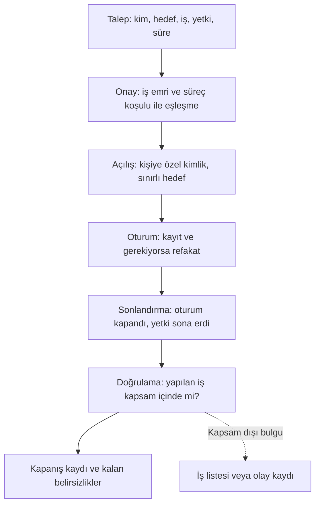

# Tedarikçi ve uzak erişim şablonu

[Ana sayfa](../README.md) · [Şablon dizini](README.md) · [Segmentasyon, kimlik ve uzak erişim](../docs/04-savunma/02-segmentasyon-ve-uzak-erisim.md)

Bu şablon iki işi birlikte kaydeder: **(1)** bir ürün veya hizmet alınmadan önce tedarikçiye sorulacaklar ve istenecek kanıtlar, **(2)** verilen her uzak erişimin kim, hangi hedef, hangi yetki, ne kadar süre ve hangi kanıtla sorularının yanıtı. İki bölüm aynı tedarikçi ve varlık kimliklerini kullanır. Dosya boş formdur; doldurma kurumun kontrollü kayıt sisteminde yapılır. Buradaki bütün örnek değerler **kurgusaldır**.

Şablon bir sözleşme metni veya hukuki form değildir; sözleşme koşulları kurumun yetkili birimlerince hazırlanır. Erişim tasarımının arkasındaki kontrol mantığı [segmentasyon, kimlik ve uzak erişim](../docs/04-savunma/02-segmentasyon-ve-uzak-erisim.md) bölümündedir.

## 1. Tedarikçi değerlendirme

### 1.1 Sorular ve istenecek kanıtlar

Cevap alanına "evet" yazmak yeterli değildir; hangi belgeye dayandığı ve hangi sürüm/lisans kapsamında geçerli olduğu yazılır.

| Konu | Sorulacak soru | Kanıt olarak istenecek | Değerlendirme notu |
|---|---|---|---|
| Ürün güvenlik özellikleri | Kişiye özel hesap, rol ayrımı, kayıt üretimi ve dışa aktarımı hangi model ve lisansta var? | Ürün güvenlik dokümanı, lisans matrisi | Özelliğin varlığı ile satın alınan pakette etkin olması ayrı konudur |
| Varsayılan yapılandırma | Ürün varsayılan olarak hangi hesaplarla ve hangi servislerle gelir; hangileri kapatılabilir? | Devreye alma/sıkılaştırma kılavuzu | Kapatılamayan servisler ayrıca listelenir |
| Kimlik doğrulama | Merkezî kimlik ile bütünleşme ve ek doğrulama hangi arayüzlerde destekleniyor? | Entegrasyon dokümanı | Mühendislik arayüzü ile web arayüzü farklı davranabilir |
| Yaşam döngüsü | Bu model ve sürüm için satış sonu, destek sonu ve güvenlik güncellemesi sonu tarihleri nedir? | Yaşam döngüsü tablosu, yazılı taahhüt | Tarih verilemiyorsa `doğrulanacak` yazılır ve sözleşme öncesi istenir |
| Zafiyet bildirimi | Ürününüzü etkileyen bir zafiyeti bize hangi kanaldan, hangi sürede bildirirsiniz? | Bildirim politikası, iletişim kanalı | Süre taahhüdü yazılı mı, en iyi çaba beyanı mı? |
| Zafiyet bilgisinin içeriği | Etkilenen sürümler, geçici önlem ve düzeltme takvimi bildirime dâhil mi? | Örnek geçmiş duyuru | Geçmiş duyuruların ayrıntı düzeyi iyi bir göstergedir |
| Yazılım bileşen bilgisi | Üründeki üçüncü taraf bileşenler listeleniyor mu; hangi biçimde? | Bileşen listesi (varsa) | Listenin güncellenme sıklığı da sorulur |
| Güvenli güncelleme | Güncelleme paketinin bütünlüğü nasıl doğrulanır; başarısız güncelleme sonrası hangi geri dönüş desteklenir? | Güncelleme prosedürü | İnternet erişimi olmadan güncelleme mümkün mü? |
| Uzak erişim ihtiyacı | Bakım için uzak erişim gerçekten gerekli mi; hangi işler yerinde veya refakatli yapılabilir? | Hizmet tanımı, bakım kapsamı | Alternatifin maliyeti ve süresi birlikte sorulur |
| Uzak erişim yöntemi | Erişim kurumun kendi kapısından mı, tedarikçinin altyapısından mı yürür; oturum kaydı kimde? | Erişim mimarisi açıklaması | Kayıt yalnız tedarikçideyse bağımsız kanıt nasıl alınır? |
| Alt yükleniciler | İşin hangi kısmı alt yükleniciyle yapılır; onların erişimi nasıl yönetilir? | Alt yüklenici listesi ve yükümlülük aktarımı | Değişiklik olduğunda bildirim koşulu var mı? |
| Personel ve yetki | Bizim sistemlerimize erişecek roller nasıl belirlenir; ayrılan personelin yetkisi nasıl kapatılır? | Yetki yönetimi açıklaması | Kapanışın kanıtı bizde de görülebiliyor mu? |
| Olay durumunda destek | Bir olayda hangi sürede, hangi kanaldan ve hangi kapsamda destek verilir? | Destek taahhüdü, nöbet bilgisi | Tedarikçi portalı veya internet yokken destek nasıl yürür? |
| Olayda bilgi paylaşımı | Tedarikçi kaynaklı bir olayda bizi bilgilendirme koşulları neler? | Yazılı koşul | Karşılıklı bilgilendirme kapsamı netleştirilir |
| Kurtarma bağımlılığı | Lisans, sertifika, bulut hizmeti veya mühendislik aracı kurtarmayı tedarikçiye bağımlı kılıyor mu? | Kurtarma senaryosu açıklaması | Bu bağımlılık [kurtarma kaydına](04-olay-ve-kurtarma.md) yazılır |
| Belgelendirme | Hangi bağımsız değerlendirme, test veya sertifikaya sahipsiniz; kapsamı nedir? | Belge ve kapsam ekleri | Belgenin kapsamı ürünün tamamını kapsamayabilir |

### 1.2 Değerlendirme kaydı

| Alan | Değer |
|---|---|
| Tedarikçi kimliği | [kurum kodu] |
| Ürün/hizmet ve sürüm | [ürün], [sürüm] |
| Değerlendirme tarihi ve yapan rol | [YYYY-AA-GG], [rol] |
| Cevapların dayandığı belgeler | [belge kimlikleri] |
| Açık kalan sorular | [soru] — sorumlu: [rol], hedef: [YYYY-AA-GG] |
| Kabul edilen kalan riskler | [risk] — kabul eden: [rol], gözden geçirme: [YYYY-AA-GG] |
| Sözleşmeye taşınması istenen maddeler | [madde listesi] |
| Karar | [uygun/koşullu uygun/uygun değil] — gerekçe: [gerekçe] |

Cevap alınamayan sorular boş bırakılmaz; "cevap alınmadı" da bir bulgudur ve karar gerekçesine yazılır.

## 2. Uzak erişim kaydı

### 2.1 Alan tanımları

| Alan | Ne yazılır? | Kurgusal örnek | Doldurma notu |
|---|---|---|---|
| Erişim kimliği | Kurum içinde tekil kod | `ERS-2026-233` | İlgili değişiklik ve iş emri kayıtlarına bağlanır |
| Talep eden | Erişimi isteyen rol ve kurum | `Yüklenici T saha sorumlusu (rol)` | Kişi kaydı kurumun kimlik sisteminde tutulur |
| Erişecek kişi kaydı | Kişiye özel hesap kimliği (paylaşılan hesap değil) | `Kimlik kaydı KMK-4471` | Hesap adı bu forma yazılmaz, kayıt kimliği yazılır |
| Hangi kurum | Tedarikçi/alt yüklenici ve sözleşme kimliği | `Yüklenici T, SZL-2025-19` | Alt yüklenici ise asıl yüklenici de yazılır |
| Hangi hedef | Varlık kodu ve bölge | `SU-SRV-003, süreç kontrol bölgesi` | Envanterdeki kodlar kullanılır; ağ adresi yazılmaz |
| Hangi işlem | Yapılacak iş, işlev düzeyinde | `Historian toplama servisinin yapılandırma düzeltmesi` | "Bakım" tek başına yetersizdir |
| Hangi yetki | Gözlem mi, değişiklik mi; hangi kapsamda | `Değişiklik; yalnız ilgili servis` | Gözlem ve değişiklik yetkisi ayrı verilir |
| İş emri / değişiklik kaydı | İşin dayandığı kayıt | `DEG-2026-041` | Kayıtsız erişim talebi gerekçesiyle birlikte değerlendirilir |
| Süre sınırı | Başlangıç ve bitiş, saat dilimiyle | `2026-09-20 02:00–05:00 (UTC+03)` | Uzatma ayrı bir onay satırıdır |
| Onaylayan | Onaylayan rol ve zaman | `İşletme sorumlusu (rol), 2026-09-19 16:10` | Talep eden ile onaylayan farklı rollerdir |
| Refakat gerekli mi? | Evet/hayır, gerekçe ve refakat eden rol | `Evet — süreç kontrol bölgesi; otomasyon ekibi` | "Hayır" cevabı da gerekçesiyle yazılır |
| Kayıt noktası ve izleyen | Hangi kayıtlar tutuluyor, kim izliyor | `Erişim kapısı oturum kaydı; hedef denetim kaydı; SOC nöbeti` | Kaydın nerede saklandığı ve süresi yazılır |
| Süreç durumu | Erişim sırasında sürecin durumu | `Yerel otomatik kontrol; depo seviyesi yüksek` | Erişim penceresinin süreç koşulu varsa yazılır |
| Sonlandırma kanıtı | Oturumun kapandığının ve yetkinin sona erdiğinin kanıtı | `Oturum kapanış kaydı; yetki süresi doldu kontrolü` | Oturumun kapanması ile yetkinin kalkması ayrı kanıtlardır |
| Erişim sonrası doğrulama | Yapılan işin kapsam içinde kaldığının kontrolü | `Proje/ayar karşılaştırması; kural dökümü farkı` | Kapsam dışı bulgu iş listesine alınır |
| Kalan belirsizlik | Doğrulanamayan noktalar | `Tedarikçi tarafındaki oturum kaydı bize açık değil` | Boş bırakılmaz |

### 2.2 Kopyalanabilir erişim kartı

| Alan | Değer |
|---|---|
| Erişim kimliği | [erişim kodu] |
| Talep eden rol ve kurum | [rol], [kurum] |
| Erişecek kişi kaydı | [kimlik kayıt kimliği] |
| Kurum ve sözleşme kimliği | [kurum], [sözleşme kimliği] |
| Hedef varlık ve bölge | [varlık kodları], [bölge] |
| Yapılacak işlem | [işlev düzeyinde iş tanımı] |
| Verilen yetki | [gözlem/değişiklik] — kapsam: [kapsam] |
| İş emri / değişiklik kaydı | [kayıt kimliği] |
| Süre sınırı | [başlangıç] – [bitiş] ([saat dilimi]) |
| Onaylayan rol ve zaman | [rol], [zaman] |
| Refakat | [gerekli/gerekli değil] — [gerekçe], refakat eden: [rol] |
| Kayıt noktası ve izleyen | [kayıt kaynakları], izleyen: [rol] |
| Süreç durumu koşulu | [koşul] |
| Dosya aktarımı | [var/yok] — [gerekçe, bütünlük kontrolü, kayıt kimliği] |
| Sonlandırma kanıtı | [oturum kapanış kanıtı]; [yetki sona erme kanıtı] |
| Erişim sonrası doğrulama | [yöntem], sonuç: [sonuç], kanıt: [kanıt kimliği] |
| Kalan belirsizlik | [belirsizlik] — iş kaydı: [kimlik] |

Kurgusal doldurulmuş örnek (kısaltılmış):

| Alan | Değer |
|---|---|
| Erişim kimliği | ERS-2026-233 |
| Hedef varlık ve bölge | SU-SRV-003, süreç kontrol bölgesi |
| Verilen yetki | Değişiklik — yalnız historian toplama servisi |
| Süre sınırı | 2026-09-20 02:00 – 05:00 (UTC+03) |
| Refakat | Gerekli — süreç kontrol bölgesinde değişiklik; refakat eden: otomasyon ekibi (rol) |
| Sonlandırma kanıtı | Oturum kapanış kaydı 04:12; yetki süre bitimi kontrolü 05:05 |

### 2.3 Erişimin yaşam çizgisi

Şema, erişim kaydındaki alanların hangi aşamada doldurulduğunu gösterir. Kimlik sağlayıcısındaki başarılı giriş, hedefteki işlemin yetkili olduğunu tek başına göstermez; onay, hedef ve iş kaydının eşleşmesi ayrı bir kontroldür.

### 2.4 Acil erişim

Planlı akışın işlemediği durumlar için ayrı bir satır tutulur: kim açtı, hangi gerekçeyle, hangi onayı sonradan aldı, hangi kayıtlar üretildi, yetki ne zaman kapatıldı ve hangi inceleme yapıldı. Acil erişim bir istisnadır; istisnanın kaydı olmadığında normal ile acil arasındaki fark kaybolur.

| Alan | Değer |
|---|---|
| Acil erişim kimliği | [kod] |
| Gerekçe ve o an bilinen durum | [gerekçe] |
| Açan ve kullanan rol | [rol] |
| Sonradan alınan onay | [rol], [zaman] |
| Kullanılan yetki ve süre | [yetki], [süre] |
| Kapanış ve kimlik bilgisi tazeleme kanıtı | [kanıt] |
| İnceleme sonucu | [sonuç], [kayıt kimliği] |

## 3. Hesap yaşam döngüsü

| Aşama | Ne yapılır? | Sahibi (rol) | Kanıt | Sıklık/tetik |
|---|---|---|---|---|
| Açılış | Kişiye özel hesap; sözleşme, iş kapsamı ve hedef listesiyle eşleştirme | [rol] | [talep ve onay kaydı] | Yeni personel veya yeni kapsam |
| Yetkilendirme | Gözlem ve değişiklik yetkisinin ayrı verilmesi; hedef kapsamının sınırlanması | [rol] | [yetki kaydı] | Açılışta ve kapsam değişiminde |
| Kullanım | Erişimin iş emriyle eşleşmesi, oturum kaydı ve gerekiyorsa refakat | [rol] | [oturum kayıtları] | Her erişimde |
| Periyodik gözden geçirme | Hesap hâlâ gerekli mi, yetki kapsamı hâlâ doğru mu? | [rol] | [gözden geçirme kaydı] | [aralık] ve sözleşme yenilemesinde |
| Askıya alma tetikleri | Sözleşme bitişi, personel ayrılışı, uzun kullanılmama, inceleme altındaki erişim, tedarikçi olayı | [rol] | [askıya alma kaydı] | Tetik gerçekleştiğinde |
| Kapanış | Yetkinin kaldırılması, kimlik bilgilerinin ve sertifikaların geçersizleştirilmesi | [rol] | [kapanış kanıtı] | İş bitiminde |
| Kapanış doğrulaması | Kapanmış hesapla erişimin sonuçsuz kaldığının kontrollü teyidi | [rol] | [doğrulama kaydı] | Kapanıştan sonra |

Personel ayrılışını tedarikçinin bildirmesi tek başına bir kontrol değildir; bildirim gelmediğinde de çalışan bir tetik (süre bitimi, dönemsel gözden geçirme, kullanılmama) tanımlanır. Kapanış kaydı olmayan bir hesap, kapanmış sayılmaz.

## 4. Kalıcı tünel yerine talep üzerine açılan erişim

İki model arasındaki fark teknoloji seçimi değil, varsayılan durumun ne olduğudur. Kalıcı bağlantıda varsayılan "açık"tır ve kapatma ayrı bir iştir; talep üzerine açılan modelde varsayılan "kapalı"dır ve açmak bir onay üretir. İkinci modelin maliyeti, acil durumda açma süresidir; bu süre ölçülür ve kabul edilebilirliği işletmeyle kararlaştırılır.

Talep üzerine erişim de kendiliğinden güvenli değildir: onay bir formaliteye dönerse, kapsam geniş verilirse veya kayıt okunmuyorsa fark yalnızca kâğıt üzerinde kalır. Aşağıdaki tablo iki modelin hangi kanıtla değerlendirileceğini gösterir.

| Konu | Kalıcı bağlantı | Talep üzerine açılan erişim |
|---|---|---|
| Varsayılan durum | Açık; kapatma ayrı iş | Kapalı; açmak onay üretir |
| Ana risk | Kullanılmadığı zamanlarda da erişilebilir kalması | Acil durumda açılışın gecikmesi |
| Kapsam kontrolü | Hedef listesi zamanla genişleyebilir | Her talepte hedef yeniden tanımlanır |
| Doğrulama kanıtı | Kullanım kaydının dönemsel incelemesi; bağlantının iş emri olmadan kullanılmadığının gösterilmesi | Talep–onay–oturum–kapanış zincirinin eşleşmesi; süre bitiminde erişimin sonuçsuz kaldığının kontrollü teyidi |
| Gözden geçirme | Bağlantının hâlâ gerekli olduğunun dönemsel gerekçesi | Onay oranı ve reddedilen/daraltılan talep örnekleri |
| Arıza durumu | Bağlantı koparsa bakım nasıl yürür? | Onay veya kimlik altyapısı yokken erişim nasıl açılır? |
| Kayıt sahipliği | Kayıt kimde tutuluyor, bağımsız kopya var mı? | Aynı soru; ek olarak talep ve onay kaydının saklanması |

Her iki modelde de aynı sorular yanıtlanır: erişim kapısının kendisi arızalanırsa ne olur, merkezî kimlik altyapısı kullanılamıyorsa kontrollü yerel erişim nasıl sağlanır, kayıt toplama kesilirse bakım durur mu yoksa alternatif kanıt mı tutulur? Bu kararlar olay anında doğaçlama verilmez.

## 5. Kontrol listesi

- [ ] Doğrudan ve dolaylı bütün tedarikçi bağlantıları listelendi; sahibi ve iş gerekçesi yazılı.
- [ ] Her erişim kişiye özel kimliğe, iş emrine ve hedef listesine bağlı.
- [ ] Gözlem ve değişiklik yetkileri ayrı verilmiş.
- [ ] Süre bitiminde yetkinin sona erdiği kanıtla doğrulanıyor.
- [ ] Refakat kararı gerekçesiyle birlikte kayıtlı.
- [ ] Oturum kayıtlarının nerede, ne kadar saklandığı ve kimin okuduğu belli.
- [ ] Tedarikçi tarafındaki kayıtlara erişim koşulu yazılı olarak konuşulmuş.
- [ ] Acil erişim istisnaları kayıtlı ve sonradan inceleniyor.
- [ ] Alt yüklenici değişiklikleri bildirim koşuluna bağlı.
- [ ] Erişim kapısının arızası ve kurtarılması planlı.
- [ ] Kullanıcı kayıtlarının saklama süreleri kurumun yetkili sürecinde belirlenmiş.
- [ ] Dönemsel gözden geçirmede kapatılan erişimlerin sayısı ve gerekçesi izleniyor.

## İlgili belgeler

- [Segmentasyon, kimlik ve uzak erişim](../docs/04-savunma/02-segmentasyon-ve-uzak-erisim.md): erişim yolunun kontrol ve kabul kanıtları.
- [Zafiyet ve değişiklik yönetimi](../docs/04-savunma/04-zafiyet-ve-degisiklik-yonetimi.md): tedarikte sorulacak sorular ve değişiklik kapıları.
- [Değişiklik ve kabul şablonu](05-degisiklik-ve-kabul.md): erişimin dayandığı değişiklik kaydı.
- [Envanter ve akış şablonu](01-envanter-ve-akis.md): hedef varlık kodları ve tedarikçi erişim alanları.
- [Olay ve kurtarma şablonu](04-olay-ve-kurtarma.md): erişimin olay sırasında sınırlanması ve kurtarmadaki tedarikçi bağımlılığı.

## Kaynak ve kapsam

- CISA ve ortaklar, *Secure by Demand: Priority Considerations for OT Owners and Operators when Selecting Digital Products*, 13 Ocak 2025, [PDF](https://www.cisa.gov/sites/default/files/2025-01/joint-guide-secure-by-demand-priority-considerations-for-ot-owners-and-operators-508c.pdf), erişim: 13.09.2026. Satın almada güvenli tasarım özelliklerinin talep edilmesi bağlamı için.
- CISA, *Internet Exposure Reduction Guidance*, 4 Haziran 2025, [yayın](https://www.cisa.gov/resources-tools/resources/exposure-reduction), erişim: 13.09.2026. Uzak erişim ve dış bağlantı görünürlüğünün azaltılması bağlamı için.
- NIST, *SP 1800-45: Cybersecurity for the Water and Wastewater Sector — Build Architecture (Operational Technology Remote Access)*, 24 Haziran 2026, [yayın kaydı](https://csrc.nist.gov/pubs/sp/1800/45/final), erişim: 13.09.2026. Farklı kapasitedeki işletmeler için temsilî güvenli uzak erişim çözümleri bağlamı için; örneklerin bir tesise uygunluğu ayrıca değerlendirilir.

Soru listeleri, erişim kaydı alanları, yaşam döngüsü tablosu, model karşılaştırması ve kontrol listeleri bu deponun **özgün eğitim sentezidir**; kaynak belgelerin çevirisi, bir standardın resmî formu veya sözleşme metni değildir. Bütün örnek değerler kurgusaldır; gerçek bir tedarikçiyi, tesisi veya yapılandırmayı temsil etmez. Lisans ve atıf koşulları [LICENSE.md](../LICENSE.md) dosyasındadır.
